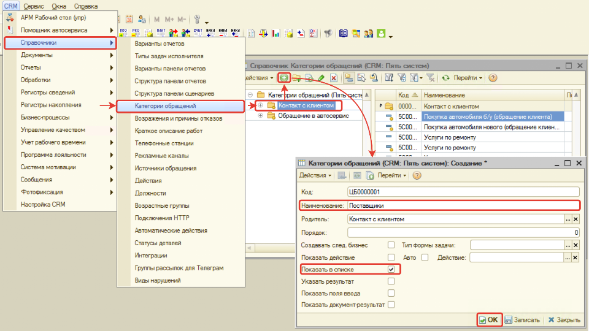

# Категории обращения

<table><tr><td><b>Время чтения:</b> 15 мин.</td><td><b>Обновлено:</b> 27.06.2022</td></tr></table>

Источник: https://www.5systems.ru/help/kategorii-obrascheniya

## Содержание

1. [Предопределенные категории обращения](#предопределенные-категории-обращения)
2. [Добавление новых категорий обращения](#добавление-новых-категорий-обращения)

## Предопределенные категории обращения

Предусмотрены предопределенные категории обращения:

| **Категория обращения** | **Описание** | **Результаты обращения** |
| --- | --- | --- |
| **Услуги по ремонту** | Категория выбирается в случае интереса клиента услугами Автосервиса (СТО). При выборе данной категории и записи клиента на ремонт бизнес-процесс "Контакт с клиентом" переходит в бизнес-процесс "Обращение в СТО". Целевое обращение. | 1. *Клиент записан* - клиент записался и планирует приехать в СТО. 2. *Отложить задачу* - клиент заинтересован в услугах СТО, но еще не записался. 3. *Перенаправить* - нужно переключить клиента на другого специалиста. 4. *Отказ* - клиент отказался от услуг СТО. |
| **Запасные части** | Категория выбирается в случае интереса клиента услугами Автосервиса (СТО). При выборе данной категории и подтверждении клиента в покупке запчастей бизнес-процесс "Контакт с клиентом" переходит в бизнес-процесс "Обращение в СТО". Целевое обращение. | 1. *Ожидаем клиента, установить резерв* 2. *Ожидаем клиента без резерва* 3. *Оформлена продажа* 4. *Перенаправить* - нужно переключить клиента на другого специалиста. 5. *Отказ* - клиент отказался от покупки запчастей. |
| **Продолжение звонка** | Категория предназначена для всех обращений клиентов, позвонивших 2 и более раз в рамках 1 дня, а также в случае, если по клиенту есть открытый бизнес-процесс «Обращение в СТО». Категория назначается автоматически. При выборе данной категории бизнес-процесс «Контакт с клиентом» завершается и не переходит в другие бизнес-процессы. |  |
| **По статусу ремонта/заказа** | Категория предназначена для клиентов, обратившихся с целью уточнить статус ремонта автомобиля. Категория назначается автоматически при идентификации клиента, в случае если по клиенту существует открытый заказ-наряд. При выборе данной категории бизнес-процесс «Контакт с клиентом» завершается и не переходит в другие бизнес-процессы. |  |
| **Повторное обращение** | Категория предназначена для клиентов, обратившихся повторно с целью продолжить общение в рамках предыдущего контакта. Данная категория назначается автоматически, в случае если за последний месяц от клиента был создан бизнес-процесс «Обращение в СТО», который был завершен отказом. При выборе данной категории бизнес-процесс «Контакт с клиентом» завершается, а первоначально созданный бизнес-процесс «Обращение в СТО» продолжается. |  |
| **Прочее** | Категория предназначена для всех прочих нецелевых обращений клиентов. При выборе данной категории бизнес-процесс «Контакт с клиентом» завершается и не переходит в другие бизнес-процессы. |  |

## Добавление новых категорий обращения

Есть возможность добавить собственные категории обращения. Для этого:

1. Перейдите в справочник "Категории обращений" (CRM → Справочники → Категории обращений).
2. Выберите группу "Контакт с клиентом".
3. Перейдите к созданию категории, где:
   - 1\. введите наименование категории,
   - 2\. установите флажок "Показать в списке".
4. Нажмите на кнопку "ОК".

Помимо добавления категории можно редактировать, убирать из списка (не отображать в обращении), устанавливать порядок отображения.

---

**Теги:** обращения, категории обращения, бизнес-процесс, архив

