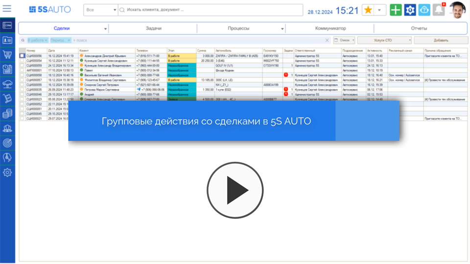
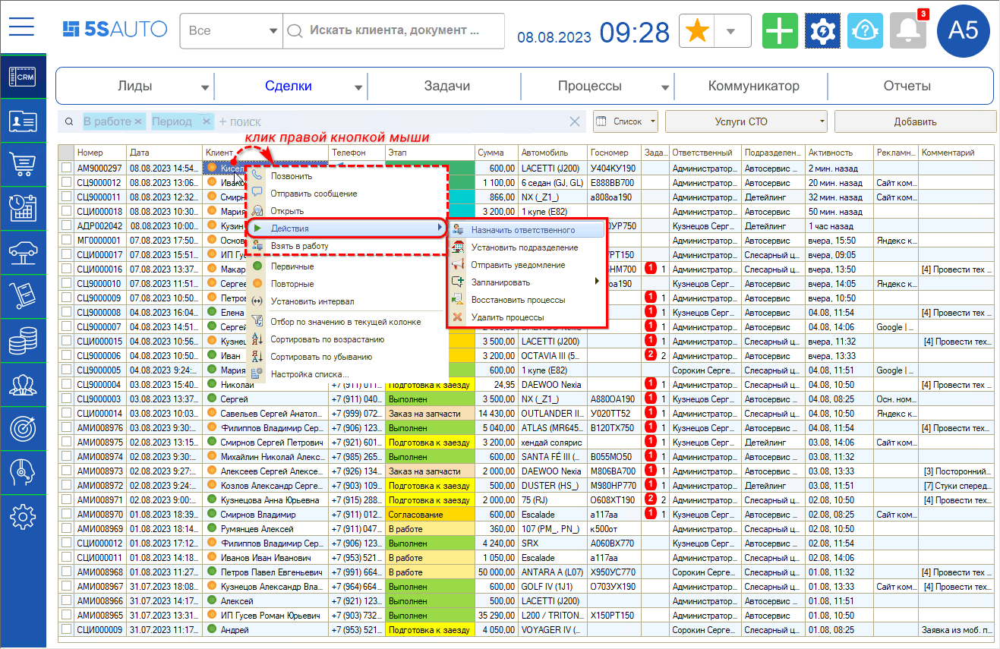
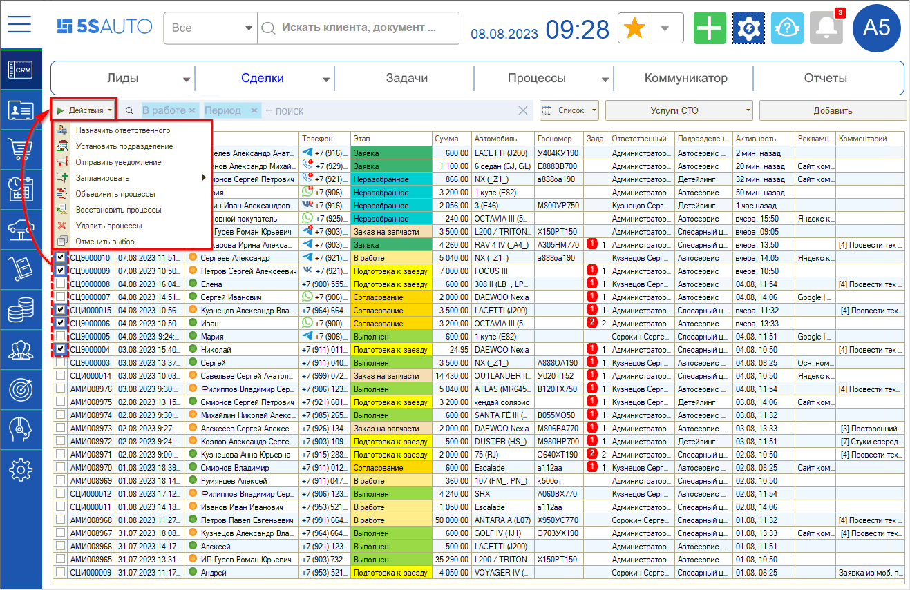
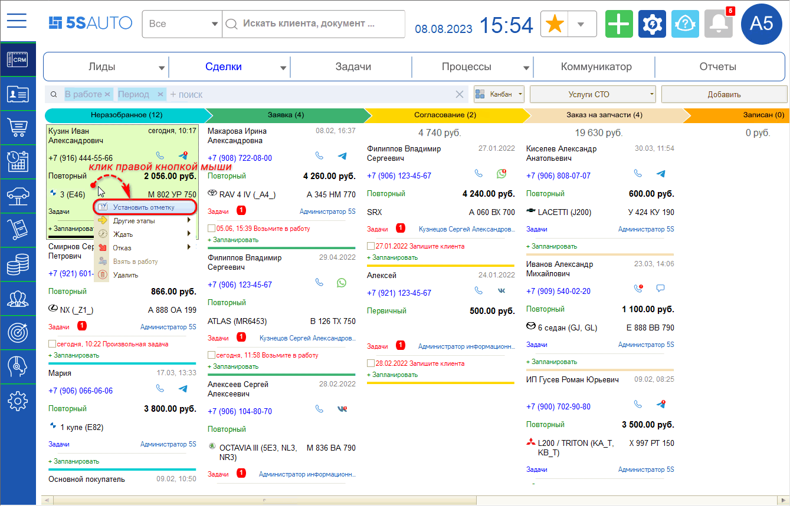
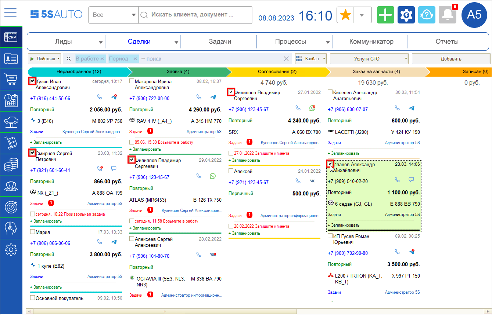
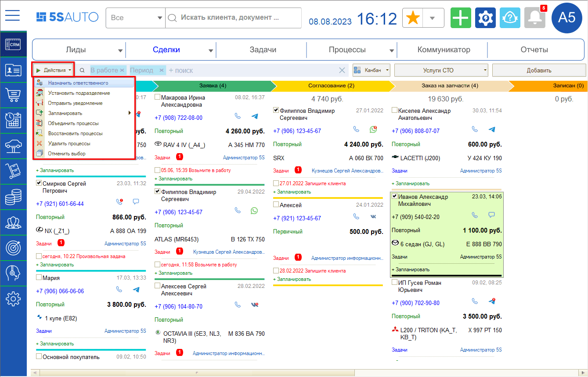

# Групповые действия со сделками

<table><tr><td><b>Время чтения:</b> 10 мин.</td><td><b>Обновлено:</b> 14.11.2024</td></tr></table>

Источник: https://www.5systems.ru/help/gruppovye-deystviya-so-sdelkami

> *Функционал действует начиная с релиза 2.5.2.1.*

## Содержание

- [Введение](#введение)
- [Видео](#видео)
- [Действия со сделками в списке](#действия-со-сделками-в-списке)
  - [Кнопка «Действия»](#кнопка-действия)
- [Групповые действия со сделками](#групповые-действия-со-сделками-1)
- [Действия со сделками на канбане](#действия-со-сделками-на-канбане)

## Введение

Сделка является центральным элементом интерфейса и представляет собой зафиксированное в программе обращение клиента. Подробнее см. статью «[Работа со сделкой](../Работа%20со%20сделкой/rabota-so-sdelkoy.md)».

Сделки могут быть представлены на рабочем столе в одном из двух режимов: список либо канбан. Подробнее см. статьи «[Список сделок](../Список%20сделок/spisok-sdelok.md)» и «[Канбан сделок](../Канбан%20сделок/kanban-sdelok.md)».

## Видео

## Действия со сделками в списке

Со сделками в списке есть возможность совершать различные действия: выделите сделку в списке и кликните по ней правой кнопкой мыши. В зависимости от того, на пересечении с каким столбцом кликнуть, открываются разные варианты действий:

Контекстное меню может содержать следующие кнопки:

- **Позвонить** — возможность позвонить клиенту.
- **Отправить сообщение** — при нажатии открывается Лента событий.
- **Открыть** — можно открыть форму сделки, карточку контрагента либо карточку автомобиля в зависимости от того, на пересечении с каким столбцом кликнуть.
- **Действия** — см. [ниже](#кнопка-действия).
- **Взять в работу** — если для сделки не назначен ответственный, можно взять ее себе в работу: при этом текущий пользователь будет записан в качестве ответственного по сделке.
- **Другие этапы** — перевод сделки на другие доступные этапы.
- **Ждать** — перевод сделки в [отложенные](../Отложенные%20сделки/otlozhennye-sdelki.md): можно отложить сделку на час, два часа, на завтра, на два дня либо указать произвольную дату.
- **Отказ** — перевод сделки в отказ с указанием причины.
- **Задачи** — открыть актуальные задачи по сделке.

### Кнопка «Действия»

В меню кнопки **«Действия»** содержатся следующие варианты:

- **Назначить ответственного**.
- **Установить подразделение**.
- **Отправить уведомление**.
- **Запланировать** — запланировать можно звонок, встречу, визит или задачу, при этом создаются разные типы задач.
- **Объединить процессы** — позволяет объединить две отмеченные сделки в одну: программа предложит выбрать одну сделку в качестве основной, в которую будут перенесены все документы, а вторая сделка будет переведена в отказ. Если в основной сделке нет автомобиля, он будет перенесен в нее из второй сделки. Подробнее см. статью «[Объединение сделок](../Объединение%20сделок/obedinenie-sdelok.md)».
- **Восстановить процессы** — используется для восстановления удаленных процессов.
- **Удалить процессы** — позволяет пометить на удаление выбранный процесс.

## Групповые действия со сделками

Есть возможность выделения нескольких сделок и групповых действий с ними. Отметьте галочками в первом столбце списка все нужные сделки — на верхней панели появится кнопка **«Действия»**, которая открывает то же меню, что и при клике на отдельную сделку (см. описание [выше](#кнопка-действия)):

Снять выделение также можно сразу со всех сделок — для этого нажмите **«Действия → Отменить выбор»**.

## Действия со сделками на канбане

Чтобы производить групповые действия со сделками на канбане, сначала установите отметки на выбранных сделках. Кликните по сделке правой кнопкой мыши и нажмите **«Установить отметку»**:

После этого появляется возможность установить отметки на всех нужных сделках:

После выбора сделок нажмите кнопку **«Действия»** на верхней панели и выберите нужный вариант — например, назначить ответственного для данной группы сделок:

Возможные варианты групповых действий со сделками:

- Назначить ответственного;
- Установить подразделение;
- Отправить уведомление;
- Запланировать: звонок, встречу, визит, задачу;
- Объединить процессы;
- Восстановить процессы;
- Удалить процессы.

Снять выделение можно также сразу со всех сделок — для этого нажмите **«Действия → Отменить выбор»**.

---

**Теги:** CRM, сделки, групповые действия, список сделок, канбан, контекстное меню, объединение процессов, отметки, ответственный, подразделение

