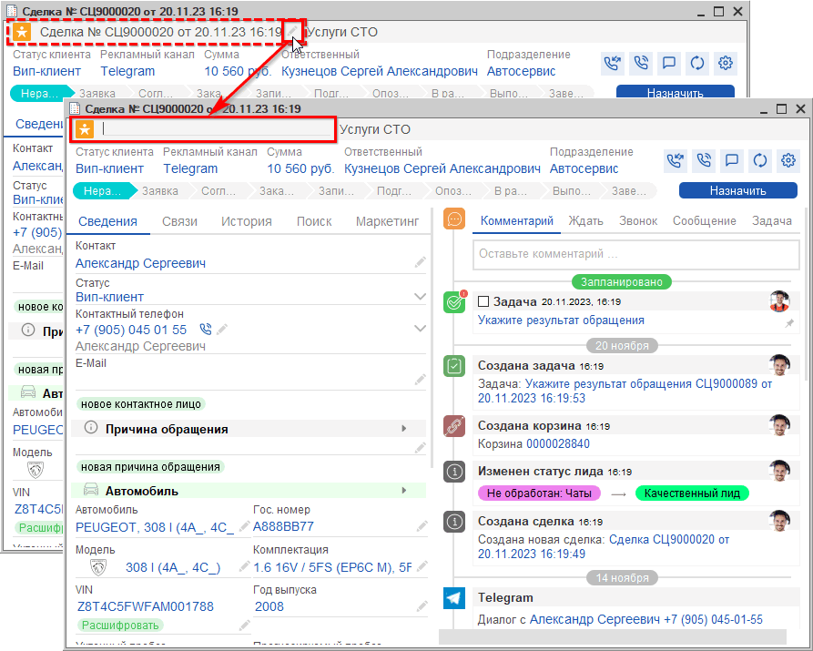
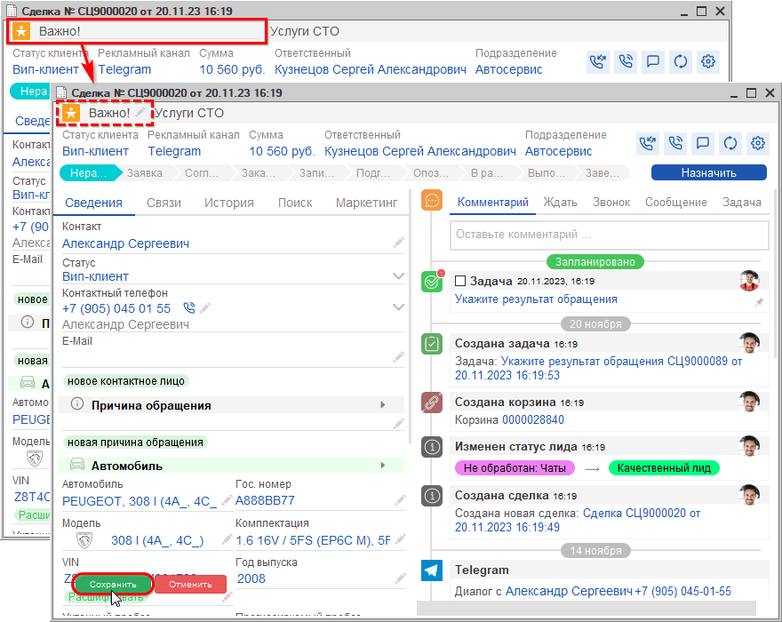
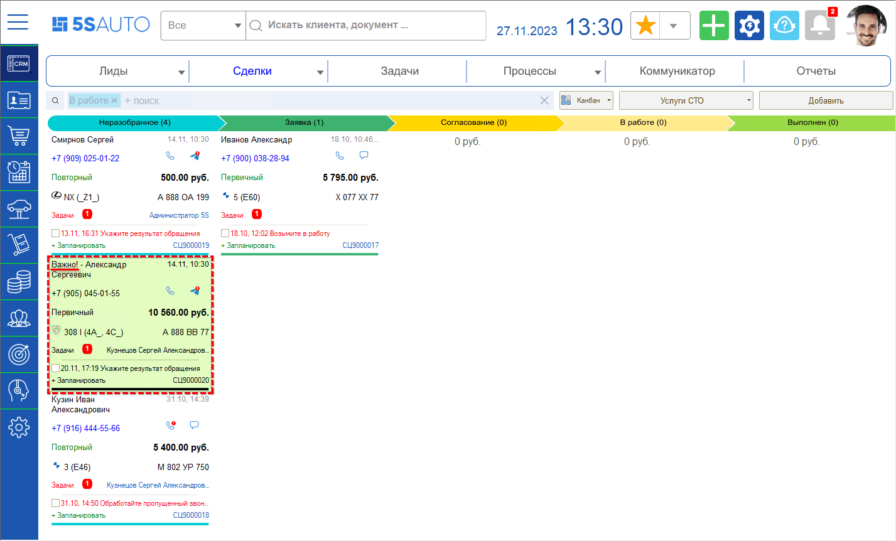
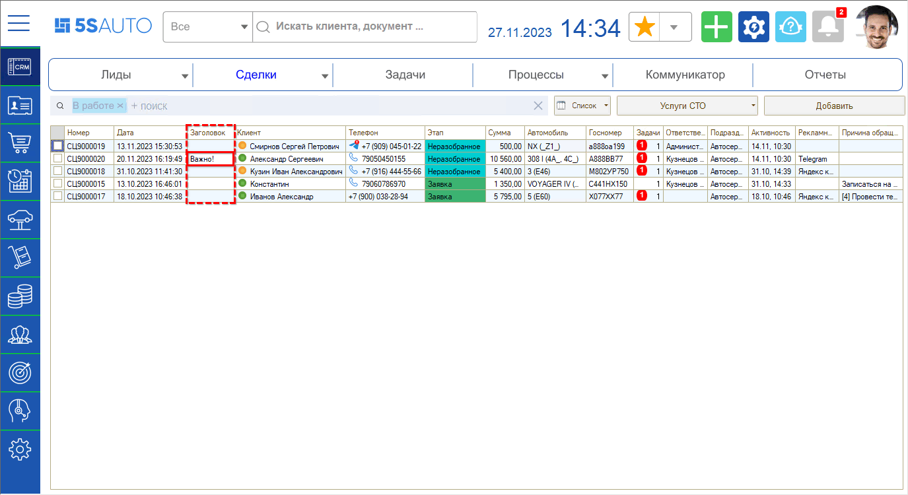
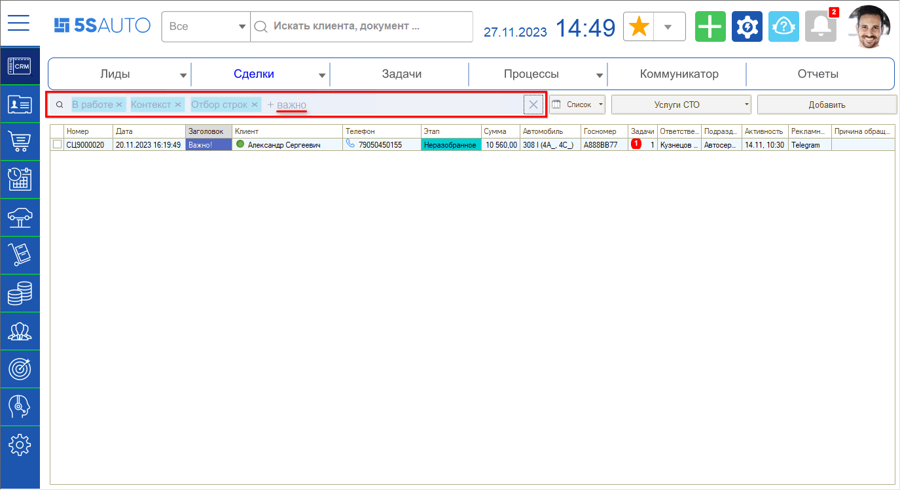
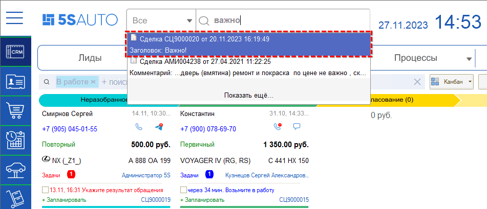

# Заголовок сделки

<table><tr><td><b>Время чтения:</b> 7 мин.</td><td><b>Обновлено:</b> 16.10.2024</td></tr></table>

Источник: https://www.5systems.ru/help/zagolovok-sdelki

> *Функционал действует начиная с релиза 5S AUTO 2.6.1.1.*

## Содержание

- [Введение](#введение)
- [Изменение заголовка сделки](#изменение-заголовка-сделки)
- [Отбор и поиск сделок по заголовку](#отбор-и-поиск-сделок-по-заголовку)

## Введение

См. основную статью «[Работа со сделкой](../Работа%20со%20сделкой/rabota-so-sdelkoy.md)».

По умолчанию в качестве названия сделки автоматически выводится обычное представление документа: буквенный код, порядковый номер, дата и время создания. Наименование по умолчанию не отображается в карточках сделок на канбане и в списке сделок.

Есть возможность задать для сделки свой произвольный заголовок.

## Изменение заголовка сделки

Чтобы задать заголовок сделки, в форме сделки нажмите кнопку **«Изменить»** рядом с заголовком — стандартный заголовок при этом автоматически очищается:

Затем введите нужное наименование, нажмите **Enter** и сохраните изменения в сделке:

Введенный заголовок будет отображаться на [канбане сделок](../Канбан%20сделок/kanban-sdelok.md) перед Ф. И. О. клиента:

а также в [списке сделок](../Список%20сделок/spisok-sdelok.md) в отдельной колонке **«Заголовок»**:

## Отбор и поиск сделок по заголовку

Затем можно использовать [отбор сделок](../Канбан%20сделок/kanban-sdelok.md#поиск-и-фильтрация-сделок-в-канбане) по заголовку: введите искомое значение в поле отбора и нажмите **Enter**:

а также находить сделки по заголовку через [полнотекстовый поиск](https://www.5systems.ru/help/rabota-s-polnotekstovym-poiskom) на верхней панели:

Варианты использования функционала:

1. Указание номеров документов «Заказ покупателя».
2. Ввод определенных значений в качестве тегов для отбора сделок по ним.
3. Маркировка отдельных нестандартных сделок на канбане или в списке для быстрого поиска нужных сделок.

---

**Теги:** CRM, сделка, заголовок сделки, наименование сделки, канбан, список сделок, отбор, полнотекстовый поиск, теги

