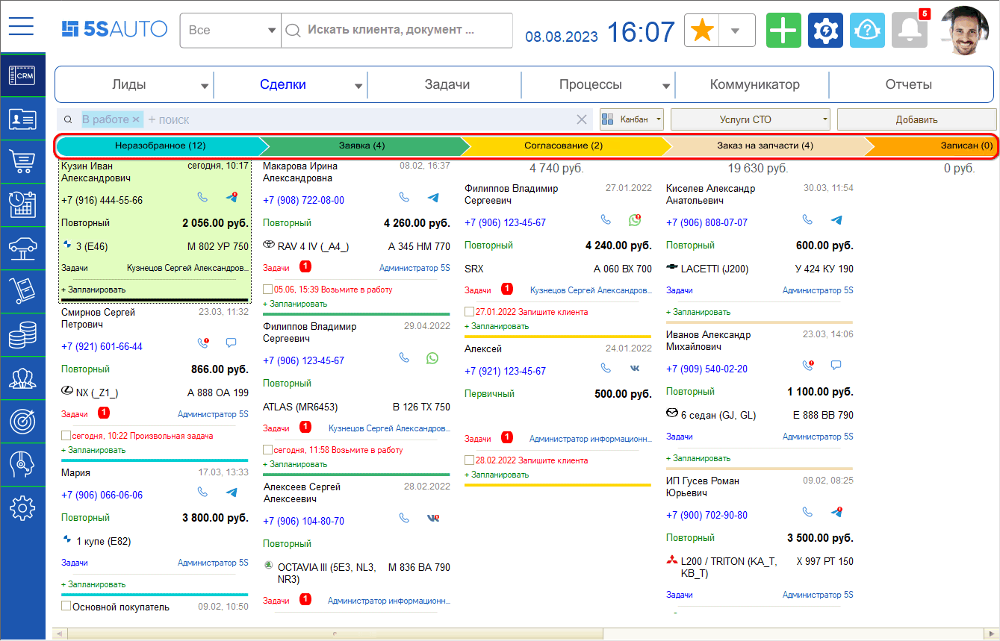
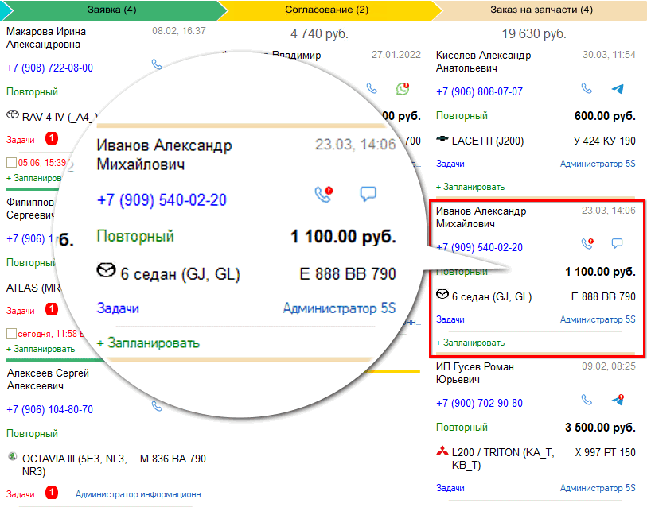
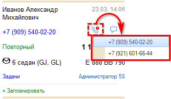
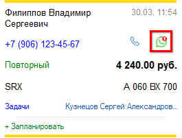
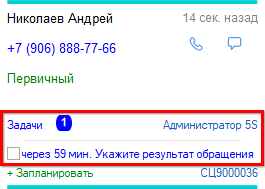
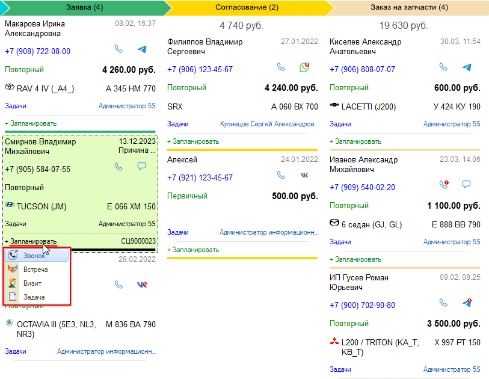
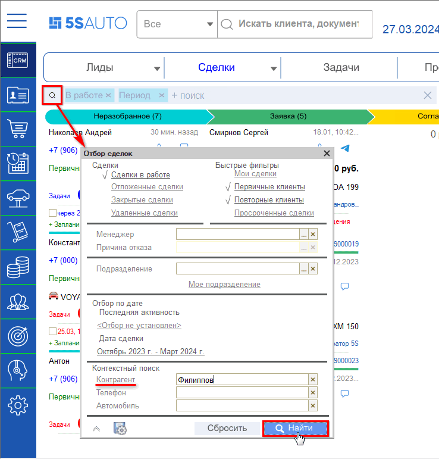
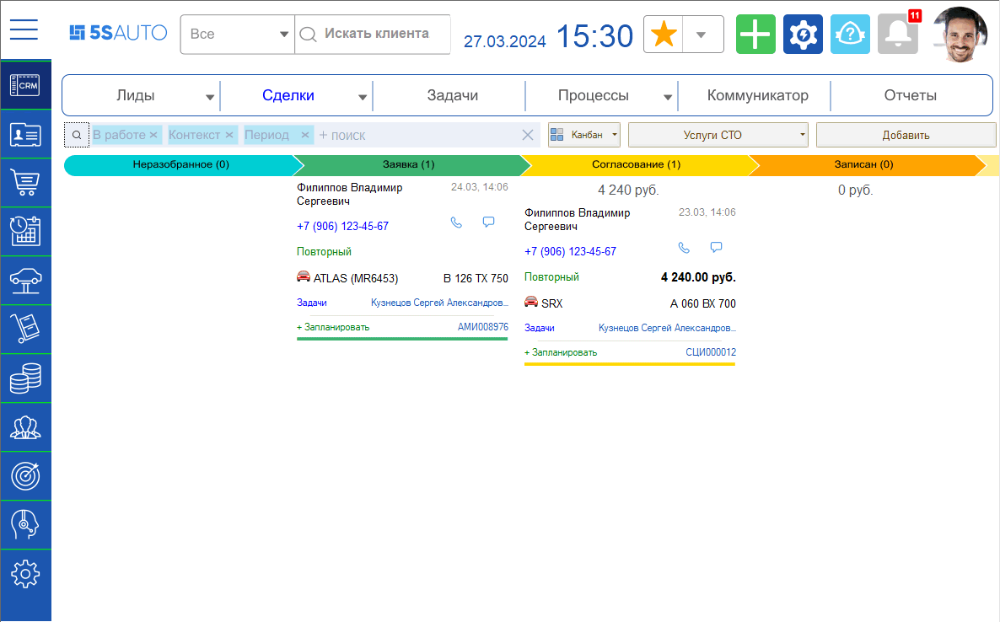
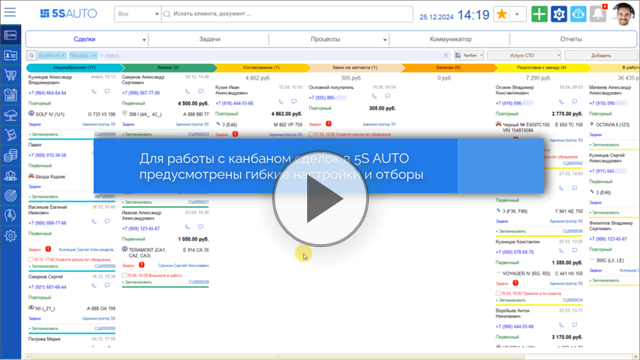

# Канбан сделок

<table><tr><td><b>Время чтения:</b> 11 мин.</td><td><b>Обновлено:</b> 16.10.2024</td></tr></table>

Источник: https://www.5systems.ru/help/kanban-sdelok

**Актуально для релиза 5S AUTO 2.6.1.1**

## Содержание

- [Введение](#введение)
- [Сделка и ее этапы](#сделка-и-ее-этапы)
- [Назначение канбан-доски](#назначение-канбан-доски)
- [Карточка сделки](#карточка-сделки)
- [Индикация пропущенных звонков и непрочитанных сообщений](#индикация-пропущенных-звонков-и-непрочитанных-сообщений)
- [Задачи и планирование в сделках](#задачи-и-планирование-в-сделках)
- [Поиск и фильтрация сделок в канбане](#поиск-и-фильтрация-сделок-в-канбане)

## Введение

Центральным элементом интерфейса является сделка. Сделка представляет собой зафиксированное в программе обращение клиента.

При каждом новом обращении — входящее письмо, звонок, сообщение в чате — автоматически создается [сделка](https://www.5systems.ru/help/rabota-so-sdelkoy). Также сделку можно добавить вручную с помощью кнопки **«Добавить сделку»**.

Сделки могут быть представлены на рабочем столе в одном из двух режимов: список либо канбан. О работе со списком сделок см. статью «[Список сделок](../Список%20сделок/spisok-sdelok.md)».

## Сделка и ее этапы

Сделка всегда находится на какой-либо стадии, которая обозначает этап работы с клиентом. У каждой сделки есть начало и конец, т. е. сделка проходит несколько этапов — от первого контакта с клиентом до успешной продажи.

Путь продаж может быть разделен на разные этапы по различным критериям. По умолчанию в CRM есть набор стандартных стадий, позволяющий учитывать ключевые точки работы со сделками:

- Неразобранное;
- Заявка;
- Согласование;
- Записан;
- В работе;
- Выполнен.

Можно использовать преднастроенный набор стадий, изменить их, а также добавить новые стадии при необходимости. Подробнее см. в статье «[Настройки воронки продаж](https://www.5systems.ru/help/nastroyki-voronki-prodazh)».

Канбан настроен таким образом, чтобы все сделки автоматически переходили на следующий этап в соответствии с заданными алгоритмами, но при этом сделку можно двигать по этапам и вручную — при соблюдении определенных условий, например при созданной корзине или заявке на ремонт.

## Назначение канбан-доски

Канбан-доска представляет собой форму отображения сделок, в которой видно, сколько сделок и на какую сумму находятся на той или иной стадии работы, запланированы ли по ним какие-либо задачи, а также другую необходимую информацию.

Таким образом, канбан-доска помогает выстраивать работу с большим количеством сделок, а также является инструментом мониторинга и первичного анализа эффективности работы.

Благодаря канбану сотрудникам всегда видно, с кем из клиентов нужно связаться, записать на ремонт или оформить заказ-наряд.

Возможности канбана: создание и настройка стадий сделок, создание новых сделок, редактирование, удаление, перемещение сделок на другие стадии.

## Карточка сделки

Каждая сделка представлена на канбан-доске в виде карточки.

В каждой карточке по умолчанию отображается следующая информация:

1. Имя клиента.
2. Номер телефона клиента.
3. Первичный или повторный клиент.
4. Автомобиль с гос. номером.
5. Актуальные задачи по данной сделке.
6. Кнопка **«Запланировать»** — можно не проваливаясь в саму сделку запланировать произвольную задачу.
7. Дата последней активности: при наведении курсора мыши на дату отображаются подробности — информация о звонке, созданном документе и т. п.
8. Кнопки вызова и отправки сообщений с индикацией пропущенных звонков и непрочитанных сообщений — см. [ниже](#индикация-пропущенных-звонков-и-непрочитанных-сообщений).
9. Сумма сделки.
10. Ответственный по сделке.

Вид карточки можно настраивать — см. описание в статье «[Настройки воронки продаж → Настройки карточки](https://www.5systems.ru/help/nastroyki-voronki-prodazh#nas_kart)».

## Индикация пропущенных звонков и непрочитанных сообщений

> *Функционал действует начиная с релиза 5S AUTO 2.5.2.1.*

Нажатием на кнопку звонка можно выбрать номер телефона, по которому следует позвонить клиенту, и сделать звонок — при условии настроенной телефонии.

Кнопка отправки сообщения отображается в виде значка предпочтительного канала общения с клиентом — т. е. мессенджера, который последним был использован в переписке с клиентом.

Нажатием на кнопку открывается «[Лента событий](https://www.5systems.ru/help/lenta-sobytiy)», где можно прочитать сообщение клиента и написать ответ.

В случае пропущенного звонка либо непрочитанного сообщения на данных кнопках отображается специальный индикатор.

## Задачи и планирование в сделках

В канбане можно отслеживать, есть ли по сделке какие-либо задачи.

Задачи привязаны к сделкам и создаются автоматически роботами при переходе сделки на определенный этап.

Практически на всех этапах сделки сотруднику нужно что-то делать — согласовать, записать клиента, указать результат, перезвонить клиенту, проценить, — т. е. двигать сделку, пока она не перейдет к состоянию выполненной.

Также задачи по сделке могут быть поставлены вручную независимо от этапа.

Если по сделке есть актуальные задачи, то в карточке отображается индикатор с их количеством, и ниже — срок выполнения и название задачи.

При необходимости можно запланировать задачу прямо в канбане. Для этого требуется нажать на кнопку **«Запланировать»**, которая есть в каждой карточке сделки, и выбрать тип: звонок, встречу, визит или произвольную задачу.

В открывшейся форме задачи требуется указать детали: дату, время, подробное описание и т. д., — записать и закрыть. Созданная задача отобразится на индикаторе рядом с полем **«Задачи»** в карточке сделки.

## Поиск и фильтрация сделок в канбане

В канбане можно искать сделки, используя быстрые фильтры: например, отобразить только сделки конкретного сотрудника или установить отбор по определенной дате.

Для этого требуется нажать на лупу на панели отбора, отметить нужный критерий отбора и нажать кнопку **«Найти»**.

В канбане останутся только те сделки, которые подходят под выбранные условия.

Также см. видео:

Более детальный отбор доступен при работе со сделками в режиме списка — см. в статье «[Список сделок → Комплексная настройка отборов](../Список%20сделок/spisok-sdelok.md#комплексная-настройка-отборов)».

Также отбор можно сохранить для последующего быстрого выбора через меню: подробнее см. в статье «[Сохранение настроек просмотра сделок](../Сохранение%20настроек%20просмотра%20сделок/sohranenie-nastroek-prosmotra-sdelok.md)».

---

**Теги:** CRM, канбан, канбан-доска, сделки, стадии сделок, воронка продаж, карточка сделки, задачи, планирование, отборы, фильтры

