

# Настройка параметров уведомлений

<table><tr><td><b>Время чтения:</b> 15 мин.</td><td><b>Обновлено:</b> 12.09.2025</td></tr></table>

Источник: https://www.5systems.ru/help/nastroyka-parametrov-uvedomleniy

**Актуально начиная с версии релиза 2.001.001**

## Содержание

- [Введение](#введение)
- [Переход к настройке](#переход-к-настройке)
- [Параметры преднастроенных уведомлений](#параметры-преднастроенных-уведомлений)
  - [Вкладка «Способы уведомлений»](#вкладка-способы-уведомлений)
  - [Вкладка «Параметры уведомления»](#вкладка-параметры-уведомления)
    - [Шаблон уведомления](#шаблон-уведомления)
    - [Параметры скрывающегося push-окна](#параметры-скрывающегося-push-окна)
    - [Параметры фиксированного push-окна](#параметры-фиксированного-push-окна)
    - [Формировать уведомление за … сек. до (после) события](#формировать-уведомление-за--сек-до-после-события)
    - [Учитывать график работы сотрудника](#учитывать-график-работы-сотрудника)
    - [Повторять уведомления](#повторять-уведомления)
    - [Прекращать уведомление пользователей](#прекращать-уведомление-пользователей)
    - [Отмечать как «Прочтено» через](#отмечать-как-прочтено-через)
- [Подключение произвольных уведомлений](#подключение-произвольных-уведомлений)

## Введение

В статье рассматривается настройка параметров уведомлений. Описание пользовательских настроек отправки уведомлений и механизма работы с функционалом см. в статье «[Работа с уведомлениями](../Работа%20с%20уведомлениями/rabota-s-uvedomleniyami.md)».

## Переход к настройке

Для настройки параметров в карточке уведомлений либо для создания нового уведомления перейдите в справочник **«Уведомления»**. Путь перехода: *Администрирование → CRM → справочник «Уведомления»*:

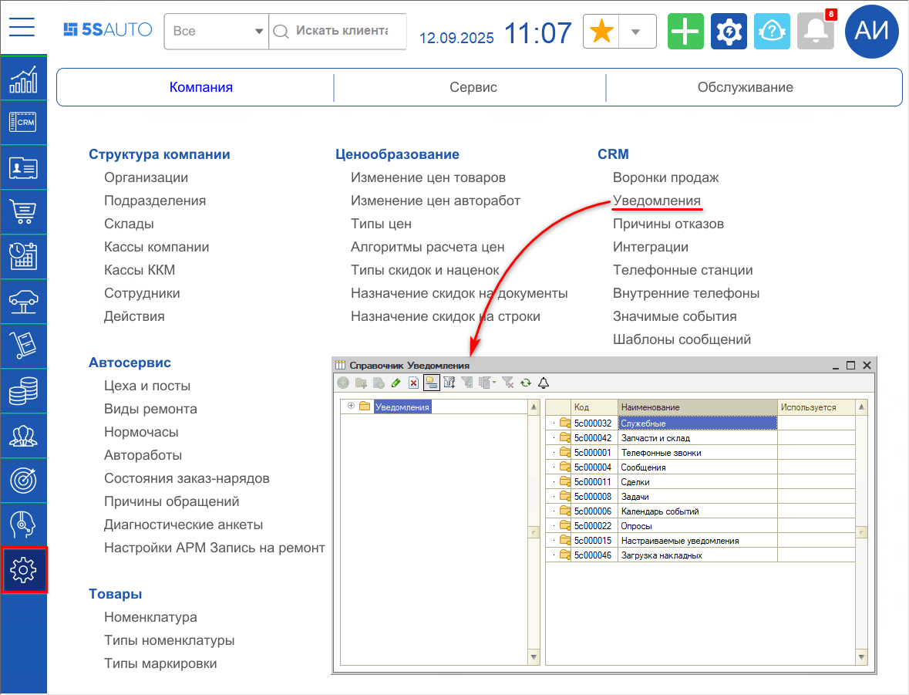

Все уведомления в справочнике сгруппированы по папкам: откройте нужную группу и выберите уведомление. Двойным кликом открывается карточка уведомления, где настраивается логика его работы.

Например, уведомление «Упомянули в комментарии» в [сделке](../Работа%20со%20сделкой/rabota-so-sdelkoy.md):

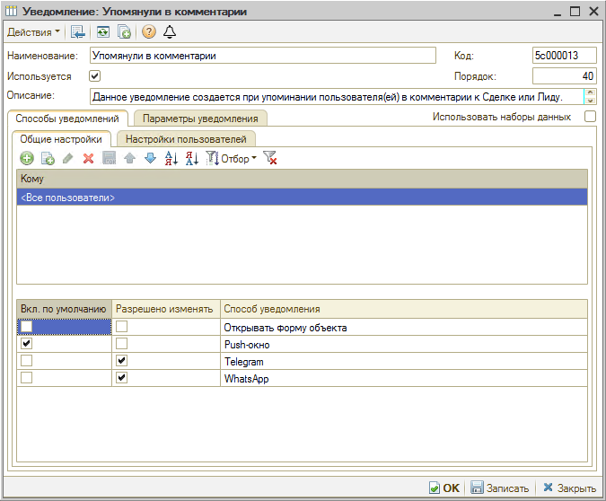

## Параметры преднастроенных уведомлений

### Вкладка «Способы уведомлений»

**Вкладка «Общие настройки».** Здесь настраивается включение уведомления и способа оповещения о нем по умолчанию, а также доступность изменения настроек уведомлений для пользователей.

Уведомление можно настроить на должность (из справочника «Должности»), [должность CRM](https://www.5systems.ru/help/adresaciya-zadach-v-crm-po-ispolnitelyam) либо индивидуально на конкретного [пользователя](https://www.5systems.ru/help/polzovateli).

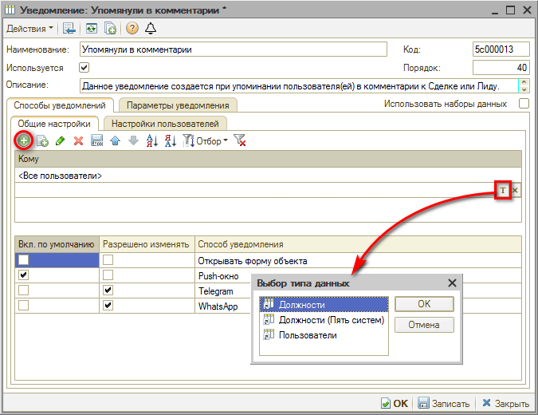

По умолчанию все пользователи получают уведомления в виде push-окна и не могут себе его отключить. При этом они могут дополнительно включить или отключить использование своего личного MAX или Telegram для рассылки уведомлений.

Если не стоит галочка в столбце **«Разрешено изменять»**, пользователь не сможет у себя в настройках уведомлений включить или отключить эти способы уведомлений.

**Вкладка «Настройки пользователей».** Здесь можно посмотреть, кто из пользователей какие настройки себе установил по данному уведомлению.

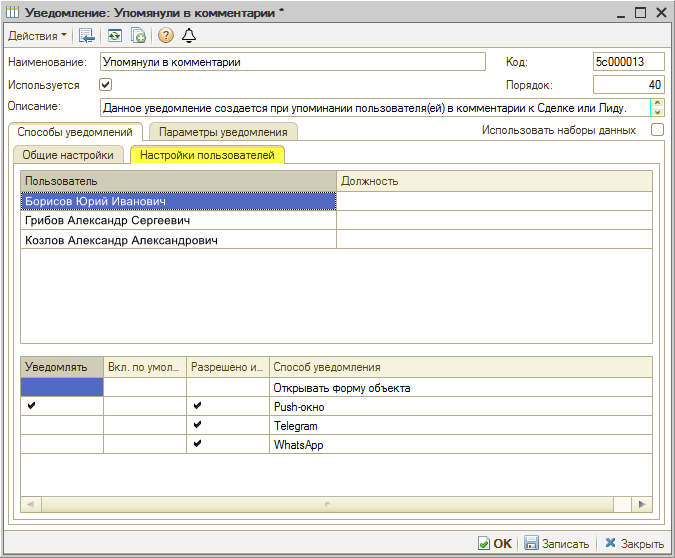

### Вкладка «Параметры уведомления»

На этой вкладке можно задать настраиваемые параметры уведомления.

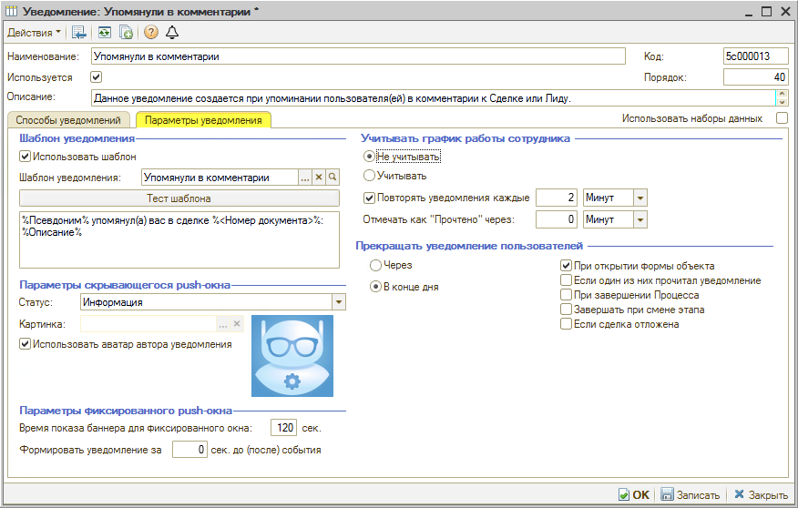

#### Шаблон уведомления

В этом поле задается текст уведомления, которое будет отправляться. Текст задается в виде шаблона, который можно настраивать: для этого нажмите на «лупу». Можно добавить в шаблон любые реквизиты сделки.

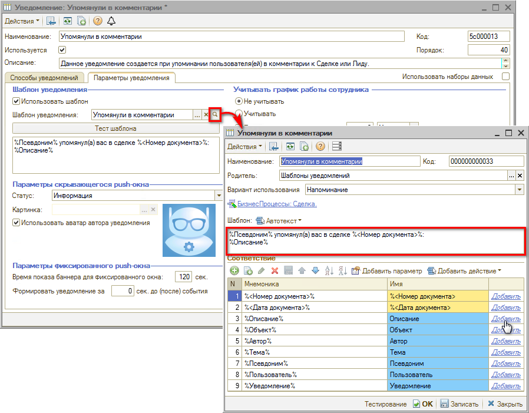

Если отключить использование шаблона снятием галочки **«Использовать шаблон»**, можно написать произвольный текст уведомления прямо в карточке.

#### Параметры скрывающегося push-окна

**Статус:**

- **Информация** — обычное уведомление, отправляется в порядке очереди, то есть появляется и висит 6 секунд. Следующее уведомление появляется после того, как исчезнет первое, и далее по очереди.
- **Важное** — приоритетное уведомление, показывается вне очереди: если в этот момент показывается другое уведомление, важное накладывается поверх него.

**Картинка.** Настраивается картинка, которая будет отображаться рядом с текстом в уведомлении. Для уведомлений, у которых есть автор-пользователь, ставится галочка **«Использовать аватар автора уведомления»**.

Если автора нет — например, уведомление генерирует робот, — можно задать другую произвольную [картинку](https://www.5systems.ru/help/biblioteka-kartinok). Например, в уведомлении «Получена заявка из внешних сервисов» установлена картинка мобильного телефона.

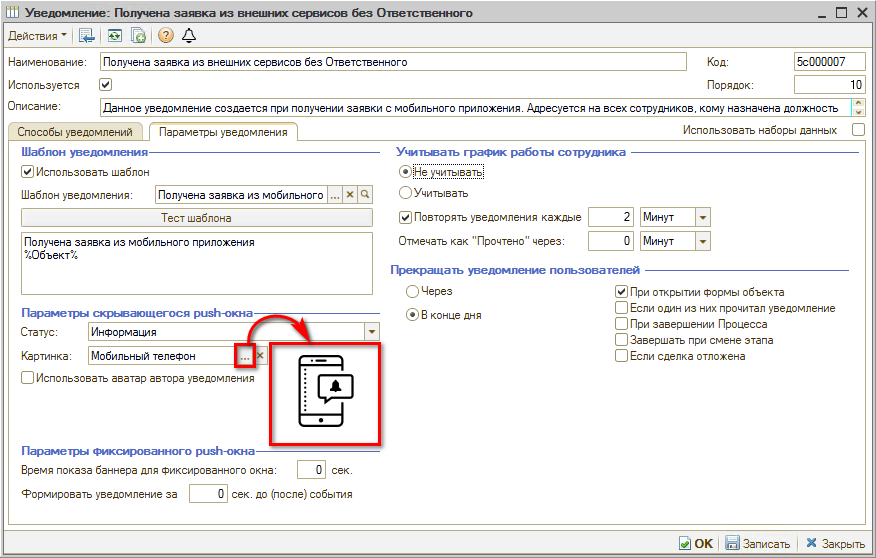

Размер картинки должен быть не более 60 × 60 пикселей.

#### Параметры фиксированного push-окна

Параметр **«Время показа баннера для фиксированного окна»** позволяет ограничить время, в течение которого окна будут отображаться (например, 300 сек.), и потом закрываться сами. По умолчанию фиксированные уведомления отображаются, пока их не закроют.

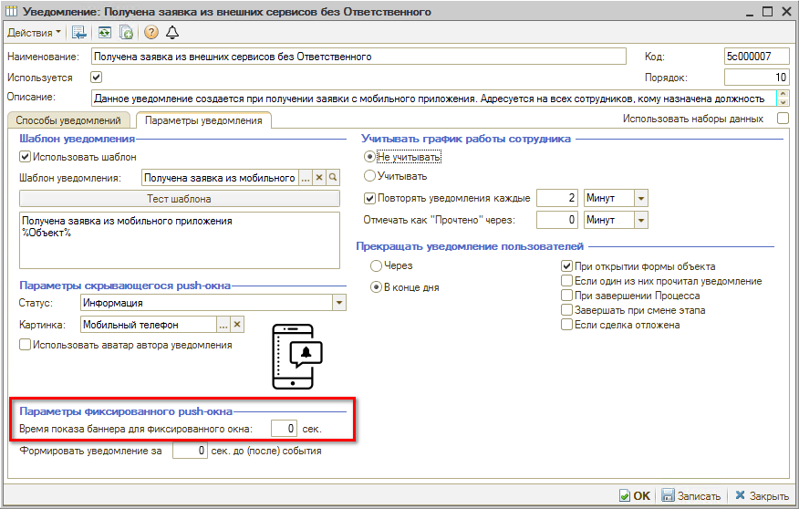

#### Формировать уведомление за … сек. до (после) события

Параметр возможно использовать для всех видов уведомлений.

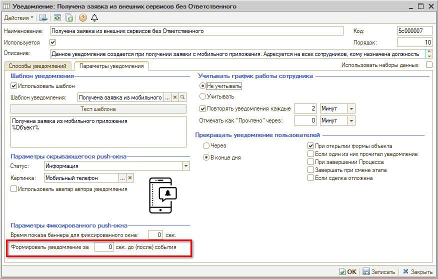

Если событие допускает возможность ожидать время его начала (например, заезд автомобиля по записи), можно настроить напоминание за несколько минут до предполагаемого наступления события.

Либо можно использовать этот параметр, чтобы отправлять уведомление не сразу после наступления события, а с отсрочкой: в этом случае укажите значение времени со знаком «минус». Например, «-120» сек. — тогда уведомление будет приходить через 2 минуты после начала события.

#### Учитывать график работы сотрудника

Параметр задается, чтобы сотруднику не приходили уведомления, когда он в отпуске или на выходных. Проверка выполняется по данным из [табеля учета рабочего времени](https://www.5systems.ru/help/tabel-ucheta-rabochego-vremeni).

Варианты: **«Учитывать»** и **«Не учитывать»**.

При выборе варианта «Учитывать» открывается поле настройки «Если сотрудник не работает в день создания уведомления»:

- Уведомляем в ближайший рабочий день;
- Не уведомляем сотрудника.

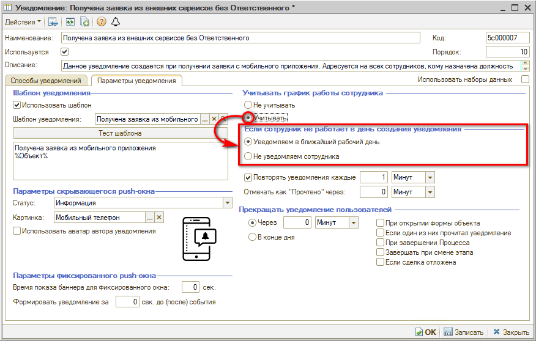

#### Повторять уведомления

> *Параметр только для скрывающихся push-уведомлений.*

Если поставить галочку **«Повторять уведомления»**, открывается поле настройки периодичности повтора, где можно задать период и выбрать единицу времени, а также появляется поле настройки параметров прекращения уведомлений.

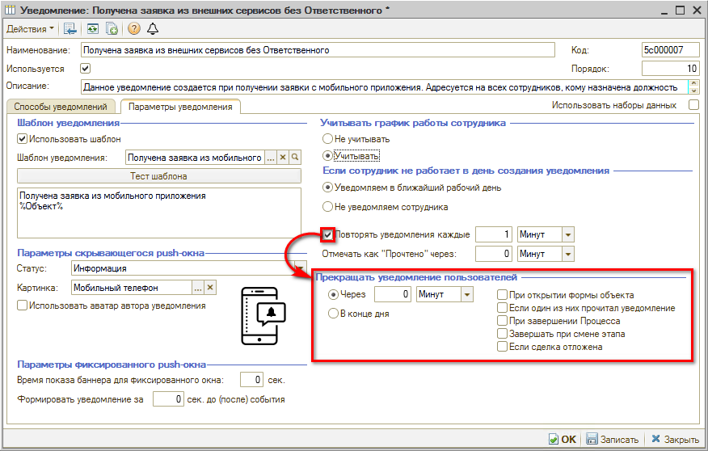

В зависимости от установленного времени будет создаваться новое уведомление по этому событию до момента, пока уведомление не будет прочтено вручную или автоматически по истечении времени в параметре [«Отмечать как прочтено через»](#отмечать-как-прочтено-через). При этом в списке уведомлений (по кнопке-«колокольчику») уведомление будет создано только одно, но будет обновляться время его актуальности.

#### Прекращать уведомление пользователей

> *Параметр только для скрывающихся push-уведомлений.*

По сути это нижняя граница времени уведомления: задается время, через которое перестанут появляться повторяющиеся уведомления по событию.

- **Через \_\_\_\_\_** — возможность задать время, через которое будет прекращаться уведомление.
- **В конце дня** — уведомление будет направляться пользователю до конца дня, в котором оно сформировано, с заданной периодичностью.
- **При открытии формы объекта** — при открытии формы объекта (документа, сделки, задачи), связанного с уведомлением, дальнейшая отправка уведомлений пользователю будет прекращена.
- **Если один из них прочитал уведомление** — если один из пользователей, которым было отправлено уведомление, ознакомился с ним, остальным пользователям также будет прекращена отправка уведомлений.
- **При завершении процесса** — если объектом уведомления является процесс, то при его завершении прекращается отправка уведомлений пользователю. Если задача — то при ее выполнении. Когда сделка закрывается, все уведомления, связанные с ней, отмечаются прочтенными.
- **Завершать при смене этапа** — при смене этапа сделки уведомление прекращается.
- **Если сделка отложена** — при переводе сделки в отложенные уведомление прекращается.

#### Отмечать как «Прочтено» через

Параметр для push-уведомлений обоих видов, означает актуальность уведомления — время, через которое уведомление автоматически отметится как прочитанное, если не «прочитать» его вручную.

Можно выбрать единицу времени и задать количество: например, отмечать как «Прочтено» через 1 час.

**Пример 1.** Если уведомление настроено на повторение каждые 5 минут, прекращение уведомления через 30 минут, а «отмечать как прочтено» — через 2 часа, то за 30 минут пользователю придет 6 уведомлений (push-окон). При этом в списке уведомлений (по кнопке-«колокольчику») появится только одно новое уведомление, и его актуальность (то есть отображение как «непрочитанное») будет обновляться по мере прихода повторных push-уведомлений.

Уведомления перестанут приходить после прочтения очередного push-уведомления или уведомления в списке вручную либо автоматически через 30 минут.

Если не «прочитать» уведомление вручную, оно в списке автоматически отметится как прочитанное через 2 часа после появления последнего push-уведомления.

**Пример 2** (для лучшего понимания механизма работы, настраивать так не рекомендуется). Если настроено повторение уведомления каждые 2 минуты, прекращение через 10 минут, а «отмечать как прочтено» — через 1 минуту, то появится первое уведомление, через минуту отметится как прочтенное и больше не будет уведомлять.

## Подключение произвольных уведомлений

Помимо преднастроенных видов уведомлений в справочнике «Уведомления» есть группа **«Настраиваемые уведомления»**, где можно подключать произвольные уведомления.

Для таких уведомлений можно подобрать свои собственные наборы данных и в зависимости от них выводить информацию в уведомление.

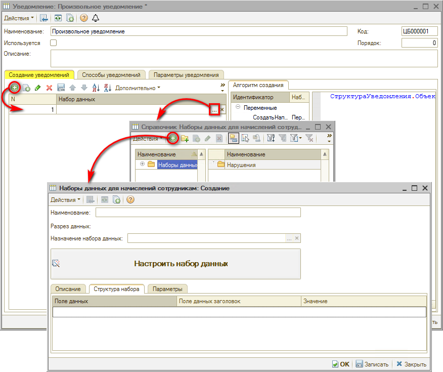

Например, можно все заказ-наряды, у которых просрочена дата выдачи, отправить в виде списка руководителю.

На вкладке «Параметры уведомления» производится настройка параметров аналогично преднастроенным уведомлениям — за исключением настроек регламентного задания, которое будет проверять с заданной периодичностью прописанные в уведомлении условия.

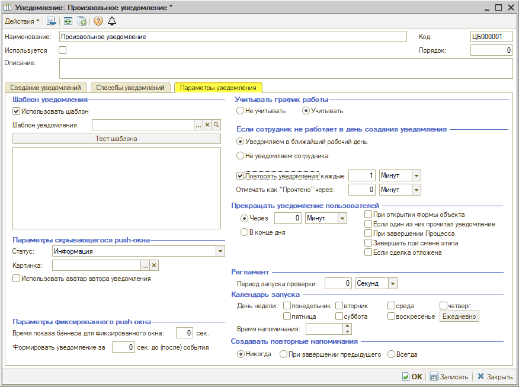

---

**Теги:** CRM, уведомления, настройка уведомлений, push-окно, шаблон уведомления, повторные уведомления, график работы, произвольные уведомления, справочник уведомлений

