

# Настройки воронки продаж

<table><tr><td><b>Время чтения:</b> 10 мин.</td><td><b>Обновлено:</b> 14.11.2024</td></tr></table>

Источник: https://www.5systems.ru/help/nastroyki-voronki-prodazh

> *Актуально начиная с версии релиза 2.001.001. Настройки формы сделки, карточки канбана и списка сделок доступны начиная с релиза 2.7.1. Настройка режимов отбора на вкладке «Сущность» доступна начиная с релиза 2.8.1.*

## Содержание

- [Введение](#введение)
- [Переход к настройкам](#переход-к-настройкам)
- [Настройки воронки продаж](#настройки-воронки-продаж-1)
  - [1. Настройка формы сделки](#1-настройка-формы-сделки)
  - [2. Настройка карточки](#2-настройка-карточки)
  - [3. Настройка списка](#3-настройка-списка)
  - [4. Адресация уведомления](#4-адресация-уведомления)
- [Настройки этапов воронки](#настройки-этапов-воронки)
  - [Вкладка «Условия»](#вкладка-условия)
  - [Вкладка «Внешние события»](#вкладка-внешние-события)
  - [Вкладка «Роботы»](#вкладка-роботы)
  - [Вкладка «Сущность»](#вкладка-сущность)
    - [Настройка режимов отбора сделок](#настройка-режимов-отбора-сделок)
  - [Вкладка «Этапы для переходов»](#вкладка-этапы-для-переходов)

## Введение

В программе есть возможность настроить разделы, которые должны отображаться на форме сделки или лида. Такая настройка позволяет убрать лишние блоки и разделы, чтобы упростить и ускорить работу со сделкой.

Например, если для воронки продаж автосервиса блок «Причина обращения» является важным, то для магазина автозапчастей или автосалона определение причин обращения не актуально — этот блок можно скрыть.

Также есть возможность настроить [список сделок](../Список%20сделок/spisok-sdelok.md) — убрать ненужные либо вывести дополнительные столбцы.

## Переход к настройкам

Изменить или добавить этапы воронок продаж, а также создать и настроить новые воронки можно в справочнике **«Процессы компании»**. Расположение справочника: *Администрирование → Компания → CRM → Воронки продаж*. Выделите строку с наименованием нужной воронки и нажмите кнопку **«Изменить»**:

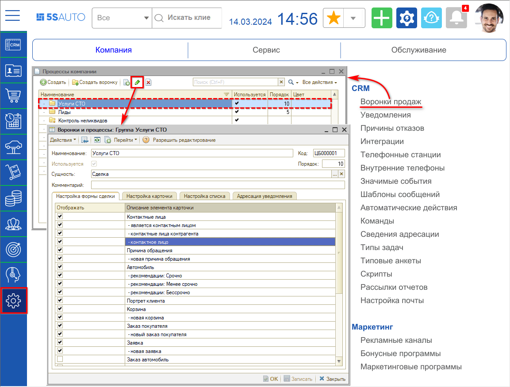

Либо можно перейти из раздела **«CRM»** по кнопке с названием воронки на верхней панели, например *«Услуги СТО → Воронки и процессы»* — справочник «Процессы компании» будет открыт в контексте текущей воронки:

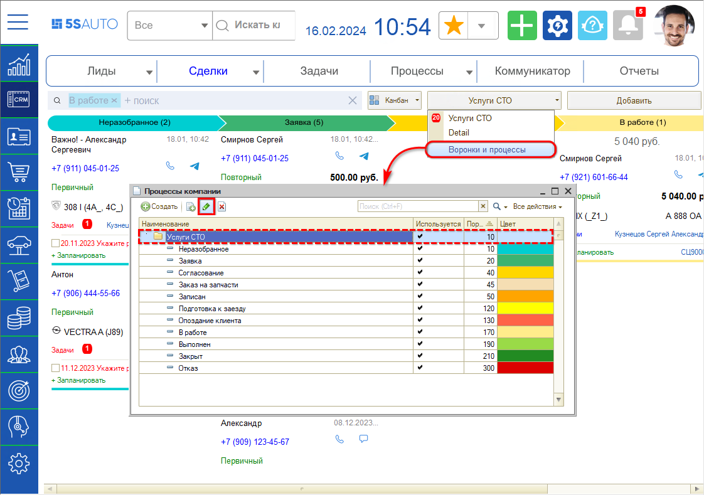

Также выделите строку с наименованием воронки и нажмите кнопку **«Изменить»**.

## Настройки воронки продаж

### 1. Настройка формы сделки

[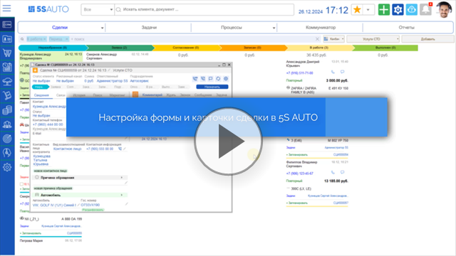](https://edu.5systems.ru/video/Rabochij_stol/Nasrtojka_formy_sdelki.mp4)

На форме сделки по умолчанию отображаются все элементы. Для изменения настроек нажмите кнопку **«Разрешить редактирование»** на верхней панели формы.

Чтобы убрать из сделки ненужные элементы, снимите галочки в колонке **«Отображать»** напротив этих элементов в списке настроек и нажмите кнопку **«Записать»**.

Например, можно убрать с формы сделки блоки «Причина обращения», «Рекомендации» и кнопку «Новое контактное лицо»:

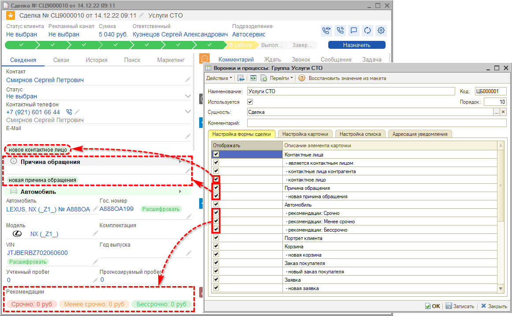

Для отображения изменений на форме сделки нажмите на верхней панели кнопку **«Обновить»**:

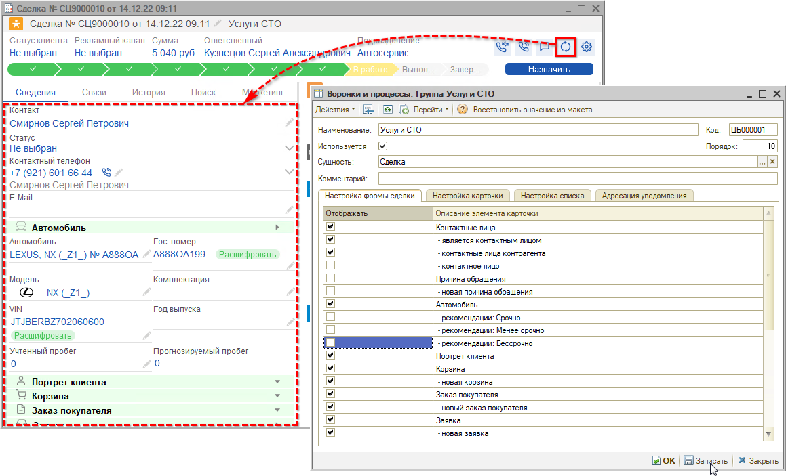

Для воронки продаж автосалона можно вывести скрытый по умолчанию блок «Заказ на автомобиль» с кнопкой «Новый заказ автомобиля» и кнопку создания документа «Новая реализация автомобиля» в блоке «Документы продажи», а также скрыть ненужные блоки:

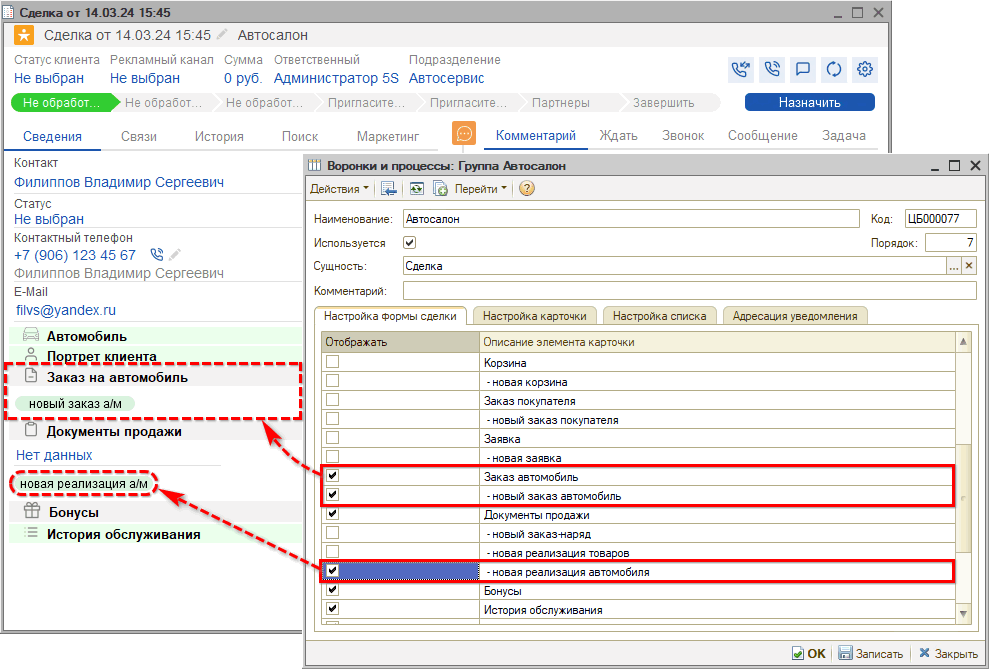

Также можно убрать [вкладки](../Работа%20со%20сделкой/rabota-so-sdelkoy.md#2-вкладка-связи) «Связи», «История», «Поиск», «Маркетинг»:

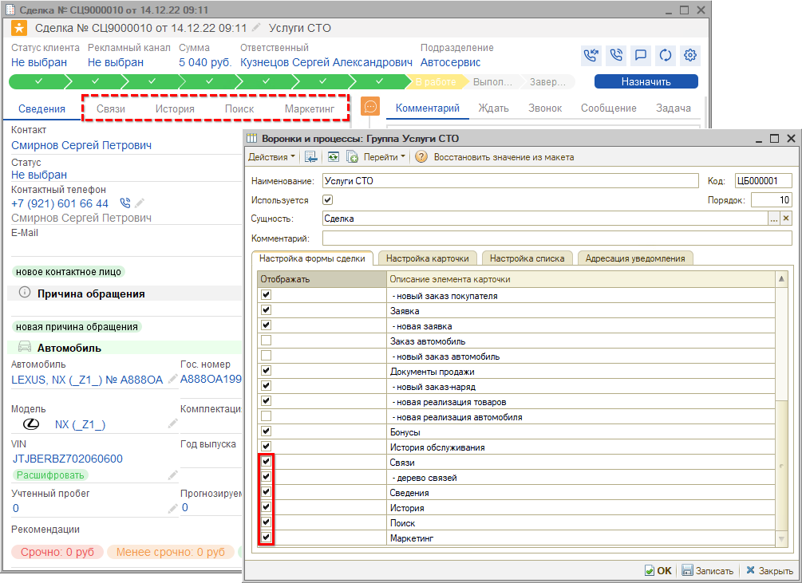

### 2. Настройка карточки

На вкладке **«Настройка карточки»** расположены настройки карточки канбана:

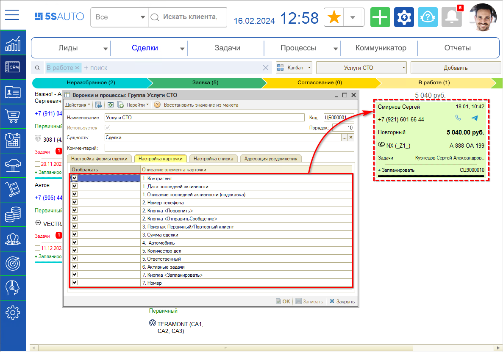

Чтобы убрать с карточки ненужные элементы, снимите галочки в колонке **«Отображать»** напротив этих элементов в списке и нажмите кнопку **«Записать»**:

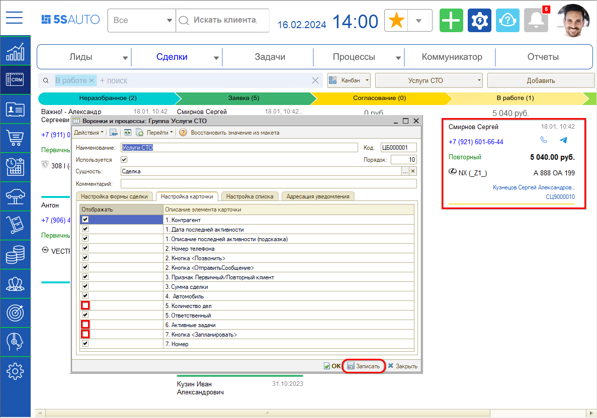

Чтобы на канбане отобразились обновленные настройки, обновите его нажатием на [кнопку с логотипом компании](../Структура%20интерфейса%205S%20AUTO/struktura-interfeysa-5s-auto.md#1-логотип-организации).

Также см. видео в разделе [выше](#1-настройка-формы-сделки).

### 3. Настройка списка

[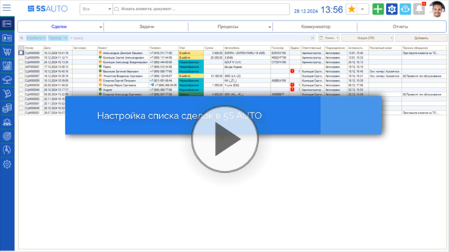](https://edu.5systems.ru/video/Rabochij_stol/Nastrojka_spiska_sdelok.mp4)

На вкладке **«Настройка списка»** собраны все колонки, которые можно вывести в [список процессов](../Список%20сделок/spisok-sdelok.md):

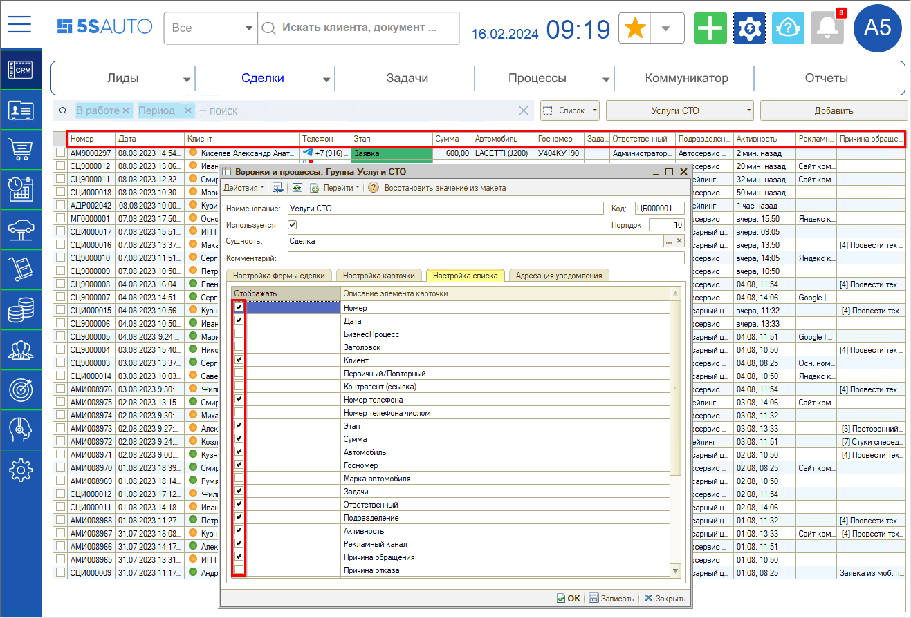

Также для перехода к настройке списка сделок можно кликнуть правой кнопкой мыши в любом месте таблицы и в выпадающем меню нажать кнопку **«Настройка списка»** — см. в [статье](../Список%20сделок/spisok-sdelok.md#интерфейс-списка-сделок).

### 4. Адресация уведомления

На вкладке **«Адресация уведомления»** можно добавить [роли](https://www.5systems.ru/help/adresaciya-zadach-v-crm-po-ispolnitelyam) пользователей, на которых будут адресоваться уведомления о новых сделках по данной воронке, если не назначен ответственный:

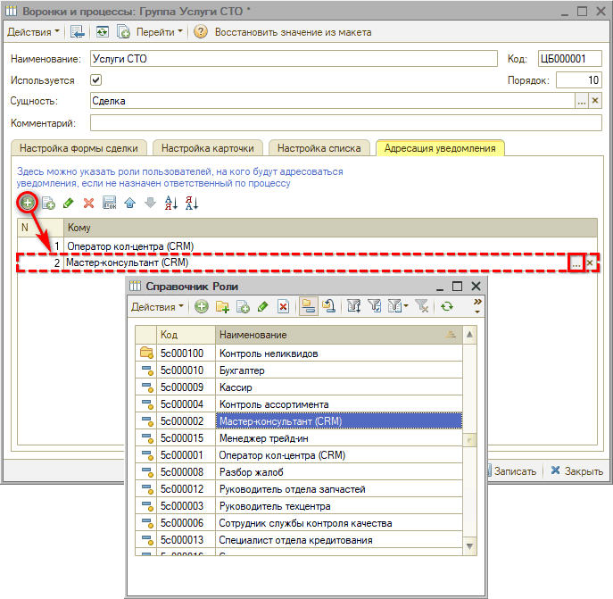

## Настройки этапов воронки

В настройках воронки можно изменить количество этапов — добавить новые или удалить лишние, отредактировать наименование, порядок и цветовое оформление.

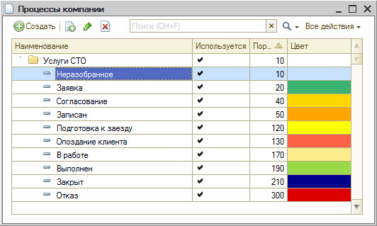

На каждый этап можно настроить внешние события, роботов, условия перехода и т. д. для автоматизации процесса преобразования [сделки](../Работа%20со%20сделкой/rabota-so-sdelkoy.md) в продажу.

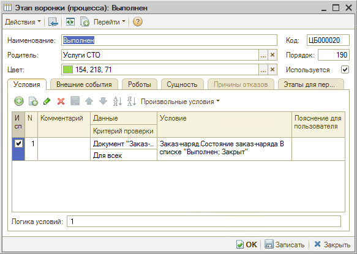

### Вкладка «Условия»

Суть задаваемых условий в следующем: чтобы сделку можно было перевести на данный этап, должны быть соблюдены определенные требования — например, заполнено определенное поле, создана корзина или заказ-наряд. Без соблюдения этих условий перевести сделку на эту стадию будет невозможно.

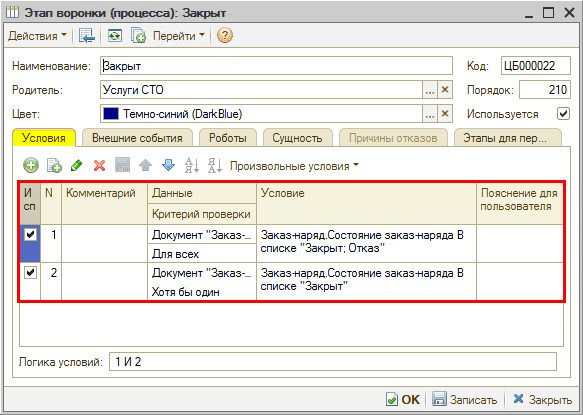

### Вкладка «Внешние события»

Внешние события настраиваются для автоматического перевода сделки на данный этап. То есть сделка будет автоматически переходить на этот этап, как только заданные условия будут выполнены. Например, переход сделки с этапа «Заявка» на этап «Согласование» будет происходить после записи [корзины](https://www.5systems.ru/help/rabota-v-arm-korzina).

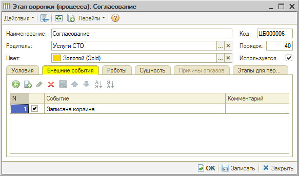

### Вкладка «Роботы»

**Робот** — это заранее спланированный алгоритм обработки сделок, который запускается, когда сделка попадает на определенный этап. То есть робот находится на конкретной стадии и запускается в тот момент, когда сделка переходит на нее.

Таким образом, можно запланировать, что должен будет сделать робот, когда сделка перейдет на данный этап. В частности, робот может поставить или завершить задачу, перевести сделку на следующий этап после смены состояния, завершить сделку и др.

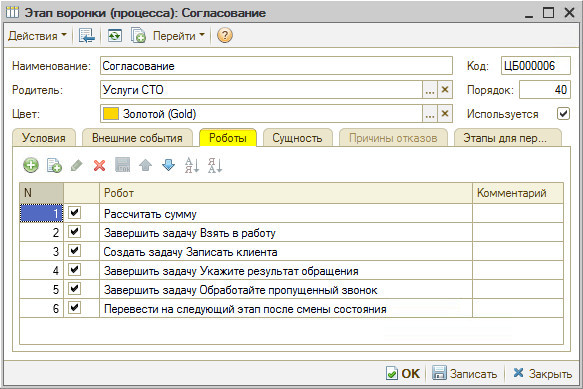

### Вкладка «Сущность»

На этой вкладке указывается, чем является этап по сущности и в каком состоянии («Начало», «В работе», «Завершен», «Отказ» и т. д.):

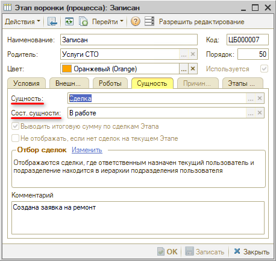

#### Настройка режимов отбора сделок

> *Настройка режимов отбора доступна начиная с релиза 2.8.1.*

Также на вкладке «Сущность» настраиваются режимы отбора сделок по подразделению и по пользователю:

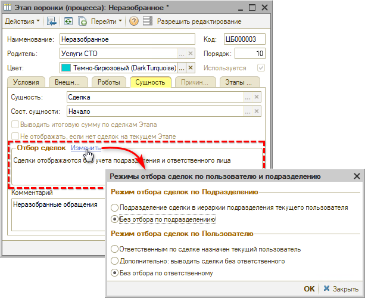

**1. Режимы отбора сделок по подразделению:**

- **Подразделение сделки в иерархии подразделения текущего пользователя** — будут отображаться сделки, в которых подразделение находится в иерархии подразделения пользователя;
- **Без отбора по подразделению** — будут отображаться сделки по всем подразделениям.

**2. Режимы отбора сделок по пользователю:**

- **Ответственным по сделке назначен текущий пользователь** — будут отображаться только те сделки, в которых ответственным назначен текущий пользователь;
- **Дополнительно: выводить сделки без ответственного** — помимо сделок, в которых ответственным назначен текущий пользователь, будут выводиться сделки, где ответственный не назначен;
- **Без отбора по ответственному** — будут отображаться все сделки, без отбора по ответственному.

Если у сотрудников настроен отбор сделок по подразделению и по пользователю, они видят на канбане только свои лиды и сделки.

Для этапа «Неразобранное» можно отключить эти отборы — тогда нераспределенные сделки будут выводиться для всех сотрудников компании независимо от их подразделения и от того, кто указан ответственным в сделках.

### Вкладка «Этапы для переходов»

Настраивается, на какие этапы можно переходить из текущего. Это возможность ограничить некорректные действия пользователя — в частности, чтобы нельзя было перетащить сделку вручную обратно.

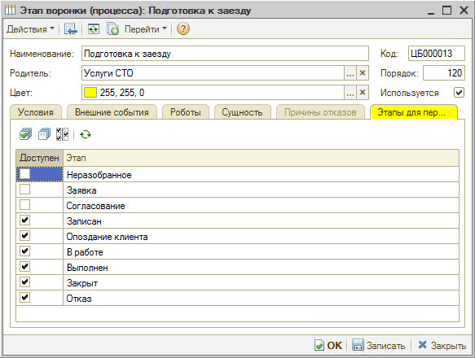

---

**Теги:** CRM, воронка продаж, процессы компании, этапы воронки, настройка формы сделки, карточка канбана, список сделок, роботы, внешние события, условия перехода, режимы отбора, адресация уведомлений

