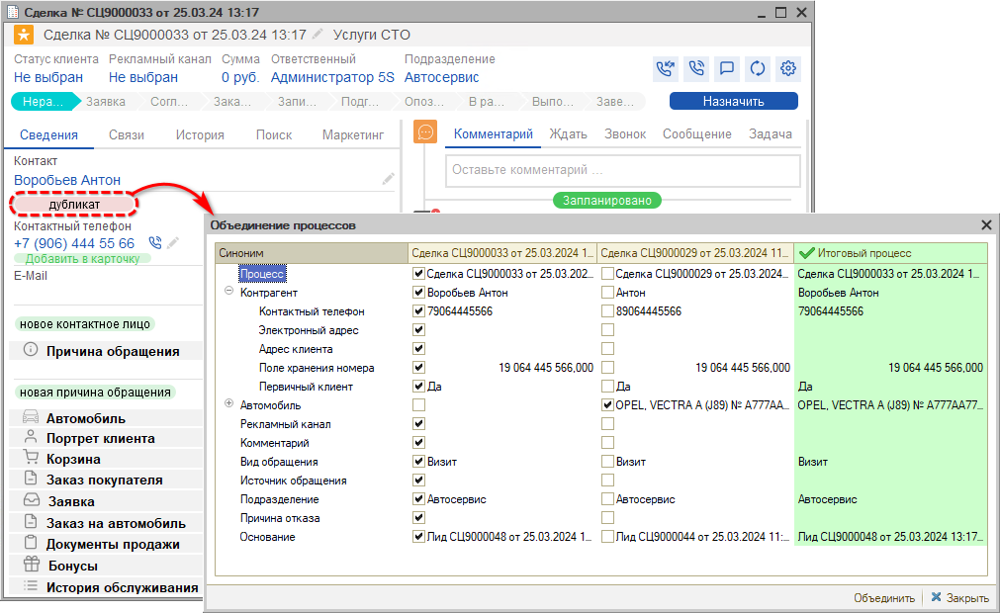
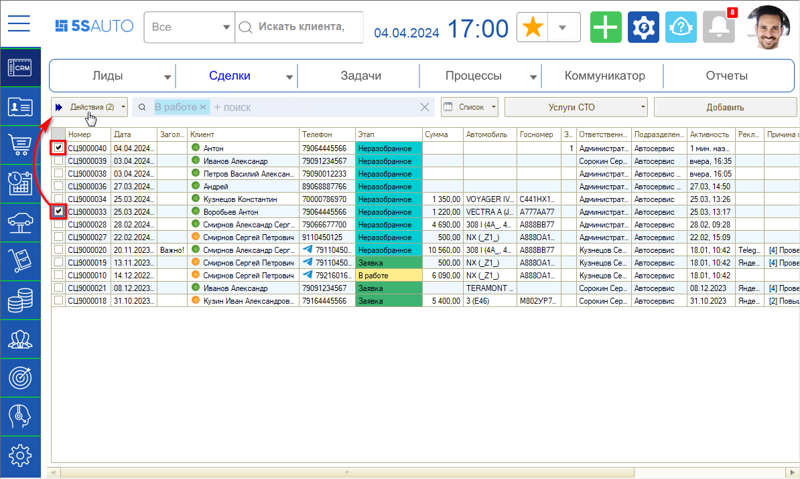
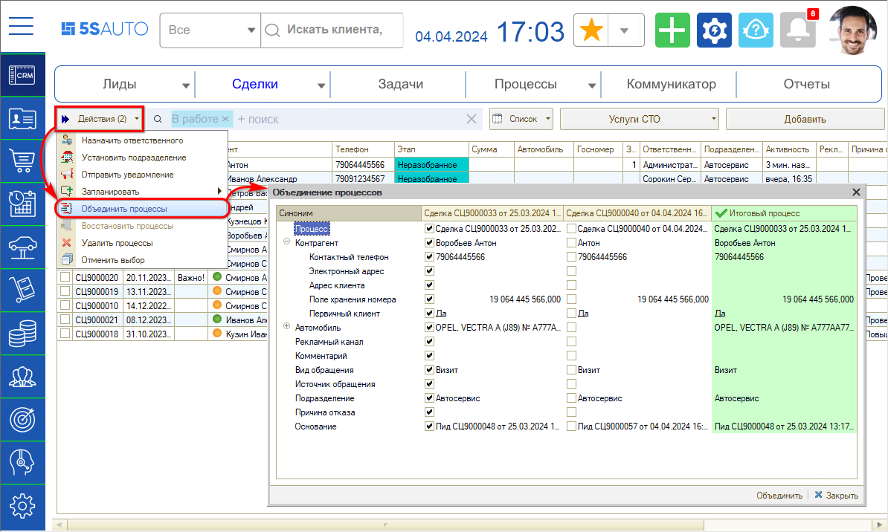
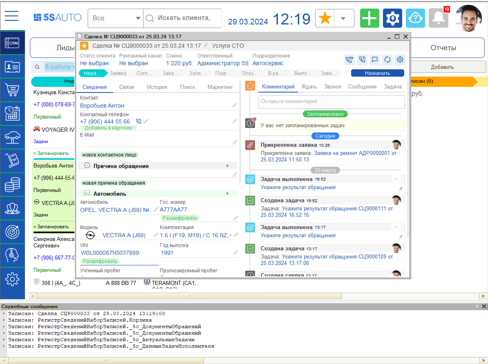

# Объединение сделок

<table><tr><td><b>Время чтения:</b> 7 мин.</td><td><b>Обновлено:</b> 16.10.2024</td></tr></table>

Источник: https://www.5systems.ru/help/obedinenie-sdelok

> *Функционал доступен начиная с версии релиза 5S AUTO 2.7.1.*

## Содержание

- [Введение](#введение)
- [Описание](#описание)
  - [Объединение дублей через форму сделки](#объединение-дублей-через-форму-сделки)
  - [Объединение сделок в списке и на канбане](#объединение-сделок-в-списке-и-на-канбане)
  - [Результат объединения](#результат-объединения)

## Введение

В программе реализована обработка **«Объединение процессов»**, которая позволяет объединить две сделки в одну, а также автоматическое информирование пользователя о наличии дублирующей сделки.

Дубли могут появиться, например, если клиент сначала позвонил и записался на ремонт, а потом позвонил уточнить детали, но с другого номера телефона, который не записан в его карточке. Либо если лишняя сделка создана вручную по ошибке.

Дубли создают лишнюю бесполезную работу, нарушают воронку продаж и портят статистику, поэтому их необходимо своевременно отслеживать и устранять.

## Описание

Программа определяет новую сделку как дублирующую при условии, что по этому же подразделению есть незакрытая сделка с такими же данными по клиенту и автомобилю. Лиды и сделки определяются программой как дублирующие, если в них совпадают данные по двум блокам:

1. **Клиент** — имя и/или телефон.
2. **Автомобиль** — модель, VIN и/или гос. номер.

### Объединение дублей через форму сделки

В дублирующей [сделке](../Работа%20со%20сделкой/rabota-so-sdelkoy.md#индикация-дубликата-сделки) после ее сохранения под строкой **«Контакт»** появляется кнопка **«Дубликат»**, при наведении курсора на нее всплывает подсказка: «По этому контрагенту уже создан процесс». При нажатии на кнопку открывается обработка **«Объединение процессов»**:

Отметьте галочками те параметры, которые необходимо перенести в новую объединенную сделку — каждый параметр можно отметить либо в одной, либо в другой сделке, — и нажмите кнопку **«Объединить»**.

В верхней строке производится выбор основного процесса, который будет сохранен в качестве итогового. По умолчанию основным процессом программа устанавливает сделку, в контексте которой открыта обработка объединения.

### Объединение сделок в списке и на канбане

Также есть возможность объединить сделки на [канбане](../Канбан%20сделок/kanban-sdelok.md) или в [списке](../Список%20сделок/spisok-sdelok.md): выделите две сделки галочками и нажмите появившуюся кнопку **«[Действия](../Групповые%20действия%20со%20сделками/gruppovye-deystviya-so-sdelkami.md#кнопка-действия)»**:

В выпадающем меню нажмите кнопку **«Объединить процессы»**, в открывшемся окне «Объединение процессов» выберите основной процесс и параметры для переноса в новую сделку и нажмите кнопку **«Объединить»**:

Основным процессом по умолчанию программа устанавливает тот лид или сделку, на которой в канбане или в списке установлен курсор.

*Примечание:* объединить можно только две сделки. Если выделить одну сделку либо три и более, кнопка объединения сделок будет недоступна.

### Результат объединения

В результате остается одна сделка с выбранными параметрами, а вторая, дублирующая, перемещается в завершенные — в отказ. Все привязанные документы и задачи переносятся в активную основную сделку. Если в основной сделке нет автомобиля, он по умолчанию будет перенесен в нее из второй сделки.

---

**Теги:** CRM, сделка, объединение сделок, дубли, дубликат, объединение процессов, лиды, канбан, список сделок, воронка продаж

