

# Отложенные сделки

<table><tr><td><b>Время чтения:</b> 12 мин.</td><td><b>Обновлено:</b> 29.10.2024</td></tr></table>

Источник: https://www.5systems.ru/help/otlozhennye-sdelki

## Содержание

- [Что такое отложенные сделки](#что-такое-отложенные-сделки)
- [Принцип работы со сделками на канбане](#принцип-работы-со-сделками-на-канбане)
- [Как перевести сделку в отложенные](#как-перевести-сделку-в-отложенные)
  - [1. Перевод сделки в «Отложенные» вручную](#1-перевод-сделки-в-отложенные-вручную)
    - [Как вернуть отложенную сделку в работу](#как-вернуть-отложенную-сделку-в-работу)
  - [2. Автоматический переход сделок в отложенные](#2-автоматический-переход-сделок-в-отложенные)
- [Настройка уведомлений](#настройка-уведомлений)

## Что такое отложенные сделки

Одна из основных идей [канбана](../Канбан%20сделок/kanban-sdelok.md) — фиксация сделок, с которыми нужно работать в настоящий момент.

По умолчанию канбан открывается в режиме **«В работе»**: на нем выводятся актуальные сделки, по которым необходимо что-то сделать — записать клиента, создать корзину, заказать запчасти и т. д.

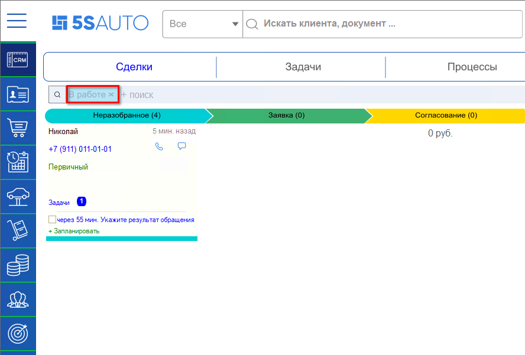

Показатель того, что все актуальные сделки отработаны, — отсутствие сделок на канбане. То есть в идеале сделок на канбане в режиме «В работе» быть не должно.

**Отложенная сделка** — это сделка, которую сотрудник отработал и отложил на определенный срок, чтобы она не смешивалась с актуальными сделками и не занимала места на рабочем канбане. При этом ее всегда можно отследить на канбане в режиме **«Отложенные»**. Отложенные сделки — это естественное состояние процесса продажи.

По истечении заданного срока робот возвращает отложенные сделки на рабочий канбан, либо сотрудник может в любой момент вернуть сделку в работу вручную — см. [ниже](#как-вернуть-отложенную-сделку-в-работу).

## Принцип работы со сделками на канбане

Для переключения между режимами канбана используется кнопка **«Отбор сделок»**. Помимо «В работе» и «Отложенных» канбан может быть открыт в режимах **«Закрытые сделки»** и **«Удаленные сделки»**:

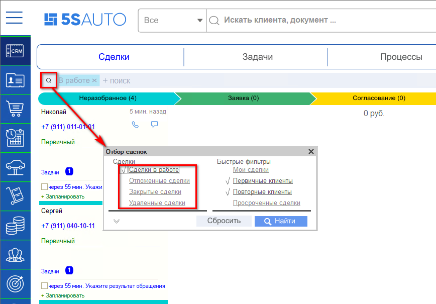

Чтобы сделка «ушла» с основного канбана, могут быть следующие варианты действий с ней:

- **записать клиента на ремонт либо создать заказ покупателя на запчасти** — в этом случае сделка будет отработана и перейдет в «Отложенные»;
- **закрыть заказ-наряд** — сделка перейдет в «Закрытые»;
- **завершить сделку** — при успешном завершении либо при отказе клиента сделка переходит в «Закрытые»;
- **отложить** — сделка перейдет в «Отложенные».

*Примечание:* в «Удаленные» сделка попадает, если ее пометить на удаление.

Таким образом, все сделки должны завершаться либо откладываться, чтобы они не оставались на основном канбане.

## Как перевести сделку в отложенные

### 1. Перевод сделки в «Отложенные» вручную

Используется, например, если клиенту озвучили стоимость ремонта или запчастей и он просит время подумать.

Способы перевода сделки в отложенные:

**1) Из карточки сделки на канбане.** Правой кнопкой мыши вызовите контекстное меню, нажмите кнопку **«Ждать»** и выберите время ожидания либо нажмите **«Указать дату»** и введите нужные дату и время:

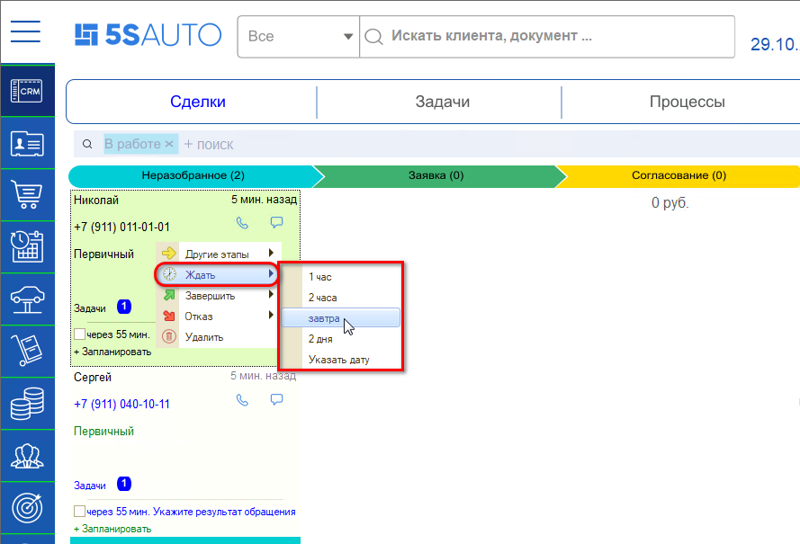

**2) Из открытой формы сделки.** В правой части на вкладке **«Ждать»** нажмите на стрелку и выберите время ожидания из выпадающего списка либо задайте нужную дату:

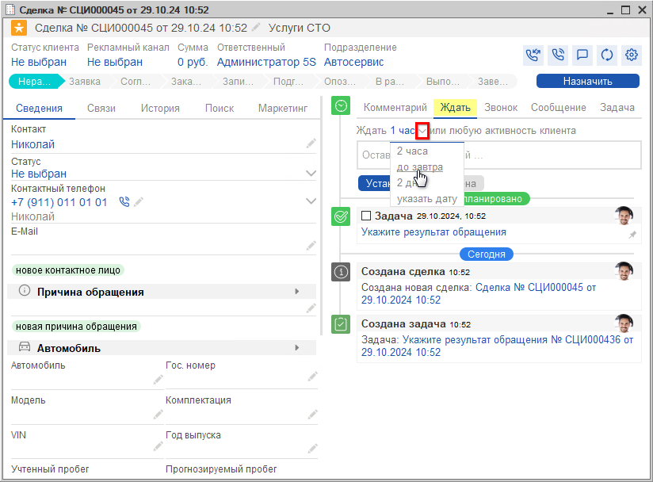

Затем можно написать комментарий, например «Клиент думает», и нажать кнопку **«Установить»**:

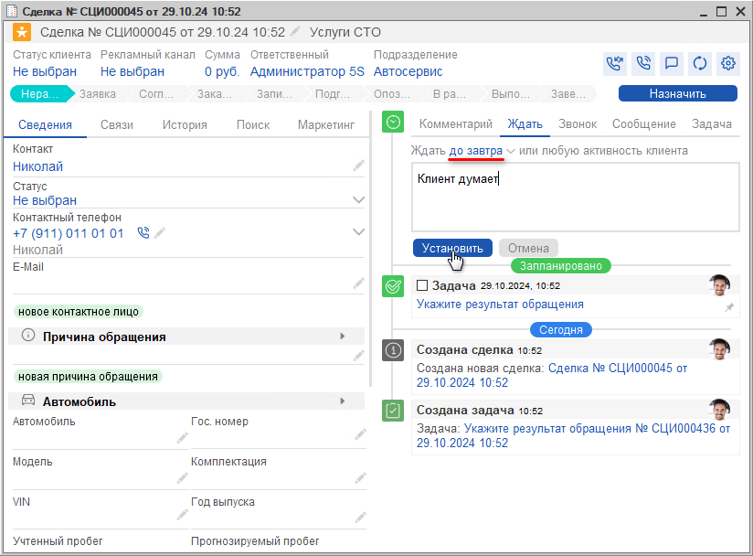

После этого сделка переходит в «Отложенные», в событиях сделки создается событие **«Ожидание»**, а также всплывает уведомление «Сделка отложена»:

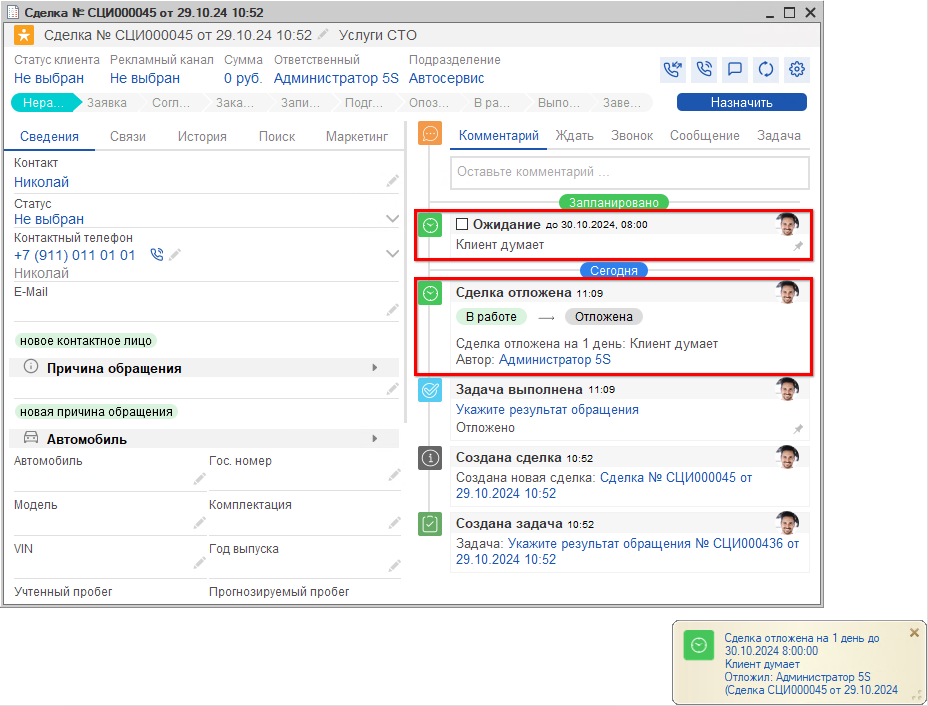

По истечении установленного времени сделка автоматически возвращается в работу, на основной канбан, и пользователю выходит уведомление «Отложенная сделка возвращена в работу».

Чтобы увидеть отложенные сделки, установите отбор **«Отложенные»** и нажмите кнопку **«Найти»** либо просто кликните на «крестик» [Х] рядом с режимом «В работе»:

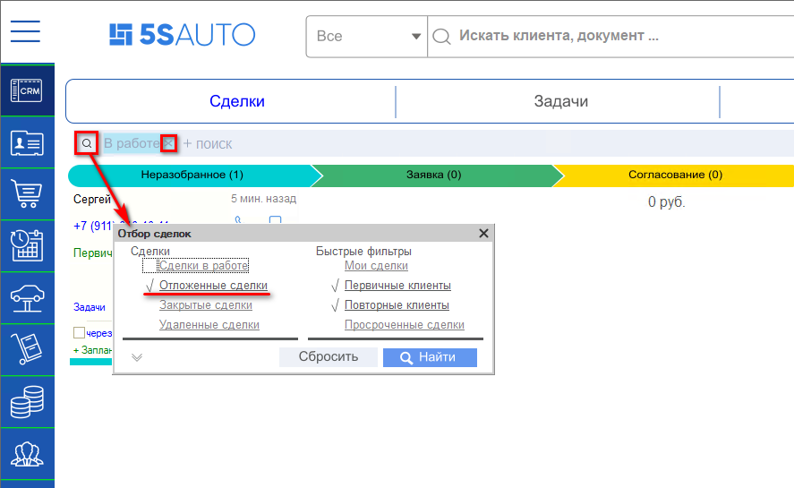

Открывается канбан с отложенными сделками:

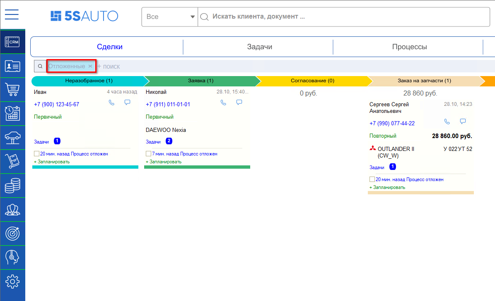

#### Как вернуть отложенную сделку в работу

Способы возврата отложенной сделки в работу:

**1) Из карточки сделки на канбане** в режиме «Отложенные» — двумя способами:

- правой кнопкой мыши вызвать контекстное меню и нажать кнопку **«Прекратить ожидание»**;
- установить галочку рядом с полем **«Процесс отложен»** и в открывшемся вопросе «Завершить ожидание?» ответить **«Да»**.

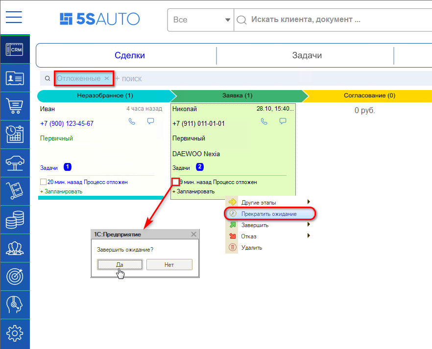

**2) Из открытой формы сделки** — установить галочку в событии **«Ожидание»**:

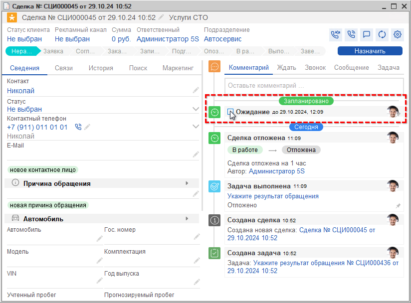

После этого сделка переводится из отложенных в работу, всплывает уведомление о том, что сделка возвращена в работу:

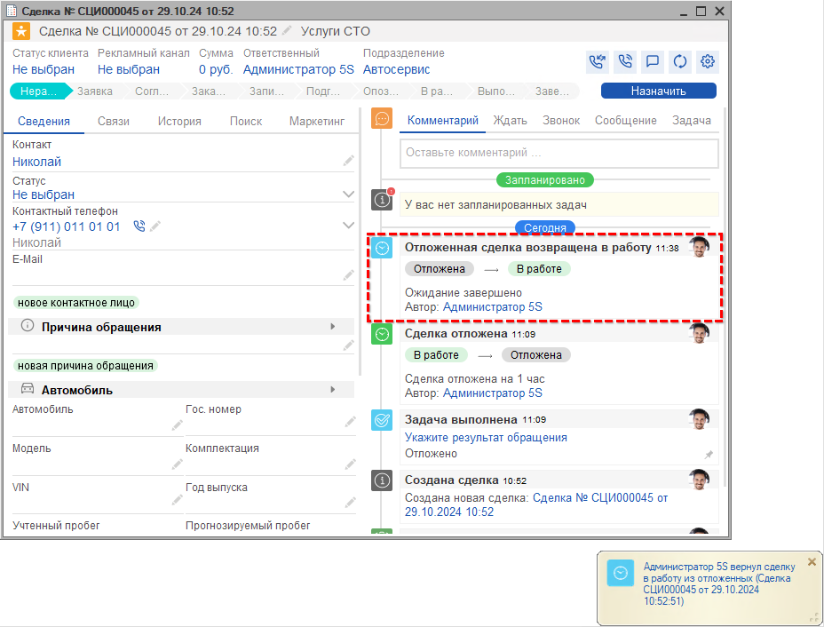

### 2. Автоматический переход сделок в отложенные

Когда клиента записали на ремонт, сделка попадает на этап **«Записан»** и выполняется действие на значимое событие **«Отложить сделку»**. См. настройки перехода: *Воронка продаж → Настройки этапа «Записан» → робот «Отложить сделку»*:

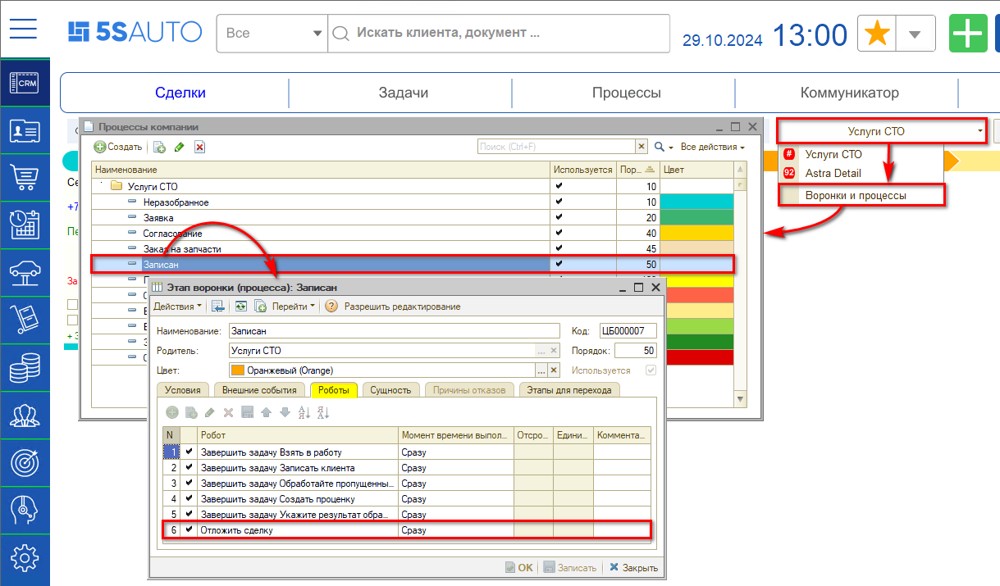

Открыть это действие можно через справочник **«Значимые события → Роботы»**:

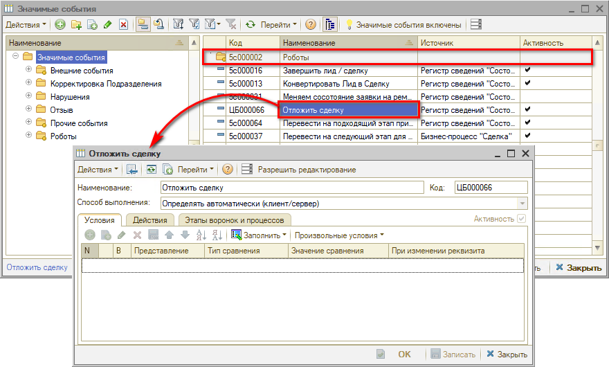

Робот «Отложить сделку» не имеет условий и выполняет действие **«Отложить сделку / вернуть сделку из отложенного состояния»** со сроком от начала работ по заявке на ремонт:

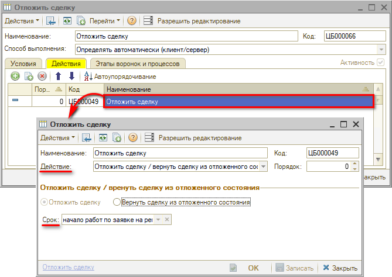

То есть сделка, попадая на этап «Записан», автоматически переходит в «Отложенные» с момента создания заявки на ремонт до начала работ по этой заявке.

## Настройка уведомлений

Уведомления «Сделка отложена» и «Отложенная сделка возвращена в работу» преднастроены по умолчанию. У пользователя есть возможность изменить тип push-окна, а также настроить отправку себе в мессенджер — см. статью «[Работа с уведомлениями](../Работа%20с%20уведомлениями/rabota-s-uvedomleniyami.md#настройка-получения-уведомлений-для-пользователя)»:

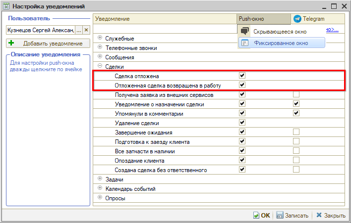

---

**Теги:** CRM, сделка, отложенные сделки, канбан, ожидание, режимы канбана, робот, значимые события, уведомления, воронка продаж

