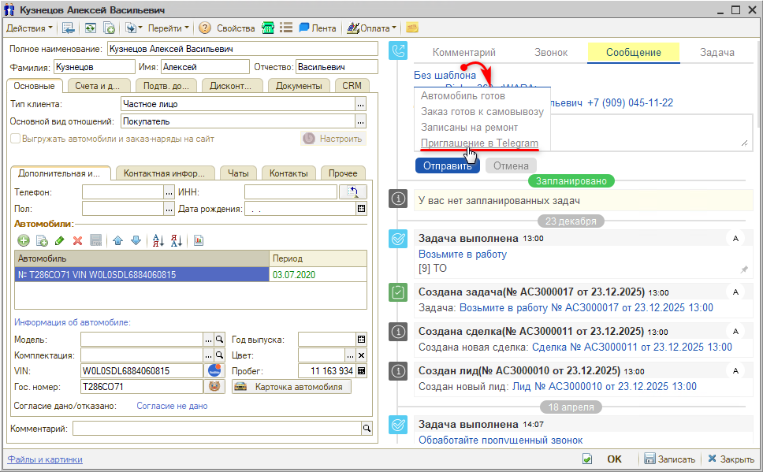
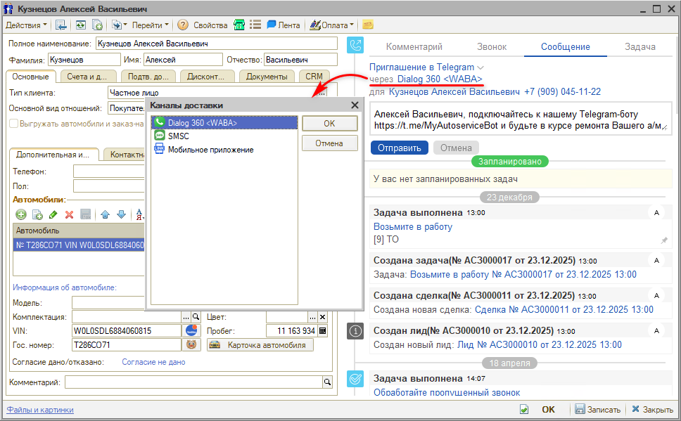
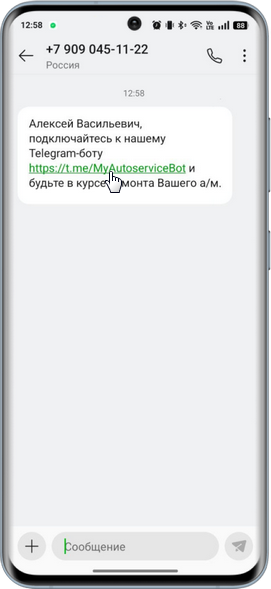
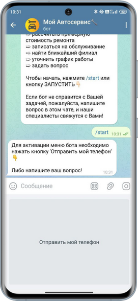

# Приглашение в Telegram

<table><tr><td><b>Время чтения:</b> 4 мин.</td><td><b>Обновлено:</b> 26.12.2025</td></tr></table>

Источник: https://www.5systems.ru/help/priglashenie-v-telegram

> *Функционал доступен начиная с релиза 2.3.1.1 (шаблон сообщения приглашения в Telegram автоматически добавится при обновлении конфигурации).*

*Примечание:* предварительно в системе должна быть настроена [интеграция с Telegram](https://www.5systems.ru/help/integraciya-s-telegram), а у клиента должно быть установлено приложение Telegram.

Чтобы создать чат с клиентом в Telegram, в правой части карточки контрагента на вкладке **«Сообщение»** выберите шаблон **«Приглашение в Telegram»**:

Далее выберите канал доставки — например, WABA, WhatsApp, SMSC и т. д.:

Затем нажмите кнопку **«Отправить»**.

Клиент получит сообщение через указанный мессенджер со ссылкой на Telegram-бота:

Далее клиент переходит по ссылке, и у него открывается бот в приложении Telegram. Остается запустить бот нажатием на кнопку **«Старт»** и активировать меню бота, отправив свой номер телефона:

После этого можно общаться с клиентом через Telegram.

---

**Теги:** Telegram, приглашение в Telegram, чаты, мессенджеры, шаблоны сообщений, карточка контрагента, Telegram-бот

