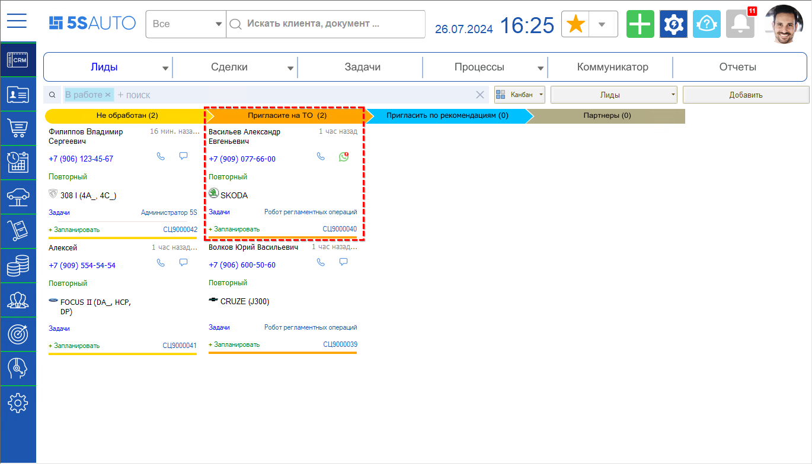
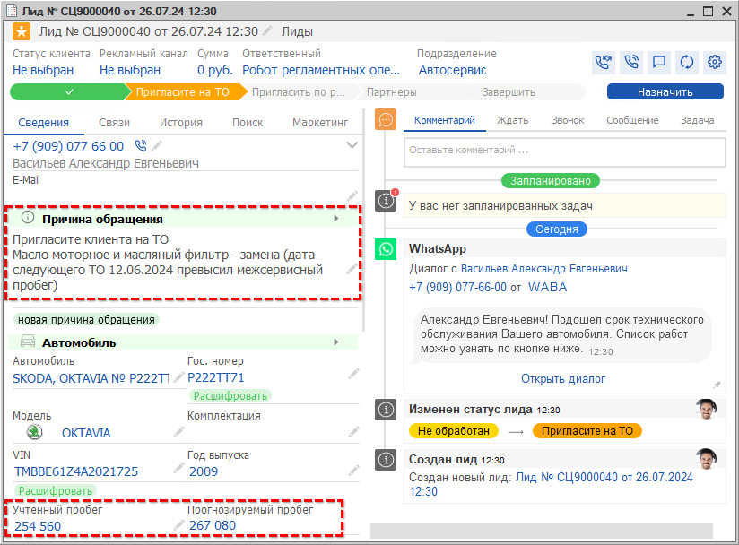
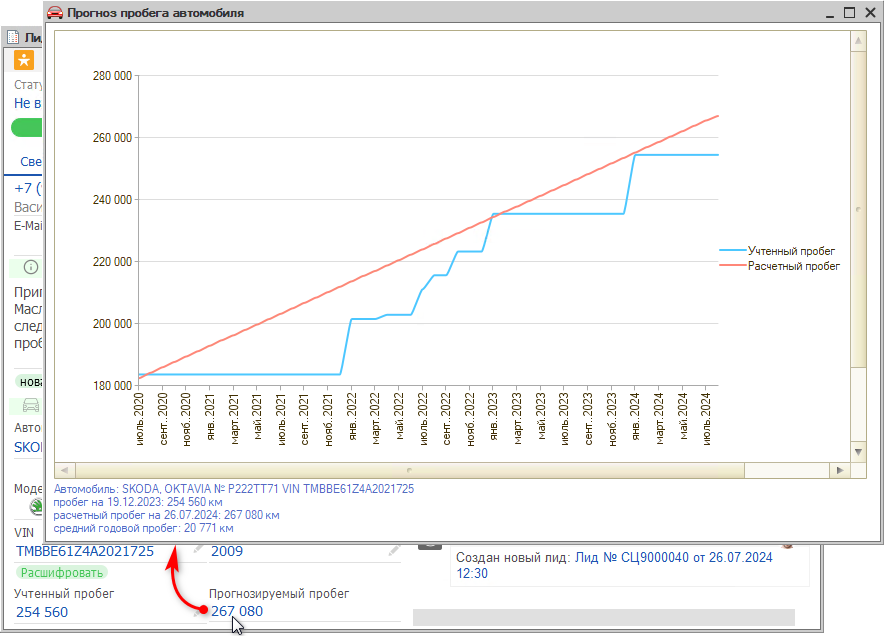

# Приглашения на ТО

<table><tr><td><b>Время чтения:</b> 8 мин.</td><td><b>Обновлено:</b> 29.07.2024</td></tr></table>

Источник: https://www.5systems.ru/help/priglasheniya-na

## Содержание

- [Введение](#введение)
- [Предварительная настройка](#предварительная-настройка)
- [Работа с приглашениями на ТО](#работа-с-приглашениями-на-то)

## Введение

В программе предусмотрена возможность автоматического создания лидов и сделок для приглашения клиентов на техническое обслуживание (ТО) исходя из межсервисных интервалов автомобилей.

## Предварительная настройка

Настройки приглашений на ТО производятся в Мастере настройки системы — см. «[Мастер настройки системы → Приглашение на ТО](https://www.5systems.ru/help/master-nastroyki-sistemy#prigl_na_to)».

## Работа с приглашениями на ТО

После выполнения регламентного задания на текущий день создаются новые лиды или сделки в специальном разделе **«Пригласите на ТО»**:

В лиде или сделке в качестве причины обращения указывается, на основании чего можно пригласить клиента: расчетный пробег превысил межсервисный либо прошел межсервисный интервал, то есть наступила дата следующего ТО:

Для наглядности по расчетному пробегу можно посмотреть график, нажав на ссылку со значением прогнозируемого пробега:

Линия с учтенным пробегом отображает введенные значения пробега для автомобиля, а линия с расчетным пробегом отражает расчетную величину пробега на данный момент.

Также клиенту отправляется сообщение в мессенджер — стандартное или по заранее настроенному шаблону — с приглашением пройти техническое обслуживание. Для отработки лида или сделки необходимо дождаться ответа клиента либо, если клиент не отвечает более суток, связаться с ним самостоятельно. В процессе общения могут быть выявлены следующие варианты:

1. **Клиент записывается на ТО** — создана запись на ремонт, лид или сделка переводятся на следующий этап как успешные.
2. **Клиент уже прошел ТО в другом сервисе** — в этом случае лид или сделку можно отложить на предполагаемое время межсервисного интервала, при необходимости добавить комментарий и запланировать звонок (см. статью «[Отложенные сделки](../Отложенные%20сделки/otlozhennye-sdelki.md)»). По истечении заданного срока сделка автоматически вернется в работу, и можно будет снова пригласить клиента на ТО. Либо можно перевести сделку [в отказ](https://www.5systems.ru/help/kak-kvalificirovat-lid), в причинах указать «Работы выполнены в другом сервисе» — но в этом случае новый расчет межсервисных интервалов автоматически производиться не будет до следующего обращения клиента.
3. **Клиент не готов приехать в ближайшее время** — сделку также можно отложить либо перевести в отказ по аналогии с вариантом выше.
4. **Расчетное значение пробега неверное, и не пришло время для ТО** — например, клиент не ездил на автомобиле в последнее время, пробег не изменился, необходимости в ТО нет. В этом случае можно отложить сделку на предполагаемое время межсервисного интервала либо перевести сделку в отказ по аналогии с вариантом 2.

Рекомендуется всегда уточнять у клиента текущий пробег автомобиля и фиксировать его значение в соответствующем параметре. Как правило, это делается в заказ-наряде при заезде клиента, так как можно проверить точное значение пробега:

Это необходимо делать для более точного расчета прогнозируемого времени наступления следующего ТО.

> **Важно!** Рекомендуется указывать реальное актуальное значение пробега для корректной работы механизмов программы.

---

**Теги:** CRM, приглашения на ТО, техническое обслуживание, межсервисный интервал, пробег, лиды, сделки, отложенные сделки, регламентное задание

