

# Работа в АРМ Коммуникатор

<table><tr><td><b>Время чтения:</b> 20 мин.</td><td><b>Обновлено:</b> 23.06.2022</td></tr></table>

Источник: https://www.5systems.ru/help/rabota-v-arm-kommunikator

## Содержание

- [Введение](#введение)
- [Интерфейс](#интерфейс)
- [Чаты](#чаты)
  - [Внутренние чаты](#внутренние-чаты)
  - [Клиентские чаты](#клиентские-чаты)
  - [Цветовая индикация](#цветовая-индикация)
- [Уведомления и адресация](#уведомления-и-адресация)
- [Настройка параметров напоминаний](#настройка-параметров-напоминаний)

## Введение

АРМ «Коммуникатор» используется для ведения переписки в чатах — внутренних (между сотрудниками организации) и клиентских.

Перейти в АРМ «Коммуникатор» можно по кнопке на верхней панели [интерфейса](../Структура%20интерфейса%205S%20AUTO/struktura-interfeysa-5s-auto.md):

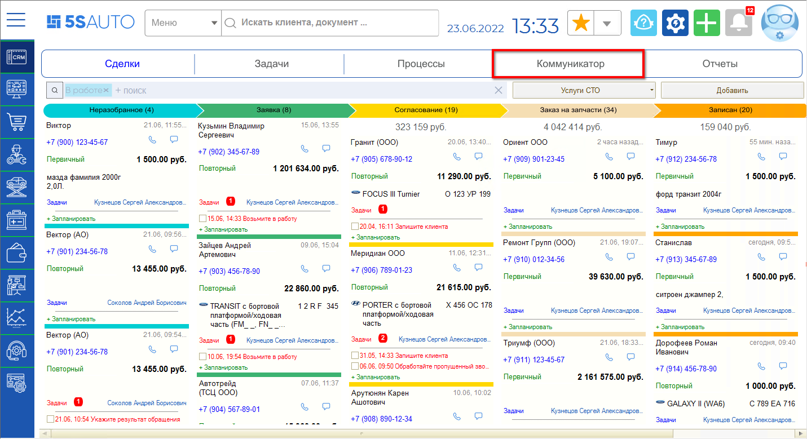

## Интерфейс

Коммуникатор представляет собой дерево групп, содержащее следующие разделы:

- События;
- Напоминания;
- Электронная почта;
- Чаты — разработка 5SYSTEMS.

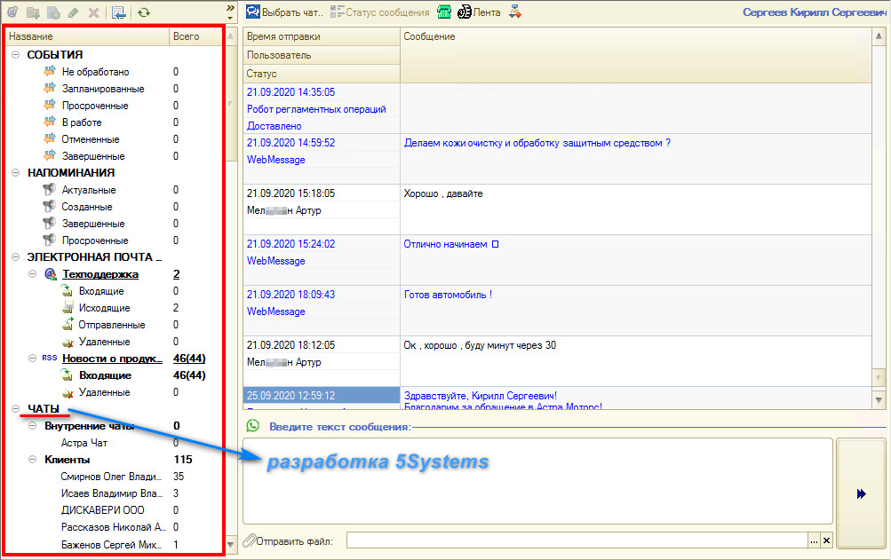

## Чаты

### Внутренние чаты

Внутренние чаты — это переписка между сотрудниками.

При создании сотрудника чат для него создается автоматически. Вручную это делается так: *CRM → Обработки → Мастер настройки → вкладка «Отправка сообщений» → вкладка «Для сотрудников» → «Создать чаты сотрудников»*. Команда создает чаты всем сотрудникам, которые на данный момент не уволены.

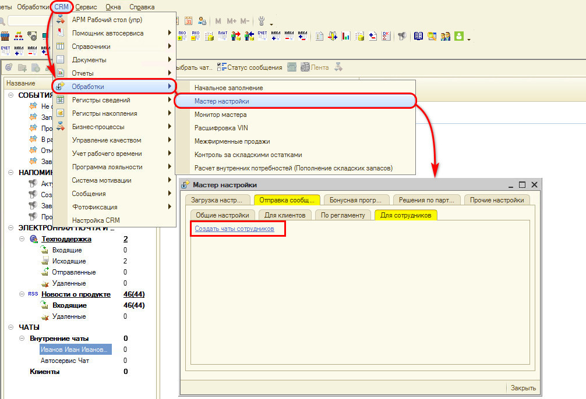

В поле слева, в дереве, отображаются актуальные сообщения за последний месяц, отсортированные по дате. Если нужного чата нет, по кнопке **«Выбрать чат»** можно найти его в списке и выбрать.

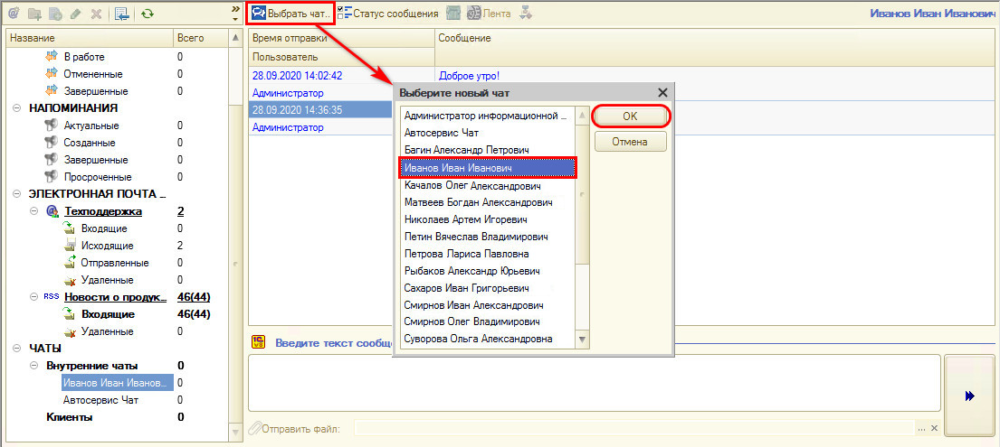

Внутренние чаты бывают личные и коллективные (групповые).

Групповые чаты настраиваются так: *CRM → Сообщения → справочник «Чаты (Пять систем)»*. Создается чат 1С — общий для компании, задается наименование, настраивается доступ:

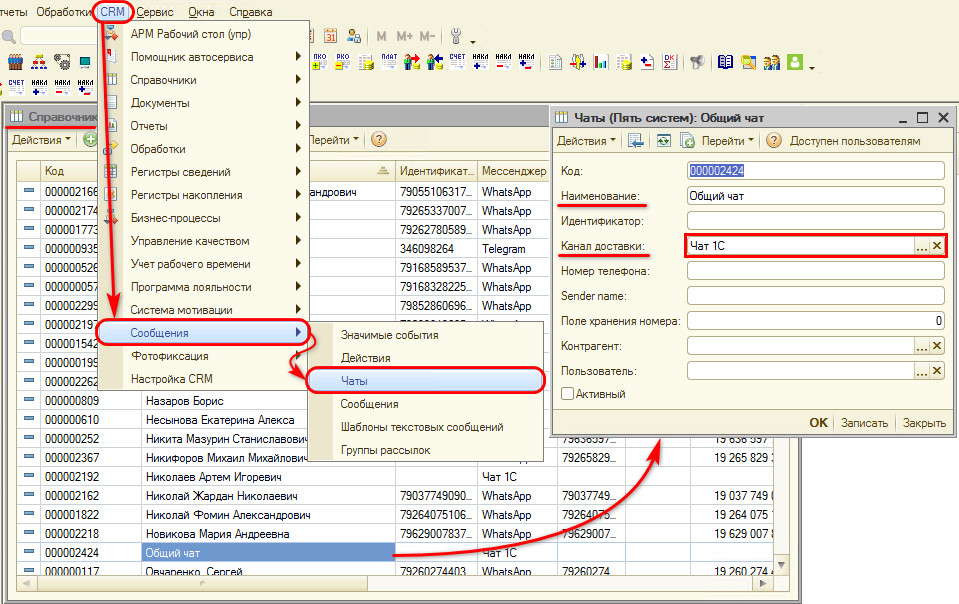

По кнопке **«Перейти → Чаты (Адресация)»** добавьте в список новую строку, выберите текущий чат — и можно установить фильтры, кому он будет доступен. Если не установлены никакие фильтры, чат доступен всем сотрудникам.

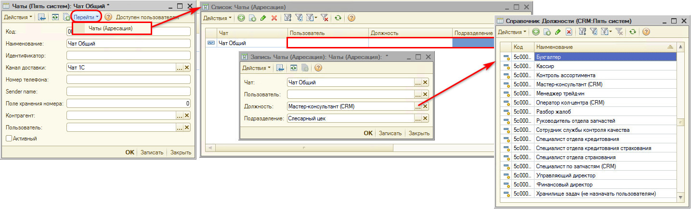

Фильтры:

- **Пользователь** — можно создать список всех пользователей, кому будет доступен данный чат (добавляется отдельная строка для каждого пользователя);
- **Должность** — выбирается из справочника должностей CRM («Пять систем»), который используется для адресации задач. То есть имеются в виду должностные обязанности, а не должность сотрудника в карточке;
- **Подразделение** — можно сделать чат для сотрудников конкретного подразделения.

По кнопке **«Доступен пользователям»** можно проверить, каким пользователям доступен чат:

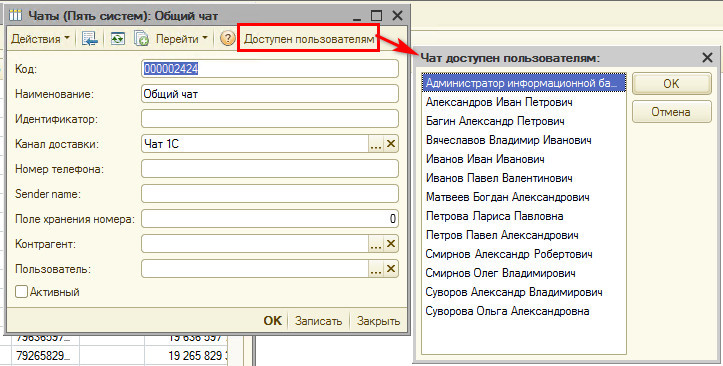

**Отправка сообщения:** заполните поле **«Введите текст сообщения»** и нажмите кнопку **«Отправить сообщение»**. Отправка файлов для внутренних чатов не реализована.

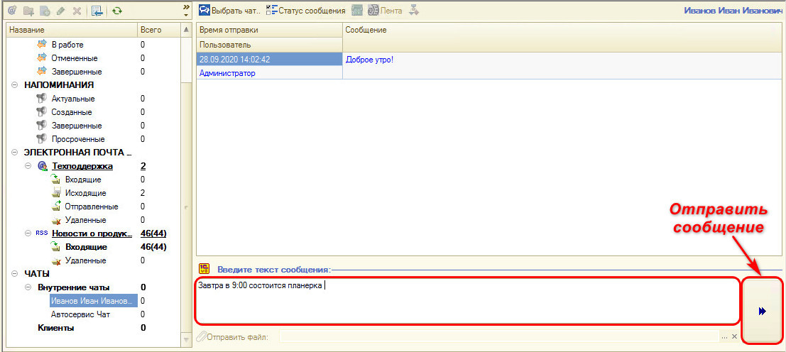

При поступлении в чат сообщения всплывает окно. По нему можно перейти либо на АРМ «Коммуникатор» и ответить, либо прочитать и принять к сведению — у отправителя оно отметится как прочитанное.

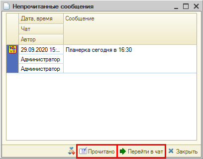

Для работы с групповыми внутренними чатами есть кнопка **«Статус сообщения»**: выводится список «Отмеченные пользователи прочитали сообщение». В нем отображаются все участники чата: те, перед кем стоит галочка, прочитали сообщение, остальные — нет.

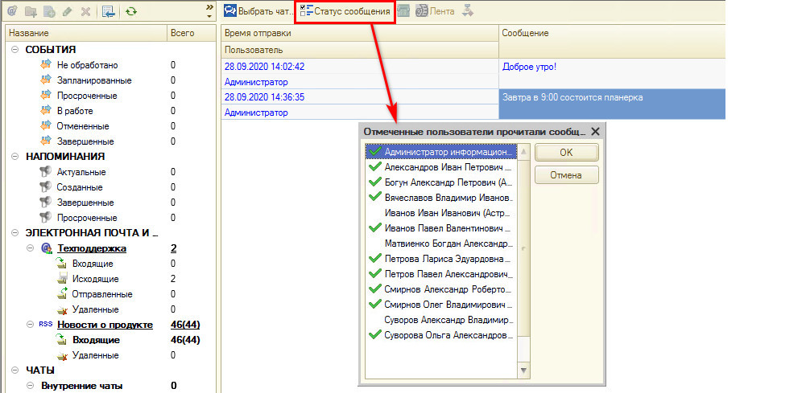

### Клиентские чаты

Выбрать нужный клиентский чат можно так же из списка (из дерева). В чате отображается значок — тип чата (WhatsApp и т. д.). Можно написать сообщение, можно отправить файл.

Кнопки, активные только в клиентских чатах:

- **Позвонить клиенту**;
- **Лента событий** — откроется окно [Ленты событий](../../Работа%20с%20клиентами/Лента%20событий/lenta-sobytiy.md), где отображаются не только сообщения чата, но и прочая переписка с клиентом и звонки;
- **Бизнес-процесс** — позволяет перейти на текущую задачу по данному клиенту.

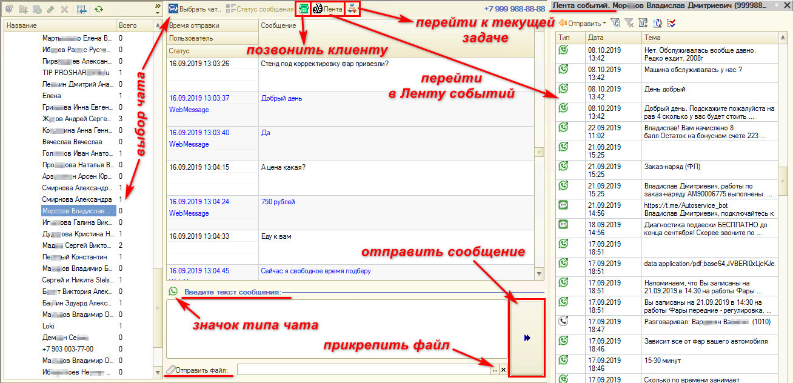

Интерфейса работы с внутренними чатами в программе больше нигде нет. Интерфейс переписки с клиентами есть в [Ленте событий](../../Работа%20с%20клиентами/Лента%20событий/lenta-sobytiy.md).

### Цветовая индикация

- **Синим** цветом отмечены исходящие сообщения (ответы клиенту или сотруднику);
- **черным** — входящие сообщения от клиента или сотрудника.

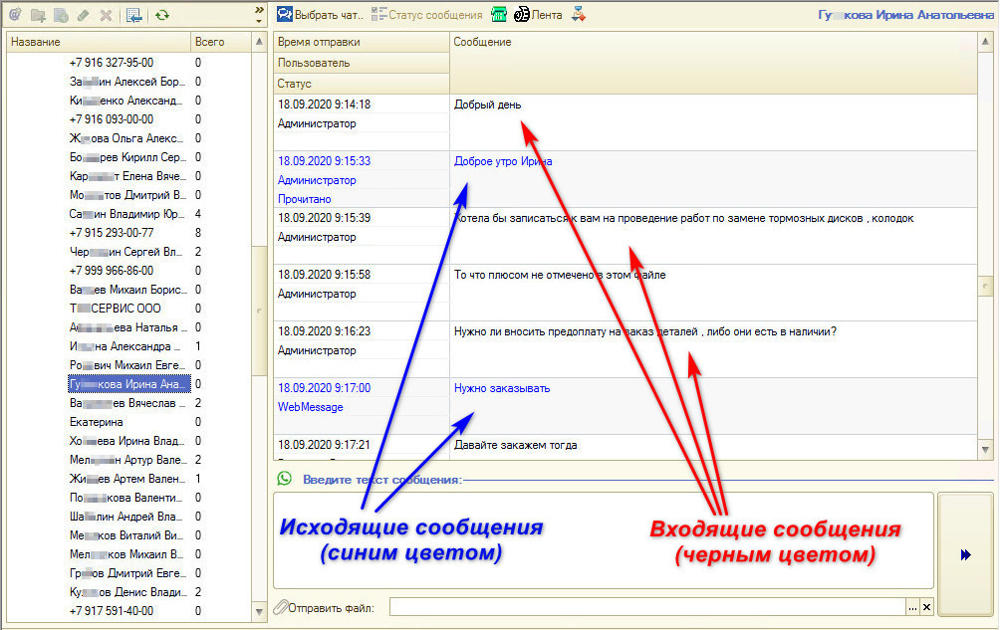

Жирным шрифтом выделяются непрочитанные входящие сообщения. Чтобы отметить сообщение как прочитанное, кликните по нему — либо через несколько секунд сообщение автоматически станет прочитанным.

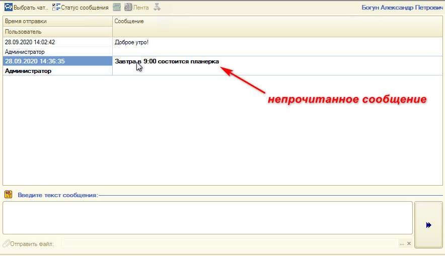

Если в сообщении написано «(Call - miss)», значит, был пропущенный звонок от клиента.

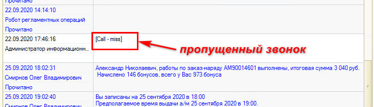

## Уведомления и адресация

В Коммуникаторе реализована поддержка уведомлений. Когда клиент что-то пишет, всплывает окно у того пользователя, на кого назначена задача по клиенту — на конкретного сотрудника или по должности CRM.

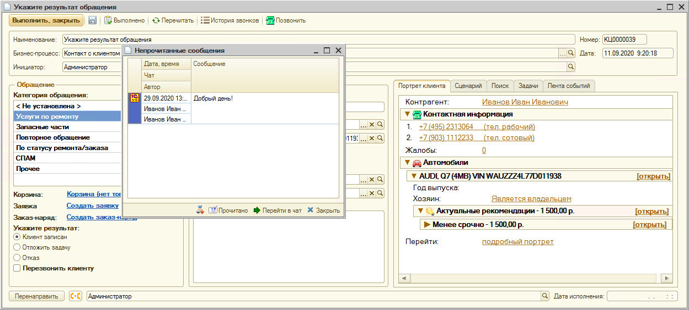

Адресация как всех задач на АРМ, так и сообщений происходит через [регистр сведений «Сведения адресации»](https://www.5systems.ru/help/adresaciya-zadach-v-crm-po-ispolnitelyam) — один из основных регистров управления всей CRM. В нем прописаны связи между пользователями, должностями CRM и подразделениями.

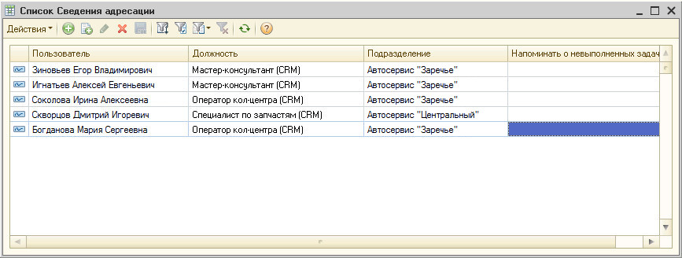

При получении сообщения от клиента (первого в течение дня) создается бизнес-процесс. Если сообщение второе и последующие, бизнес-процесс заново не создается. Но если задача закрыта, создается новая задача либо в старой задаче правится время, когда надо на нее ответить.

## Настройка параметров напоминаний

Путь: *Сервис → Настройка параметров → вкладка «Прочие»*.

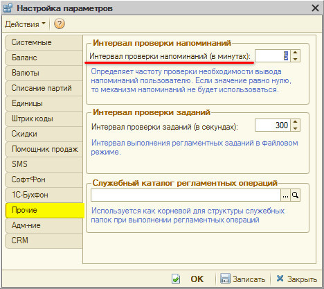

Настраивается интервал проверки напоминаний в минутах — например, каждые 5 минут. Если установить значение **0**, механизм напоминаний не будет использоваться: сообщения в чат будут приходить, но окно с напоминанием всплывать не будет.

**Если обновить** — сообщение в чате появится сразу.

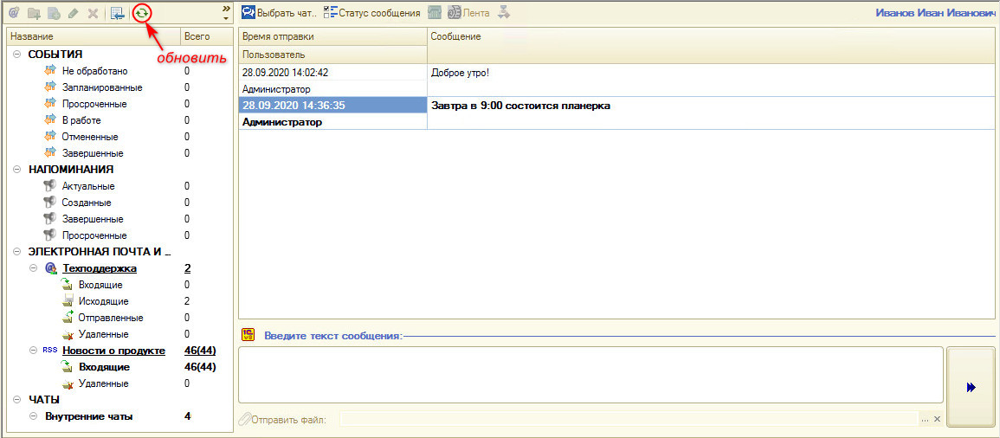

**Автоматически** — окно сообщения всплывет по истечении заданного интервала (5 минут).

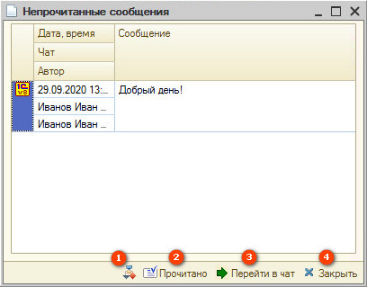

Из появившегося окна сообщения нажатием на соответствующие кнопки можно:

- перейти в бизнес-процесс;
- отметить как прочитанное;
- перейти в чат;
- закрыть.

---

**Теги:** CRM, Коммуникатор, АРМ, чаты, внутренние чаты, групповые чаты, клиентские чаты, уведомления, сведения адресации, напоминания, лента событий

