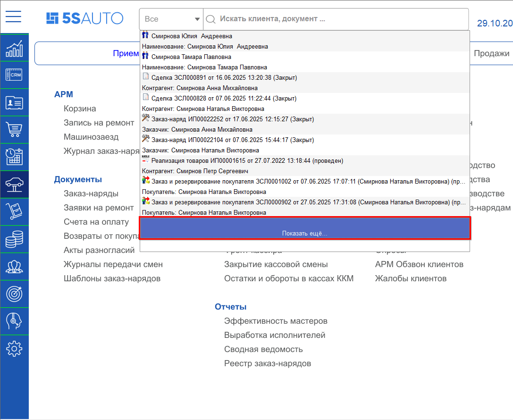

# Работа с полнотекстовым поиском

<table><tr><td><b>Время чтения:</b> 5 мин.</td><td><b>Обновлено:</b> 26.12.2025</td></tr></table>

Источник: https://www.5systems.ru/help/rabota-s-polnotekstovym-poiskom

**Актуально начиная с версии релиза 2.001.001**

## Содержание

- [Введение](#введение)
- [Работа с поиском](#работа-с-поиском)

## Введение

В системе реализован полнотекстовый поиск по частичному совпадению в справочниках, реестрах документов, разделах меню.

Механизм полнотекстового поиска основан на использовании полнотекстового индекса, который создается в базе данных и затем периодически, по мере необходимости, обновляется.

## Работа с поиском

Строка поиска находится на верхней панели [интерфейса](../Структура%20интерфейса%205S%20AUTO/struktura-interfeysa-5s-auto.md#2-строка-поиска).

Поиск можно вести по разным реквизитам: по имени или фамилии клиента, по номеру телефона, по модели автомобиля, по VIN-номеру, гос. номеру и т. д.

Например, для поиска заказ-наряда по клиенту введите в строку поиска его фамилию — частично или полностью — и нажмите на клавиатуре **Enter**.

В результате найден заказчик с введенной фамилией «Смирнова» в заказ-наряде № \_\_\_ от дд.мм.гг. Двойным кликом на строку с нужным результатом поиска открывается соответствующий документ, сделка или элемент справочника — в рассматриваемом примере заказ-наряд.

Кнопка **«Показать еще»** посредством двойного клика позволяет просмотреть следующие результаты поиска.

Поиск производится по разделам: Контрагенты, Автомобили, Сделки, Заказ-наряды, Реализации, Заказы, Меню. По умолчанию поиск ведется во всех разделах одновременно, но можно выбрать один из разделов и искать только в нем.

Например, через поле поиска можно быстро найти нужный пункт меню интерфейса, предварительно выбрав раздел **«Меню»**.

О настройке полнотекстового поиска и устранении возможных нарушений его работы см. статью «[Настройка полнотекстового поиска](https://www.5systems.ru/help/nastroyka-polnotekstovogo-poiska)».

---

**Теги:** CRM, полнотекстовый поиск, поиск, строка поиска, индекс поиска, интерфейс, справочники, реестры документов

