

# Работа с уведомлениями

<table><tr><td><b>Время чтения:</b> 21 мин.</td><td><b>Обновлено:</b> 18.10.2024</td></tr></table>

Источник: https://www.5systems.ru/help/rabota-s-uvedomleniyami

> *Актуально начиная с версии релиза 5S AUTO **2.001.001**.*

## Содержание

- [Введение](#введение)
- [Работа с уведомлениями](#работа-с-уведомлениями-1)
- [Настройка уведомлений](#настройка-уведомлений)
- [Виды оповещений](#виды-оповещений)
  - [Push-окно](#push-окно)
  - [Telegram](#telegram)
- [Настройка получения уведомлений для пользователя](#настройка-получения-уведомлений-для-пользователя)
- [Описание предопределенных уведомлений](#описание-предопределенных-уведомлений)

## Введение

В 5S AUTO есть возможность прямо в программе получать уведомления о возникновении различных ключевых событий: от пропущенного звонка клиента или поступления запчастей до упоминания пользователя в комментарии в сделке.

## Работа с уведомлениями

Количество непрочитанных уведомлений отображается индикатором на кнопке с колокольчиком на верхней панели [интерфейса](../Структура%20интерфейса%205S%20AUTO/struktura-interfeysa-5s-auto.md):

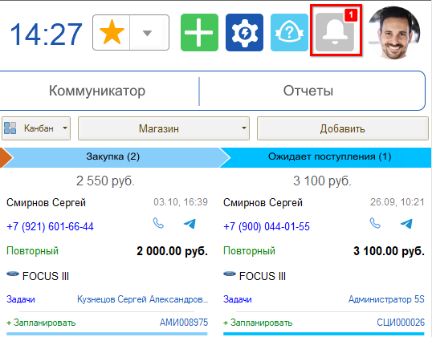

Нажатием на кнопку открывается весь список текущих уведомлений.

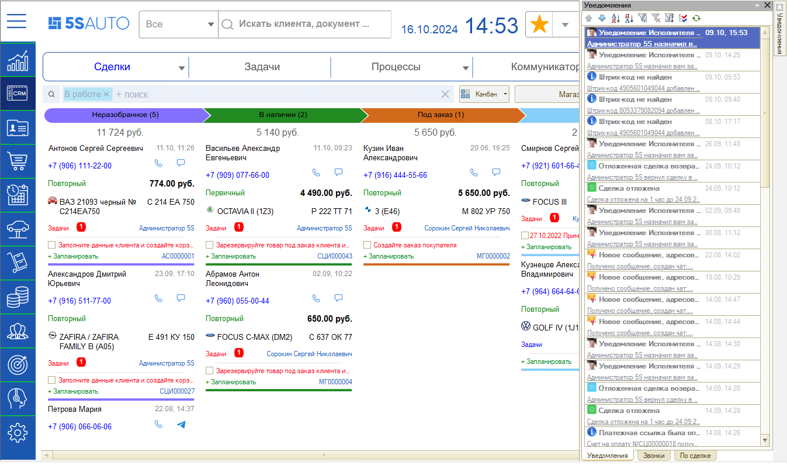

Также уведомления приходят в форме push-окон:

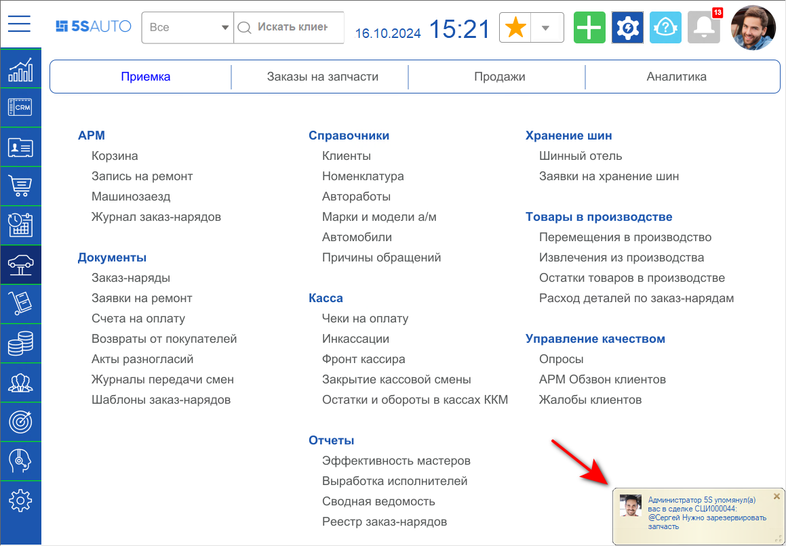

Например, если в [сделке](../Работа%20со%20сделкой/rabota-so-sdelkoy.md) оставить комментарий и отметить там другого пользователя, то этому пользователю сразу же придет уведомление с текстом «<имя пользователя> упомянул(а) Вас в сделке №_: <текст комментария>» и фотографией пользователя, написавшего комментарий.

## Настройка уведомлений

[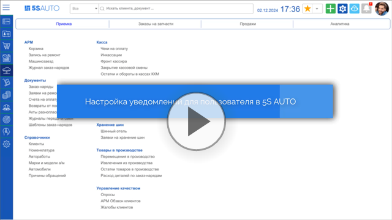](https://edu.5systems.ru/video/Polzovateli/Nastroyka_uvedomlenij_dlya_polzovatelya.mp4)

Каждый пользователь может настроить уведомления для себя. Перейти к настройкам уведомлений можно, нажав на аватар на верхней панели интерфейса и выбрав в выпадающем меню пункт **«Настройка уведомлений»**:

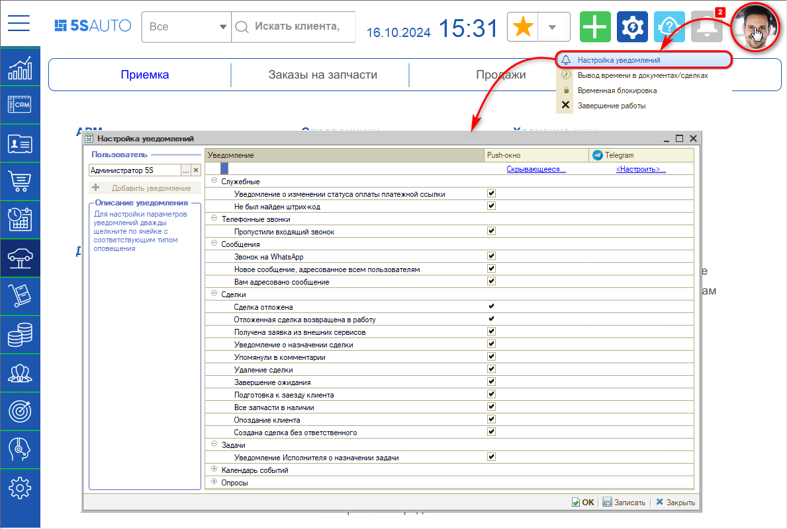

Интерфейс настройки уведомлений сделан для максимально удобного подключения чатов пользователем.

Для настройки параметров уведомлений нужно дважды кликнуть по ячейке со ссылкой под заголовком соответствующего вида оповещения — откроются настройки вида оповещения.

## Виды оповещений

Для настройки доступны два вида оповещения: push-окно и Telegram. Для push-окна можно изменять вид отображения, для Telegram доступен выбор чата, в который будет уходить уведомление.

### Push-окно

Push-окно — это уведомление, всплывающее на экране монитора пользователя, которому оно адресовано. По умолчанию отображается в нижнем правом углу. Push-окно можно перемещать, растягивать или закрыть, пока оно не исчезнет автоматически.

Push-окно может быть фиксированным или скрывающимся. Для изменения варианта нужно дважды кликнуть по ссылке под заголовком столбца **«Push-окно»**:

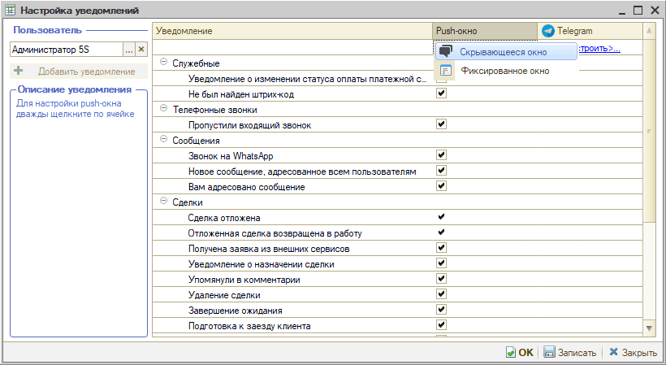

**Скрывающееся окно.** Настроено по умолчанию. Уведомление в виде скрывающегося push-окна появляется на 6 секунд и постепенно исчезает, если не навести на него курсор (изменить продолжительность нет возможности):

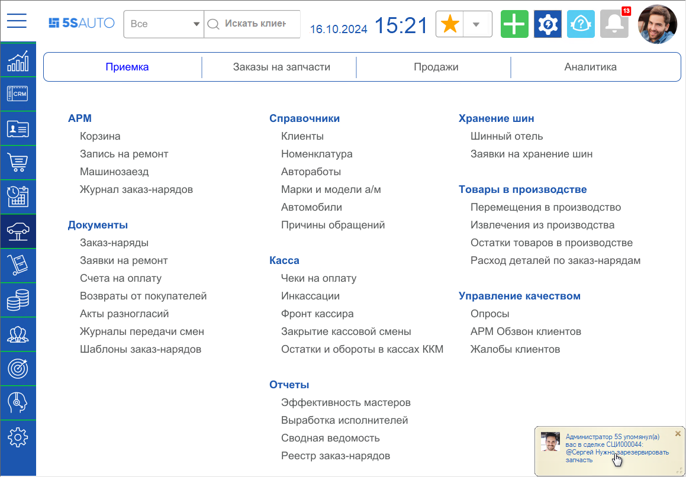

Кликнув на текст уведомления, можно перейти в форму элемента, на основании которого оно создано, — например, в сделку.

В зависимости от [настроек, заданных в карточке конкретного уведомления](../Настройка%20параметров%20уведомлений/nastroyka-parametrov-uvedomleniy.md): если пользователь не закрыл push-окно, то оно скроется и может остаться незамеченным, либо оно будет повторно появляться и исчезать, пока его не закроют.

Чтобы пользователь наверняка не пропустил push-уведомление, предусмотрена возможность настроить фиксированный вариант push-окна.

**Фиксированное окно.** Будет висеть, пока пользователь его не закроет:

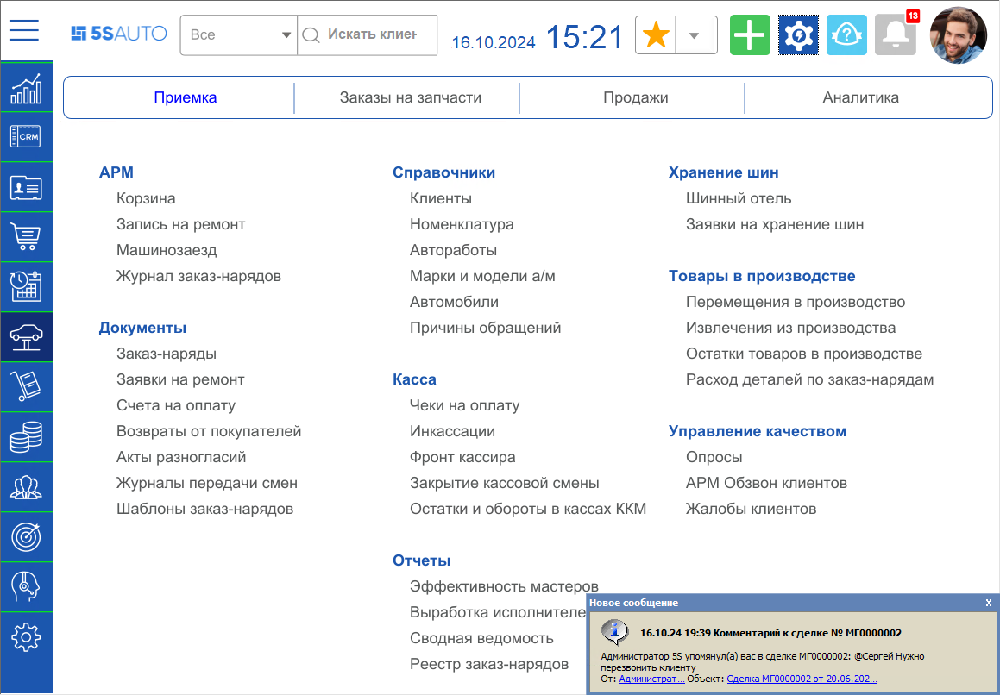

Каждый пользователь имеет возможность самостоятельно выбрать удобный для себя вариант push-уведомления.

### Telegram

Каждый пользователь сам для себя настраивает связку со своим личным Telegram.

Для получения уведомлений нужно выбрать чат с Telegram-ботом:

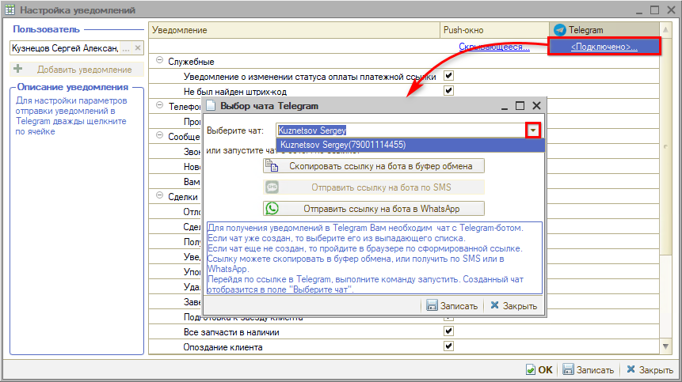

Если бот еще не создан, требуется перейти по сформированной ссылке и запустить чат. Созданный чат отобразится в поле **«Выберите чат»**.

Если чат уже создан, он будет подтягиваться по номеру телефона сотрудника — при условии, что установлена связь между карточками пользователя, сотрудника и контрагента и телефон указан во всех карточках в контактной информации. То есть для выбора будет доступен чат контрагента, который привязан к сотруднику.

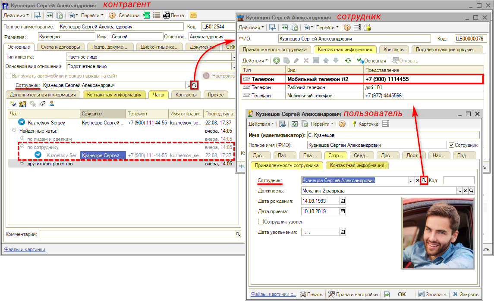

После выбора чата Telegram-бот компании будет присылать уведомление о событии в программе в личный чат пользователя:

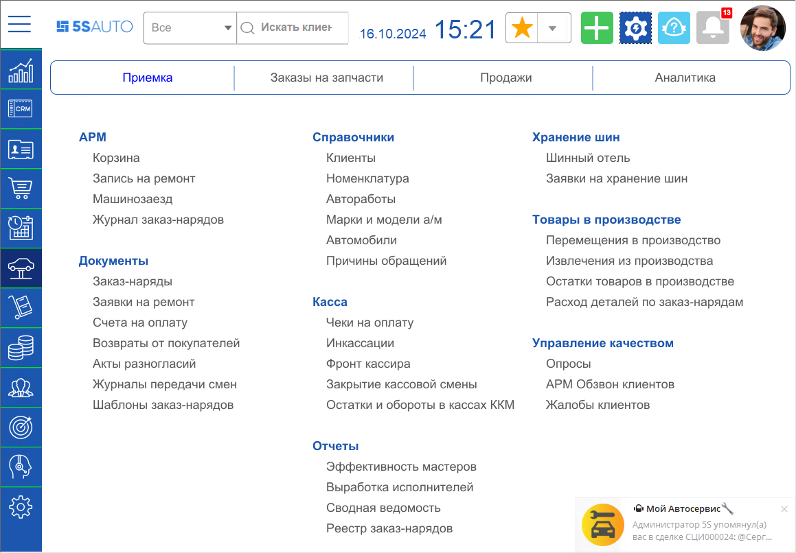

## Настройка получения уведомлений для пользователя

Система будет оповещать пользователя только о тех событиях, которые включены у него. Для включения или отключения уведомления требуется поставить или снять галочку на пересечении соответствующего типа уведомления и способа оповещения о нем:

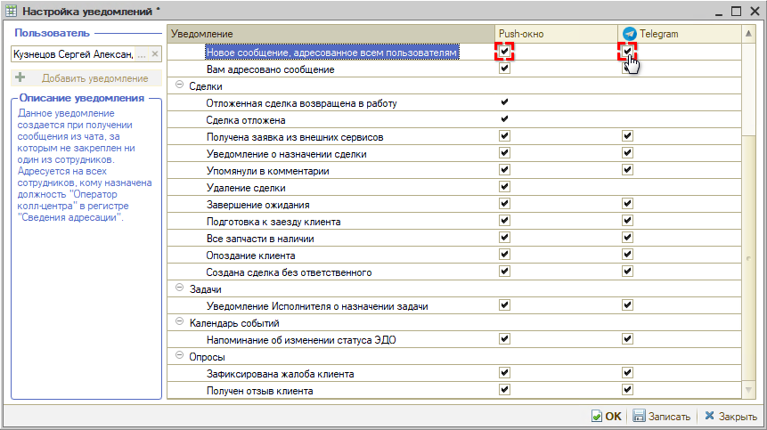

В системе есть уведомления, которые по умолчанию скрыты, но их можно добавить нажатием на кнопку **«Добавить уведомление»** и настроить:

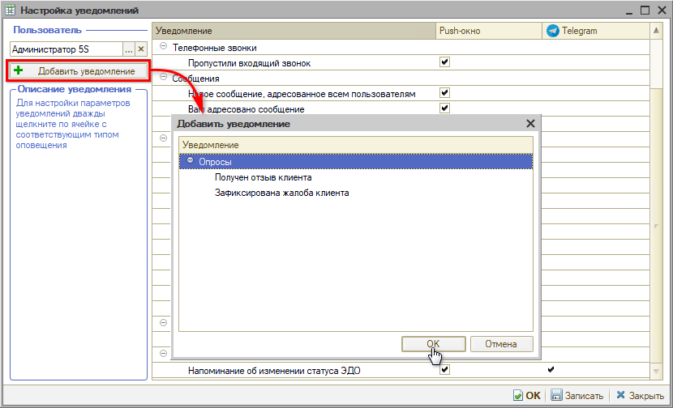

*Примечание:* если кнопка «Добавить уведомление» неактивна, значит в список пользовательской настройки добавлены все доступные уведомления из справочника. Уведомления доступны для добавления в пользовательский список при следующих настройках параметров в карточке уведомления (см. статью «[Настройка параметров уведомлений](../Настройка%20параметров%20уведомлений/nastroyka-parametrov-uvedomleniy.md)»):

1. Уведомление активно, т. е. установлен флаг **«Используется»**.
2. Уведомление не назначено пользователю по умолчанию, т. е. снят признак **«Вкл. по умолчанию»** (иначе оно добавляется автоматически).
3. Разрешено изменять настройки уведомления, т. е. включен признак **«Разрешено изменять»**.

## Описание предопределенных уведомлений

### Служебные

| Описание уведомления | Назначение и условия срабатывания | Адресация по умолчанию |
|---|---|---|
| Поступление платежа на расчетный счет (релиз 2.8.2) | Уведомление создается при поступлении на расчетный счет платежа по документу оплаты путем [автоматической загрузки банковской выписки](../../Банки%20и%20платежные%20системы/Банковские%20выписки/Автоматическая%20загрузка%20банковских%20выписок/avtomaticheskaya-zagruzka-bankovskikh-vypisok.md) по API через регламентное задание «Загрузка банковских выписок» | Адресуется автору и менеджеру документа-основания, если системой определена сделка выписки (документ). Если сделка не определена, уведомление без указания документа-основания адресуется пользователям со следующими должностями в [сведениях адресации](../../Задачи/Адресация%20задач%20в%20CRM%20по%20исполнителям/adresaciya-zadach-v-crm-po-ispolnitelyam.md): Бухгалтер, Кассир, Управляющий директор и Финансовый директор |
| Уведомление об изменении статуса оплаты платежной ссылки | Уведомление создается при поступлении [платежа по СБП](../../Банки%20и%20платежные%20системы/Система%20быстрых%20платежей/Работа%20с%20СБП/rabota-s-sbp.md#уведомление) от клиента, включает информацию об оплате, смене статуса документа и необходимости пробить чек | По умолчанию адресуется пользователю, создавшему платежную ссылку |
| Не был найден штрихкод | Уведомление создается при [сканировании штрихкода товара](../../Склад%20и%20запчасти/Штрихкодирование%20номенклатуры/Сканирование%20штрихкодов/skanirovanie-shtrikhkodov-tovarov.md), если номенклатуры с таким штрихкодом нет в базе | Адресуется текущему пользователю |

### Телефонные звонки

| Описание уведомления | Назначение и условия срабатывания | Адресация по умолчанию |
|---|---|---|
| Пропущен входящий звонок | Создается, если на входящий звонок никто из сотрудников не ответил | Адресуется всем сотрудникам, кому назначена должность «Оператор колл-центра» в регистре «[Сведения адресации](../../Задачи/Адресация%20задач%20в%20CRM%20по%20исполнителям/adresaciya-zadach-v-crm-po-ispolnitelyam.md)» |

### Сообщения

| Описание уведомления | Назначение и условия срабатывания | Адресация по умолчанию |
|---|---|---|
| Звонок на WhatsApp | Создается при получении на WhatsApp звонка от клиента | Если у чата с клиентом есть ответственный, уведомление по умолчанию адресуется ему. Если ответственного нет — всем сотрудникам, кому назначена должность «Оператор колл-центра» в регистре «[Сведения адресации](../../Задачи/Адресация%20задач%20в%20CRM%20по%20исполнителям/adresaciya-zadach-v-crm-po-ispolnitelyam.md)» |
| Новое сообщение, адресованное всем пользователям | Создается при получении сообщения из чата, за которым не закреплен ни один из сотрудников | Адресуется всем сотрудникам, кому назначена должность «Оператор колл-центра» в регистре «[Сведения адресации](../../Задачи/Адресация%20задач%20в%20CRM%20по%20исполнителям/adresaciya-zadach-v-crm-po-ispolnitelyam.md)» |
| Вам адресовано сообщение | Создается при получении сообщения из чата, у которого есть ответственный | Адресуется ответственному по чату |

### Сделки

| Описание уведомления | Назначение и условия срабатывания | Адресация по умолчанию |
|---|---|---|
| Сделка отложена | Создается при переводе сделки в «[Отложенные](../Отложенные%20сделки/otlozhennye-sdelki.md)» | Адресуется пользователю, который отложил сделку |
| Отложенная сделка возвращена в работу | Создается при [возвращении сделки из «Отложенных»](../Отложенные%20сделки/otlozhennye-sdelki.md#как-вернуть-отложенную-сделку-в-работу) в работу | Адресуется пользователю, который отложил сделку, и пользователю, который вернул ее в работу |
| Получена заявка из внешних сервисов | Создается при получении заявки с мобильного приложения | Адресуется всем сотрудникам, кому назначена должность «Оператор колл-центра» в регистре «[Сведения адресации](../../Задачи/Адресация%20задач%20в%20CRM%20по%20исполнителям/adresaciya-zadach-v-crm-po-ispolnitelyam.md)» |
| Уведомление о назначении сделки | Создается, если один пользователь назначает другого ответственным по [сделке](../Работа%20со%20сделкой/rabota-so-sdelkoy.md) | Адресуется новому ответственному |
| Упомянули в комментарии | Создается при упоминании пользователя (пользователей) в комментарии к [сделке](../Работа%20со%20сделкой/rabota-so-sdelkoy.md) или к лиду | Адресуется всем пользователям, кто был отмечен |
| Удаление сделки | Создается, если сделка помечается [удаленной](../Редактирование%20и%20удаление%20сделок/redaktirovanie-i-udalenie-sdelok.md) | Адресуется всем сотрудникам, кому назначена должность «Руководитель техцентра» в регистре «[Сведения адресации](../../Задачи/Адресация%20задач%20в%20CRM%20по%20исполнителям/adresaciya-zadach-v-crm-po-ispolnitelyam.md)» |
| Завершение ожидания | Создается, если по сделке завершается ожидание | Адресуется ответственному |
| Подготовка к заезду клиента | Создается при переводе сделки в этап «Подготовка к заезду» | Адресуется ответственному |
| Все запчасти в наличии | Создается, если по [заказу покупателя](../../Работа%20с%20заказами/Работа%20с%20заказами%20покупателя/rabota-s-zakazami-pokupatelya.md), связанному со сделкой, все [товары поступили на склад](https://www.5systems.ru/help/shag-postuplenie-tovarov-na-sklad). Проверка выполняется при проведении документов «Поступление товаров и услуг» | Адресуется ответственному по сделке |
| Опоздание клиента | Создается, если клиент опаздывает по предварительной [записи](../../Запись%20на%20ремонт) | Адресуется всем сотрудникам, кому назначена должность «Оператор колл-центра» в регистре «[Сведения адресации](../../Задачи/Адресация%20задач%20в%20CRM%20по%20исполнителям/adresaciya-zadach-v-crm-po-ispolnitelyam.md)» |
| Создана сделка без ответственного | Возникает при создании сделки без ответственного | Адресуется всем пользователям, кому назначены роли, указанные в [настройках воронки продаж на вкладке «Адресация уведомления»](../Настройки%20воронки%20продаж/nastroyki-voronki-prodazh.md#4-адресация-уведомления) |

### Задачи

| Описание уведомления | Назначение и условия срабатывания | Адресация по умолчанию |
|---|---|---|
| Уведомление исполнителя о назначении задачи | Создается, если один пользователь создает задачу для другого | Адресуется исполнителю задачи |

### Календарь событий

| Описание уведомления | Назначение и условия срабатывания | Адресация по умолчанию |
|---|---|---|
| Напоминание об изменении статуса ЭДО | Создается при подписании клиентом документа, [отправленного по F.Doc](../../Интеграция%20с%20внешними%20сервисами/Интеграция%20с%20сервисом%20Безбумажный%20офис%20F.Doc/integraciya-s-servisom-bezbumazhnyy-ofis-fdoc.md#уведомления) | Адресуется пользователю, который отправил документ на подпись клиенту |

### Опросы

| Описание уведомления | Назначение и условия срабатывания | Адресация по умолчанию |
|---|---|---|
| Получен отзыв клиента | Появляется, когда создается документ «[Опрос](../../Управление%20качеством%20обслуживания/Опрос%20клиента%20о%20качестве%20обслуживания/opros-klienta-o-kachestve-obsluzhivaniya.md)» после ответа клиента на автоматический [запрос на отзыв](../../Практики/Запрос%20на%20отзыв%20довольного%20клиента%20об%20автосервисе/zapros-na-otzyv-dovolnogo-klienta-ob-avtoservise.md) | Адресуется тем, кто установит себе оповещение об этом уведомлении |
| Зафиксирована жалоба клиента | Создается, если по документу «[Опрос](../../Управление%20качеством%20обслуживания/Опрос%20клиента%20о%20качестве%20обслуживания/opros-klienta-o-kachestve-obsluzhivaniya.md)» был создан документ «[Жалоба](../../Управление%20качеством%20обслуживания/Обработка%20жалоб%20от%20клиентов/obrabotka-zhalob-ot-klientov.md)» | Адресуется всем сотрудникам, кому назначена должность «Руководитель техцентра» в регистре «[Сведения адресации](../../Задачи/Адресация%20задач%20в%20CRM%20по%20исполнителям/adresaciya-zadach-v-crm-po-ispolnitelyam.md)» |

Настройка параметров уведомлений, в том числе логики их работы, производится в карточке каждого уведомления. Подробнее см. в статье «[Настройка параметров уведомлений](../Настройка%20параметров%20уведомлений/nastroyka-parametrov-uvedomleniy.md)».

---

**Теги:** CRM, уведомления, push-окно, Telegram, оповещения, настройка уведомлений, адресация, сведения адресации, сделки, задачи

