

# Работа со сделкой

<table><tr><td><b>Время чтения:</b> 15 мин.</td><td><b>Обновлено:</b> 16.10.2024</td></tr></table>

Источник: https://www.5systems.ru/help/rabota-so-sdelkoy

**Актуально для релиза 5S AUTO 2.7.1**

## Содержание

- [Введение](#введение)
- [1. Верхняя панель](#1-верхняя-панель)
- [2. Панель этапов сделки](#2-панель-этапов-сделки)
- [3. Кнопки действий](#3-кнопки-действий)
- [4. Информация о клиенте](#4-информация-о-клиенте)
  - [1. Вкладка «Сведения»](#1-вкладка-сведения)
    - [Индикация дубликата сделки](#индикация-дубликата-сделки)
  - [2. Вкладка «Связи»](#2-вкладка-связи)
  - [3. Вкладка «История»](#3-вкладка-история)
  - [4. Вкладка «Поиск»](#4-вкладка-поиск)
  - [5. Вкладка «Маркетинг»](#5-вкладка-маркетинг)

## Введение

Сделка является центральным элементом интерфейса и представляет собой зафиксированное в программе обращение клиента. Сделка создается автоматически при каждом новом обращении: входящее письмо, звонок, сообщение в чате. При визите клиента без звонка сделку можно создать вручную.

Сделки могут быть представлены на рабочем столе в одном из двух режимов: список либо канбан. Подробнее см. статьи «[Список сделок](../Список%20сделок/spisok-sdelok.md)» и «[Канбан сделок](../Канбан%20сделок/kanban-sdelok.md)».

Форма сделки открывается двойным кликом на карточку сделки на канбане или строку со сделкой в списке и содержит всю возможную информацию, необходимую для работы с клиентом.

## 1. Верхняя панель

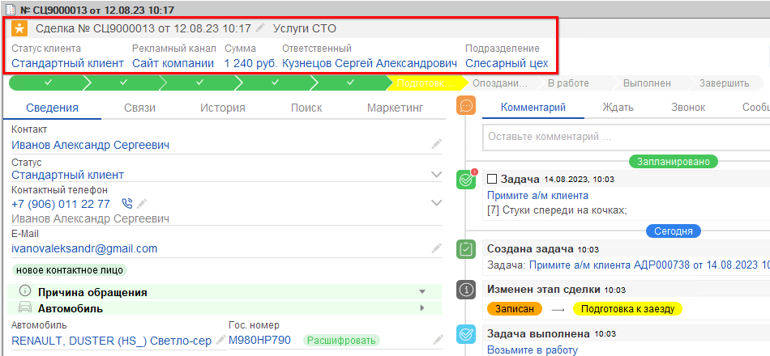

На верхней панели сделки отображается следующая информация:

- заголовок сделки — стандартный заголовок можно изменить, см. статью «[Заголовок сделки](../Заголовок%20сделки/zagolovok-sdelki.md)»;
- статус клиента;
- рекламный канал;
- сумма;
- ответственный («Ответственный в сделке»);
- подразделение.

## 2. Панель этапов сделки

Отображается шкала этапов сделки, например: Заявка, Согласование, Записан, Подготовка к заезду, Опоздание клиента, В работе, Выполнен, Завершено.

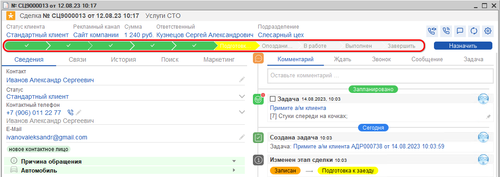

Есть возможность изменить этап сделки вручную, если соблюдены условия перехода: выберите кликом мыши нужный этап на шкале и нажмите кнопку **«Назначить»**.

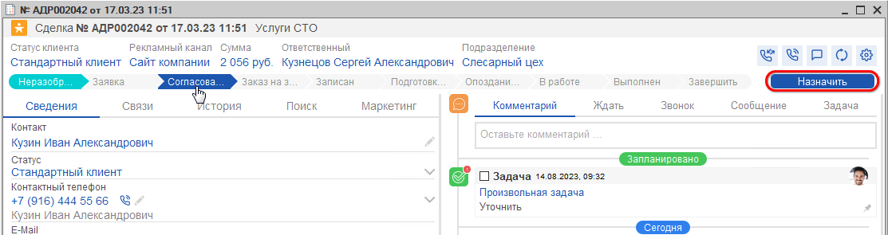

## 3. Кнопки действий

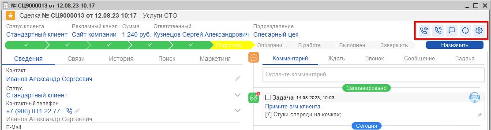

- **Перевод звонка** — позволяет перевести звонок на другого сотрудника;
- **Звонок** — при нажатии начнется дозвон до клиента с привязанного внутреннего номера;
- **Сообщение** — открывается форма отправки сообщения клиенту;
- **Обновить страницу**;
- **Настройки** — нажатием на кнопку открывается контекстное меню:

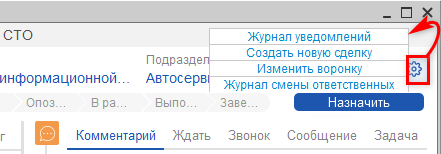

## 4. Информация о клиенте

В левой половине формы сделки представлена вся необходимая информация по клиенту.

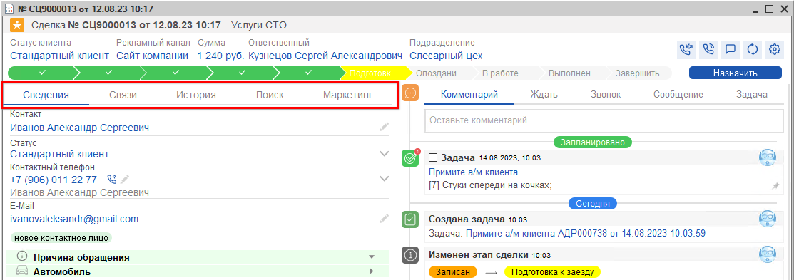

Данные собраны на следующих вкладках:

- Сведения
- Связи
- История
- Поиск
- Маркетинг

### 1. Вкладка «Сведения»

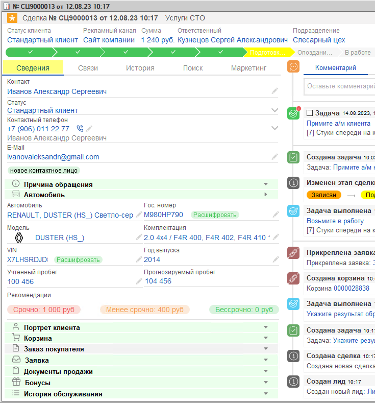

На вкладке собрана основная информация о клиенте.

**1) Контакты клиента.** Ф. И. О., статус клиента и контактные данные — номер телефона и e-mail:

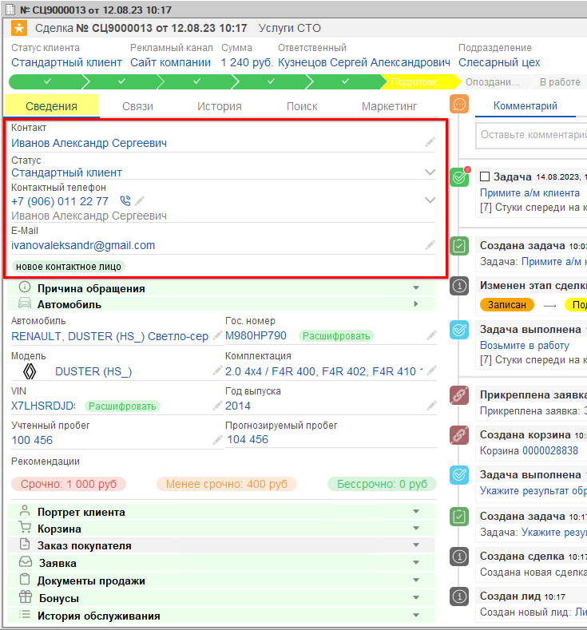

Если у клиента есть контактное лицо либо если данный клиент является контактным лицом другого контрагента, в этом поле также отображается информация о его контактных лицах: Ф. И. О., вид взаимоотношений (сотрудник компании, родственник и т. д.) и телефон, по которому можно сразу с ними связаться.

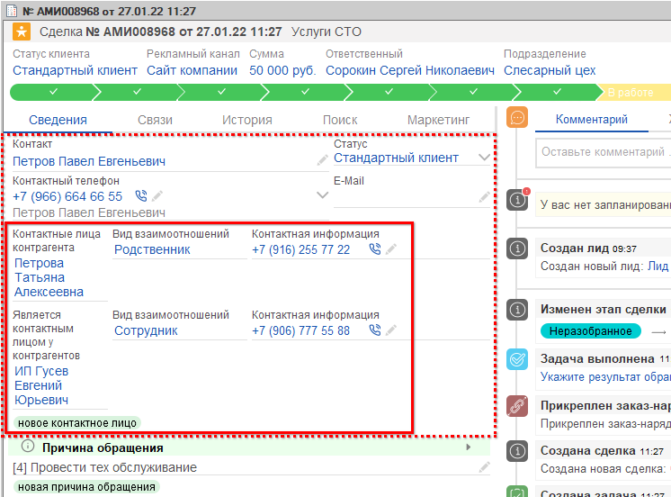

**2) Причина обращения.** Можно выбрать причину обращения из справочника или ввести новую вручную.

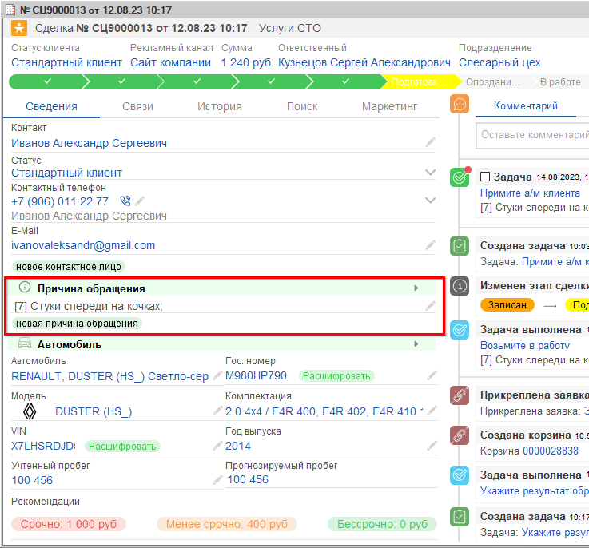

**3) Автомобиль.** VIN и гос. номер, марка и модель, учтенный и прогнозируемый пробег и т. д., а также актуальные рекомендации:

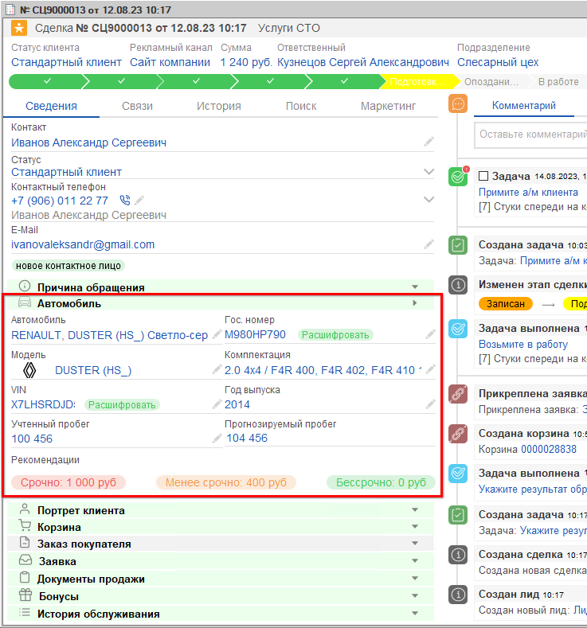

**4) Портрет клиента.** Количество покупок, средний чек, жалобы, отзывы и др.:

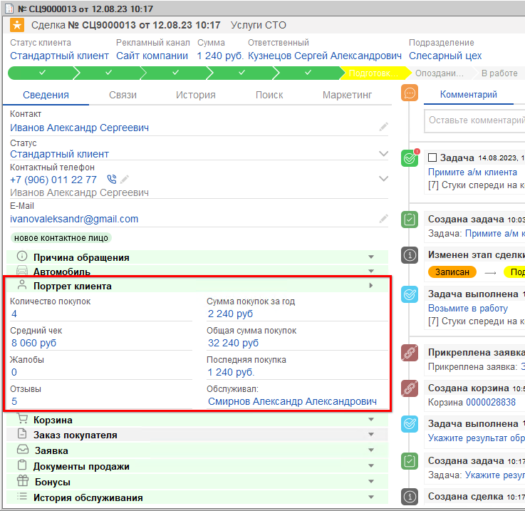

**5) Корзина.** Отображается [корзина](https://www.5systems.ru/help/rabota-v-arm-korzina), созданная в рамках данной сделки, — одна или несколько. Также можно создать новую корзину прямо из сделки.

**6) Документы.** Представлены все созданные по сделке документы — [заказы покупателя](https://www.5systems.ru/help/rabota-s-zakazami-pokupatelya), заявки на ремонт, заказ-наряды — с отображением их текущих стадий, т. е. состояний документа.

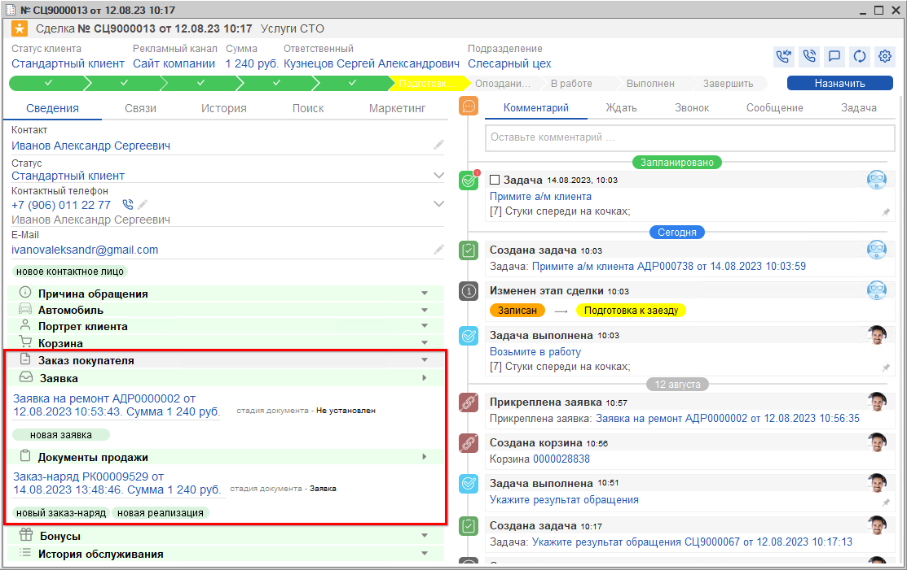

При создании новой заявки на ремонт программа предложит выбрать основание — корзину (при наличии корзины в сделке).

**7) Бонусы.** Отображается информация по бонусной системе: уровень, количество бонусов на счету, бесплатные услуги и т. д.

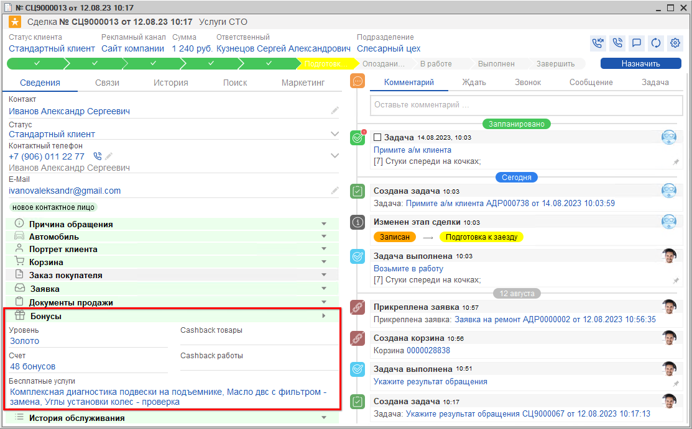

**8) История обслуживания.** Представлены все заказ-наряды по всем автомобилям клиента:

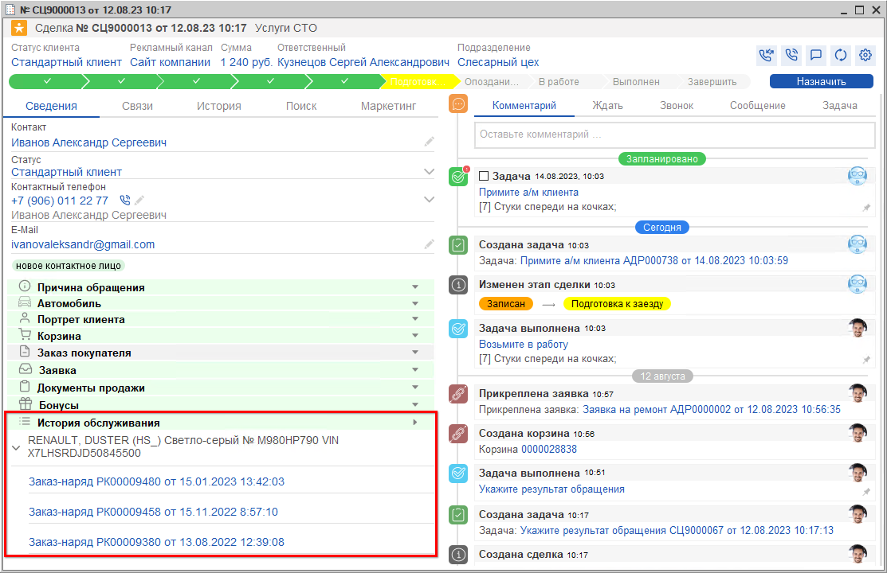

#### Индикация дубликата сделки

При добавлении сделки с такими же данными, как в уже имеющейся открытой сделке, программа определяет новую сделку как дублирующую.

При сохранении дублирующей сделки под строкой **«Контакт»** появляется кнопка **«Дубликат»**. При наведении курсора на кнопку всплывает подсказка: «По этому контрагенту уже создан процесс». При нажатии на кнопку открывается обработка **«Объединение процессов»**:

Данная обработка позволяет объединить две сделки в одну. Подробнее о причинах появления дублей и принципе работы функционала объединения сделок см. в статье «[Объединение сделок](https://www.5systems.ru/help/obedinenie-sdelok)».

### 2. Вкладка «Связи»

Дерево связей документов позволяет отследить путь сделки и проконтролировать все созданные документы — от лида до чека на оплату и опроса по качеству.

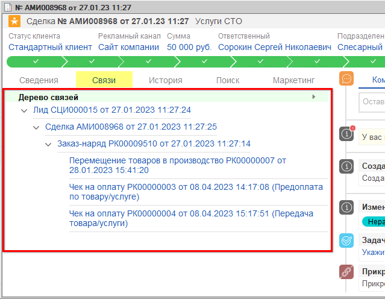

Дерево связей можно использовать для быстрого перехода и изменения подчиненных документов.

### 3. Вкладка «История»

На вкладке расположен регистр всех действий пользователей с данной формой сделки: просмотр, изменения, внесение данных и т. д. Отображаются точная дата и время, имя пользователя и описание его действий — с чем работали и что конкретно сделали.

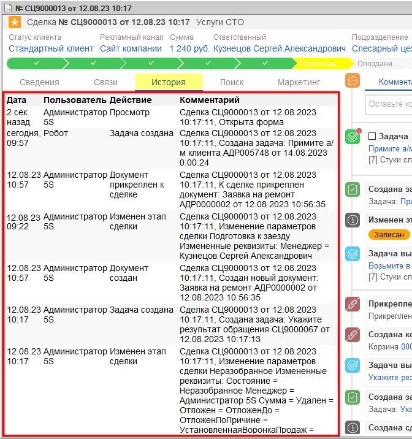

### 4. Вкладка «Поиск»

Предназначена для уточнения данных сделки. Поиск доступен по следующим параметрам: Ф. И. О., номер телефона, гос. номер и VIN-номер.

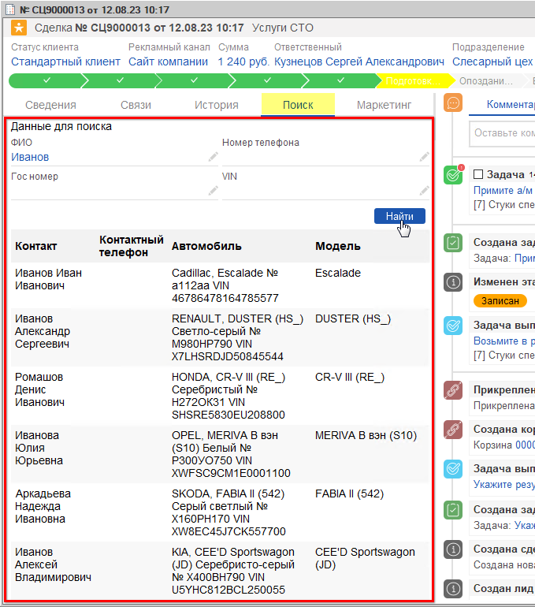

Из найденных вариантов можно выбрать нужный и уточнить, какой именно элемент требуется заполнить или заменить в сделке — только клиента, только автомобиль или и то, и другое.

### 5. Вкладка «Маркетинг»

На вкладке отображается [рекламный канал](https://www.5systems.ru/help/nastroyka-reklamnykh-kanalov), по которому пришел клиент, а также промокод (раздел в разработке).

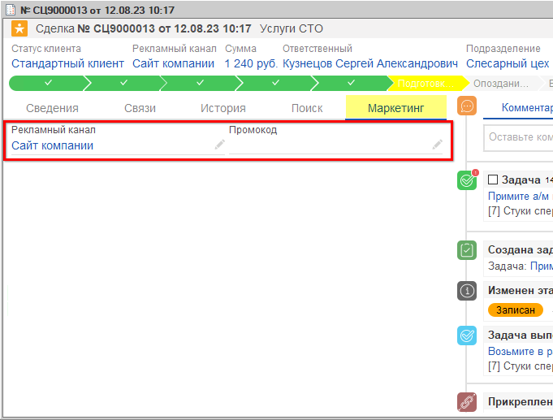

Все перечисленные данные выводятся в сделке по умолчанию, при необходимости лишние разделы можно скрыть при помощи настройки формы сделки — см. в статье «[Настройки воронки продаж → Настройка формы сделки](https://www.5systems.ru/help/nastroyki-voronki-prodazh#nas_formy)».

*Примечание:* в статье рассматривается форма сделки в воронке продаж для автосервиса. Для воронок магазина автозапчастей и автосалона по умолчанию в сделке выводятся другие поля, отображение которых также можно редактировать настройками.

В правой половине формы сделки отображаются все события по данной сделке: задачи, звонки, комментарии, изменения этапов сделки и др. Подробнее см. в статье «[События сделки](../События%20сделки/sobytiya-sdelki.md)».

---

**Теги:** CRM, сделка, форма сделки, этапы сделки, контрагенты, автомобиль, портрет клиента, корзина, документы, бонусы, история обслуживания, дубликат сделки, связи документов

