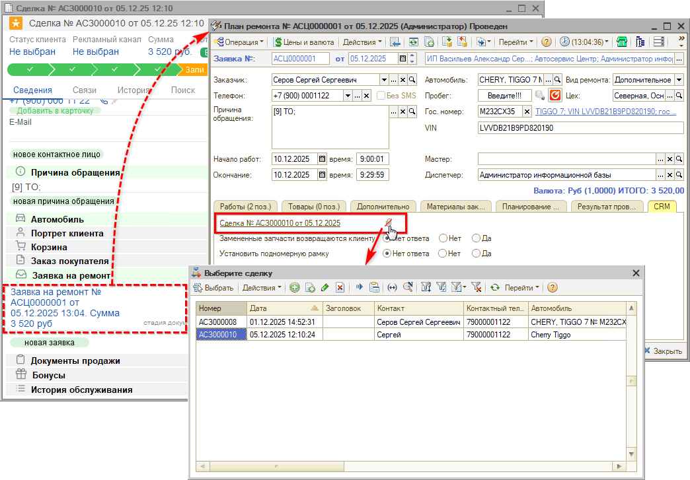
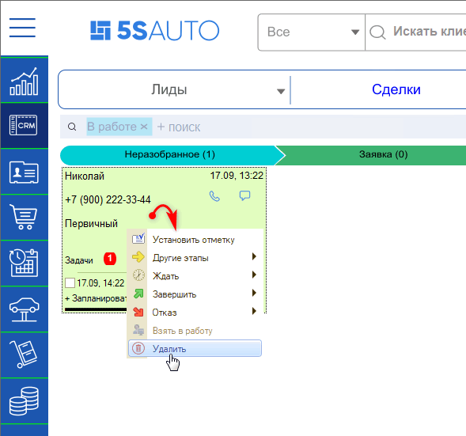
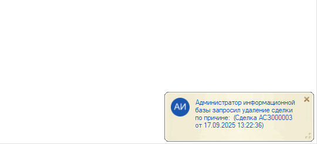
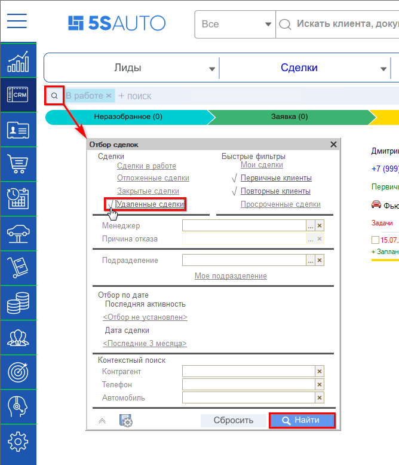
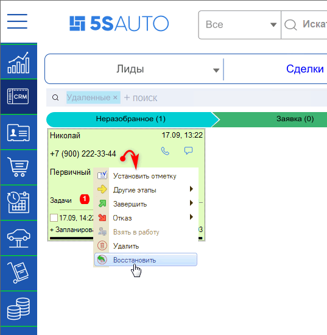
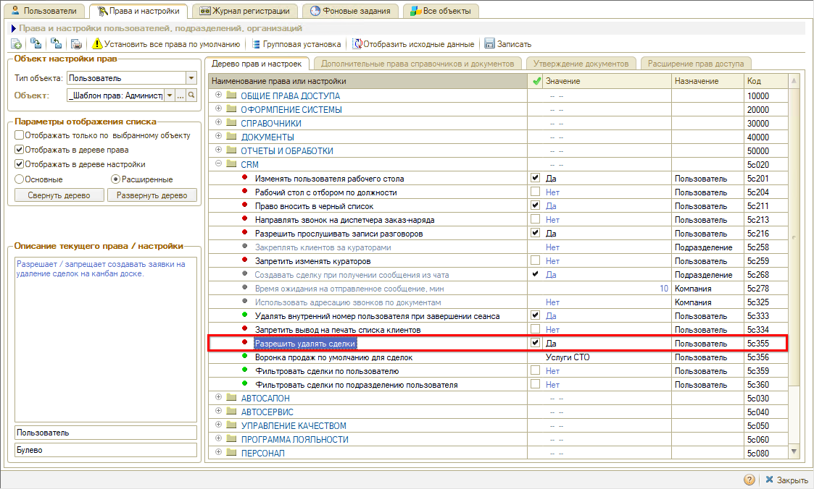

# Редактирование и удаление сделок

<table><tr><td><b>Время чтения:</b> 6 мин.</td><td><b>Обновлено:</b> 05.12.2025</td></tr></table>

Источник: https://www.5systems.ru/help/redaktirovanie-i-udalenie-sdelok

> *Актуально начиная с версии релиза 2.001.001. Обновленная форма сделки реализована в версии 2.5.2.1.*

## Содержание

- [Введение](#введение)
- [Открепление документа от сделки](#открепление-документа-от-сделки)
- [Удаление сделок](#удаление-сделок)
  - [Пометка на удаление](#пометка-на-удаление)
  - [Окончательное удаление или восстановление](#окончательное-удаление-или-восстановление)
- [Права для редактирования и удаления сделок](#права-для-редактирования-и-удаления-сделок)

## Введение

О работе со сделкой см. основную [статью](../Работа%20со%20сделкой/rabota-so-sdelkoy.md).

Сделку, созданную по ошибке, можно открепить от документа, а также пометить на удаление.

## Открепление документа от сделки

Бывает, что сделка прикреплена по ошибке — например, если у клиента два автомобиля и две сделки. Документ от сделки можно открепить (например, в карточке плана ремонта, вкладка **CRM**), выбрать нужную сделку и прикрепить к ней:

## Удаление сделок

Если сделка создана по ошибке либо задублирована, она будет мешать на [канбан-доске](../Канбан%20сделок/kanban-sdelok.md) и портить статистику по воронке продаж. В таких случаях возникает необходимость удалить лишнюю сделку.

Отказом рекомендуется пользоваться только в случае, если сделка реально проиграна.

Также можно воспользоваться функционалом объединения дублирующих сделок — см. статью «[Объединение сделок](../Объединение%20сделок/obedinenie-sdelok.md)».

### Пометка на удаление

Нажатием правой клавиши на карточку сделки открывается меню:

- **Установить отметку** — подробнее см. в статье «[Групповые действия со сделками](../Групповые%20действия%20со%20сделками/gruppovye-deystviya-so-sdelkami.md#действия-со-сделками-на-канбане)»;
- **Другие этапы**;
- **Ждать**;
- **Завершить**;
- **Отказ**;
- **Взять в работу**;
- **Удалить**.

При нажатии **«Удалить»** сделка не удаляется непосредственно, а помечается на удаление.

Срабатывает [уведомление](../Работа%20с%20уведомлениями/rabota-s-uvedomleniyami.md) «Удаление сделки», которое адресуется на всех руководителей:

### Окончательное удаление или восстановление

Помеченные на удаление сделки перемещаются в раздел **«Удаленные сделки»** канбана. Их можно открыть, воспользовавшись фильтром:

Отсюда помеченную на удаление сделку можно удалить окончательно либо восстановить:

Если в сделке есть подчиненные документы (корзина, заказ покупателя и пр.), удалить ее не получится — только через отказ.

Если сделка отмечается **«Удалить окончательно»**, все ссылки перебиваются и данные очищаются по регистрам: происходит корректное удаление.

## Права для редактирования и удаления сделок

Возможность помечать сделки на удаление ограничивается [правом](https://www.5systems.ru/help/ustanovka-prav-i-nastroek-polzovatelya) **«Разрешить удалять сделки»**:

Окончательное удаление сделок, помеченных на удаление, доступно пользователям с [ролью](https://www.5systems.ru/help/polzovateli#dostupnye_roli) администратора с полными правами.

---

**Теги:** CRM, сделки, удаление сделок, пометка на удаление, восстановление сделки, открепление документа, дубли, права пользователей, канбан

