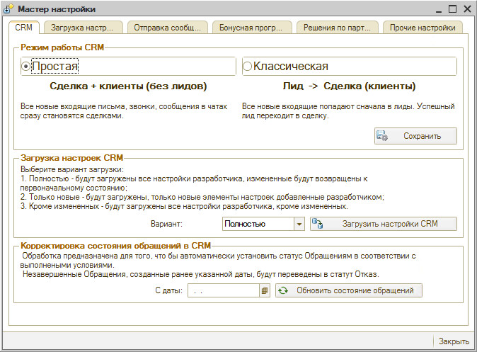
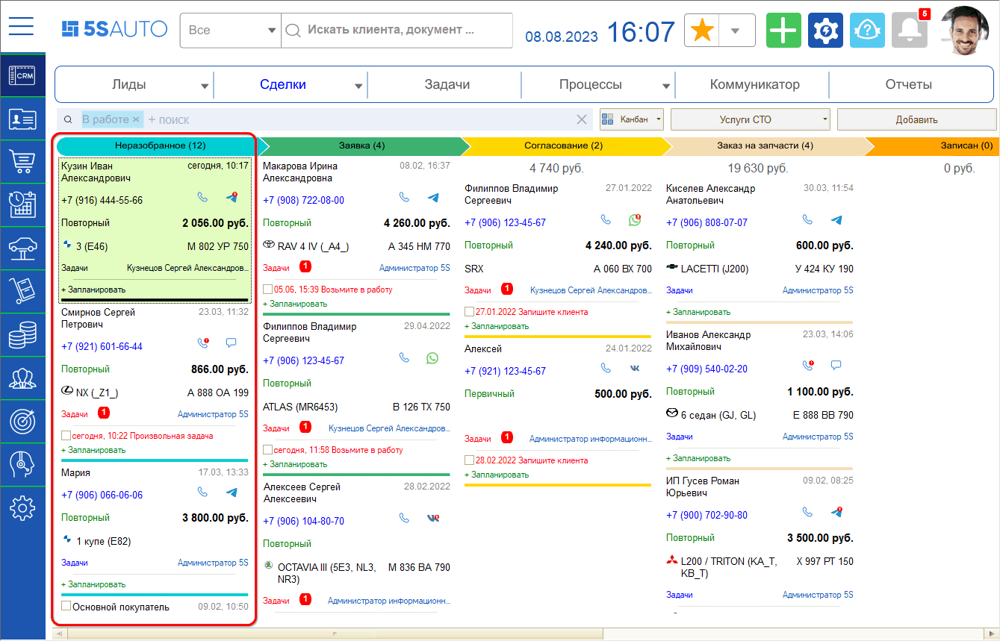

# Режимы работы CRM

<table><tr><td><b>Время чтения:</b> 5 мин.</td><td><b>Обновлено:</b> 05.12.2025</td></tr></table>

Источник: https://www.5systems.ru/help/rezhimy-raboty-crm

**Актуально начиная с версии релиза 2.001.001**

## Содержание

- [Лиды и сделки](#лиды-и-сделки)
- [Выбор режима работы](#выбор-режима-работы)
  - [Простой режим работы CRM](#простой-режим-работы-crm)
  - [Классический режим работы CRM](#классический-режим-работы-crm)

## Лиды и сделки

Сделка — это центральная часть интерфейса.

Само понятие «сделка» подразумевает, что уже есть договоренность с клиентом. Каждая сделка проходит несколько этапов — от первого контакта с клиентом до успешной продажи. Самое первое касание, зацепка с клиентом, — это и есть **лид**.

То есть лид — это потенциальная продажа, потенциальный клиент: он может преобразоваться в сделку, перейти в «Обращение в СТО», а может уйти в отказ. Лид может быть нецелевым, а сделка — нет.

## Выбор режима работы

Существует два варианта работы CRM: можно выделять лиды либо работать в упрощенной форме, только со сделками. По умолчанию CRM работает в простом режиме и не использует лиды.

Чтобы выбрать или изменить режим работы CRM, перейдите в **Мастер настройки**, вкладка **CRM**, поле **«Режим работы CRM»**:

Виды:

1. **Простая: Сделка + клиенты (без лидов).** Все новые входящие письма, звонки, сообщения в чатах сразу становятся сделками.
2. **Классическая: Лид → Сделка (клиенты).** Все новые входящие попадают сначала в лиды. Успешный лид переходит в сделку.

### Простой режим работы CRM

При выборе простого варианта работы CRM лиды в отдельном канбане учитываться не будут: все звонки, сообщения, письма будут попадать в **«Неразобранное»** — на начальный этап единого канбана. То есть каждое обращение сразу становится сделкой. При этом первый этап этой сделки — это по сути лид. Сделка в простом режиме работы CRM еще не есть продажа: сделка может не состояться.

В 5S AUTO лиды и сделки постепенно движутся по определенным этапам — от создания до успешного завершения. Подробнее см. статью «[Канбан сделок](../Канбан%20сделок/kanban-sdelok.md)».

### Классический режим работы CRM

Разбивка на лиды и сделки нужна компаниям, которые работают с большим потоком клиентов и располагают отдельным колл-центром для обработки всех поступающих обращений. В таком случае лидами занимаются менеджеры, которые делают первоначальную обработку, а сами сделки ведут мастера-консультанты.

В классическом режиме работы CRM сделками становятся только успешные лиды. Лиды учитываются в одном канбане, сделки — в другом: таким образом уменьшается количество этапов работы со сделкой.

Лиды дают возможность следить за процессом работы с клиентами, контролировать эффективность менеджеров, строить воронки продаж и использовать множество других полезных функций.

При выборе классического режима работы сотрудник будет решать, создавать из обращения клиента лид или сделку.

---

**Теги:** CRM, режимы работы CRM, лиды, сделки, простой режим, классический режим, Мастер настройки, канбан, воронка продаж

