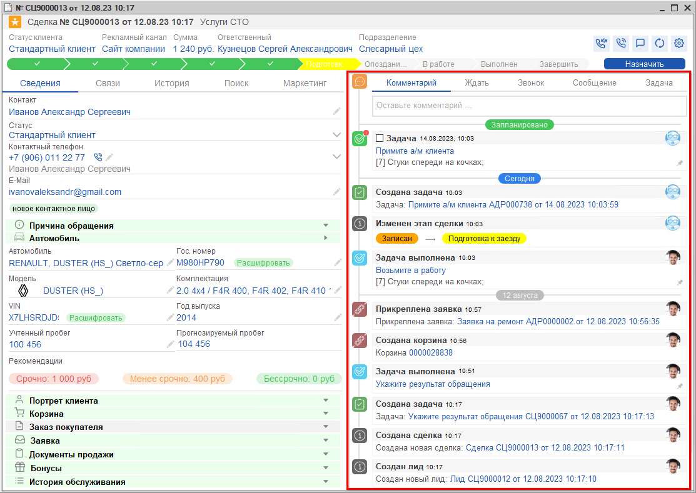
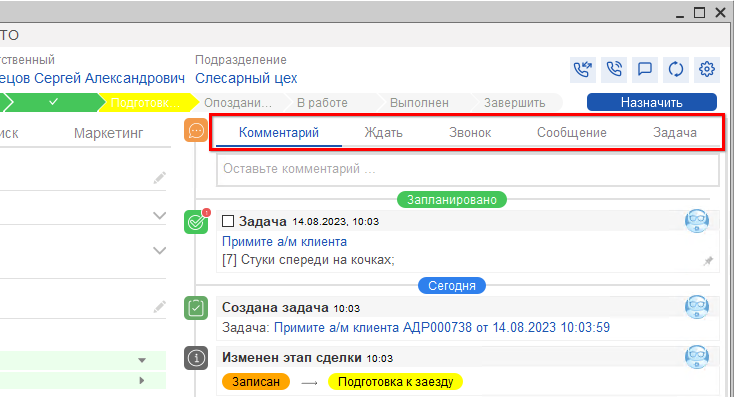
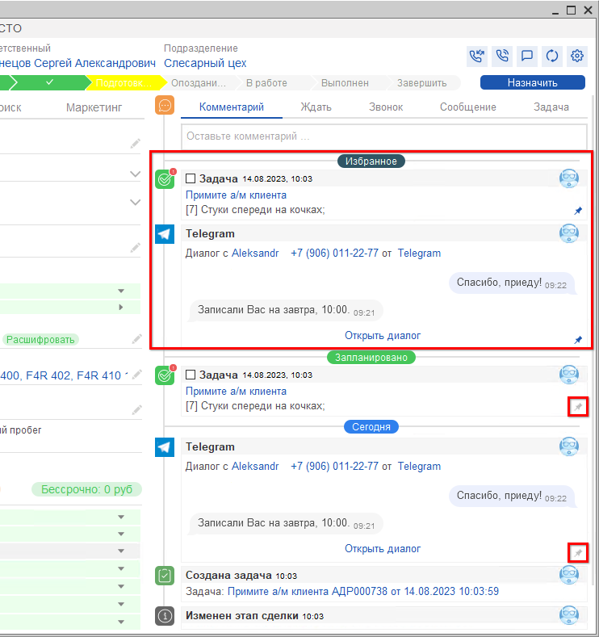
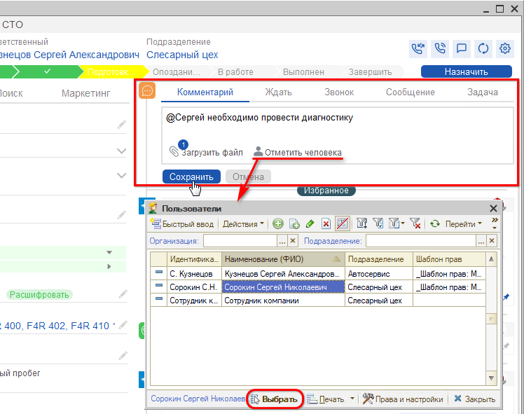
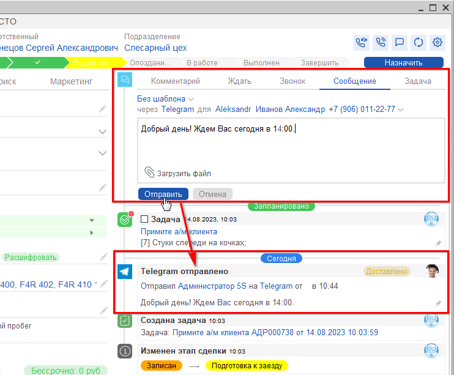
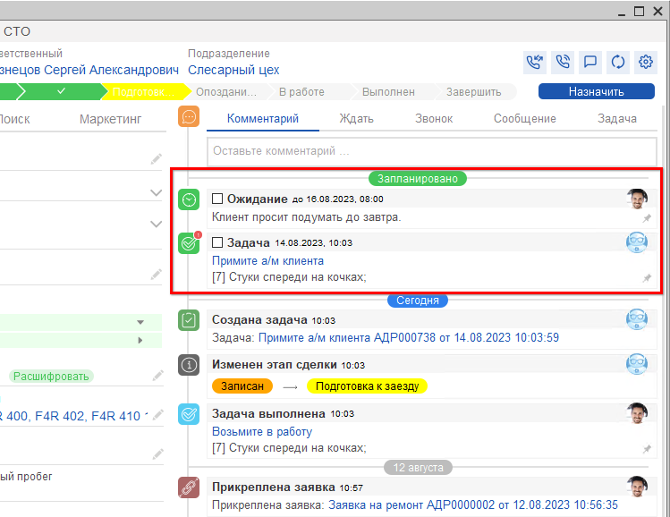
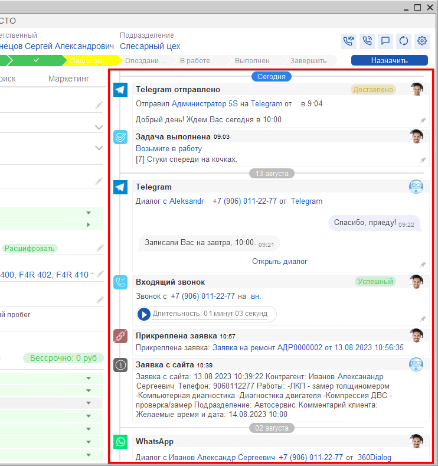
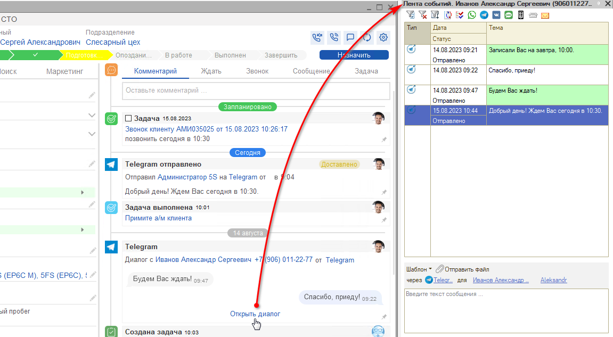

# События сделки

<table><tr><td><b>Время чтения:</b> 13 мин.</td><td><b>Обновлено:</b> 16.10.2024</td></tr></table>

Источник: https://www.5systems.ru/help/sobytiya-sdelki

> *Функционал доступен начиная с версии релиза 5S AUTO 2.001.001. Обновленная форма сделки реализована в версии 2.5.2.1.*

## Содержание

- [Введение](#введение)
- [События сделки](#события-сделки-1)
  - [1. Комментарии и планирование дел](#1-комментарии-и-планирование-дел)
  - [2. Запланировано](#2-запланировано)
  - [3. Коммуникация с клиентом в разбивке по датам](#3-коммуникация-с-клиентом-в-разбивке-по-датам)

## Введение

Сделка является центральным элементом интерфейса и представляет собой зафиксированное в программе обращение клиента. Основной интерфейс формы сделки рассмотрен в статье «[Работа со сделкой](../Работа%20со%20сделкой/rabota-so-sdelkoy.md)».

## События сделки

В правой половине формы сделки отображаются все события по данной сделке: задачи, переписка с клиентом и звонки, комментарии, изменения этапов сделки и др. События отсортированы по времени:

Не выходя из сделки, можно вносить комментарии, планировать дела и создавать задачи по сделке, писать клиенту:

Любую задачу или диалог можно закрепить в **«Избранном»** в верхней части нажатием на кнопку-«гвоздик»:

### 1. Комментарии и планирование дел

**1) Комментарий.** Окно для создания внутреннего комментария позволяет зафиксировать последние изменения, заметки и прочее с возможностью упомянуть коллегу — в этом случае он получит [уведомление](../Работа%20с%20уведомлениями/rabota-s-uvedomleniyami.md), — а также прикрепить файл.

Например, можно оставить заметку для себя и коллег о нестандартном клиенте либо задать уточняющий вопрос по сделке коллеге — профильному специалисту.

*Примечание:* в этом окне по умолчанию отображаются те пользователи, которые выполнили вход в программу и у которых установлен внутренний номер телефона — см. статью «[Пользователи](https://www.5systems.ru/help/polzovateli#parametry_polz)».

**2) Ждать.** Функция используется, если клиент по данной сделке попросил «подумать» один или несколько дней. Можно установить количество дней или ожидание любой активности от клиента: сделка будет переведена в отложенные — подробнее см. статью «[Отложенные сделки](../Отложенные%20сделки/otlozhennye-sdelki.md)».

**3) Звонок.** Можно запланировать звонок клиенту на определенные дату и время, добавить комментарий и напоминание:

**4) Сообщение.** Форма отправки сообщения клиенту. Можно использовать шаблон или написать произвольный текст, выбрать мессенджер, номер телефона, прикрепить файл. Отправленное сообщение сразу отобразится в событиях на текущий день:

**5) Задача.** Нажатием на вкладку **«Задача»** открывается форма создания произвольной задачи, которая будет привязана к данной сделке:

### 2. Запланировано

В данном блоке отображаются запланированные и актуальные задачи по сделке, а также перевод сделки в отложенные:

### 3. Коммуникация с клиентом в разбивке по датам

В событиях сделки отображается вся коммуникация с клиентом с момента создания сделки по текущий день в разбивке по датам — диалоги, а также входящие и исходящие звонки с возможностью сразу прослушать их:

Диалоги в событиях сделки сгруппированы по дате и мессенджеру. Каждый диалог можно открыть в виде «[Ленты событий](https://www.5systems.ru/help/lenta-sobytiy)» и посмотреть детально его содержание:

---

**Теги:** CRM, сделка, события сделки, комментарии, задачи, планирование, звонки, сообщения, отложенные сделки, лента событий, избранное

