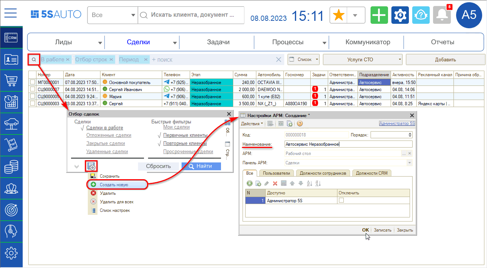
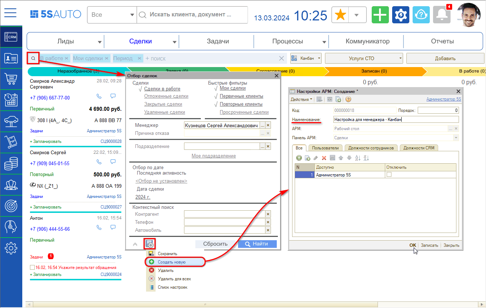
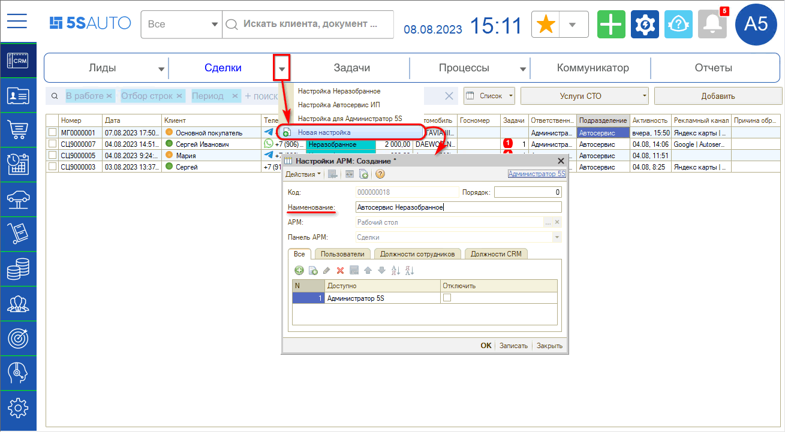
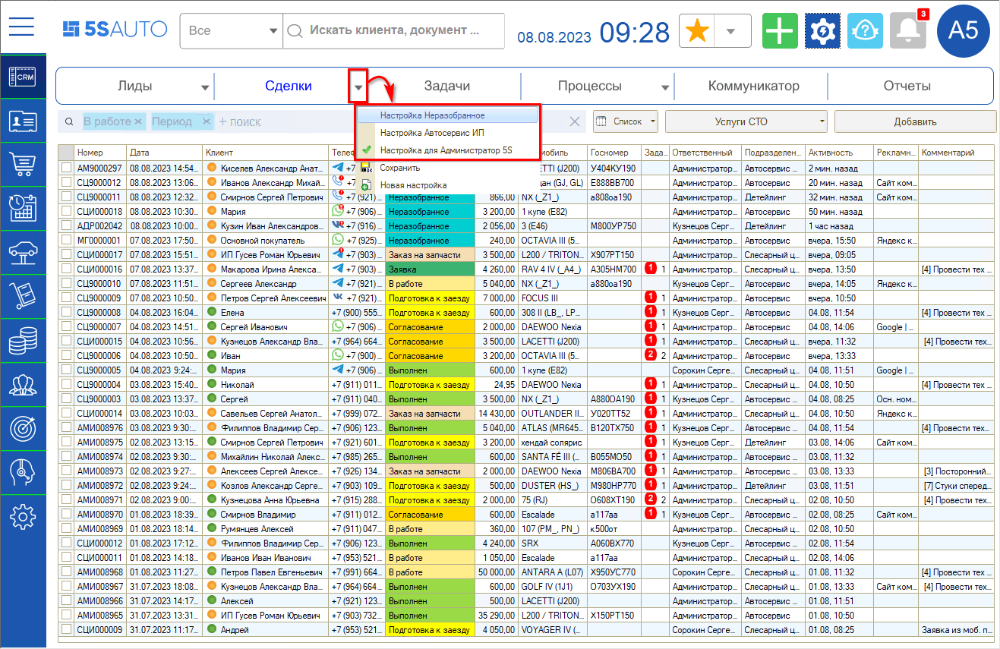
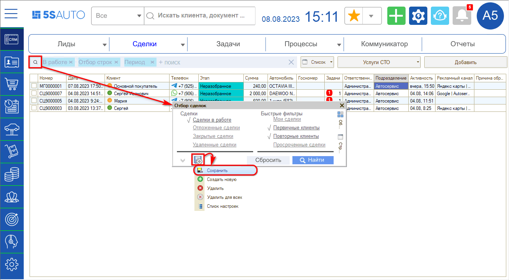
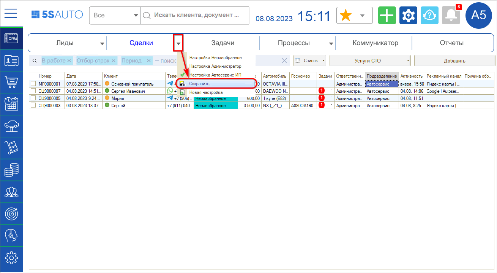
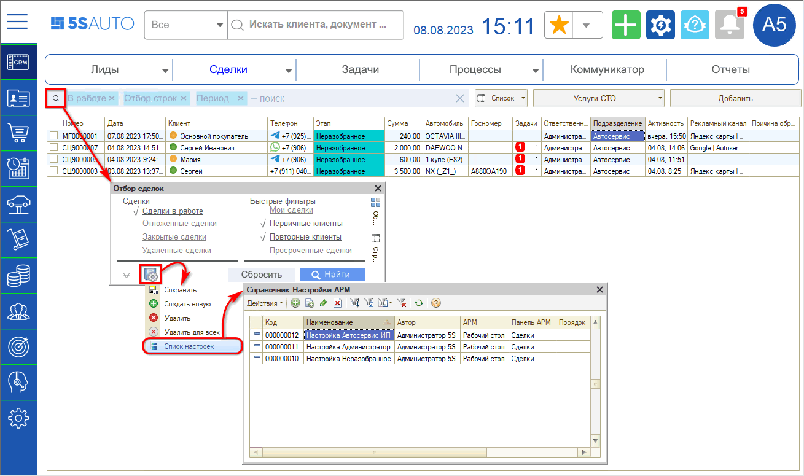
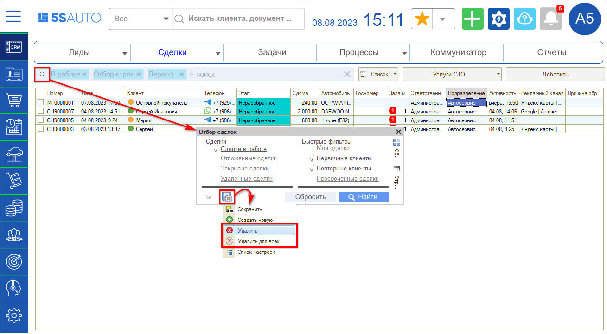

# Сохранение настроек просмотра сделок

<table><tr><td><b>Время чтения:</b> 10 мин.</td><td><b>Обновлено:</b> 25.03.2024</td></tr></table>

Источник: https://www.5systems.ru/help/sokhranenie-nastroek-prosmotra-sdelok

**Актуально начиная с версии релиза 2.5.2.1**

## Содержание

- [Введение](#введение)
- [Сохранение новой настройки](#сохранение-новой-настройки)
- [Быстрый переход к сохраненным настройкам](#быстрый-переход-к-сохраненным-настройкам)
- [Изменение текущей настройки](#изменение-текущей-настройки)
- [Список настроек](#список-настроек)
- [Удаление сохраненных настроек](#удаление-сохраненных-настроек)

## Введение

Для работы со списком и с канбаном сделок предусмотрены гибкие настройки и отборы, которые можно сохранить, чтобы не настраивать их заново каждый раз, а сразу открывать нужную настройку. Подробнее см. статьи «[Список сделок](../Список%20сделок/spisok-sdelok.md)» ([+ видео](../Список%20сделок/spisok-sdelok.md#отборы-и-фильтры)) и «[Канбан сделок](../Канбан%20сделок/kanban-sdelok.md)».

## Сохранение новой настройки

Чтобы сохранить отборы, установленные для просмотра списка сделок, нажатием на кнопку с лупой на панели отборов откройте форму **«Отбор сделок»** и нажмите **«Сохранить настройки → Создать новую»**:

Аналогично производится сохранение настройки отборов для канбана:

Либо можно нажать на стрелку на кнопке **«Сделки → Новая настройка»**:

В открывшейся форме создания новой настройки задайте новое уникальное наименование настройки и сохраните нажатием на кнопку **«Записать»** или **«ОК»**.

## Быстрый переход к сохраненным настройкам

Сохраненные настройки затем доступны для быстрого перехода через выпадающее меню:

## Изменение текущей настройки

При необходимости внести изменения в текущую настройку их следует сохранить — нажмите кнопку **«Сохранить»** в меню записи настроек:

Либо по стрелке на кнопке **«Сделки» → «Сохранить»**:

Если требуется оставить текущую настройку и сохранить новую, нажмите кнопку **«Новая настройка»**, то есть действуйте как при создании новой настройки — см. [выше](#сохранение-новой-настройки).

## Список настроек

Сохраненные настройки записываются в справочник **«Настройки АРМ»**. Открыть его для просмотра можно нажатием на кнопку **«Список настроек»** в меню записи настроек:

Настройки из данного списка можно открыть для изменения и изменить наименование и доступ пользователей к настройке.

## Удаление сохраненных настроек

При необходимости можно удалить лишнюю сохраненную настройку: откройте ее и в меню сохранения настроек нажмите кнопку **«Удалить»** или **«Удалить для всех»**:

Кнопка **«Удалить»** позволяет пользователю удалить текущий вариант настройки для самого себя. Кнопка **«Удалить для всех»** позволяет удалить данную настройку для всех пользователей — если у текущего пользователя установлено соответствующее право **«Разрешить редактировать все варианты настроек АРМ Запись на ремонт»**.

Право позволяет редактировать любые настройки. Если оно отключено, редактировать или удалять можно только настройки, в которых текущий пользователь является автором.

Также можно удалить ненужную настройку через справочник «Настройки АРМ» (см. [выше](#список-настроек)): выделить настройку и нажать кнопку **«Пометить на удаление»**.

---

**Теги:** CRM, сделки, настройки просмотра, отборы, фильтры, настройки АРМ, список сделок, канбан, сохранение настроек, права пользователей

