

# Список сделок

<table><tr><td><b>Время чтения:</b> 20 мин.</td><td><b>Обновлено:</b> 26.08.2026</td></tr></table>

Источник: https://www.5systems.ru/help/spisok-sdelok

> *Функционал действует начиная с релиза 5S AUTO 2.5.2.1.*

## Содержание

- [Введение](#введение)
- [Интерфейс списка сделок](#интерфейс-списка-сделок)
- [Отборы и фильтры](#отборы-и-фильтры)
  - [Быстрые фильтры](#быстрые-фильтры)
  - [Отборы по значению в колонках](#отборы-по-значению-в-колонках)
    - [1. Отбор по обращениям](#1-отбор-по-обращениям)
    - [2. Отбор по сообщениям](#2-отбор-по-сообщениям)
    - [3. Отбор по этапу](#3-отбор-по-этапу)
    - [4. Отбор по сумме](#4-отбор-по-сумме)
    - [5. Отбор по автомобилям](#5-отбор-по-автомобилям)
    - [6. Отбор по задачам](#6-отбор-по-задачам)
    - [7. Отбор по ответственному](#7-отбор-по-ответственному)
    - [8. Отбор по подразделению](#8-отбор-по-подразделению)
    - [9. Отбор по активности](#9-отбор-по-активности)
    - [10. Отбор по рекламным каналам](#10-отбор-по-рекламным-каналам)
  - [Отбор по значению в ячейке](#отбор-по-значению-в-ячейке)
  - [Комплексная настройка отборов](#комплексная-настройка-отборов)
  - [Сохранение отборов](#сохранение-отборов)
  - [Снятие отборов](#снятие-отборов)

## Введение

Лиды, сделки и процессы в системе можно просматривать в двух режимах: список и канбан. Описание работы с канбаном см. в статье «[Канбан сделок](../Канбан%20сделок/kanban-sdelok.md)».

Список сделок представляет собой таблицу, в которую выведена вся основная информация по текущим сделкам:

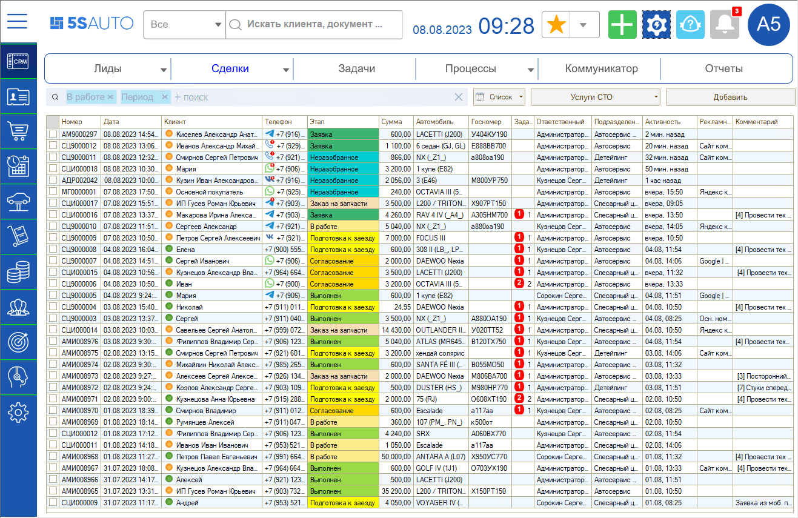

Для переключения между режимами используется кнопка на верхней панели **«Список / Канбан»**:

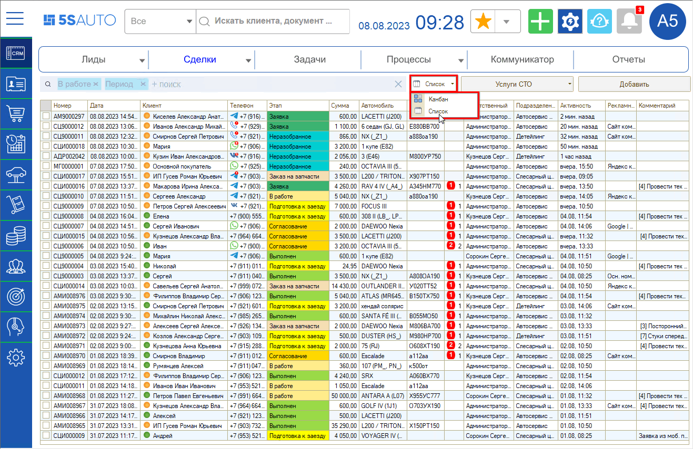

## Интерфейс списка сделок

Информация по лидам и сделкам, входящим в список, по умолчанию выводится в разбивке на следующие колонки:

- Номер
- Дата
- Клиент
- Телефон
- Этап
- Сумма
- Автомобиль
- Госномер
- Задачи
- Ответственный
- Подразделение
- Активность
- Рекламный канал
- Комментарий

При необходимости можно добавить другие колонки или убрать ненужные: кликните правой кнопкой мыши в любом месте таблицы и перейдите в **«Настройку списка»**:

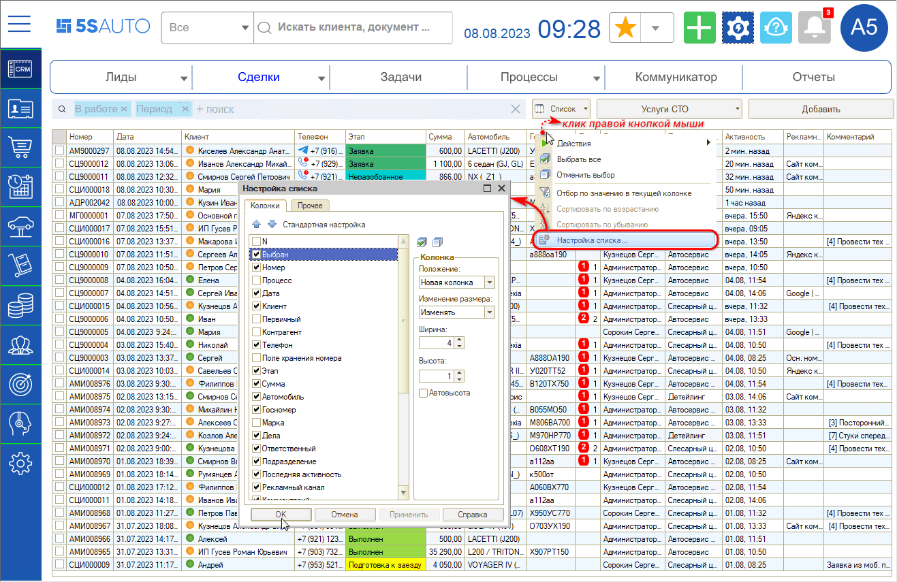

Настройка списка сохраняется для текущего рабочего стола и применяется при следующем открытии.

По умолчанию открывается канбан со сделками, созданными за последние 3 месяца, либо с теми, у которых за это время менялся этап или ответственный. При необходимости можно установить для себя различные отборы и фильтры сделок — см. ниже.

## Отборы и фильтры

[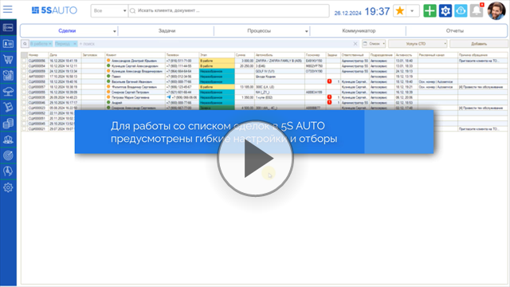](https://edu.5systems.ru/video/Rabochij_stol/Otbory_v_rezhime_spiska.mp4)

### Быстрые фильтры

Быстрые фильтры позволяют, например, отобразить только свои сделки либо задать период по дате создания сделок или последней активности по ним. Нажмите кнопку с лупой на панели отбора, задайте нужные критерии и нажмите **«Найти»**:

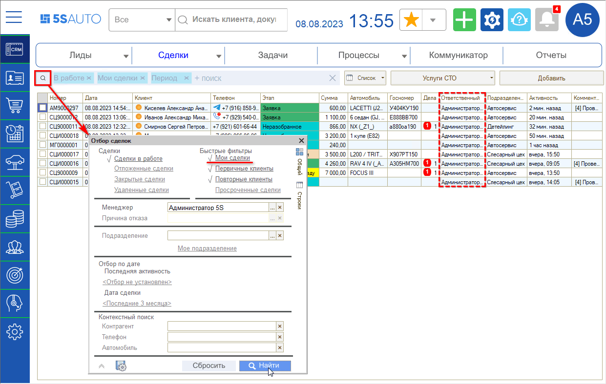

Установленные фильтры сохраняются для текущего рабочего стола и будут действовать по умолчанию при следующем открытии списка сделок.

### Отборы по значению в колонках

Для удобства работы со списком есть возможность устанавливать отборы по значениям в каждой колонке.

#### 1. Отбор по обращениям

При клике правой кнопкой мыши по колонкам **«Номер»**, **«Дата»** или **«Клиент»** открывается меню, в котором можно установить отбор по первичным либо повторным клиентам, а также задать временной интервал:

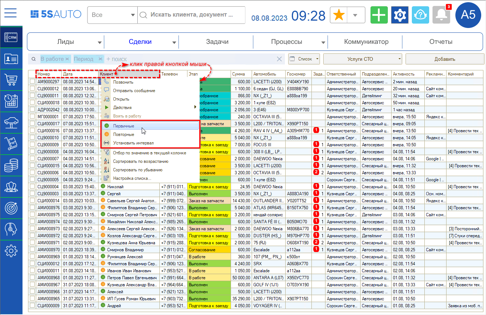

Например, можно оставить в списке только первичных клиентов:

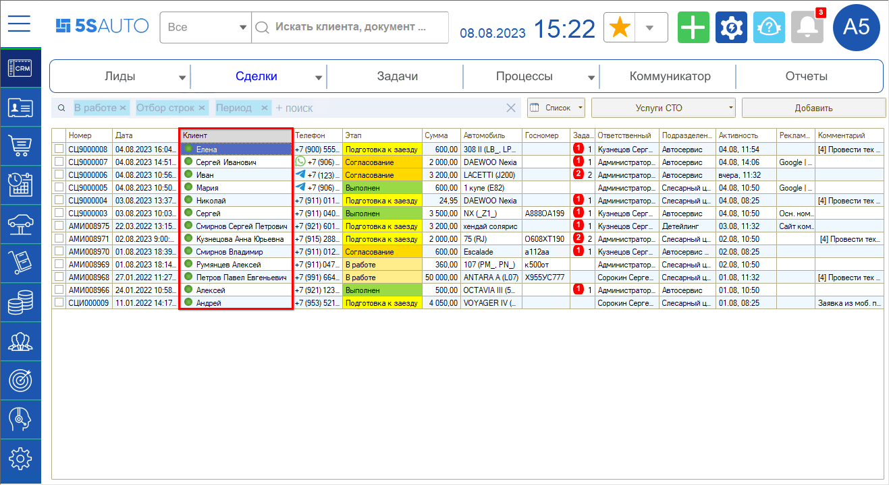

#### 2. Отбор по сообщениям

При клике правой кнопкой мыши на столбце **«Телефон»** можно установить отбор по непрочитанным сообщениям либо по клиентам, основным каналом общения с которыми являются мессенджеры:

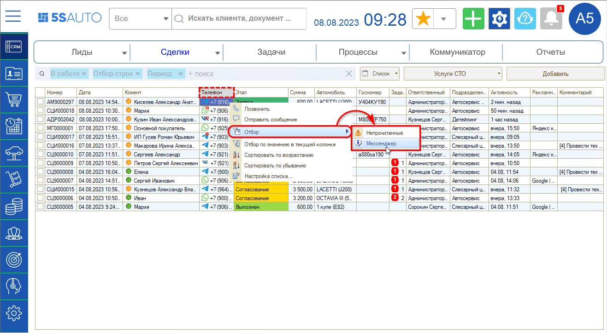

#### 3. Отбор по этапу

Есть возможность выбрать только сделки, находящиеся на определенном этапе, например «Неразобранное»:

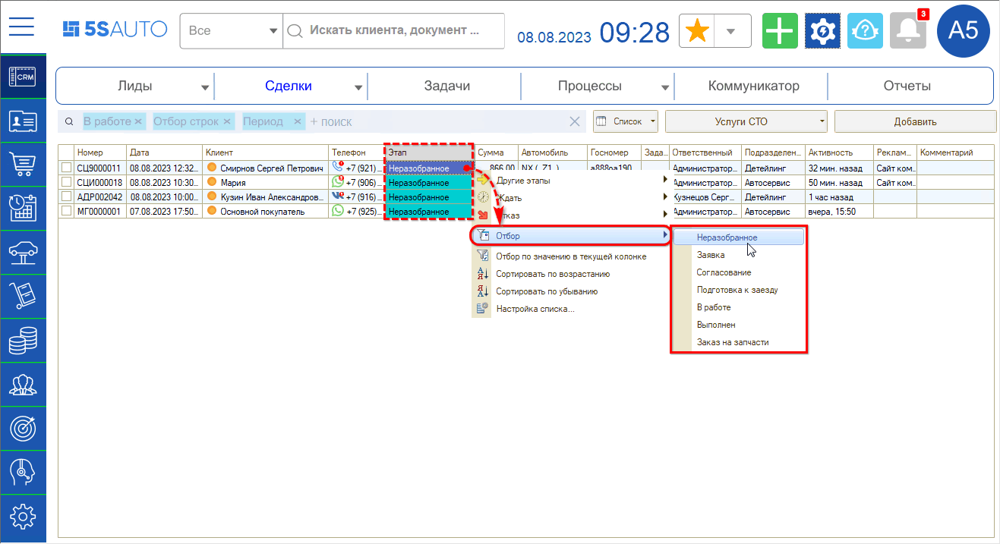

Также можно сортировать сделки по этапам — по возрастанию или по убыванию:

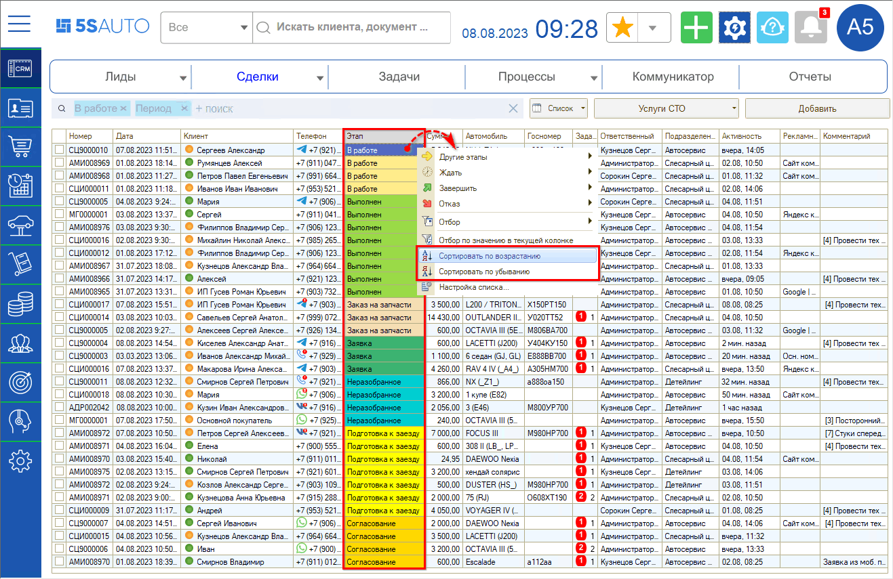

#### 4. Отбор по сумме

При установке отбора по сумме открывается меню со следующими значениями:

- Не указана
- < 1000 руб.
- \> 1000 руб.
- \> 10 000 руб.
- \> 50 000 руб.

Например, можно оставить в списке только сделки, сумма по которым больше 1000 рублей:

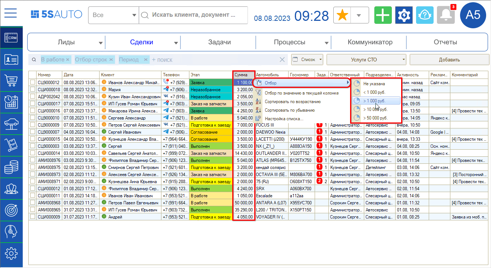

#### 5. Отбор по автомобилям

При установке отбора по автомобилю открывается список марок всех автомобилей из текущего списка сделок — можно вывести только автомобили определенной марки:

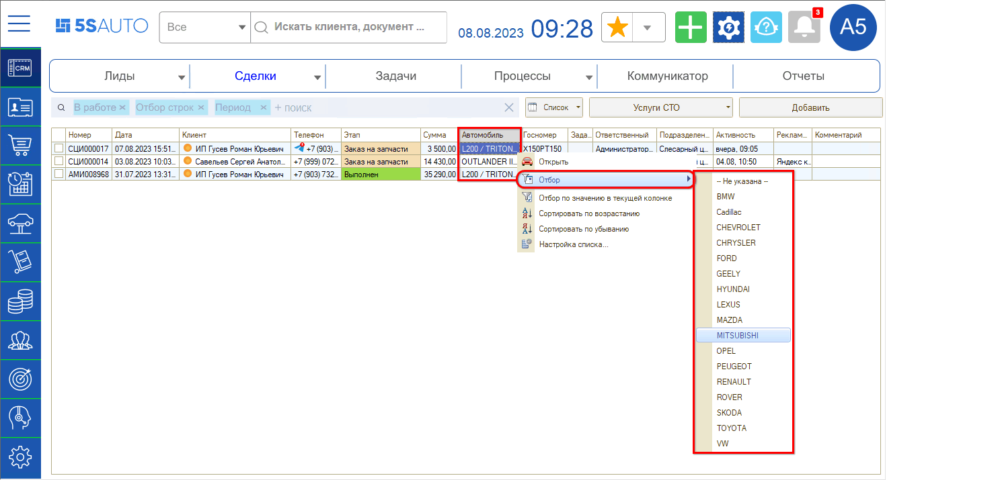

#### 6. Отбор по задачам

Есть возможность установить отбор сделок по просроченным задачам либо по сделкам без задач:

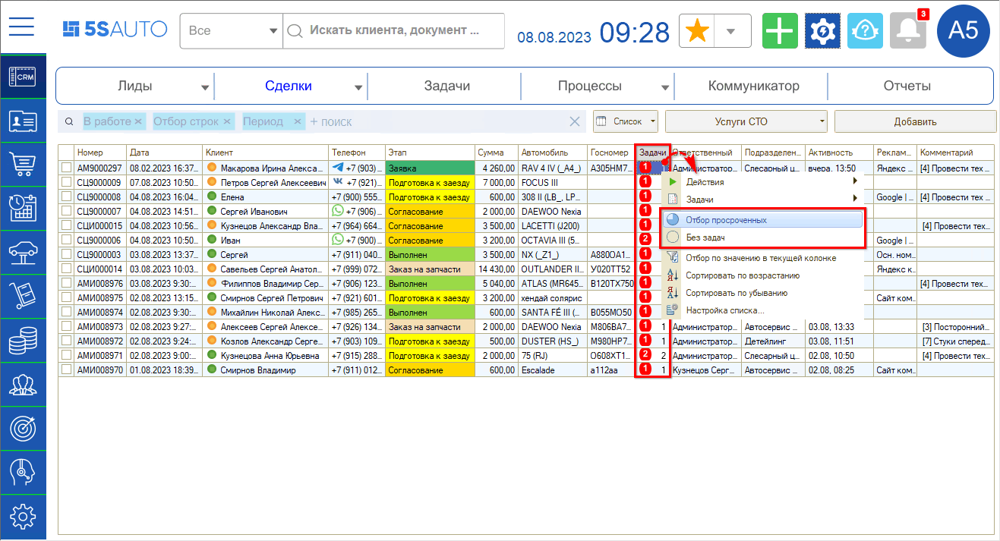

#### 7. Отбор по ответственному

Есть возможность установить отбор сделок по ответственному — в меню предлагается выбор среди пользователей, которые назначены ответственными для сделок в текущем списке:

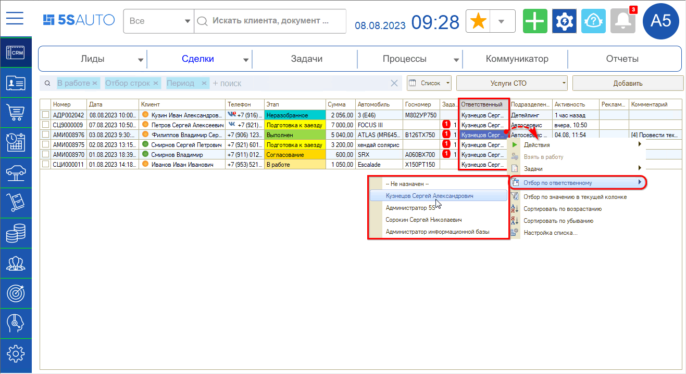

#### 8. Отбор по подразделению

Есть возможность установить отбор сделок по подразделению:

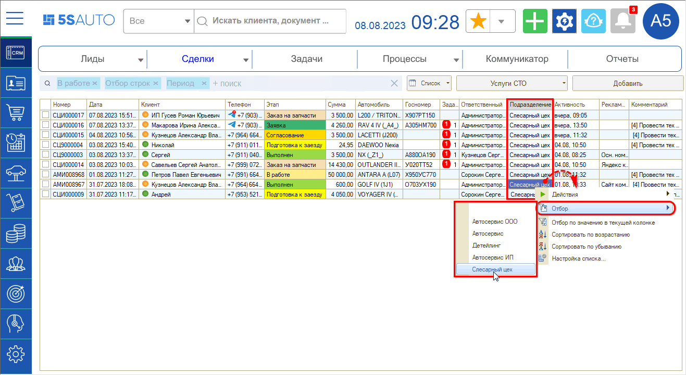

#### 9. Отбор по активности

Активность — это последние дата и время следующих действий по сделке: создание документов, созвон или переписка с клиентом, прикрепление комментария в сделке.

При установке отбора по последней активности открывается меню со следующими вариантами:

- Час
- 2 часа
- Сегодня
- Вчера
- Неделя
- Месяц
- Установить интервал

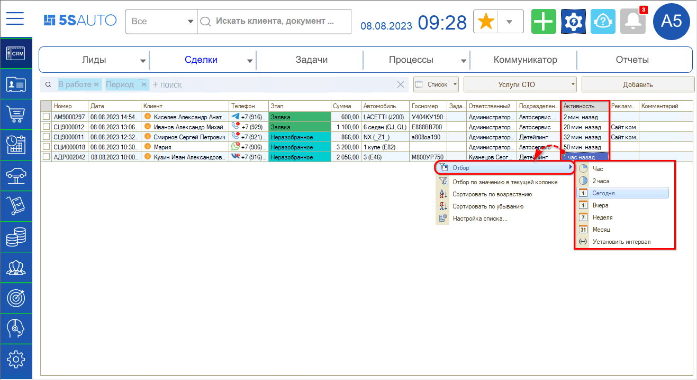

#### 10. Отбор по рекламным каналам

Есть возможность установить отбор по рекламным каналам: выделите ячейку с нужным рекламным каналом, кликните правой кнопкой мыши и выберите **«Отбор по значению в текущей колонке»**:

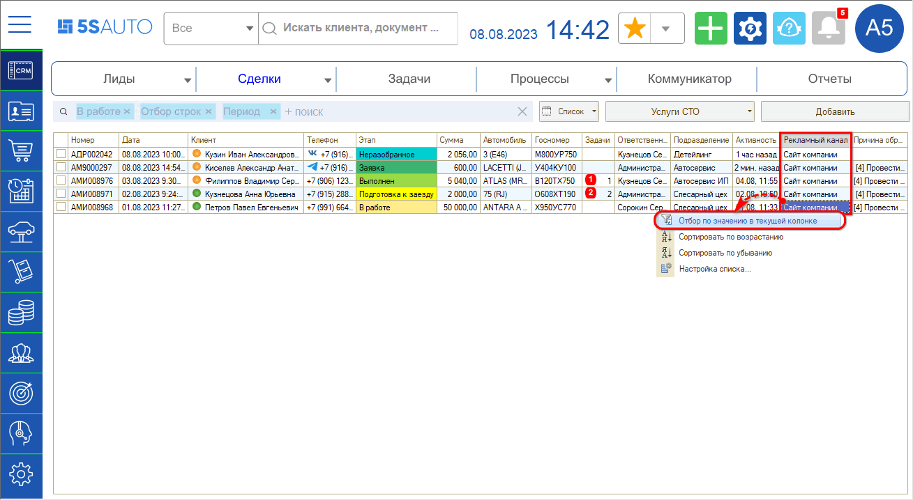

### Отбор по значению в ячейке

Также можно установить отбор по значению в любой ячейке списка — например, выбрать все сделки по определенному клиенту:

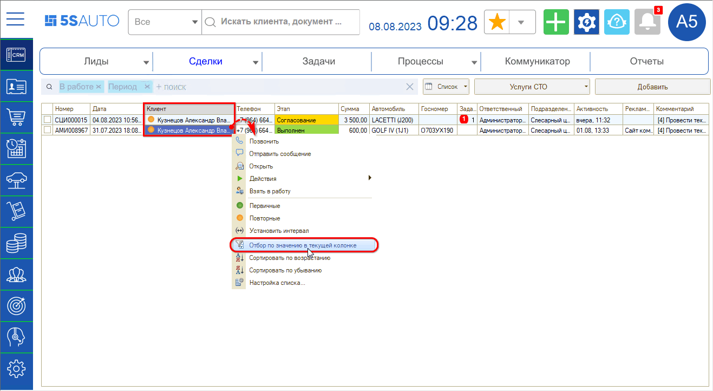

### Комплексная настройка отборов

Для единовременной установки всех необходимых отборов перейдите в окно **«Отбор сделок → Строки»** и задайте все нужные настройки сразу:

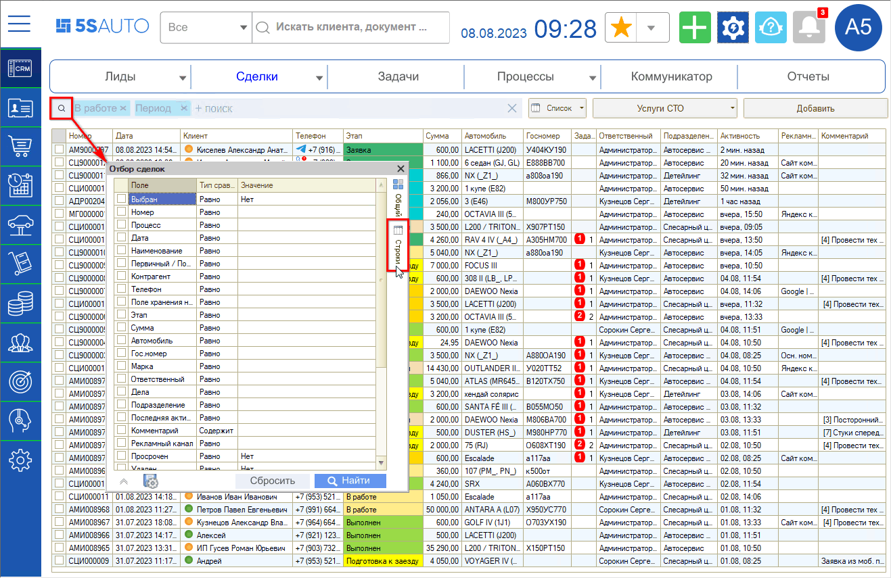

### Сохранение отборов

Установленные для просмотра списка сделок отборы можно сохранить и затем просто выбирать из списка нужную настройку — см. описание в статье «[Сохранение настроек просмотра сделок](https://www.5systems.ru/help/sokhranenie-nastroek-prosmotra-sdelok)».

### Снятие отборов

Для снятия установленных отборов нажмите кнопку **«Отбор строк»** и кликните на тот отбор, который необходимо снять, либо нажмите **«Отключить отбор»** — снимутся все заданные отборы:

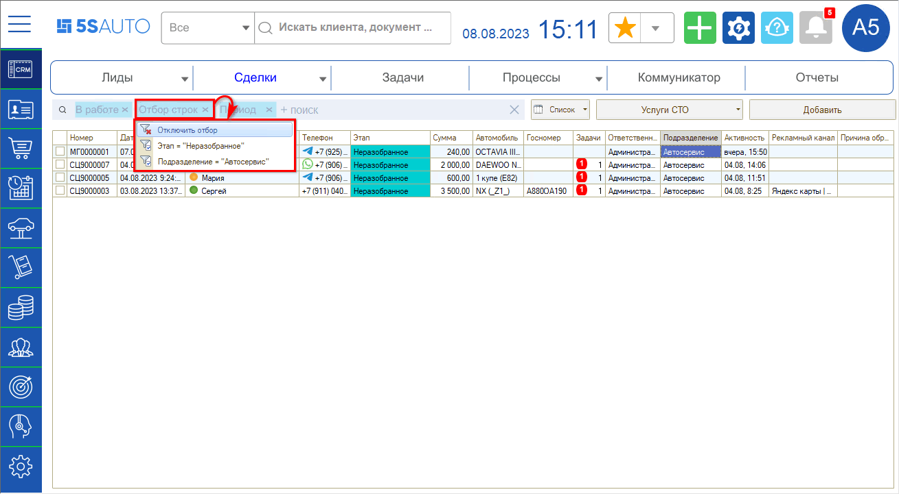

---

**Теги:** CRM, список сделок, сделки, лиды, отборы, фильтры, быстрые фильтры, настройка списка, колонки, сортировка, рабочий стол

