

# Структура интерфейса 5S AUTO

<table><tr><td><b>Время чтения:</b> 13 мин.</td><td><b>Обновлено:</b> 28.03.2024</td></tr></table>

Источник: https://www.5systems.ru/help/struktura-interfeysa-5s-auto

**Актуально для релиза 2.6.1.1**

## Содержание

- [Боковое меню](#боковое-меню)
- [Разделы интерфейса](#разделы-интерфейса)
  - [CRM и задачи](#crm-и-задачи)
  - [Переход в АРМ-ы](#переход-в-арм-ы)
  - [Разделы навигации](#разделы-навигации)
- [Верхняя панель](#верхняя-панель)
  - [1. Логотип организации](#1-логотип-организации)
  - [2. Строка поиска](#2-строка-поиска)
  - [3. Панель «Избранное»](#3-панель-избранное)
  - [4. Кнопка быстрого добавления](#4-кнопка-быстрого-добавления)
  - [5. Кнопка «Настройки»](#5-кнопка-настройки)
  - [6. Техподдержка](#6-техподдержка)
  - [7. Кнопка «Напоминания»](#7-кнопка-напоминания)
  - [8. Аватар](#8-аватар)
  - [9. Панель управления пользователем](#9-панель-управления-пользователем)
    - [Временная блокировка работы в системе](#временная-блокировка-работы-в-системе)

## Боковое меню

Внешний вид меню 5S AUTO может быть очень разным. Цветовое оформление настраивается под корпоративные цвета каждой компании, набор разделов и их наполнение — под каждого отдельного пользователя.

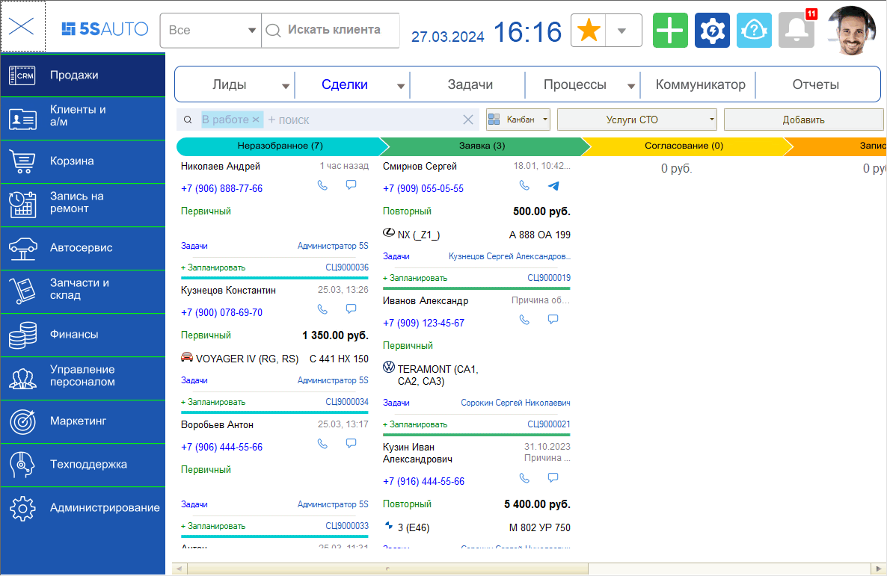

По умолчанию всем пользователям доступны все пункты меню без ограничений. При необходимости для каждого рядового сотрудника — мастера-приемщика, специалиста по подбору запчастей или оператора колл-центра — можно настроить упрощенный интерфейс с минимально необходимым набором функций. Это помогает ускорить текущую работу в программе и процесс обучения новых сотрудников.

## Разделы интерфейса

### CRM и задачи

**1. «Продажи».** Непосредственно CRM-система. Представляет собой [канбан-доску со сделками](../Канбан%20сделок/kanban-sdelok.md).

**2. «Задачи».** Открывается АРМ «Рабочий стол», в котором можно увидеть полный список задач, отсортированных по должности или текущему пользователю.

### Переход в АРМ-ы

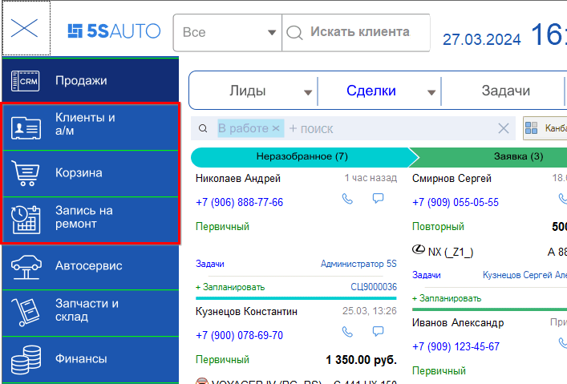

**3. «Клиенты и автомобили».** Переход в [АРМ «Клиенты и автомобили»](../../Работа%20с%20клиентами/Работа%20в%20АРМ%20Клиенты%20и%20автомобили/rabota-v-arm-klienty-i-avtomobili.md).

**4. «Корзина».** Переход в [АРМ «Корзина»](../../Проценка%20запчастей%20и%20работ/Работа%20в%20АРМ%20Корзина/rabota-v-arm-korzina.md).

**5. «Запись на ремонт».** Переход в АРМ «Запись на ремонт».

### Разделы навигации

Эти разделы содержат в себе различные функции, которые в свою очередь разбиты на подразделы (Заказы, Продажи, Аналитика и т. д.).

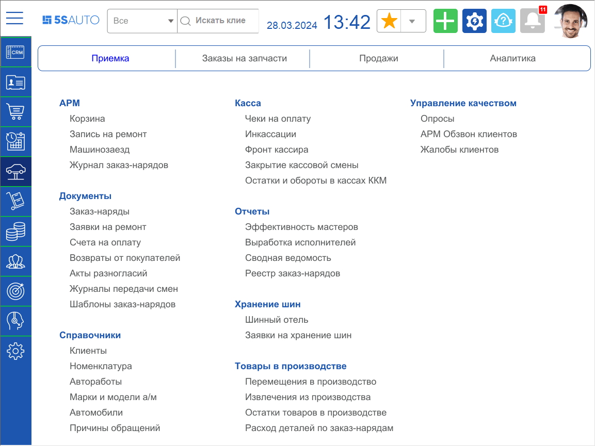

**6. «Автосервис».** Блок содержит перечень АРМ, документов, справочников, отчетов, необходимых для работы автосервиса — приемки автомобиля, заказа запчастей и т. д.

**7. «Запчасти и склад».** Раздел включает все необходимые инструменты для ведения полноценного складского учета.

**8. «Финансы».** Блок содержит весь необходимый функционал для ведения бухгалтерского учета, контроля доходов и расходов, состояния взаиморасчетов, проведения кассовых операций и т. д.

**9. «Маркетинг».** Раздел включает инструменты для проведения маркетинговых кампаний и осуществления программ лояльности.

**10. «Управление персоналом».** В разделе собраны инструменты для учета рабочего времени сотрудников и выработки, управления качеством, а также для реализации [системы мотивации](https://www.5systems.ru/help/opisanie-vozmozhnostey-sistemy-motivacii).

**11. «Руководителю».** *Функционал в разработке.* Раздел содержит отчеты и ключевые показатели, то есть представляет собой панель управления аналитикой.

**12. «Техподдержка».** *Функционал в разработке.*

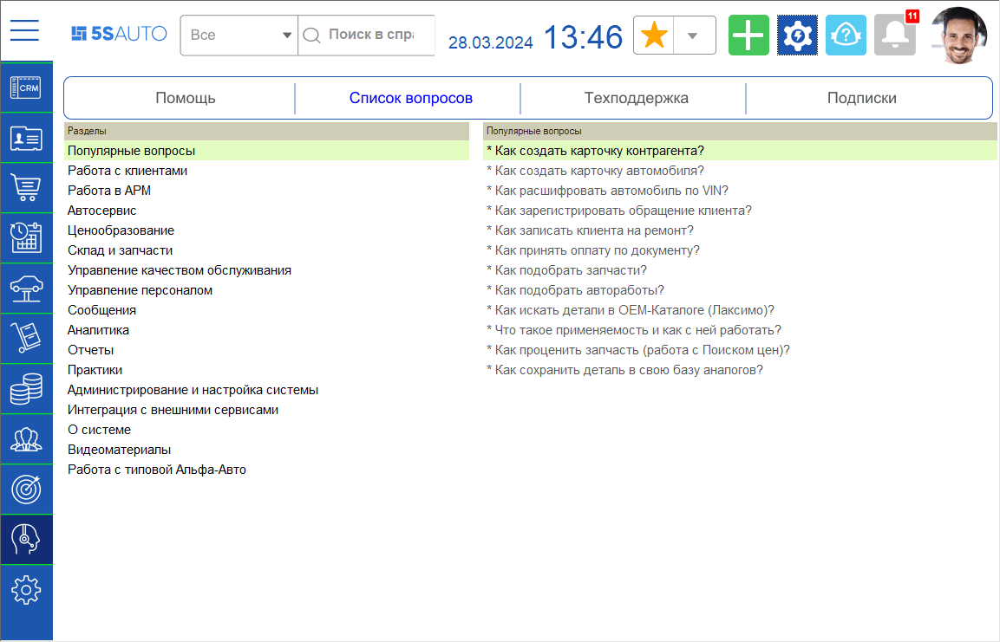

Содержит подразделы:

1. **«Помощь»** — структурированный список методических материалов со ссылками на Базу знаний.
2. **«Список вопросов»** — популярные вопросы по работе с программой с готовыми ответами на них.
3. **«Техподдержка»** — список тикетов в техподдержку с возможностью создания, комментирования и просмотра ответов от специалистов («Задать вопрос»).
4. **«Подписки»** — возможность оформлять различные подписки, предусмотренные в системе, и просматривать их состояние. На данный момент в системе доступны такие подписки, как расшифровка гос. номеров, электронный документооборот и т. д.

**13. «Администрирование».** Раздел включает в себя все инструменты для тонкой настройки системы. Состоит из трех подразделов:

1. **Компания** — список основных справочников и документов, используемых при наполнении базы.
2. **Сервис** — инструменты для настройки интерфейса, торгового оборудования, пользователей и их прав.
3. **Обслуживание** — перечень возможностей по обслуживанию и поддержанию работоспособности системы.

## Верхняя панель

### 1. Логотип организации

Первым элементом на верхней панели интерфейса является логотип компании. Логотип представляет собой кнопку, нажатием на которую производится обновление рабочего стола.

### 2. Строка поиска

Реализован полнотекстовый поиск по частичному совпадению в разделах меню, справочниках, реестрах документов. Возможен поиск по разным реквизитам: по имени или фамилии клиента, по номеру телефона, по модели автомобиля, по VIN-номеру, гос. номеру и т. д.

Можно вести поиск в выбранном разделе — Контрагенты, Автомобили, Сделки, Заказ-наряды, Реализации, Заказы, Меню — либо искать во всех разделах одновременно. О работе с поиском см. подробнее в статье «[Работа с полнотекстовым поиском](../Работа%20с%20полнотекстовым%20поиском/rabota-s-polnotekstovym-poiskom.md)».

Чтобы поиск работал, необходимо включить регламентное задание — см. статью «[Настройка полнотекстового поиска](https://www.5systems.ru/help/nastroyka-polnotekstovogo-poiska)».

### 3. Панель «Избранное»

Панель **«Избранное»** предназначена для быстрого доступа к различным элементам базы. В избранное можно добавить любые реестры, отчеты или документы.

При нажатии на «звездочку» открывается панель управления избранным. Можно добавлять элементы, группировать, изменять наименование и последовательность.

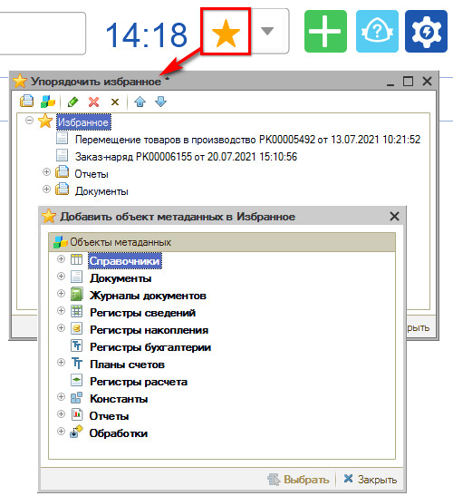

Чтобы упорядочить элементы, добавленные в избранное, можно создавать отдельные папки и группировать их в нужной иерархии.

### 4. Кнопка быстрого добавления

### 5. Кнопка «Настройки»

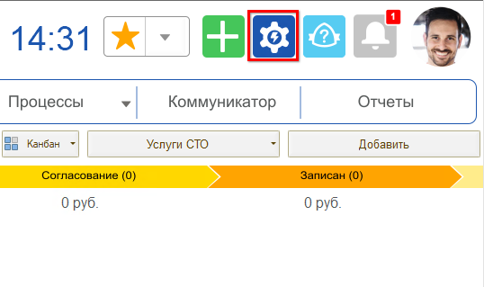

### 6. Техподдержка

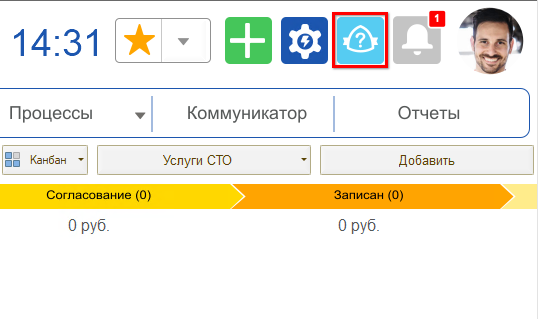

### 7. Кнопка «Напоминания»

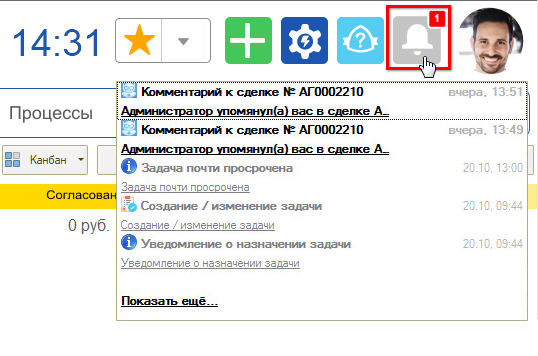

При появлении непрочитанных уведомлений на кнопке появляется индикатор, отображающий их количество. При нажатии на кнопку открывается полный список уведомлений пользователя.

Подробнее об уведомлениях и их настройке см. в статьях «[Работа с уведомлениями](../Работа%20с%20уведомлениями/rabota-s-uvedomleniyami.md)» и «[Настройка параметров уведомлений](../Настройка%20параметров%20уведомлений/nastroyka-parametrov-uvedomleniy.md)».

### 8. Аватар

Аватар пользователя настраивается в карточке сотрудника на соответствующей вкладке.

Для настройки аватара сначала загрузите фото сотрудника на вкладке **«Фотография»**, затем перейдите на вкладку **«Аватар»**, кликните на фото и выделите квадратом ту часть фото, которая должна отображаться в качестве аватара. Нажмите кнопку **«Результат»** и **«ОК»**.

Выбранный аватар пользователя будет отображаться рядом с его именем в сделках, в ленте событий и т. д.

### 9. Панель управления пользователем

При нажатии на аватар пользователя открывается панель управления.

Панель управления позволяет:

1. Авторизоваться на портале техподдержки — это даст доступ к созданию и управлению тикетами в соответствующем разделе интерфейса.
2. Перейти к [настройкам уведомлений](../Настройка%20параметров%20уведомлений/nastroyka-parametrov-uvedomleniy.md).
3. Временно заблокировать сеанс пользователя — см. [ниже](#временная-блокировка-работы-в-системе).
4. Завершить работу программы.

#### Временная блокировка работы в системе

Режим блокировки предназначен для предотвращения несанкционированного использования системы в отсутствие пользователя. Блокировка используется, когда пользователю требуется отойти от компьютера, — чтобы каждый раз не выходить из программы.

Функционал имеет смысл, только когда для пользователя задан пароль.

**Блокировка вручную.** Нажмите на аватар пользователя и в выпадающем меню — кнопку **«Временная блокировка»**:

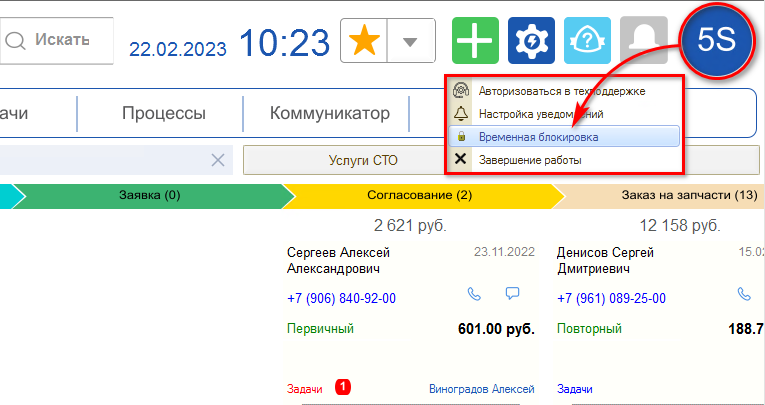

Работа в системе будет заблокирована и появится окно с сообщением «Программа заблокирована!»:

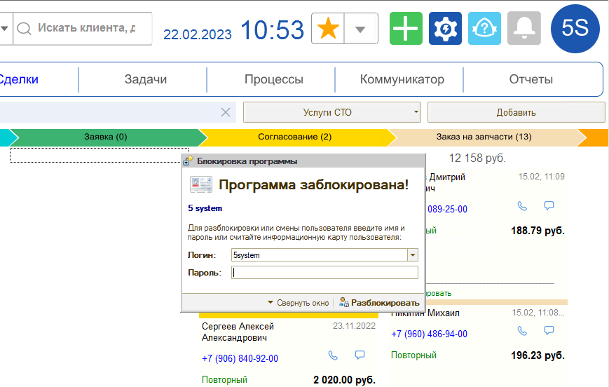

Кнопка **«⏷ Свернуть окно»** сворачивает окно программы.

Чтобы разблокировать программу и продолжить работу в системе, введите пароль текущего пользователя — такой же, как при запуске системы, — и нажмите кнопку **«Разблокировать»**:

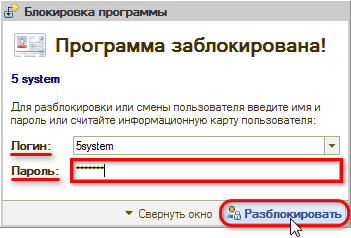

Если для текущего пользователя пароль не был задан, вводить пароль не нужно. После правильного ввода пароля система становится доступной для работы.

Также из формы блокировки в систему может зайти другой пользователь под своими учетными данными: выбрать из списка свой логин, ввести пароль и нажать кнопку **«Разблокировать»**:

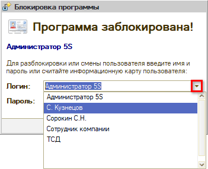

**Автоматическая блокировка.** Есть возможность настроить автоматическую блокировку программы по истечении нескольких минут бездействия пользователя — см. статью «[Настройка рабочего стола → Автоматическая блокировка работы в программе](https://www.5systems.ru/help/nastroyka-rabochego-stola#autoblock)».

---

**Теги:** CRM, интерфейс, боковое меню, разделы навигации, верхняя панель, избранное, полнотекстовый поиск, аватар, уведомления, временная блокировка, АРМ

