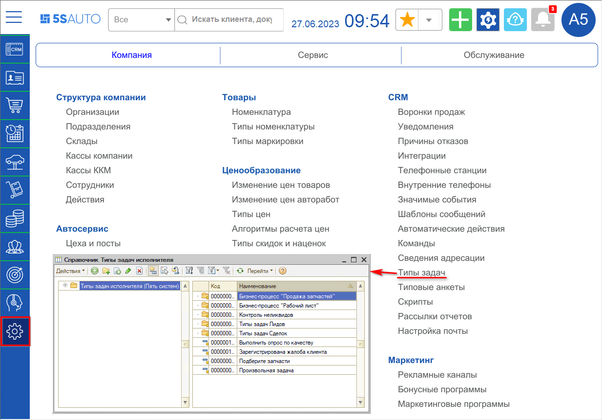
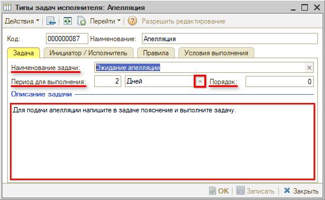
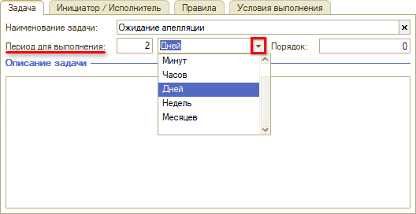
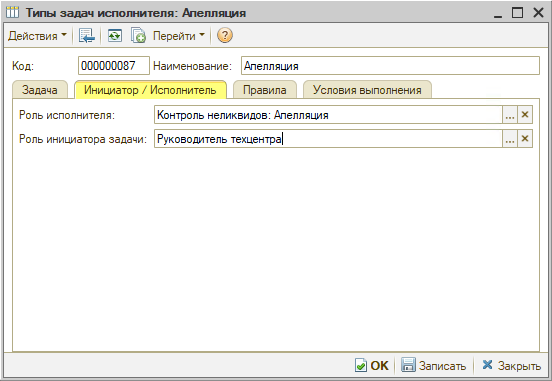
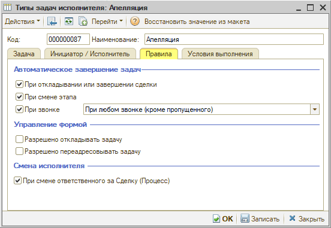
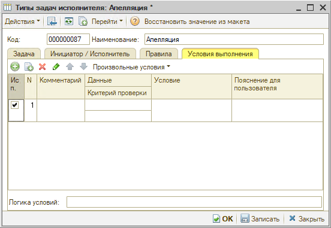
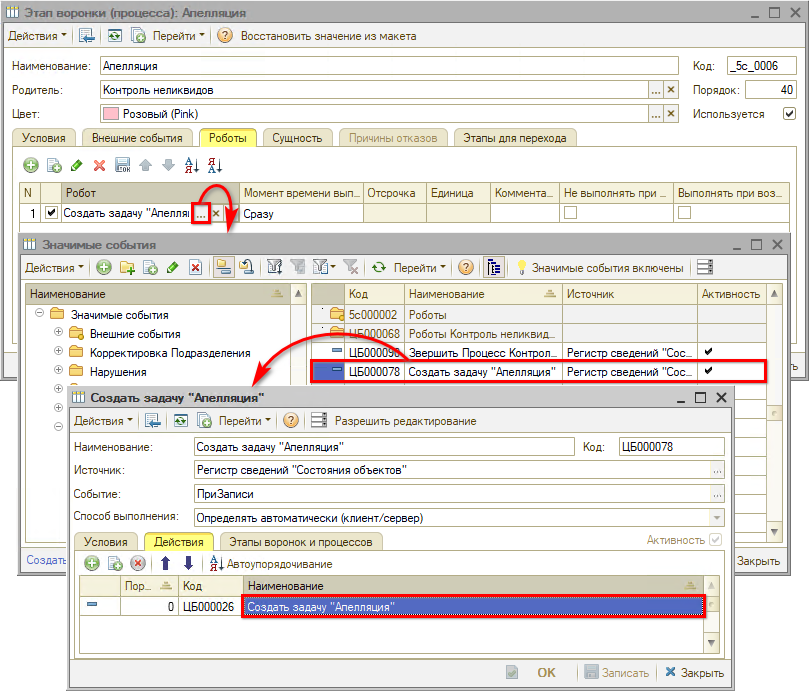
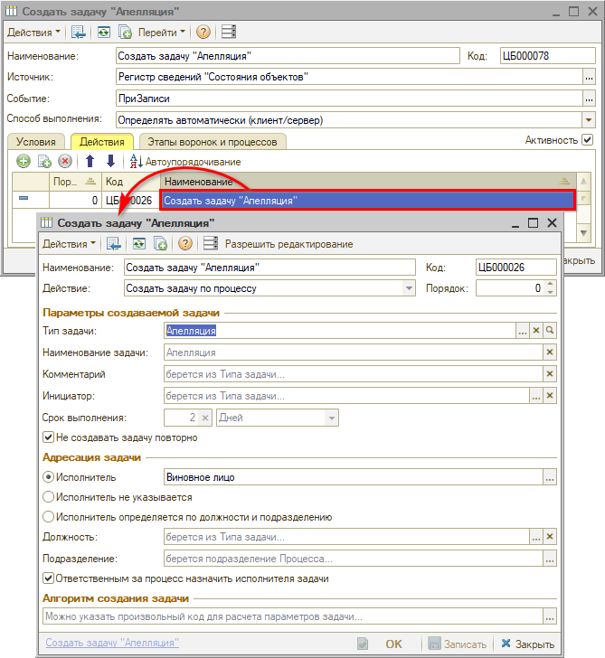
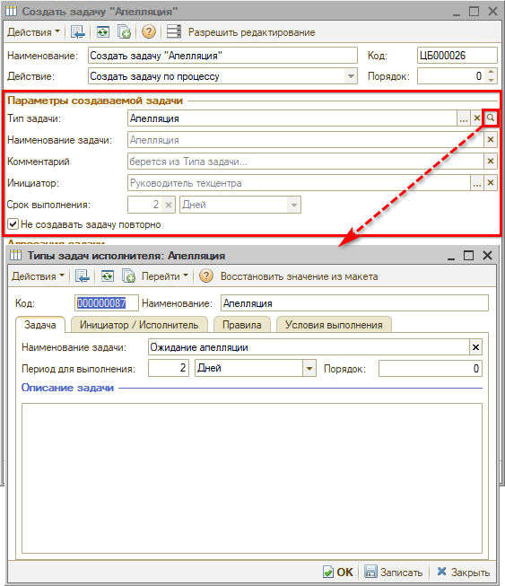
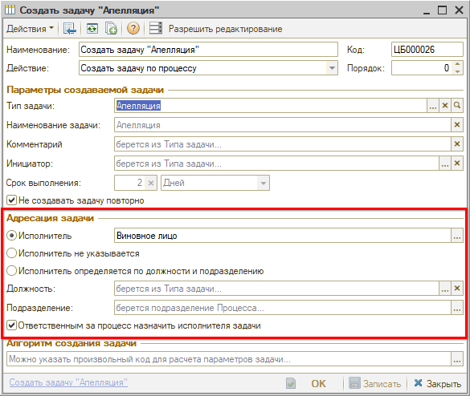

# Типы задач

<table><tr><td><b>Время чтения:</b> 14 мин.</td><td><b>Обновлено:</b> 26.06.2023</td></tr></table>

Источник: https://www.5systems.ru/help/tipy-zadach

## Содержание

- [Справочник «Типы задач»](#справочник-типы-задач)
- [Настройки типа задачи](#настройки-типа-задачи)
  - [1. Параметры задачи](#1-параметры-задачи)
  - [2. Инициатор и исполнитель](#2-инициатор-и-исполнитель)
  - [3. Правила](#3-правила)
  - [4. Условия выполнения](#4-условия-выполнения)
- [Настройка создания задач](#настройка-создания-задач)

## Справочник «Типы задач»

В программе реализованы специальные типы задач. Справочник **«Типы задач»** предусмотрен для объединения аналогичных задач по типам и указания для этих типов общей логики создания, выполнения, адресации и прочих одинаковых настроек.

Справочник расположен в меню программы: *Администрирование → Компания → CRM → Типы задач*:

## Настройки типа задачи

### 1. Параметры задачи

На вкладке **«Задача»** устанавливаются следующие параметры:

**1) Наименование задачи** — название задачи, которое будет отображаться у пользователя. Это отдельный реквизит, не связанный с параметром «Наименование» в верхнем поле карточки типа задачи.

**2) Период для выполнения** — срок для выполнения задачи, то есть количество в разных временных единицах:

**3) Порядок** — параметр для закрытия задач в определенной последовательности, бывает важен для некоторых типов задач.

**4) Описание задачи** — можно заполнить пояснение для исполнителя, что требуется сделать для выполнения задачи данного типа.

### 2. Инициатор и исполнитель

На вкладке **«Инициатор/исполнитель»** настраиваются следующие параметры:

**1) Роль исполнителя** — задается должность пользователя, на которого будет создаваться задача данного типа.

**2) Роль инициатора задачи** — параметр заполняется для того, чтобы в задачу в качестве инициатора вместо робота подтягивалась должность реального пользователя либо сотрудника: например, чтобы у исполнителя задачи отображалось, что задача назначена директором.

### 3. Правила

На вкладке **«Правила»** собраны следующие параметры:

**1) Автоматическое завершение задач:**

- **При откладывании или завершении сделки** — настраивается автоматическое выполнение задачи при откладывании или завершении сделки, чтобы задачи не считались просроченными.
- **При смене этапа** — аналогично настраивается автоматическое выполнение задачи при смене этапа.
- **При звонке** — автозавершение задач при звонке настраивается для [работы с пропущенными звонками](../../Телефония/Работа%20с%20пропущенными%20звонками/rabota-s-propushchennymi-zvonkami.md): чтобы после созвона с клиентом задачи не висели на канбане и другой пользователь повторно не побеспокоил клиента.

  Нажатием на стрелку  можно выбрать один из вариантов настройки:

  - **При любом звонке (кроме пропущенного)** — задача будет завершаться при входящих и исходящих звонках;
  - **При входящем звонке** — задача будет завершаться только при входящем звонке от клиента;
  - **При исходящем звонке** — задача будет завершаться только в случае исходящего звонка клиенту;
  - **При исходящем звонке исполнителя** — программа проверяет, кто совершал звонок клиенту, и завершает задачу, только если это был исполнитель задачи. Проверка осуществляется по внутренним телефонам сотрудников, если они настроены.

**2) Управление формой** — настройка разрешения откладывать и переадресовывать задачу. Если галочки сняты, пользователь не сможет отложить или переадресовать задачу.

**3) Смена исполнителя** — смена исполнителя задачи при смене ответственного за [сделку](../Работа%20со%20сделкой/rabota-so-sdelkoy.md): при смене ответственного в сделке будет автоматически меняться исполнитель задачи.

### 4. Условия выполнения

На вкладке **«Условия выполнения»** возможна настройка произвольных условий выполнения задачи — осуществляется специалистами техподдержки 5SYSTEMS.

## Настройка создания задач

Создание задач осуществляется роботом создания задач, на него создается специальное действие создания задачи. Для этого реализован тип действия робота на значимое событие **«Создать задачу по бизнес-процессу»**:

Настройки действия создания задачи:

**1. Блок «Параметры создаваемой задачи».** Значения параметров в поля этого раздела подтягиваются из настроек типа задачи:

**2. Блок «Адресация задачи»:**

**1) Варианты назначения исполнителя:**

- **Выбор определенного исполнителя** — в частности, в приведенном примере при создании задач «Апелляция» исполнителем необходимо назначать виновное лицо.
- **Исполнитель не указывается** — в этом случае создаваемые задачи данного типа будут видны всем пользователям.
- **Исполнитель определяется по должности и подразделению** — при выборе этого варианта в задаче по умолчанию будет указываться исполнитель по должности из настроек типа задачи и по подразделению из процесса. Либо можно указать должность и подразделение в дополнительных параметрах.

**2) Галочка «Ответственным за процесс назначить исполнителя задачи»** — настройка смены исполнителя процесса при смене исполнителя задачи.

В воронке лидов и сделок адресация осуществляется, как правило, на менеджера. В бизнес-процессе контроля неликвидов при смене этапов предусмотрена адресация на других исполнителей и другие должности — например, на бухгалтера, юриста и т. д. При переходе процесса на определенный этап будет меняться исполнитель процесса в соответствии с исполнителем задачи, которая на этом этапе создается.

**3. Алгоритм создания задачи.** Есть возможность вручную написать произвольный код для расчета алгоритма создания задачи.

---

**Теги:** CRM, задачи, типы задач, автозавершение задач, исполнитель, инициатор, адресация задач, робот создания задач, значимые события, бизнес-процессы

