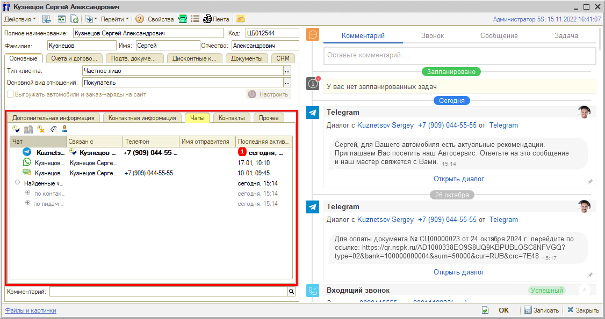
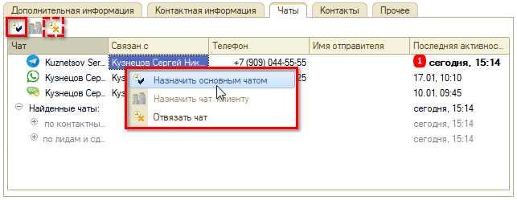
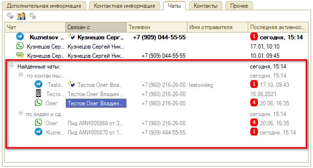
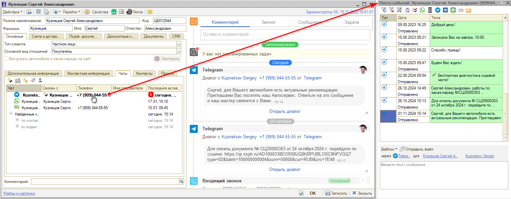
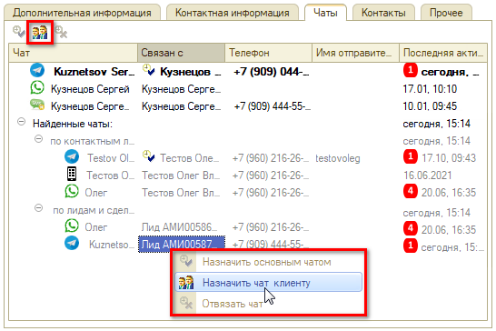
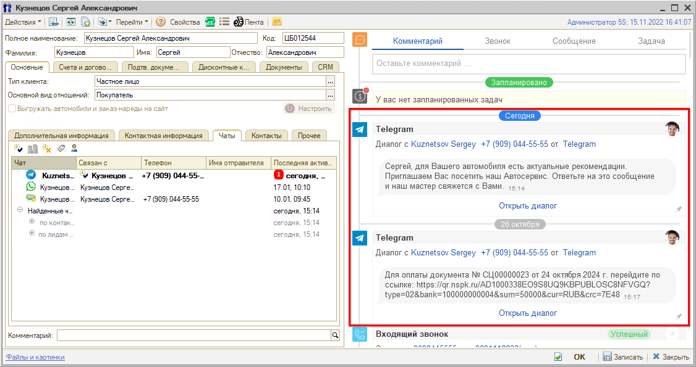
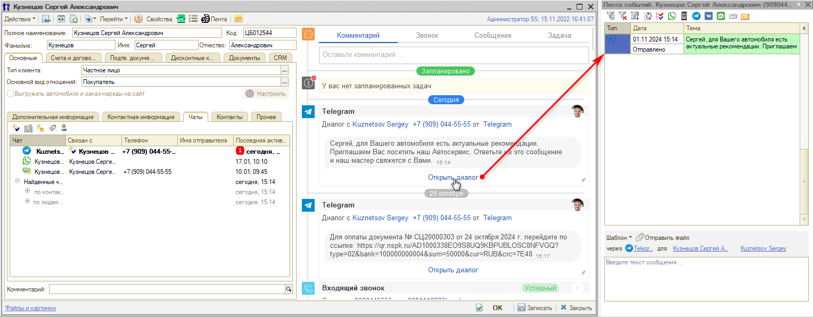

# Чаты клиента

<table><tr><td><b>Время чтения:</b> 7 мин.</td><td><b>Обновлено:</b> 01.11.2024</td></tr></table>

Источник: https://www.5systems.ru/help/chaty-klienta

> *Функционал доступен начиная с релиза 2.2.7.2.*

## Содержание

- [1. Вкладка «Чаты» в карточке клиента](#1-вкладка-чаты-в-карточке-клиента)
- [2. Диалоги в карточке клиента](#2-диалоги-в-карточке-клиента)

## 1. Вкладка «Чаты» в карточке клиента

В левой части карточки контрагента находится вкладка **«Чаты»**. На ней видно, с какими чатами связан данный контрагент:

Связь контрагента с чатами происходит посредством лидов и сделок: контрагент связан с лидами и сделками, а с ними связаны чаты.

Чаты, с которыми контрагент связан напрямую, выводятся вверху списка. Можно выбрать один из чатов в качестве основного: выделите чат и нажмите кнопку **«Назначить основным»** на верхней панели либо кликните на чат правой кнопкой мыши и в выпадающем меню выберите **«Назначить основным чатом»**:

Также можно отвязать чат от клиента нажатием на кнопку **«Отвязать чат»**.

Ниже расположено поле **«Найденные чаты»** — в нем отображаются найденные программой чаты, опосредованно связанные с данным контрагентом:

Группы связанных чатов:

- **по контактным лицам** — чаты контрагентов, которые являются контактными лицами данного контрагента;
- **по связанным контрагентам** — чаты контрагентов, для которых данный контрагент является контактным лицом;
- **по лидам и сделкам** — чаты по сделкам, в которых указан номер телефона данного контрагента;
- **по сотруднику** — если с контрагентом связана карточка сотрудника, а с сотрудником связан чат;
- **другие контрагенты** — чаты, подтянутые по номеру телефона: если такой же номер телефона найден в других карточках контрагентов.

При клике на Ф. И. О. контактного лица в столбце **«Связан с»** открывается его карточка клиента, при клике на Ф. И. О. сотрудника открывается карточка пользователя, связанная с карточкой сотрудника.

При двойном клике на номер телефона открывается Лента с чатом за весь период общения с клиентом в данном мессенджере:

*Примечание:* просмотреть отдельный диалог в ленте можно, кликнув на нужный диалог в событиях сделки — см. [ниже](#2-диалоги-в-карточке-клиента).

Найденный чат можно назначить клиенту: кликните на чат правой кнопкой мыши и выберите соответствующий пункт выпадающего меню либо выделите чат и нажмите кнопку **«Назначить чат клиенту»** на верхней панели:

## 2. Диалоги в карточке клиента

Переписка с клиентом отображается в правой части карточки контрагента. Сообщения сгруппированы по диалогам на основании мессенджера и даты:

Таким образом, **диалог** — это переписка с клиентом в мессенджере за определенный день.

При нажатии на диалог в событиях открывается Лента с подробным содержанием данного диалога:

Отсюда можно написать и отправить клиенту сообщение — в произвольной форме либо используя шаблоны, а также прикрепить файл при необходимости.

*Примечание:* чтобы в Ленте открылась вся переписка с клиентом в данном мессенджере, на вкладке «Чаты» дважды кликните по номеру телефона напротив нужного мессенджера — см. [выше](#1-вкладка-чаты-в-карточке-клиента).

---

**Теги:** чаты, диалоги, мессенджеры, карточка клиента, контрагент, лента событий, переписка, основной чат, найденные чаты

