

# Автомобили

<table><tr><td><b>Время чтения:</b> 15 мин.</td><td><b>Обновлено:</b> 29.01.2025</td></tr></table>

Источник: https://www.5systems.ru/help/avtomobili-0

## Содержание

- [Справочник Автомобили](#справочник-автомобили)
  - [Расположение справочника](#расположение-справочника)
  - [Работа со справочником «Автомобили»](#работа-со-справочником-автомобили)
- [Карточка автомобиля](#карточка-автомобиля)
  - [Вкладки](#вкладки)
  - [Способы перехода в карточку автомобиля в программе](#способы-перехода-в-карточку-автомобиля-в-программе)
  - [Добавление автомобиля в базу](#добавление-автомобиля-в-базу)

## Справочник Автомобили

В справочник **«Автомобили»** заносится информация обо всех автомобилях: как клиентских, так и собственных автомобилях предприятия. Информация из этого справочника используется в заказ-нарядах и заявках на ремонт, заказах покупателей и других документах и рабочих местах программы.

### Расположение справочника

Справочник расположен в меню интерфейса *Автосервис → Приемка → Справочники → Автомобили:*

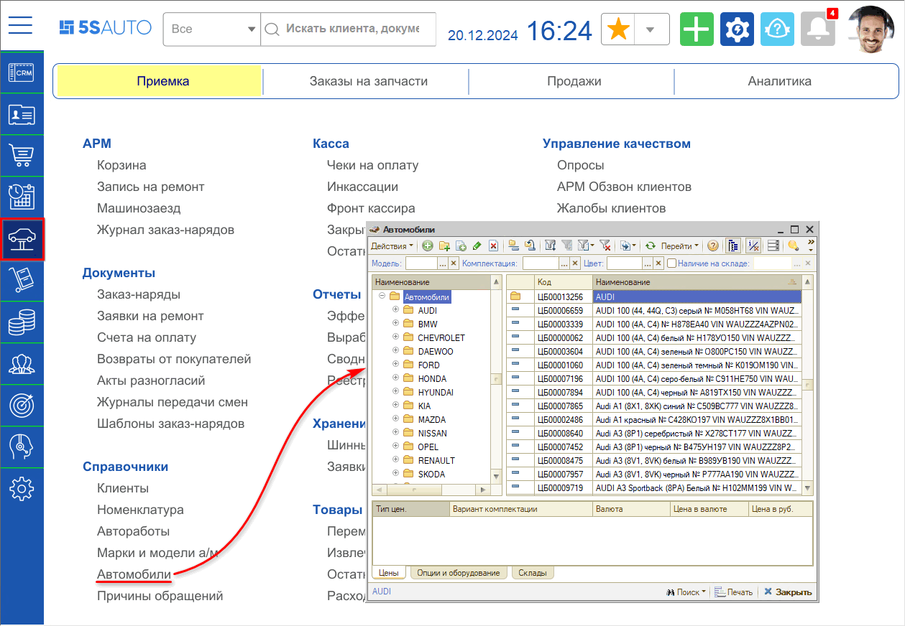

### Работа со справочником «Автомобили»

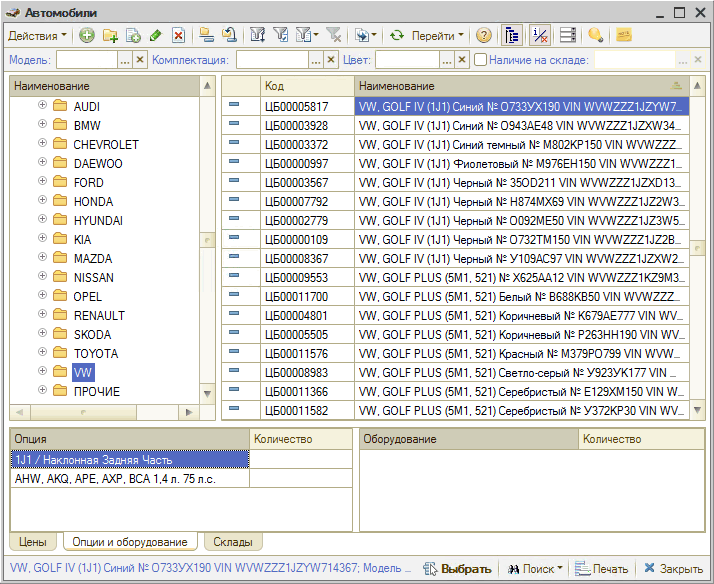

**Кнопки панели управления:**

| Кнопка | Описание |
| --- | --- |
|  | Добавить: создать новую карточку автомобиля |
|  | Добавить группу: создать папку для группировки списка |
|  | Добавить новый элемент копированием |
|  | Изменить текущий элемент |
|  | Установить пометку удаления |
|  | Включить/отключить иерархический просмотр |
|  | Переместить элемент в другую группу |
|  | Фильтры и отборы |
|  | Ввести на основании |
|  | Обновить текущий список |
| 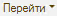 | Перейти к связанной информации |
|  | Отобразить/скрыть панель информации |
|  | *Рекомендации* по автомобилю |
|  | Поиск по справочнику |

## Карточка автомобиля

**Описание полей карточки автомобиля:**

| Поле | Содержимое |
| --- | --- |
| Параметры автомобиля | Указывается [модель автомобиля](../Модели%20автомобилей%20и%20другие%20справочники/modeli-avtomobiley-i-drugie-spravochniki.md) и вариант его *комплектации*. Значения выбираются из справочников «Модели автомобилей» и «Варианты комплектации» соответственно. Введенные значения автоматически отображаются в наименовании автомобиля |
| VIN | Идентификационный номер автомобиля. Автоматически отображается в наименовании автомобиля. При заполнении этого поля происходит проверка на ввод недопустимых символов. Допустимыми символами считаются цифры и латинские буквы. Также можно установить ограничения ввода запрещенных символов, список которых устанавливается правом «Контроль ввода запрещенных символов VIN» (группа прав «Справочники»). Данное право хранит строку запрещенных символов для VIN.  Запрещенные символы вводятся строкой без дополнительных разделителей. В случае наличия недопустимых символов в VIN автомобиля пользователю выдается служебное сообщение об этом |
| Кнопка «Расшифровать а/м»  | По кнопке осуществляется переход в обработку «Идентификация автомобилей», где можно [расшифровать автомобиль](https://5systems.ru/help/rasshifrovka-avtomobilya-po-vin) при помощи TecDoc и онлайн-каталога |
| Оригинал. VIN | VIN-код автомобиля назначенный производителем. Реквизит не обязателен для заполнения |
| Гос. номер, Год выпуска, Пробег, № кузова, № двигателя, № шасси, ПТС/СРТС | В этих полях отображаются регистрационные и текущие данные автомобиля |
| Кнопка «Расшифровать а/м по гос.номеру»  | Нажатием на кнопку с эмблемой ГИБДД осуществляется [расшифровка автомобиля по гос.номеру](https://5systems.ru/help/integraciya-s-bazoy-gibdd). Данные отображаются на вкладке «Комментарий». *Функционал доступен при условии настроенной интеграции с базой ГИБДД, каждый запрос платный* |
| Владелец | [Контрагент](../../Работа%20с%20клиентами/Контрагенты%20и%20контакты/kontragenty-i-kontakty.md), которому принадлежит автомобиль. Выбирается из справочника «Контрагенты и контакты». Для автомобилей, принадлежащих предприятию, этот реквизит не заполняется |
| Цвет | Цвет автомобиля по классификации ГИБДД. Выбирается из справочника «Цвета» |
| Код цвета | Код цвета автомобиля по классификации производителя |
| Наименование | Наименование автомобиля |
| Полное наименование | Полное наименование автомобиля |

**Кнопка-ссылка «Файлы и картинки»**

При нажатии на ссылку открывается форма списка файлов и картинок, прикрепленных к карточке автомобиля.

**Кнопка-ссылка «Ввести ПТС»**

С помощью ссылки «Ввести ПТС» можно создать «Паспорт транспортного средства» для автомобиля.

### Вкладки

1. **Вкладка «Дополнительно»**

   - *Кузов* — тип кузова;
   - *Двигатель* — тип двигателя;
   - *КПП* — тип КПП;
   - *Салон* — тип салона.

   Определяются по варианту комплектации автомобиля.

2. **Вкладка «Доверенные лица»**

   Список доверенных лиц и список подтверждающих документов:

   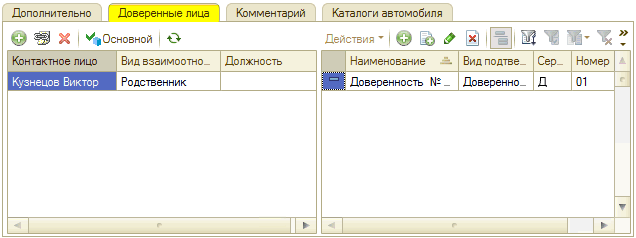

3. **Вкладка «Комментарий»**

   На вкладке может быть введена любая текстовая информация. Сюда подгружаются данные из каталога ГИБДД при расшифровке автомобиля по гос.номеру:

   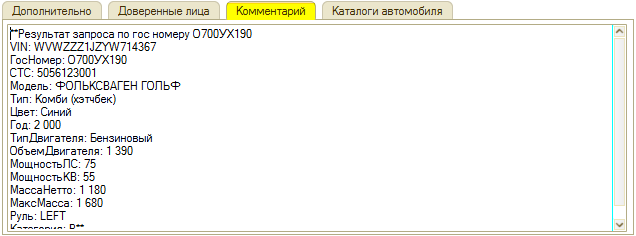

4. **Вкладка «Каталоги автомобиля»**

   На данной вкладке отображаются данные по сделанным ранее и сохраненным расшифровкам автомобиля в TecDoc и онлайн-каталогах: каталог, модель, комплектация (модификация) автомобиля.

   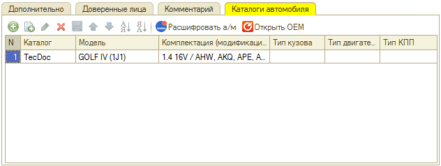

### Способы перехода в карточку автомобиля в программе

#### 1. Из Сделки

При нажатии на наименование автомобиля в [Сделке](../../CRM/Работа%20со%20сделкой/rabota-so-sdelkoy.md) появляются кнопки «Выбрать», «Очистить» и «Показать»:

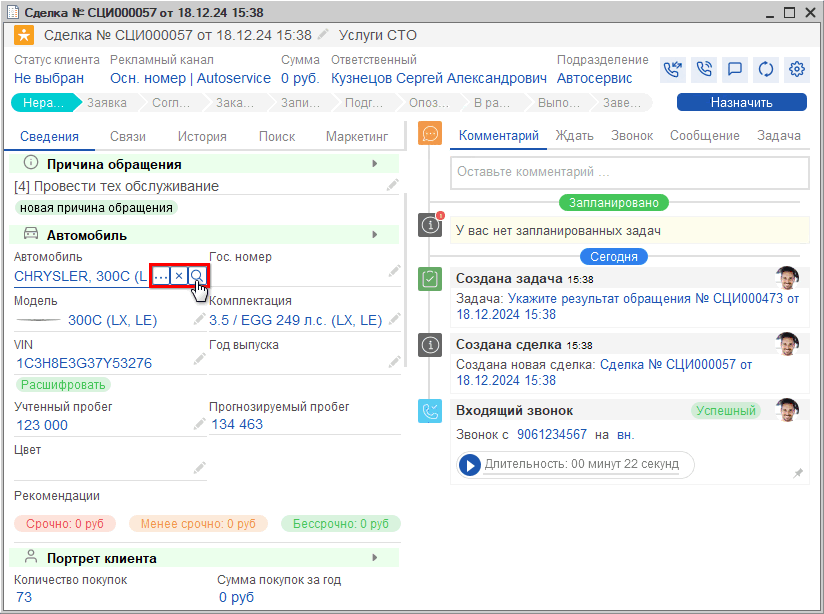

Кнопка «Показать»  открывает карточку автомобиля. Кнопка «Выбрать»  открывает справочник «Автомобили».

Справочник «Автомобили» открывается с отбором по текущему клиенту.

#### 2. Из АРМ Клиенты и автомобили

В [АРМ «Клиенты и автомобили»](../../Работа%20с%20клиентами/Работа%20в%20АРМ%20Клиенты%20и%20автомобили/rabota-v-arm-klienty-i-avtomobili.md) можно найти имеющийся в базе автомобиль по VIN-номеру или гос. номеру и открыть карточку автомобиля двойным кликом по нужной строке в списке автомобилей (список автомобилей выводится по клиенту, выделенному в области «Список клиентов»):

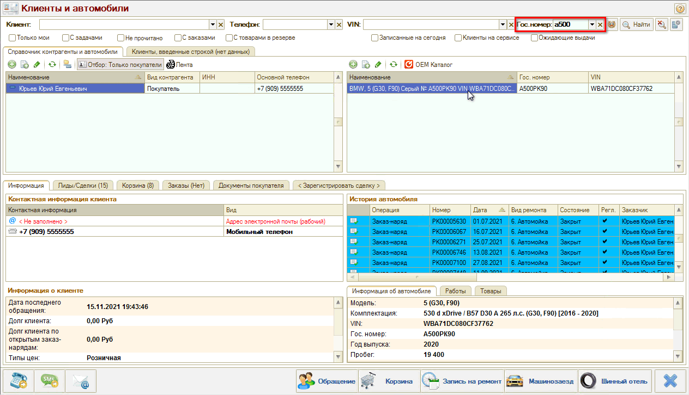

#### 3. Из АРМ «Корзина»

Открыть карточку автомобиля или перейти в справочник для выбора другого автомобиля клиента можно из [АРМ «Корзина»](../../Проценка%20запчастей%20и%20работ/Работа%20в%20АРМ%20Корзина/rabota-v-arm-korzina.md) нажатием на кнопки «Выбрать» или «Открыть» в параметре «Автомобиль»:

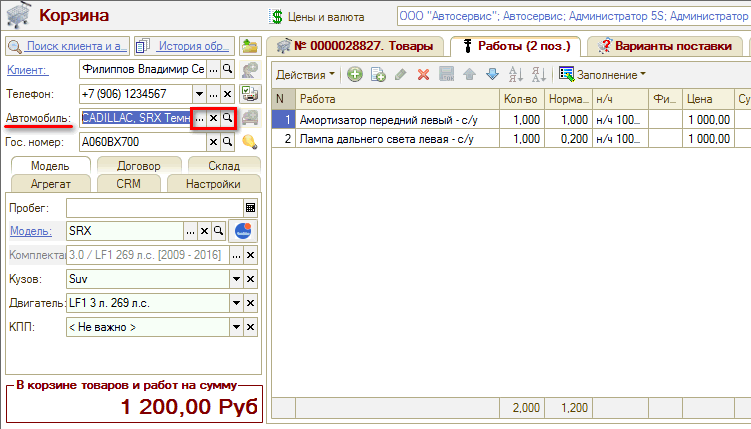

#### 4. Из АРМ «Запись на ремонт»

Из [АРМ «Запись на ремонт»](../../Запись%20на%20ремонт/Календарь%20для%20планирования%20работ/kalendar-dlya-planirovaniya-rabot.md) можно перейти в справочник «Автомобили» по кнопке «Выбрать» в параметре «Автомобиль»:

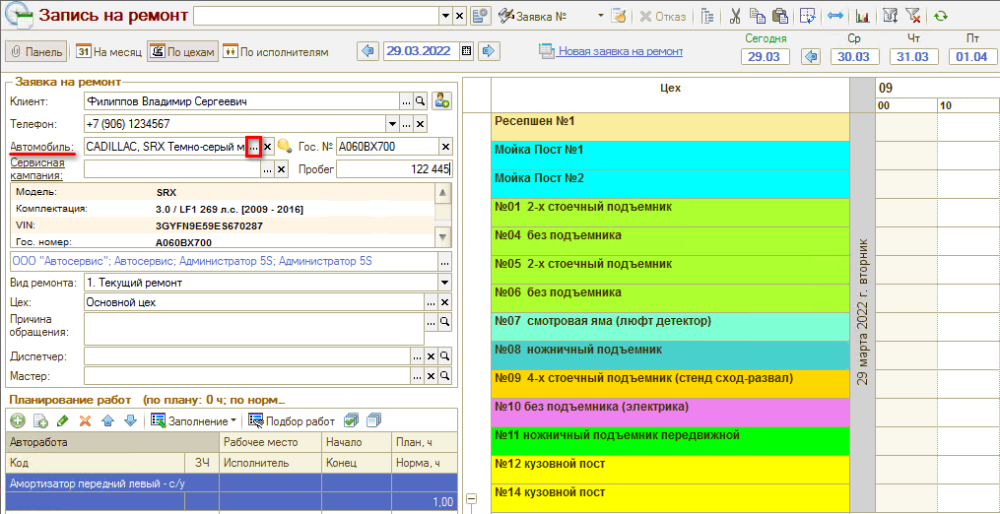

#### 5. Из карточки клиента

Открыть автомобиль из [карточки клиента](../../Работа%20с%20клиентами/Контрагенты%20и%20контакты/kontragenty-i-kontakty.md) можно кнопкой «Открыть карточку автомобиля» в поле «Информация об автомобиле»:

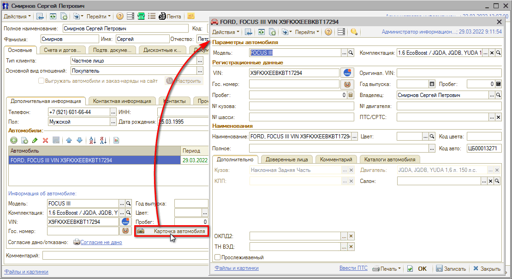

#### 6. Из документов

Из документов «Заявка на ремонт», «[Заказ-наряд](https://5systems.ru/help/zakaz-naryady)», «Заказ покупателя» карточка автомобиля и справочник «Автомобили» открываются кнопками «Выбрать» и «Открыть» в параметре «Автомобиль»:

### Добавление автомобиля в базу

#### 1. Из АРМ Клиенты и автомобили

В [АРМ «Клиенты и автомобили»](../../Работа%20с%20клиентами/Работа%20в%20АРМ%20Клиенты%20и%20автомобили/rabota-v-arm-klienty-i-avtomobili.md) можно найти имеющийся в базе автомобиль, зарегистрированный на определенного клиента. Если автомобиль не найден в программе по VIN или гос. номеру, то можно создать карточку автомобиля по кнопке «Добавить» в области «Список автомобилей» и заполнить данные:

#### 2. Из Сделки

Для того, чтобы создать карточку автомобиля из Сделки, требуется в строке «Автомобиль» нажать на карандаш:

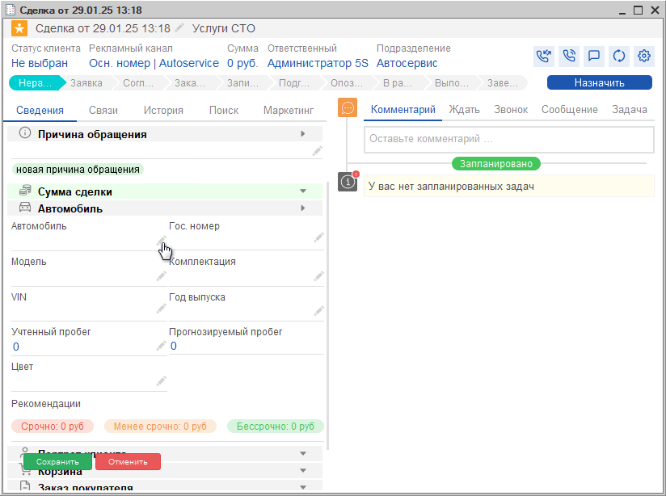

затем нажать кнопку выбора  и выбрать тип данных «Автомобили»:

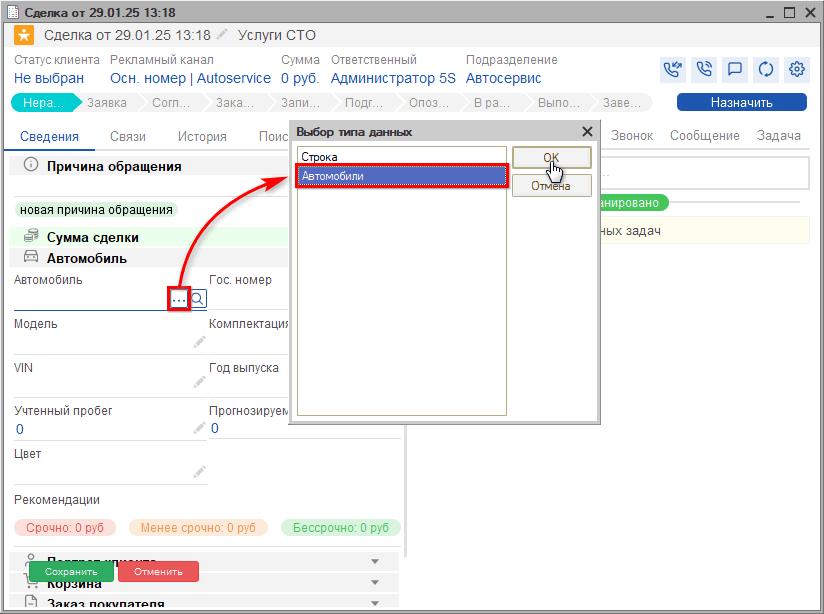

После этого снова нажать кнопку «Выбрать» — при этом открывается справочник «Автомобили»:

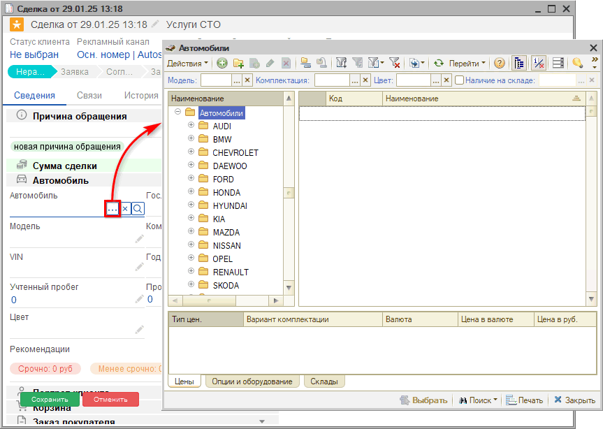

*Примечание:* Справочник открывается с отбором по текущему клиенту; т.к. клиент в примере первичный, у него еще нет ни одного автомобиля.

В справочнике необходимо добавить новую карточку автомобиля — см. далее.

#### 3. Из справочника «Автомобили»

В справочнике «Автомобили» следует создать новый элемент, т.е. карточку автомобиля, нажатием на кнопку «Добавить»:

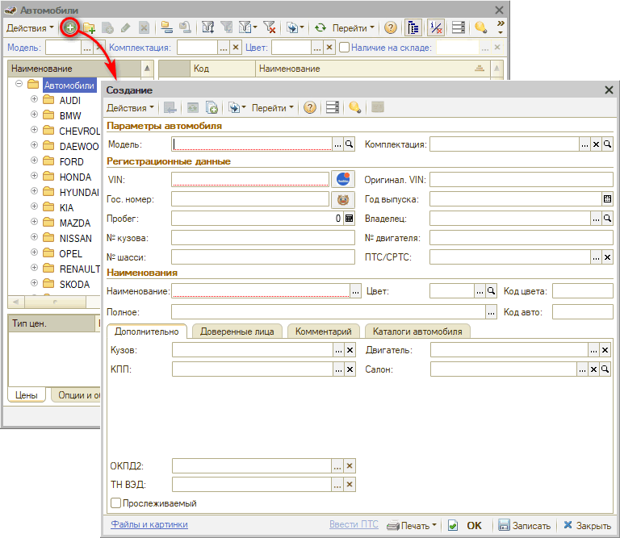

Далее необходимо заполнить все поля карточки автомобиля вручную на основе карточки СТС, либо при помощи инструментов [расшифровки автомобиля по VIN](https://5systems.ru/help/rasshifrovka-avtomobilya-po-vin) или [по гос. номеру](https://5systems.ru/help/integraciya-s-bazoy-gibdd).

#### 4. Из АРМ Корзина

Можно создать новый автомобиль из Корзины, нажав кнопку «Зарегистрировать новый автомобиль»:

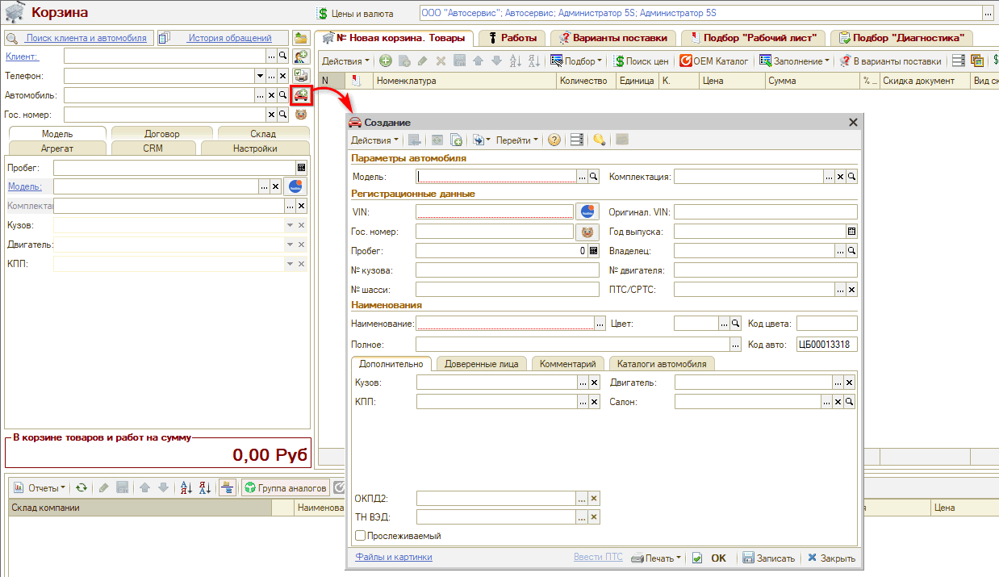

#### 5. Из Заказ-наряда

При создании Заказ-наряда на основании Заявки на ремонт, *если автомобиль был введен строкой,* открывается диалоговое окно, из которого можно создать карточку автомобиля нажатием на кнопку «Открыть форму ввода автомобиля»:

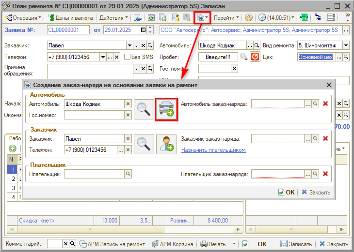

---

**Теги:** автомобили, справочник, карточка автомобиля, VIN, расшифровка автомобиля, добавление автомобиля

