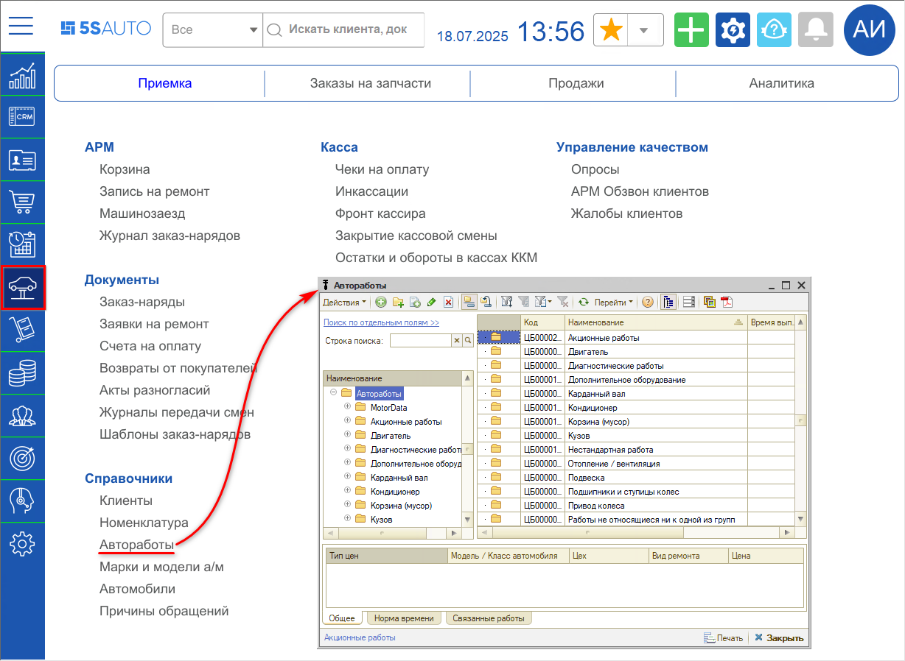
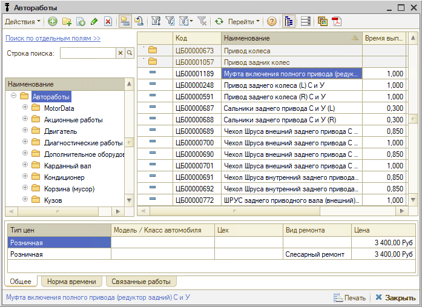
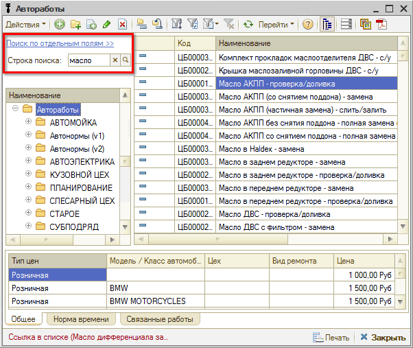
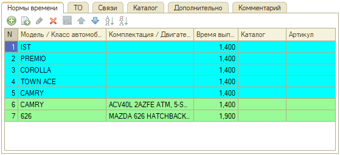
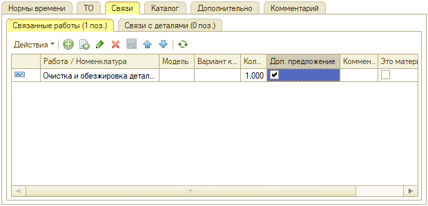
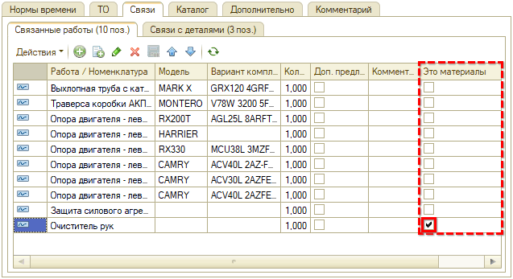
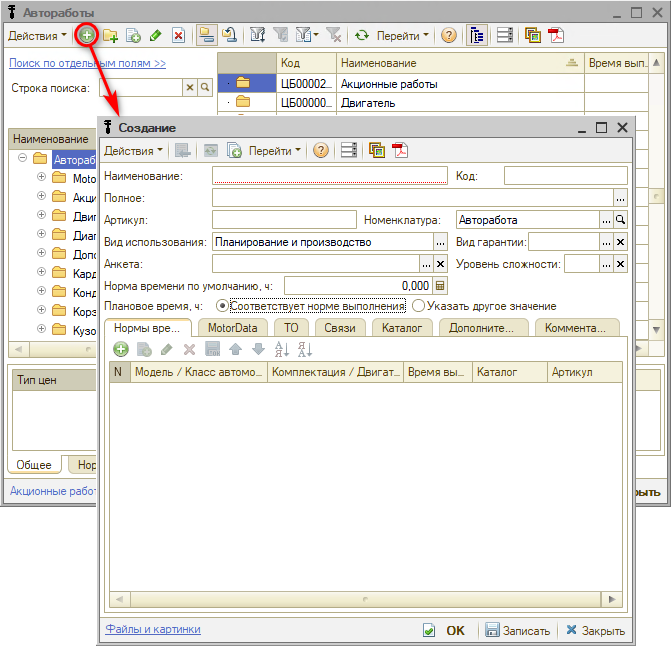
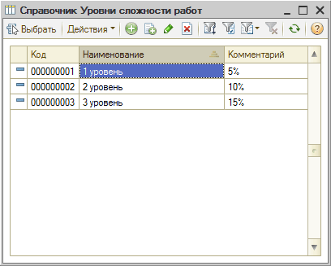
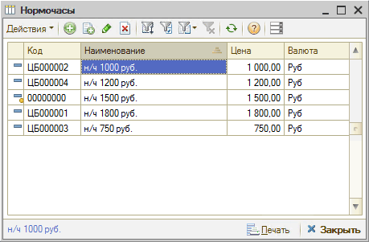
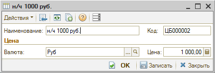

# Автоработы

<table><tr><td><b>Время чтения:</b> 12 мин.</td><td><b>Обновлено:</b> 17.07.2025</td></tr></table>

Источник: https://www.5systems.ru/help/avtoraboty-0

## Содержание

- [Справочник Автоработы](#справочник-автоработы)
  - [Способы перехода в справочник «Автоработы»](#переход-в-справочник-автоработы)
  - [Работа со справочником](#работа-со-справочником)
  - [Поиск по справочнику](#поиск-по-справочнику)
- [Карточка автоработы](#карточка-автоработы)
  - [Описание полей карточки автоработы](#описание-полей-карточки-автоработы)
  - [Вкладки карточки автоработы](#вкладки-карточки-автоработы)
- [Как добавить автоработу](#как-добавить-автоработу)
- [Уровень сложности работы](#уровень-сложности-работы)
- [Нормочасы](#нормочасы)
- [Подбор авторабот в программе](#подбор-авторабот-в-программе)

## Справочник Автоработы

Справочник «Автоработы» содержит перечень всех авторемонтных работ, производимых компанией.

### Переход в справочник «Автоработы»

Переход в справочник «Автоработы» производится через меню интерфейса *Автосервис → Приемка → Справочники → Автоработы:*

### Работа со справочником

**Кнопки панели управления**

| Кнопка | Описание |
| --- | --- |
|  | Добавить: создать новую автоработу. |
|  | Добавить группу: создать папку для группировки списка. |
|  | Добавить новый элемент копированием. |
|  | Изменить текущий элемент. |
|  | Установить пометку удаления. |
|  | Включить/отключить иерархический просмотр. |
|  | Переместить элемент в другую группу. |
|  | Фильтры и отборы. |
|  | Ввести на основании. |
|  | Обновить текущий список. |
|  | Перейти к связанной информации. |
|  | Прикрепление файла с картинкой. |
|  | Прикрепление файла с описанием. |

### Поиск по справочнику

Для поиска по справочнику авторабот можно переключиться на режим поиска по отдельным полям или искать по одному полю.

**Вариант 1. Поиск одним полем**

В строку поиска нужно ввести искомое значение, нажать [Enter] или кнопку с лупой: в списке останутся только позиции, содержащие в артикуле или наименовании введенные символы.

**Вариант 2. Поиск по отдельным полям**

Можно вести поиск отдельно каталожным номерам или наименованию авторабот.

## Карточка автоработы

### Описание полей карточки автоработы

| Поле | Содержимое |
| --- | --- |
| Наименование | Наименование автоработы. |
| Полное | Полное наименование автоработы. |
| Код | Код автоработы. |
| Артикул | № автоработы по каталогу. |
| Номенклатура | Выбирается из справочника «[Номенклатура](https://5systems.ru/help/nomenklatura-0)». Базовая номенклатура автоработы с параметрами для задания ставок налогов. |
| Вид использования | Вид использования авторабот. Выбирается из списка: - *Планирование* — работы, которые будут использоваться исключительно для планирования при записи на ремонт, но не должны включаться на вкладку «Работы» заявки и заказ-наряда. Отображаются на вкладке «Планирование» заявки на ремонт. - *Производство* — работы, которые не используются для планирования, включаются на вкладку «Работы» заявки и заказ-наряда. - *Планирование и производство* — работы, которые могут использоваться как для планирования, так и быть включенными в заказ-наряд. Такие работы будут отображаться как на вкладке «Планирование», так и на вкладке «Работы» документа «Заявка на ремонт». |
| Анкета | Диагностическая анкета. Параметр заполняется при работе с функционалом «[Диагностические анкеты](../../Проценка%20запчастей%20и%20работ/Диагностические%20анкеты/diagnosticheskie-ankety.md)»: для использования анкеты создается специальная авторабота и устанавливается ее связь с анкетой. |
| Вид гарантии | Выбор значения из справочника «[Виды гарантии](https://5systems.ru/help/garantiynaya-politika)» → Автоработы. |
| Уровень сложности | Выбор *уровня сложности* работ из соответствующего справочника, который предварительно нужно заполнить. Уровни сложности работ влияют на начисление заработной платы исполнителей. В отчетах возможно смотреть выработку по разным уровням сложности. |
| Норма времени по умолчанию | Общая норма времени выполнения работ. Это значение будет подставляться по умолчанию для всех моделей автомобилей.  В табличной части «Нормы времени» могут быть указаны исключения — другое время работ для особых случаев. |

### Вкладки карточки автоработы

**1. Нормы времени**

На вкладке «Нормы времени» отображается норма времени выполнения автоработы в часах для автомобилей выбранного класса.

Если класс автомобиля не задан, то значение общего параметра «Норма времени по умолчанию» действует для всех классов автомобилей.

**2. ТО**

Вкладка «ТО» используется для авторабот, которые относятся к категории техобслуживания, т.е. выполняется регулярно, и может использоваться для настройки автоматической рассылки [приглашений на ТО](../../CRM/Приглашения%20на%20ТО/priglasheniya-na-to.md).

Для использования функционала требуется поставить галочку «Эта работа выполняется регулярно (техническое обслуживание)» и задать пробег и интервал обслуживания. В таблице можно задать параметры для определенных [моделей](../Модели%20автомобилей%20и%20другие%20справочники/modeli-avtomobiley-i-drugie-spravochniki.md).

**3. Связи**

Вкладка «Связи» включает два раздела: «Связанные работы» и «Связи с деталями».

*1) Связанные работы*

На вкладке «Связанные работы» отображается список работ, связанных с текущей автоработой:

*Примечание:* Признак «Доп. предложение» на данной вкладке может быть использован для информации. Для установки связей с целью вывода дополнительных предложений в Корзине при работе с применяемостью используется специальный механизм — подробнее см. статью «[Работа с применяемостью](https://www.5systems.ru/help/rabota-s-primenyaemostyu#svyaz_s_rab_detali)».

Также есть возможность добавить материалы по данной автоработе для последующей автоподстановки в Заказ-наряды — для этого необходимо в строке с добавленной номенклатурой установить признак **«Это материалы»** (подробнее см. в статье [Работа с расходными материалами](../Работа%20с%20расходными%20материалами/rabota-s-raskhodnymi-materialami.md#автоматическое-заполнение-расходных-материалов-включенных-в-работу)):

*2) Связи с деталями*

На вкладке «Связи с деталями» отображается перечень номенклатуры, связанной с текущей автоработой.

**4. Каталог**

Данная вкладка используется для установки связи с каталогами, например с внешним каталогом услуг для настройки интеграции с веб-приложением 5S Link — подробнее см. в статье «[Настройка каталога услуг](https://www.5systems.ru/help/nastroyka-kataloga-uslug)»:

**5. Дополнительно**

На данной вкладке собраны дополнительные настройки:

*Примечание:* Признак «Это доп. предложение» на данной вкладке может быть использован для информации. Для установки связей с целью вывода дополнительных предложений в Корзине при работе с применяемостью используется специальный механизм — подробнее см. статью «[Работа с применяемостью](https://www.5systems.ru/help/rabota-s-primenyaemostyu#svyaz_s_rab_detali)».

**6. Комментарий**

На вкладке «Комментарий» может быть введена произвольная текстовая информация.

## Как добавить автоработу

Для того, чтобы создать в программе новую автоработу, требуется перейти в справочник «Автоработы» (например, из заказ-наряда), выбрать группу и нажатием на кнопку добавить новый элемент.

В новой карточке автоработы требуется заполнить все необходимые параметры:

- Наименование автоработы: при задании наименований авторабот рекомендуется соблюдать единообразие в наименованиях;
- Вид использования: рекомендуемый — Планирование и производство;
- Анкета — если авторабота создается для использования диагностической анкеты, то в данном поле необходимо указать нужную анкету;
- Уровень сложности работы — выбрать из заранее заполненного справочника;
- Вид гарантии: если вид гарантии указан на группу работ, то в карточке каждой отдельной автоработы можно его не указывать;
- Норма времени по умолчанию — норма времени для данной автоработы; в случае если для разных марок и моделей автомобилей норма времени для этой работы отличается — требуется заполнить таблицу на вкладке «Нормы времени».

## Уровень сложности работы

Уровни сложности работ добавляются в соответствующий справочник. Они влияют на начисление заработной платы исполнителей. В отчетах возможно смотреть выработку по разным уровням сложности.

Варианты создания системы уровней:

- Легкая-Средняя-Сложная,
- 1-2-3-4…,
- A-B-C-D-E, и т.д.

## Нормочасы

Справочник «Нормочасы» служит для хранения данных о стоимости нормочасов выполнения работ.

Стоимость единицы времени выполнения различных работ может быть различной, она может задаваться в рублях или в другой валюте.

Место расположения справочника в меню программы: *Справочники → Автосервис → Нормочасы*.

Справочник «Нормочасы»:

Карточка нормочаса:

## Подбор авторабот в программе

Подбор авторабот может производиться в различных местах системы:

**1. В АРМ Корзина**

См. статью «[Работа в АРМ Корзина](../../Проценка%20запчастей%20и%20работ/Работа%20в%20АРМ%20Корзина/rabota-v-arm-korzina.md)» и видеоурок «[Как подбирать автоработы в АРМ Корзина](../../Проценка%20запчастей%20и%20работ/Как%20подбирать%20автоработы%20в%20АРМ%20Корзина/kak-podbirat-avtoraboty-v-arm-korzina.md)».

**2. В АРМ Запись на ремонт**

См. раздел «[Календарь для планирования работ](../../Запись%20на%20ремонт/Календарь%20для%20планирования%20работ/kalendar-dlya-planirovaniya-rabot.md)» и видеоурок «[Как подобрать автоработы из АРМ Запись на ремонт](../../Запись%20на%20ремонт/Как%20подобрать%20автоработы%20из%20АРМ%20Запись%20на%20ремонт/kak-podobrat-avtoraboty-iz-arm-zapis-na-remont.md)».

**3. В документе Заявка на ремонт**

**4. В Заказ-наряде**

См. статью «[Заказ-наряды](https://5systems.ru/help/zakaz-naryady)» и видеоурок «[Как добавить работы в Заказ-наряд](https://5systems.ru/help/kak-dobavit-raboty-v-zakaz-naryad)».

---

**Теги:** автоработы, справочник, нормы времени, нормочасы, уровень сложности, подбор работ

