

# Виды ремонта

<table><tr><td><b>Время чтения:</b> 10 мин.</td><td><b>Обновлено:</b> 15.06.2026</td></tr></table>

Источник: https://www.5systems.ru/help/vidy-remonta

## Содержание

- [Введение](#введение)
- [Настройка](#настройка)
  - [Справочник «Виды ремонта»](#справочник-виды-ремонта)
  - [Карточка Вида ремонта](#карточка-вида-ремонта)
    - [Основные реквизиты](#основные-реквизиты)
    - [Дополнительные реквизиты](#дополнительные-реквизиты)
    - [Вкладки](#вкладки)
- [Использование](#использование)
  - [В документах](#в-документах)
  - [В ценообразовании](#в-ценообразовании)

## Введение

Вид ремонта устанавливается в Заявке на ремонт и Заказ-наряде из предварительно заполненного справочника.

В разрезе видов ремонта возможен анализ работы сервиса: можно делать определенные отборы в отчетах по видам ремонта. Выработка исполнителям начисляется согласно настройке, определенной в виде ремонта (реквизит «Выработка»).

Есть возможность задать стоимость нормочаса в зависимости от вида ремонта (в документе Изменение цен авторабот).

## Настройка

### Справочник «Виды ремонта»

Расположение справочника — *Администрирование → Компания → Автосервис → Виды ремонта* или в стандартном меню *Справочники → Автосервис → Виды ремонта:*

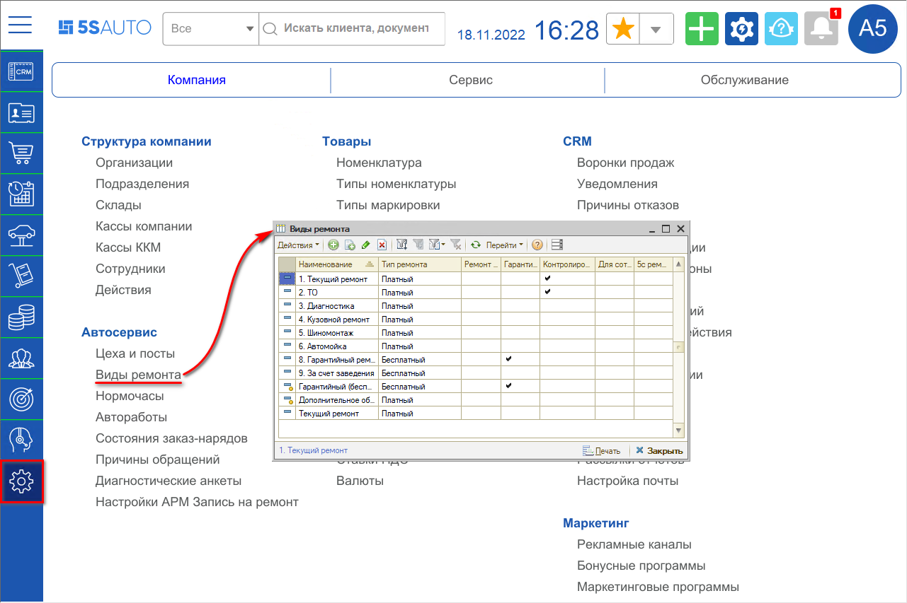

Справочник «Виды ремонта» заполняется пользователем самостоятельно. Количество возможных видов ремонта не ограничено, однако рекомендуется не злоупотреблять чрезмерным расширением данного справочника.

Главное отличие видов ремонта — это тип: платный или бесплатный.

Бесплатный тип ремонта обычно выбирается для гарантийного ремонта (в случае если поломка попадает под гарантийный период), либо для ремонта «за счет заведения» (если такой вид предусмотрен политикой автосервиса), а также может быть установлен для «внутреннего ремонта» (т.е. когда ремонтируются собственные или арендованные автосервисом автомобили).

При выборе бесплатного вида ремонта не делается движений по взаиморасчетам и не формируется доход организации (т.е. компания берет его себе на затраты).

### Карточка Вида ремонта

#### Основные реквизиты

При создании нового вида ремонта первым делом следует задать наименование и выбрать тип ремонта:

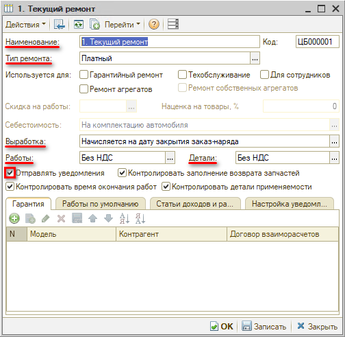

#### Дополнительные реквизиты

**1. «Используется для»:**

**1)** признак *«Ремонт агрегатов»* используется при работе с механизмом [Учет агрегатного ремонта](https://5systems.ru/help/uchet-agregatnogo-remonta);

**2)** признак *«Для сотрудников»* активирует параметры «Скидка на работы» и «Наценка на товары» с целью настройки отдельного ценообразования для сотрудников компании:

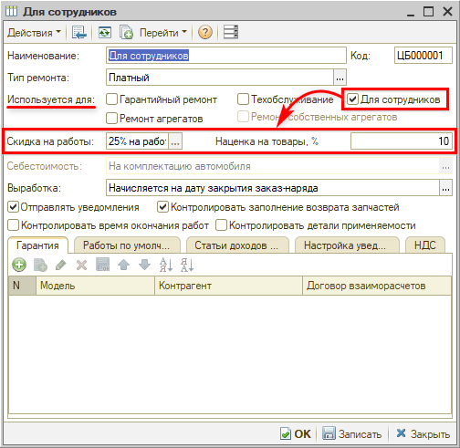

**Примечания:**

- Доступ к настройке вида ремонта с признаком «Для сотрудников», а также возможность закрывать заказ-наряды, в которых выбран вид ремонта с данным признаком, активируется *правом «Разрешить закрывать заказ-наряды для сотрудников» (5с319).* Если право установлено в значение «Нет», признак «Для сотрудников» в настройках вида ремонта будет заблокирован для редактирования;
- Автомобиль сотрудника должен быть добавлен в *регистр сведений «Автомобили сотрудников»* с отметкой *«Разрешено использовать автомобиль».* Без этого не получится провести заказ-наряд с видом ремонта «Для сотрудников»;
- Скидка *для работ* должна быть *только с видом начисления «На строку»;*
- Проверить изменение стоимости работ и товаров в документе в соответствии с параметрами, заданными в виде ремонта для сотрудников, можно при переводе заказ-наряда в состояние «Выполнен»;
- Признак «Для сотрудников» может быть установлен *только в одном виде ремонта.*

**3)** признак *«Гарантийный ремонт»:* нужен для совместимости с типовым функционалом «Альфа-Авто», может использоваться в учете дилерских центров (когда требуется произвести гарантийный ремонт за счет автопроизводителя). На логику поведения программы 5S AUTO данный флаг не влияет;

**4)** признак *«Техобслуживание»* оставлен для совместимости с типовым функционалом «Альфа-Авто». На логику поведения программы 5S AUTO данный флаг также не влияет.

**2. «Себестоимость»:**

Реквизит оставлен для совместимости с типовым функционалом «Альфа-Авто», может использоваться для учета установки дополнительного оборудования на автомобиль в модуле «Автосалон» (для увеличения стоимости автомобиля).

**3. Как начисляется выработка:**

- Начисляется на дату закрытия заказ-наряда;
- Начисляется на дату окончания работ по заказ-наряду.

Способ начисления выработки на дату окончания работ по заказ-наряду выбирается в случае, если система оплаты труда предполагает выплату заработной платы до поступления оплаты от клиента по заказ-наряду.

**4.** Важно в настройках вида ремонта задать **признак ставок НДС** на товары и работы. Если автосервис работает без НДС, нужно во всех видах ремонта выбрать настройку работ и деталей «Без НДС». Если на услуги НДС не начисляется, а на товары начисляется, соответственно, установить работы «Без НДС», детали — «С НДС».

**5.** При отметке **«Отправлять уведомления»** появляется вкладка «Настройка уведомлений» (см. ниже: раздел «*Вкладки п.4*»):

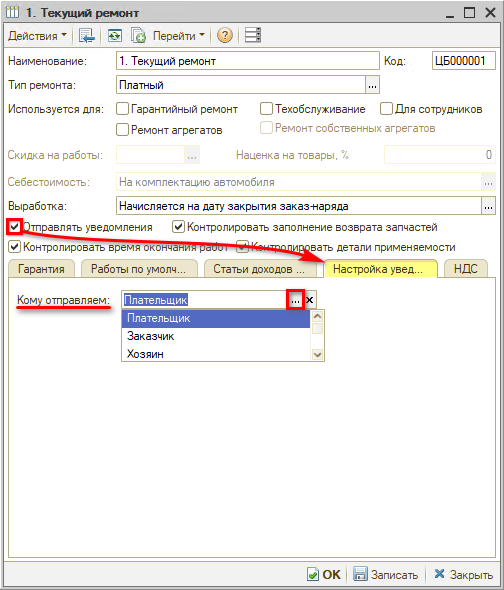

**6.** Флаг **«Контролировать заполнение возврата запчастей»**: устанавливает контроль заполнения возврата замененных запчастей клиенту при оформлении Заявки на ремонт (выйдет предупреждение от программы, если не заполнить).

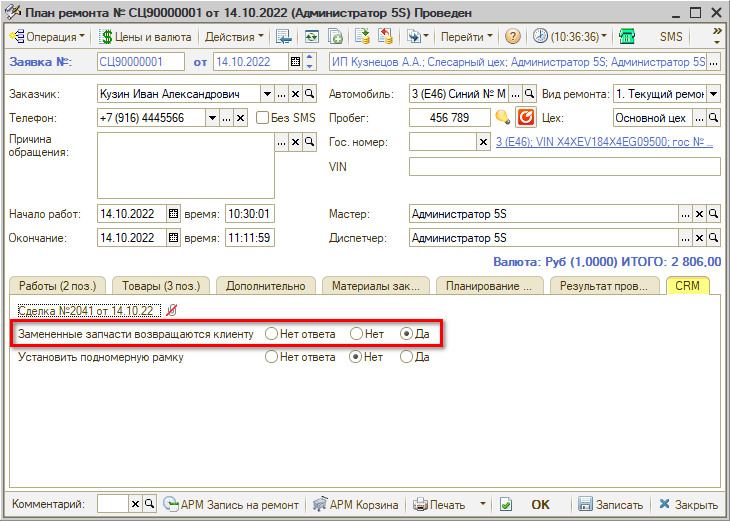

**7.** Флаг **«Контролировать время окончания работ»**: при переводе Заказ-наряда в состояние «Выполнен» выравнивается дата окончания работ в Заявке на ремонт — обрезается запланированное время работы и освобождается время для [Записи на ремонт](../../Запись%20на%20ремонт/Календарь%20для%20планирования%20работ/kalendar-dlya-planirovaniya-rabot.md).

**8.** Флаг **«Контролировать детали применяемости»** должен быть установлен для тех видов ремонта, по которым предусмотрена работа по *автозаполнению применяемости из заказ-наряда* — подробнее см. [статью](https://5systems.ru/help/avtozapolnenie-primenyaemosti-iz-zakaz-naryada) *(доступно начиная с релиза 2.6.1.1.).* При установке флага будет отображаться колонка «Деталь применяемости» в заказ-наряде в таблицах «Работы» и «Товары».

#### Вкладки

1. ***«Гарантия»:*** может использоваться в работе дилерских центров для подстановки плательщика в зависимости от марки автомобиля (тип ремонта платный).

   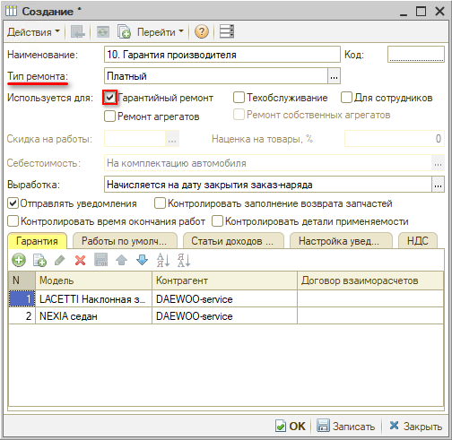

2. Во вкладке **«Работы по умолчанию»** можно добавить дополнительные работы для автозаполнения [Записи на ремонт](https://5systems.ru/help/rabota-v-arm-zapis-na-remont) при выборе этого вида ремонта:

   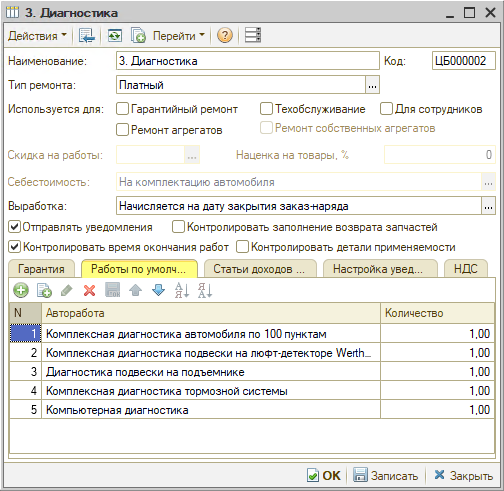

3. ***«Статьи доходов и расходов»:*** настраиваются статьи доходов и расходов, которые будут использоваться в Заказ-наряде.

   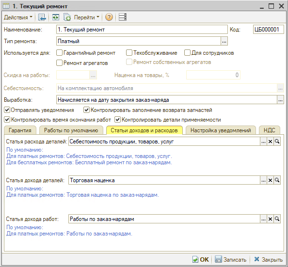

4. ***«Настройка уведомлений»:*** *«Кому отправляем» — Плательщик / Заказчик / Хозяин.*

   По умолчанию установлена отправка уведомлений плательщику. Однако в некоторых случаях плательщику отправлять уведомления не нужно.

   Например, внучка приехала отремонтировать по страховому случаю автомобиль, оформленный на бабушку. Таким образом, заказчик — внучка, плательщик — страховая компания, а владелец автомобиля — бабушка. Следовательно, для страхового вида ремонта рекомендуется создать отдельный элемент справочника и настроить отправку уведомлений *заказчику* ремонта:

   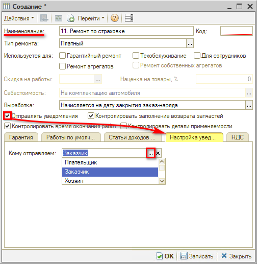

   *Примечание:* Для работы механизма должно быть настроено условие *отправки уведомлений по значимым событиям* (см. [Мастер настройки системы → Настройка отправки сообщений клиентам](https://5systems.ru/help/master-nastroyki-sistemy)): *Отправлять уведомления (Вид ремонта) = «Да»*.

   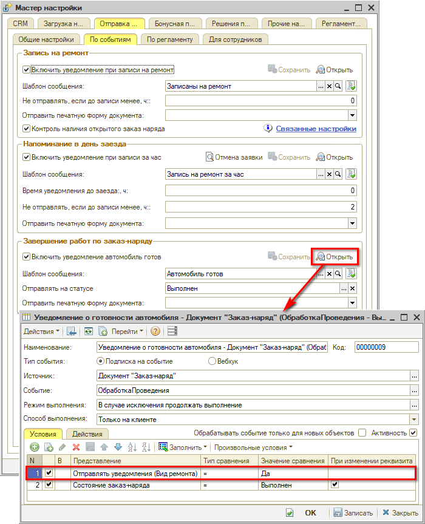

## Использование

### В документах

Вид ремонта выбирается в Заявке на ремонт:

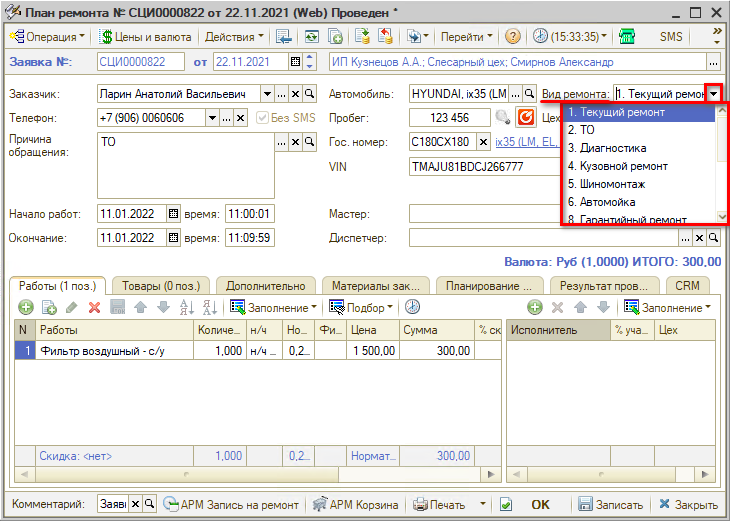

и в [Заказ-наряде](https://5systems.ru/help/zakaz-naryady):

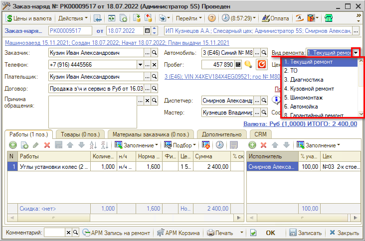

По умолчанию подтягивается вид «Текущий ремонт». В случае необходимости можно настроить пользователю другой вид ремонта по умолчанию через [Установку прав и настроек](https://5systems.ru/help/ustanovka-prav-i-nastroek-polzovatelya) — *Установка прав и настроек → Документы → Общие параметры документов → Ввод новых документов → Вид ремонта по умолчанию:*

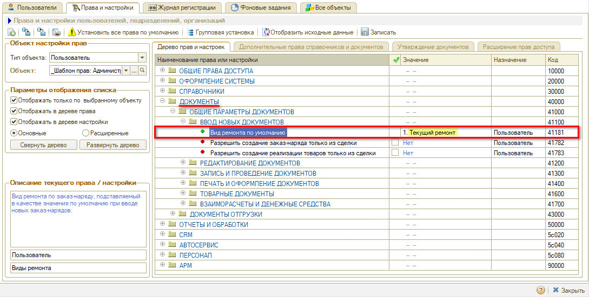

Выбранный здесь вид ремонта будет подгружаться у пользователя по умолчанию в создаваемые им документы.

Например, для работника автомойки можно установить вид ремонта по умолчанию «Автомойка».

### В ценообразовании

Есть возможность задать стоимость нормочаса в зависимости от вида ремонта (в документах Изменение цен авторабот). Для этого нужно создать на каждый вид ремонта документ «Установка цен авторабот компании» и настроить в нем вид ремонта:

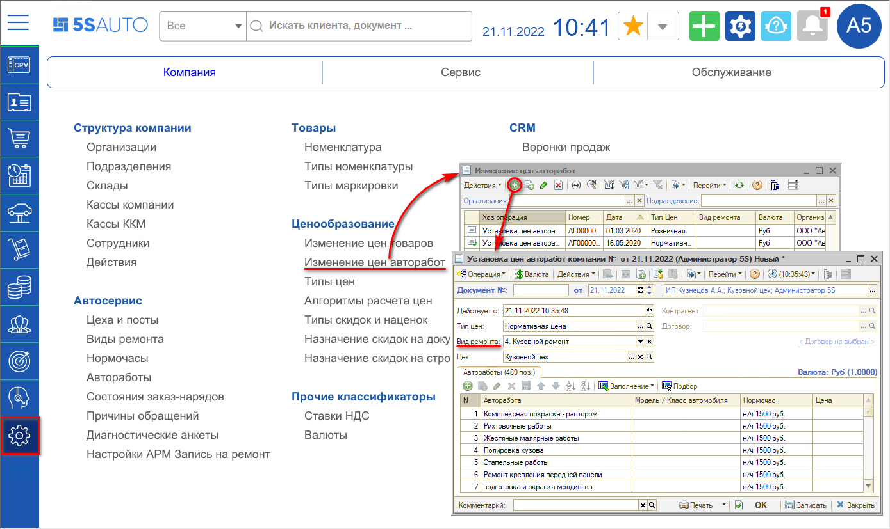

---

**Теги:** виды ремонта, гарантийный ремонт, платный ремонт, НДС, уведомления, выработка

