

# Гарантийная политика

<table><tr><td><b>Время чтения:</b> 16 мин.</td><td><b>Обновлено:</b> 14.06.2022</td></tr></table>

Источник: https://www.5systems.ru/help/garantiynaya-politika

## Содержание

- [Введение](#введение)
- [Общая гарантийная политика](#общая-гарантийная-политика)
- [Расширенная гарантийная политика](#расширенная-гарантийная-политика)
- [Предварительные настройки](#предварительные-настройки)
  - [Включение расширенной гарантийной политики](#включение-расширенной-гарантийной-политики)
  - [Настройка Видов гарантий](#настройка-видов-гарантий)
  - [Настройка Вида гарантии для Автоработы](#настройка-вида-гарантии-для-автоработы)
  - [Настройка Вида гарантии для Номенклатуры](#настройка-вида-гарантии-для-номенклатуры)
- [Видео по теме](#видео-по-теме)

## Введение

**Общая гарантийная политика** определяет гарантийную политику на все предоставляемые в Автосервисе работы и товары. Общая гарантийная политика отображается в Заказ-наряде и его печатной форме.

**Расширенная гарантийная политика** позволяет задавать вид гарантии на конкретные работы и товары, подобранные в Заказ-наряд. При этом в печатной форме Заказ-наряда отражаются на какие товары/работы какая гарантия распространяется.

## Общая гарантийная политика

В настройке (по подразделению) **ДОКУМЕНТЫ → ОБЩИЕ ПАРАМЕТРЫ ДОКУМЕНТОВ → ПЕЧАТЬ И ОФОРМЛЕНИЕ ДОКУМЕНТОВ → «Гарантии на ремонт»** (код 41481) заполняется текст гарантийной политики:

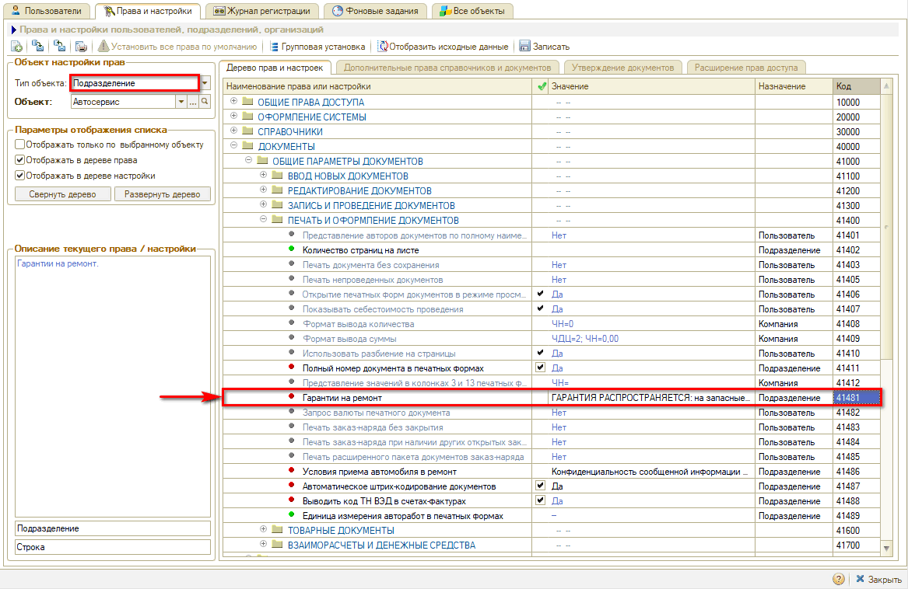

Текст из настройки «Гарантии на ремонт» отображается в Заказ-наряде:

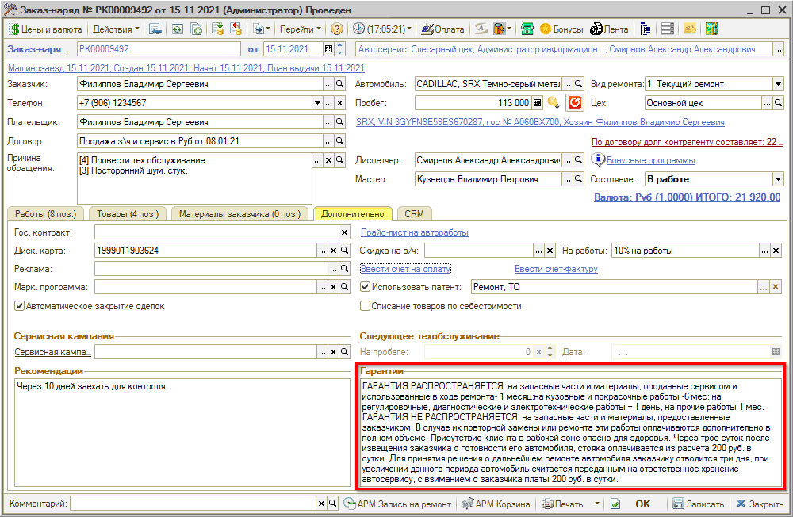

и в печатной форме Заказ-наряда:

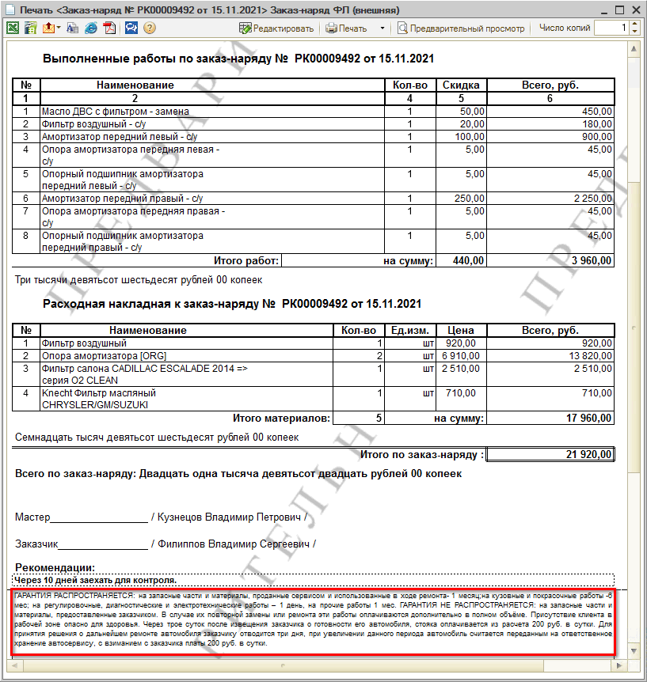

## Расширенная гарантийная политика

При включении ***расширенной гарантийной политики*** в табличной части «Работы» и «Товары» Заказ-наряда появляется колонка «Вид гарантии»:

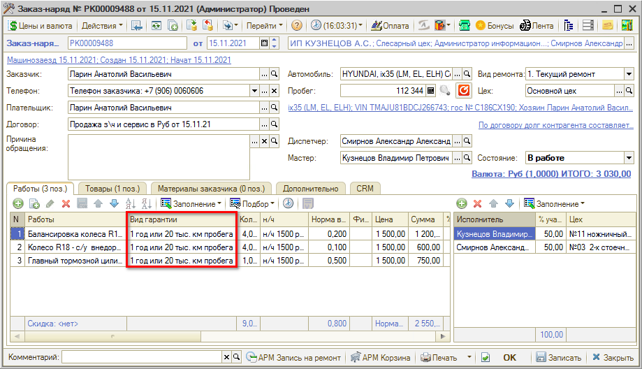

Значение в колонку *«Вид гарантии»* подставляется из преднастроенного справочника «Виды гарантии» вручную или автоматически, если для [*Автоработы*](../Автоработы/avtoraboty.md) или [*Номенклатуры*](../../Склад%20и%20запчасти/Номенклатура/nomenklatura.md) настроен параметр «Вид гарантии».

Для всех работ/товаров, для которых не указано значение в колонке «Вид гарантии», при записи документа по умолчанию подставляется предопределенное значение «Без гарантии» справочника «Виды гарантии».

В печатной форме Заказ-наряда по работам и товарам отражается информация о том, какой вид гарантии на них распространяется:

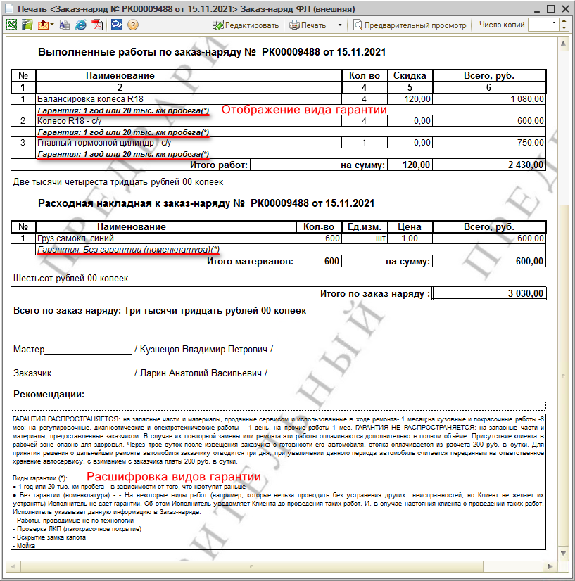

***Обратите внимание!*** В описании гарантийной политики отражается как описание из общей гарантийной политики (если оно задано в настройках), так и описание по видам гарантий, настроенным для товаров и работ в Заказ-наряде.

## Предварительные настройки

### Включение расширенной гарантийной политики

Расширенная гарантийная политика включается/отключается через Мастер настройки системы (меню интерфейса: **Администрирование → Сервис → Начальная настройка → Мастер настройки**) на вкладке «Прочие настройки»:

### Настройка Видов гарантий

Виды гарантий настраиваются в справочнике «Виды гарантии» (стандартное меню программы: **CRM → Все операции → Справочники → Виды гарантии**):

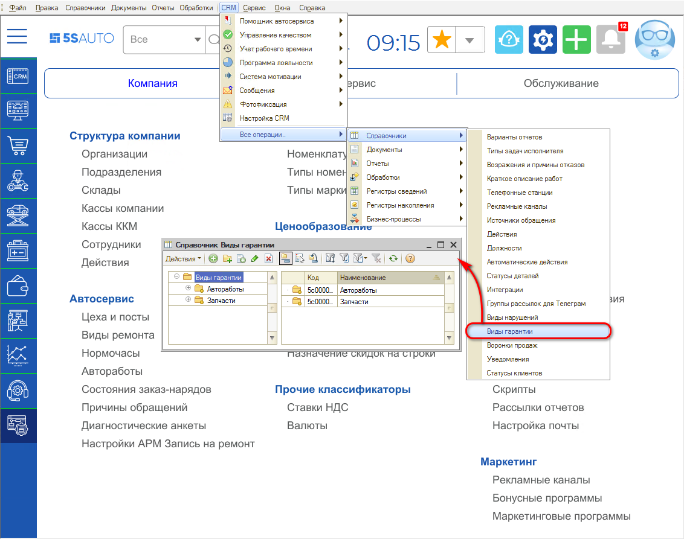

По каждому предполагаемому виду гарантии на автоработы и запчасти укажите наименование и описание:

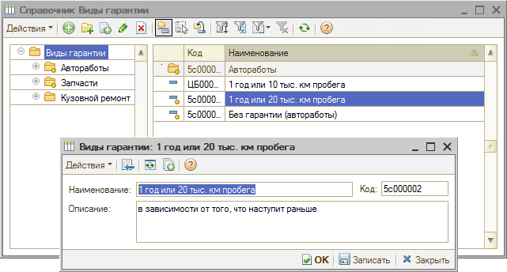

Описание вида гарантии отражается в печатной форме Заказ-наряда.

### Настройка Вида гарантии для Автоработы

Настройка Вида гарантии для авторабот производится через справочник «Автоработы» для группы или элемента.

**Настройка для группы авторабот**

Выберите в справочнике группу авторабот, нажмите кнопку «Изменить»  и выберите значение параметра «Вид гарантии»:

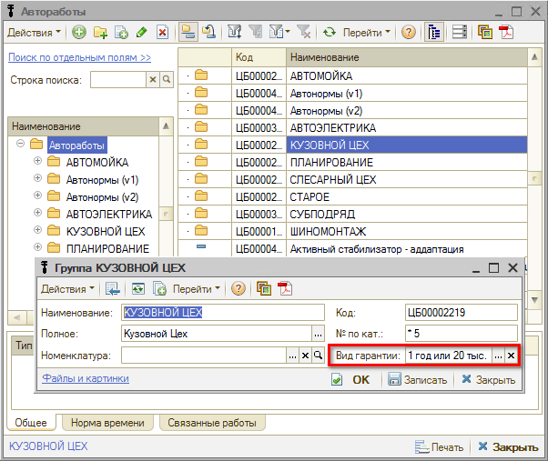

**Настройка в карточке автоработы**

Если требуется настроить вид гарантии на отдельные автоработы, откройте карточку автоработы и выберите вид гарантии в соответствующем поле:

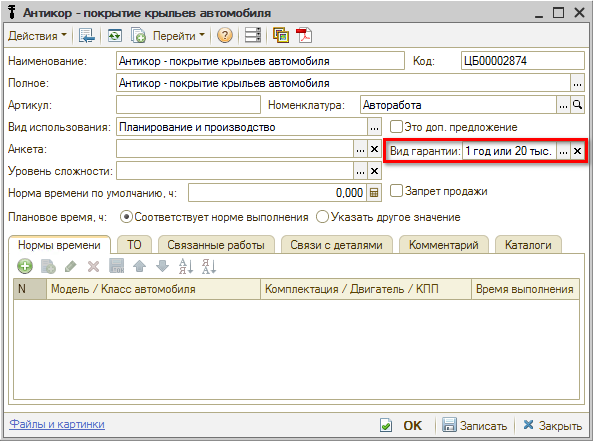

**Алгоритм определения вида гарантии для работ**

Определение вида гарантии в Заказ-наряде на автоработу происходит по иерархии снизу вверх: если вид гарантии не указан в карточке, то значение подтягивается из группы и т. д.

### Настройка Вида гарантии для Номенклатуры

Настройка Вида гарантии для запчастей производится через справочник «Номенклатура» также для группы или элемента.

**Настройка Вида гарантии для группы номенклатуры**

Выберите в справочнике группу номенклатуры, нажмите кнопку «Изменить»  и выберите значение параметра «Вид гарантии»:

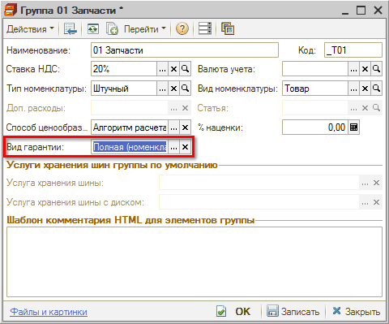

**Настройка в карточке номенклатуры**

Если требуется настроить вид гарантии на отдельные запчасти, откройте карточку номенклатуры и выберите вид гарантии в соответствующем поле:

Можно указать вид гарантии для производителя товара:

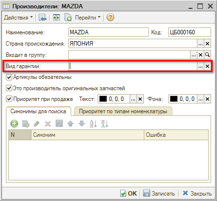

В этом случае вид гарантии на товар будет автоматически подставляться в Заказ-наряд по производителю, если в карточке товара не задан свой вид гарантии.

**Алгоритм определения вида гарантии для товаров**

Определение вида гарантии в Заказ-наряде на товар происходит следующим образом:

- если указан в карточке товара, то подставляется из карточки товара;
- если не указан в карточке товара, но указан в производителе, то подставляется по производителю;
- если не указан в карточке товара и по производителю, то ищется снизу вверх по группе номенклатуры:
  - если указан в группе, то подставляется из группы;
  - если нигде не указан, то ничего не подставляется.

## Видео по теме

**Вебинар по теме «Расширенная гарантийная политика» от 06.11.2020 (до 14:30):**

[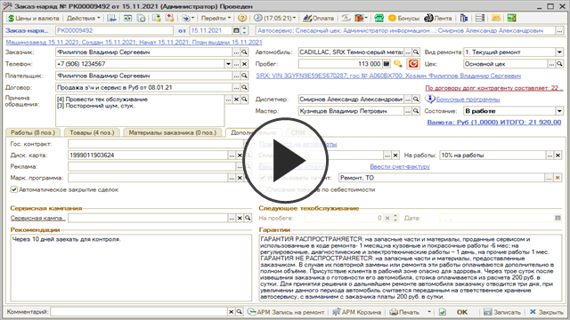](https://edu.5systems.ru/video/archive/Rasshirennaya_garantiynaya_politika;_Jurnal_peredachi_smen–Vebinar_5_SYSTEMS_06.11.2020.mp4)

---

**Теги:** гарантийная политика, гарантия на ремонт, вид гарантии, заказ-наряд, автоработы, номенклатура

