

# Диагностические анкеты

<table><tr><td><b>Время чтения:</b> 15 мин.</td><td><b>Обновлено:</b> 16.06.2022</td></tr></table>

Источник: https://www.5systems.ru/help/diagnosticheskie-ankety

## Содержание

- [Введение](#введение)
- [Создание диагностической анкеты](#создание-диагностической-анкеты)
- [Параметры диагностической анкеты](#параметры-диагностической-анкеты)
- [Связь диагностической анкеты с работой](#связь-диагностической-анкеты-с-работой)
- [Отображение и печать диагностической анкеты в Заказ-наряде](#отображение-и-печать-диагностической-анкеты-в-заказ-наряде)
- [Занесение результатов диагностической анкеты в Заказ-наряде](#занесение-результатов-диагностической-анкеты-в-заказ-наряде)
- [Обработка выявленных проблем и замечаний через АРМ «Корзина»](#обработка-выявленных-проблем-и-замечаний-через-арм-корзина)
- [Видео по теме](#видео-по-теме)

## Введение

В программе реализован механизм диагностических анкет, с помощью которого можно заложить алгоритм проведения диагностики автомобиля и обработать результаты проведенной диагностики. Диагностические анкеты представляют собой чек-листы проверки, которые могут применяться в ходе быстрого осмотра автомобиля или проведения Технического осмотра (ТО). По выявленным проблемам и замечаниям в процессе диагностики формируется предложение для клиента.

Процесс работы с диагностическими анкетами в программе выглядит следующим образом:

1. Создание диагностической анкеты.
2. Связь работы и диагностической анкеты.
3. Выбор работы для проведения диагностики и печать диагностической анкеты для механика из Заказ-наряда.
4. Занесение результатов диагностики, проведенной механиком, в Заказ-наряд.
5. Формирование предложения по выявленным проблемам и замечаниям через АРМ «Корзина».

## Создание диагностической анкеты

Для создания диагностической анкеты перейдите в справочник **«Диагностические анкеты»** (**Администрирование → Компания → Автосервис → Диагностические анкеты** или из типового меню: **CRM → Помощник автосервиса → Диагностические анкеты**) и создайте новую запись с помощью кнопки **«Добавить»** командного меню:

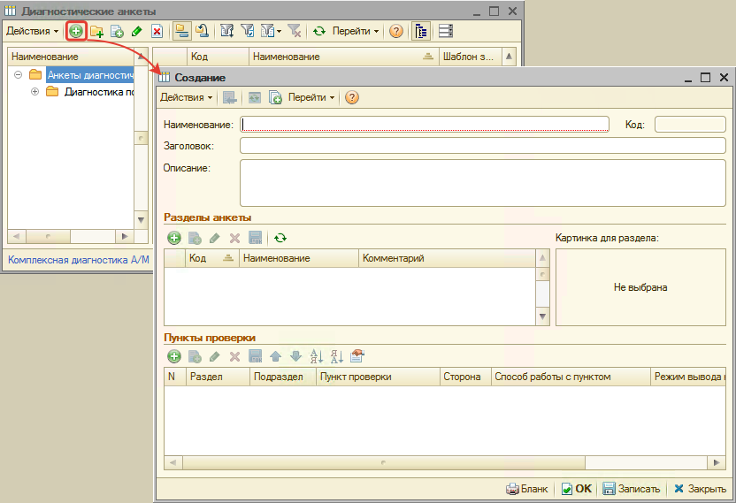

В карточке диагностической анкеты обязательно введите наименование и запишите изменения:

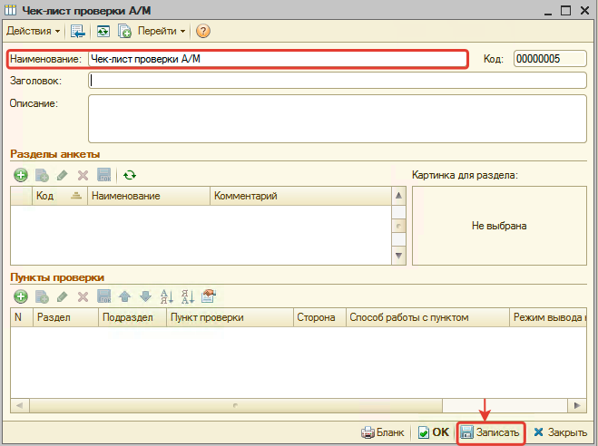

При необходимости можно ввести заголовок анкеты в соответствующее поле, который будет печататься в бланке. Если не заполнить заголовок, то в бланке будет печататься заголовок из поля **«Наименование»**.

После записи диагностической анкеты приступите к наполнению пунктов проверки, согласно которым планируется провести диагностику. Если пункты проверки необходимо разбить по разделам, то сначала необходимо создать разделы. См. раздел [Параметры диагностической анкеты](#параметры-диагностической-анкеты).

Рассмотрим пример создания анкеты из двух разделов.

Создадим раздел **«Общий осмотр»** и для раздела добавим пункты проверки:

1. Выберем тип пункта проверки **«Автоработы»** и укажем конкретную автоработу для общего осмотра.
2. Выберем соответствующую для проверяемой детали сторону установки.
3. Для некоторых пунктов проверки выберем опцию **«Способ работы с пунктом» = «Список значений»** и заполним списком значений (в результате в бланке, в поле «Примечание», будет предложено для подчеркивания несколько вариантов).

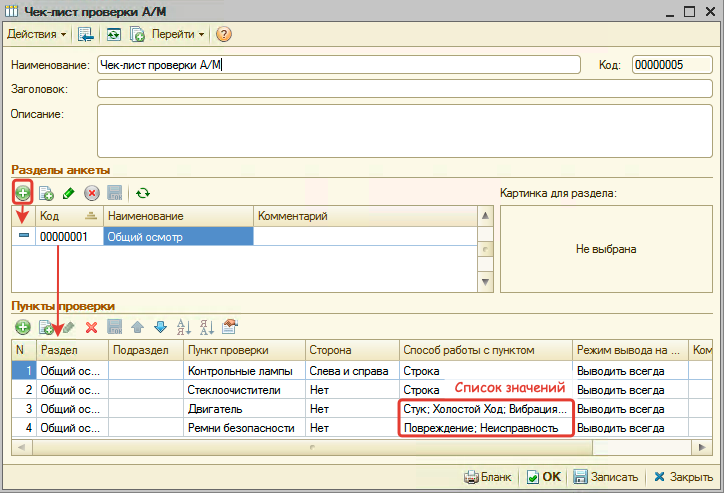

Таким же образом создадим еще один раздел с пунктами проверки и посмотрим, что получилось в печатном бланке:

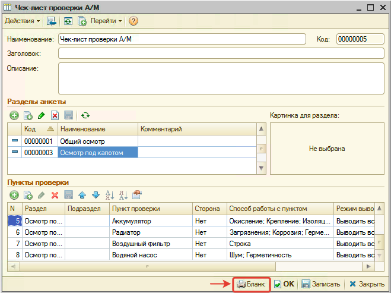

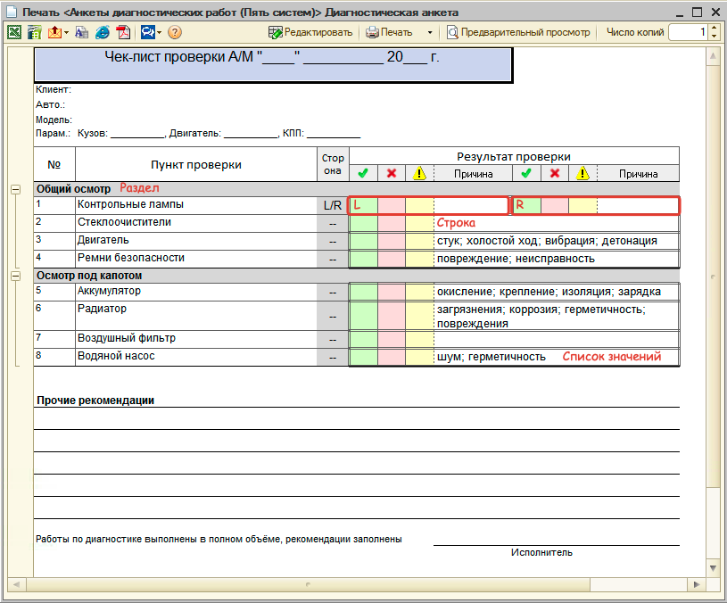

Разделы и пункты проверки сортируются по параметру **«Код»/«№»** в порядке возрастания.

## Параметры диагностической анкеты

| Параметр | Описание |
| --- | --- |
| **Параметры диагностической анкеты** | |
| Наименование | Наименование диагностической анкеты. Если не заполнен параметр «Заголовок» |
| Заголовок | Заголовок, который выводится в бланке диагностической анкеты. Если не заполнен, то в качестве заголовка выводится значение из параметра «Наименование» |
| Описание | Краткое описание диагностической анкеты |
| **Параметры раздела** | |
| Код | Код раздела. Разделы сортируются в порядке возрастания параметра «Код» |
| Наименование | Наименование раздела |
| Комментарий | Описание раздела |
| Картинка для раздела | Область загрузки, просмотра и удаления картинки раздела. Если загружена картинка раздела, то она отображается в бланке. Для вызова меню управления картинкой нажмите правую кнопку мыши |
| **Параметры пункта проверки** | |
| N | Номер по порядку пункта проверки |
| Раздел | Связь с разделом первого уровня, в котором отображается пункт проверки в бланке |
| Подраздел | Связь с разделом второго уровня, в котором отображается пункт проверки в бланке |
| Пункт проверки | Значение одного из справочников: Детали применяемости, Автоработы (наиболее предпочтительный вариант), Номенклатура |
| Сторона | Выбор стороны установки детали: Нет (по умолчанию), Слева, Справа, Слева и Справа |
| Способ работы с пунктом | Выбор способа установки: **Строка** (по умолчанию) — при вводе результата проверки можно будет вписать только строку. **Дата** — при вводе результата проверки можно будет вписать только дату. **Число** — при вводе результата проверки можно будет вписать только число. **Список значений** — при вводе результата проверки можно будет выбрать значение из списка и вписать дополнительный комментарий в виде строки |
| Режим вывода на печать | Выбор режима вывода на печать: Выводить всегда (по умолчанию), Никогда не выводить (скрывает пункт проверки из бланка), Выводить при наличии данных для модели |
| Комментарий | Комментарий, который выводится на печать. Можно указать нюансы, каким именно образом проверяется деталь, с помощью какого прибора и т. д. |

## Связь диагностической анкеты с работой

Для того, чтобы диагностическая анкета появлялась в заказ-наряде, необходимо связать ее с автоработой, в ходе которой и будет происходить диагностика автомобиля. Для этого в карточке автоработы выберите соответствующую диагностическую анкету:

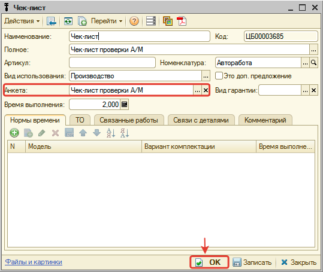

Установите норму времени и запишите работу.

## Отображение и печать диагностической анкеты в Заказ-наряде

При выборе работы в Заказ-наряде, которая связана с диагностической анкетой, связанная диагностическая анкета отобразится в таблице документа:

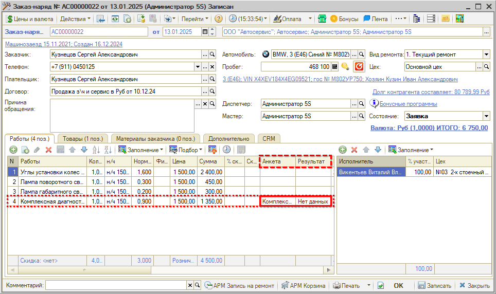

Печать диагностической анкеты доступна в режиме заполнения диагностической анкеты. В режим заполнения можно перейти двойным кликом мыши по анкете:

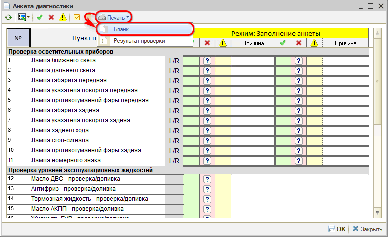

## Занесение результатов диагностической анкеты в Заказ-наряде

Для занесения результатов проверки по заполненному механиком бланку диагностической анкеты дважды кликните мышью по анкете в Заказ-наряде. В режиме заполнения анкеты внесите результаты:

Двойным кликом мыши отметьте выявленные проблемы и предупреждения по пунктам проверки с указанием причины. Если для причины в анкете установлен список значений, то отобразится окно выбора значений с возможностью указать комментарий:

По остальным пунктам проверки заполните, что «все ОК»:

Сохраните изменения:

В результате диагностическая анкета перейдет в состояние **«Обработана»**:

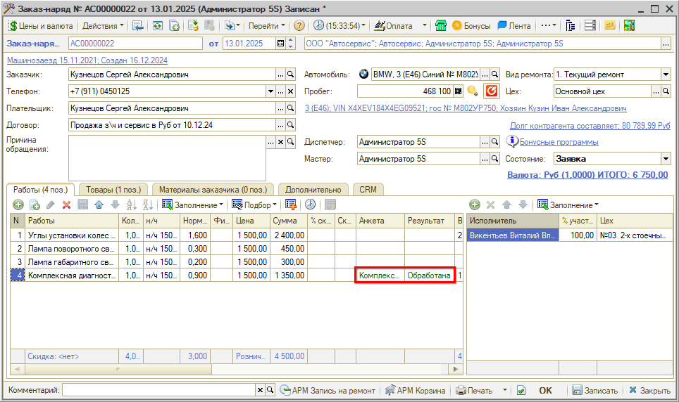

Заполненную анкету можно распечатать для клиента.

### Командное меню обработки диагностической анкеты

| Кнопка | Наименование | Описание |
| --- | --- | --- |
|  | Обновить диагностический лист | Обновить данные по диагностическому листу |
| 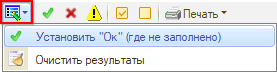 | Установить «Ок» (где не заполнено) | По всем необработанным пунктам установить результат проверки «Ок» |
| 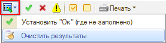 | Очистить результаты | Удалить все занесенные результаты проверки |
|  | Отбор «Ок» | Отобразить только те пункты, где установлен результат «Ок» |
|  | Отбор «Замена» | Отобразить только те пункты, где установлен результат «Замена» |
|  | Отбор «Внимание» | Отобразить только те пункты, где установлен результат «Внимание» |
|  | Отбор «Все проверенные» (Режим обработки результата) | Отобразить только те пункты, по которым проставлены результаты. Доступно для режима «Обработка результата» |
|  | Отбор «Все непроверенные» (Режим внесения данных) | Отобразить только те пункты, по которым не проставлены результаты. Доступно для режима «Заполнение анкеты» |
| 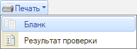 | Печать Бланк | Распечатать диагностическую анкету в виде бланка для заполнения |
| 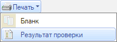 | Печать Результат проверки | Распечатать заполненную диагностическую анкету |

## Обработка выявленных проблем и замечаний через АРМ «Корзина»

Если в ходе проверки по диагностической анкете найдены проблемы и предупреждения, перейдите из Заказ-наряда в АРМ **«[Корзина](../../Проценка%20запчастей%20и%20работ/Работа%20в%20АРМ%20Корзина/rabota-v-arm-korzina.md)»** с целью формирования предложений по ремонту для автомобиля клиента.

Для формирования предложения по выявленным проблемам и замечаниям через АРМ «Корзина» для начала нужно ознакомиться с принципами работы в [АРМ «Корзина»](../../Проценка%20запчастей%20и%20работ/Работа%20в%20АРМ%20Корзина/rabota-v-arm-korzina.md) и с [Применяемостью](../../Склад%20и%20запчасти/Работа%20с%20применяемостью/rabota-s-primenyaemostyu.md).

В АРМ «Корзина» перейдите на вкладку **Подбор «Диагностика»**.

Подбор «Диагностика» состоит из:

**1. Область списка диагностических анкет**, разделенных по группам:

- **Текущая диагностика** — список незавершенных заказ-нарядов, в которых есть диагностические анкеты.
- **Завершенная диагностика** — список завершенных заказ-нарядов, в которых были обработаны диагностические анкеты.
- **Анкеты** — список всех диагностических анкет, созданных в программе.

**2. Область обработки диагностических анкет:**

- **Просмотр и заполнение диагностической анкеты** — по текущей диагностике можно не только посмотреть результаты диагностики, но и заполнить/изменить результат.
- **Работы и детали, связанные с пунктом проверки** — отображаются все созданные связи при работе с применяемостью, позволяет создать связи (см. [Работа с применяемостью](../../Склад%20и%20запчасти/Работа%20с%20применяемостью/rabota-s-primenyaemostyu.md)).

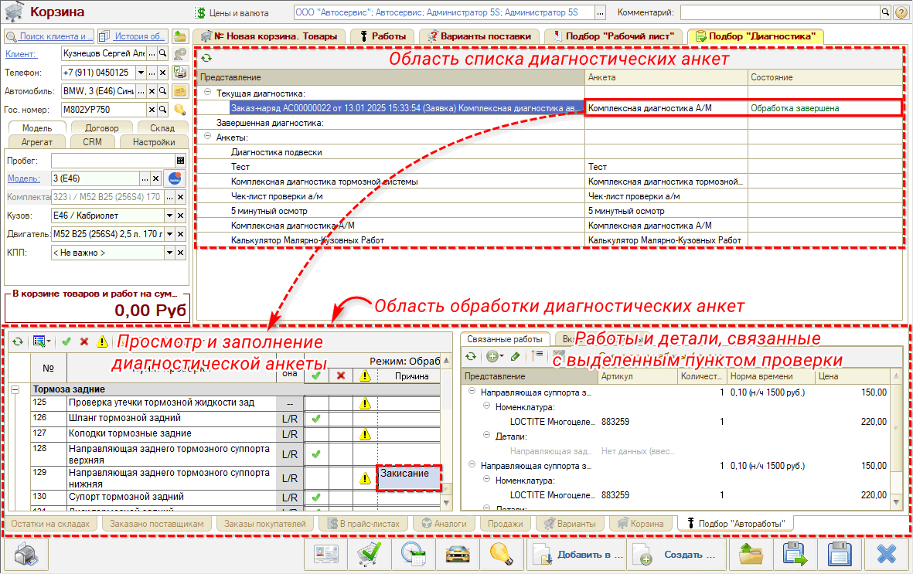

Таким образом, для обработки диагностической анкеты:

1. Выберите анкету из раздела текущей диагностики области списка диагностических анкет.
2. Активизируйте результат пункта проверки с проблемой или предупреждением в области обработки диагностических анкет.
3. Просмотрите связанные работы и детали:

   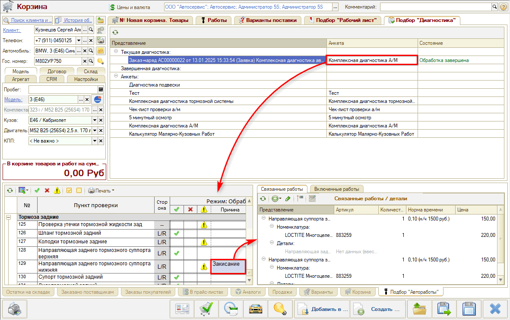

   В примере в качестве пунктов проверки выступают автоработы. Автоработы на проверку в свою очередь связываются с автоработами/деталями применяемости/номенклатурой, которые могут понадобиться в случае неисправности автомобиля.

4. Если среди связей есть подходящие работы/детали/номенклатура, то добавьте выбранную работу/деталь/номенклатуру в Корзину или в Варианты поставки (см. [Работа с применяемостью → Использование применяемости для подбора](../../Склад%20и%20запчасти/Работа%20с%20применяемостью/rabota-s-primenyaemostyu.md#использование-применяемости-для-подбора)).
5. Если подходящих работ/деталей/номенклатуры среди существующих связей нет, то для начала свяжите работу/деталь/номенклатуру с пунктом проверки:

   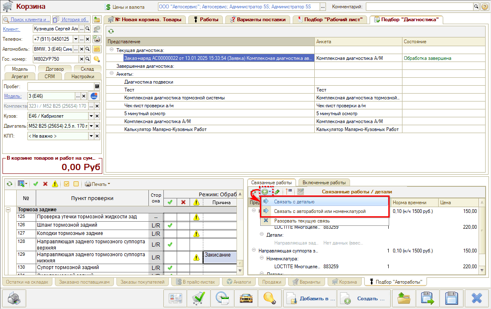

   Затем добавьте созданные связи в Корзину.

После добавления товаров/работ в Корзину (позиции на вкладках «Товары» и «Работы») можно:

1. Перенести подобранные товары/работы в рекомендации и распечатать их в Заказ-наряде для клиента.
2. Создать по подобранным товарам/работам новый Заказ-наряд для автомобиля клиента.

Полный список действий с товарами/работами в Корзине см. [Работа в АРМ Корзина → 5. Панель действий](../../Проценка%20запчастей%20и%20работ/Работа%20в%20АРМ%20Корзина/rabota-v-arm-korzina.md#5-панель-действий).

## Видео по теме

**[Курс «Диагностические анкеты» — вебинар 5SYSTEMS 09.12.2020](https://www.youtube.com/watch?v=zdsD17fXSy0):**

[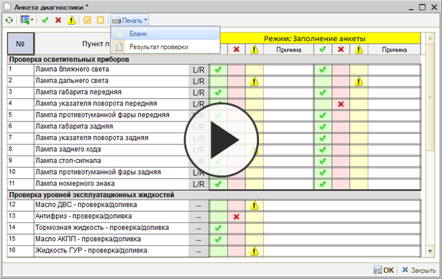](https://edu.5systems.ru/video/archive/Kurs_Diagnosticheskie_ankety-Vebinar_5SYSTEMS_09.12.2020.mp4)

---

**Теги:** диагностические анкеты, чек-лист, диагностика автомобиля, пункты проверки, заказ-наряд, корзина, применяемость, печать бланка

