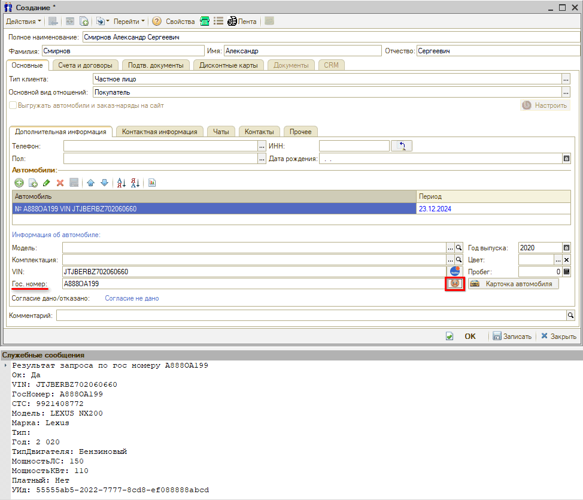
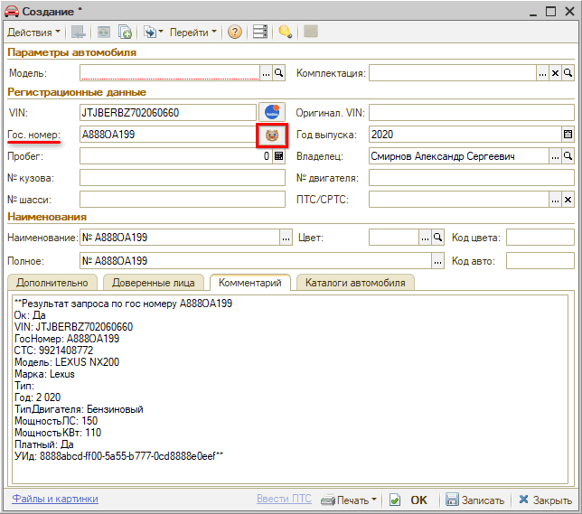
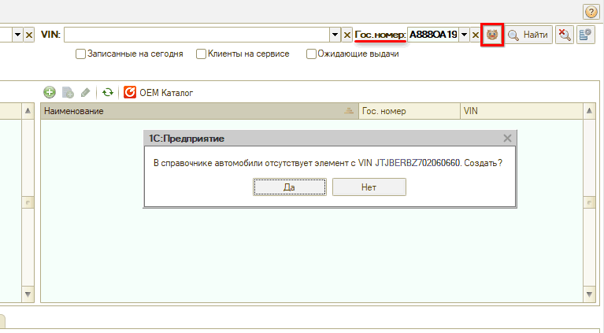
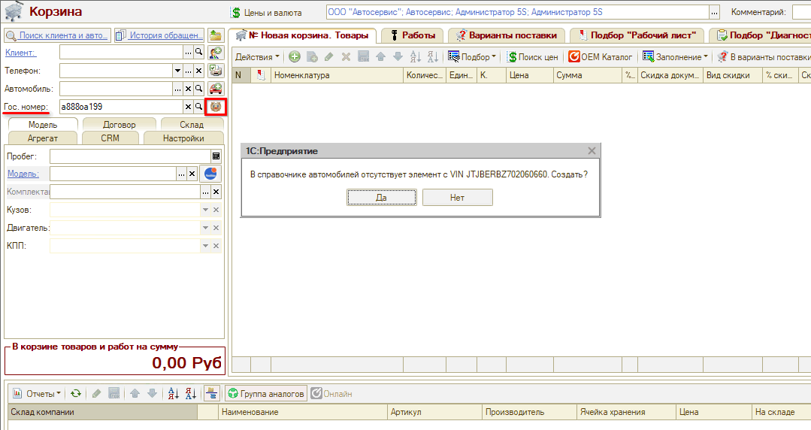
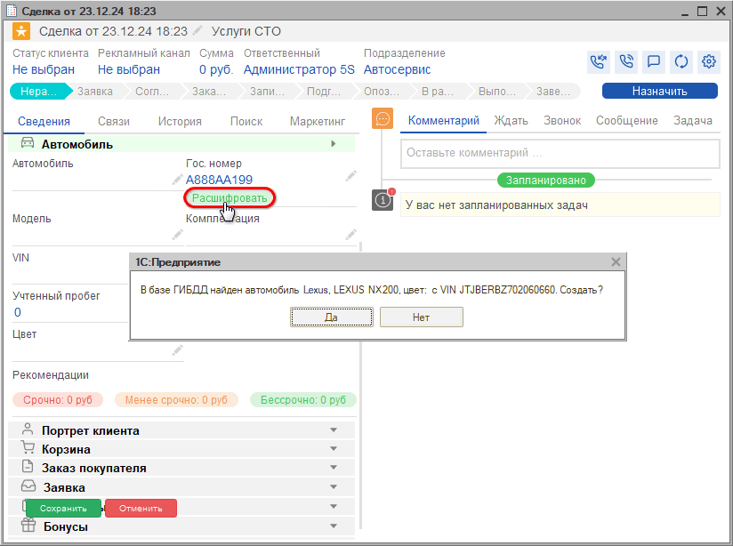
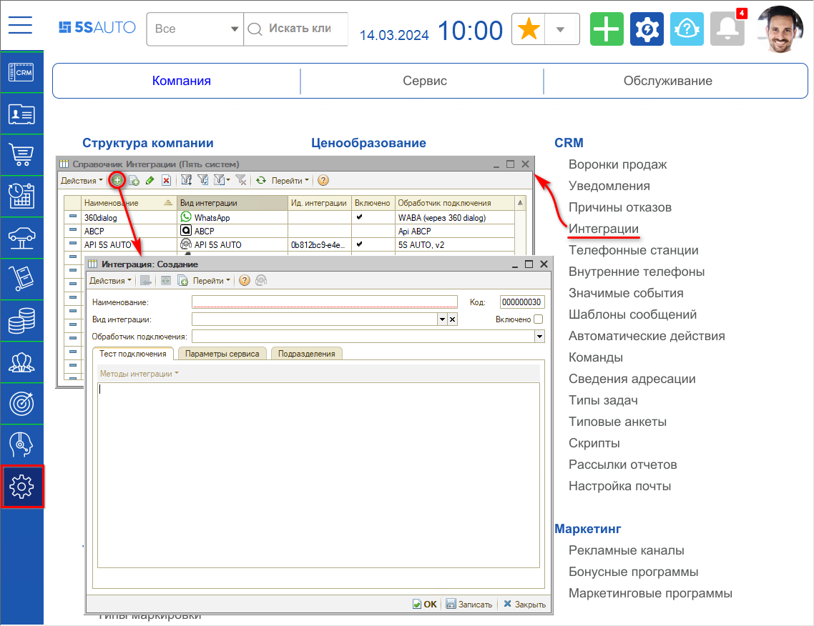
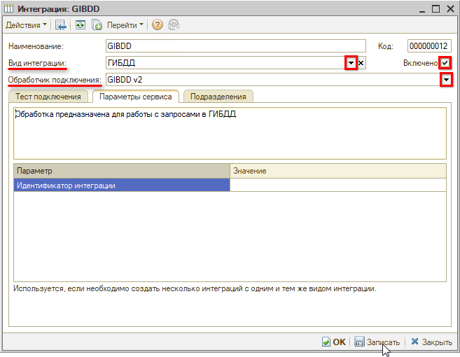
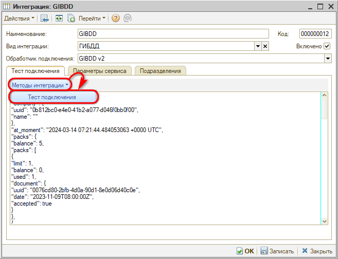

# Интеграция с базой ГИБДД

<table><tr><td><b>Время чтения:</b> 7 мин.</td><td><b>Обновлено:</b> 29.07.2026</td></tr></table>

Источник: https://www.5systems.ru/help/integraciya-s-bazoy-gibdd

*Актуально для релиза 2.7.1.*

## Содержание

- [Введение](#введение)
- [Расшифровка автомобиля](#расшифровка-автомобиля)
- [Настройка](#настройка)

## Введение

В программе реализована возможность подключения **интеграции с базой ГИБДД**.

После добавления и настройки интеграции с ГИБДД становится активной *кнопка с эмблемой ГИБДД* , расположенная рядом с полем гос. номера. Найти данную кнопку можно:

- В карточке контрагента
- В карточке автомобиля
- В АРМ Клиенты и автомобили
- В АРМ Корзина
- В Сделке

При нажатии на кнопку расшифровки отправляется запрос в ГИБДД на получение данных по введенному гос. номеру. Гос. номер должен состоять из шести и более символов.

## Расшифровка автомобиля

#### Расшифровка из карточки контрагента

При нажатии кнопки расшифровки в *карточке контрагента* в карточку добавляется автомобиль, заполняются поля *VIN* и *«Год выпуска»*, в окно служебных сообщений выводится результат запроса (данные, полученные из ГИБДД). Необходимо выбрать вручную *модель* в соответствии с полученными данными и «Записать».

#### Расшифровка из карточки автомобиля

При нажатии кнопки расшифровки *в карточке автомобиля* в карточку подтягиваются VIN-номер и Год выпуска, а также автоматически открывается вкладка «Комментарий», на которую записываются данные, полученные из ГИБДД:

Полученные данные можно использовать при расшифровке автомобиля — заполнить модель, комплектацию и другие параметры и *записать* автомобиль.

#### Расшифровка из АРМ Клиенты и автомобили

При нажатии кнопки расшифровки *в АРМ «Клиенты и автомобили»* в случае отсутствия в справочнике автомобиля с данным VIN программа предложит создать карточку автомобиля:

#### Расшифровка из АРМ Корзина

При расшифровке *из АРМ «Корзина»*, если автомобиль уже есть в базе, то он подтянется, если нет — программа предложит создать:

#### Расшифровка из Сделки

Также расшифровать автомобиль по гос. номеру можно из Сделки. Для этого достаточно ввести гос. номер в соответствующее поле, и, если его нет в базе системы, программа предложит создать:

Если автомобиль клиента уже есть в системе, при расшифровке по гос. номеру программа найдет автомобиль, в случае необходимости предложит скорректировать имеющиеся данные.

## Настройка

Предварительно для настройки интеграции с сервисом должна быть настроена интеграция с [API 5S AUTO](https://www.5systems.ru/help/api-5s-auto).

Следует создать новый элемент в справочнике «Интеграции» — *Администрирование → Компания → CRM → Интеграции:*

Необходимо заполнить следующие параметры:

- *Вид интеграции* — выбрать вид интеграции «ГИБДД»;
- *Обработчик подключения* — выбрать обработчик «GIBDD»;
- *Наименование* — заполнится автоматически, при необходимости задать свое;
- Установить галочку *«Включено»*.

Затем необходимо сохранить интеграцию нажатием на кнопку *«ОК»* или *«Записать»*.

Для проверки успешного подключения следует на вкладке «Тест подключения» нажать кнопку *«Методы интеграции → Тест подключения»:*

В случае корректной работы интеграции будут выведены данные подключения к сервису.

---

**Теги:** гибдд, интеграция, расшифровка автомобиля по гос. номеру, vin, api 5s auto

