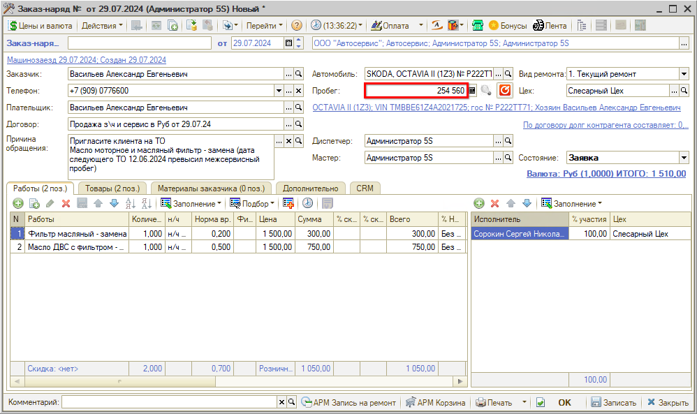
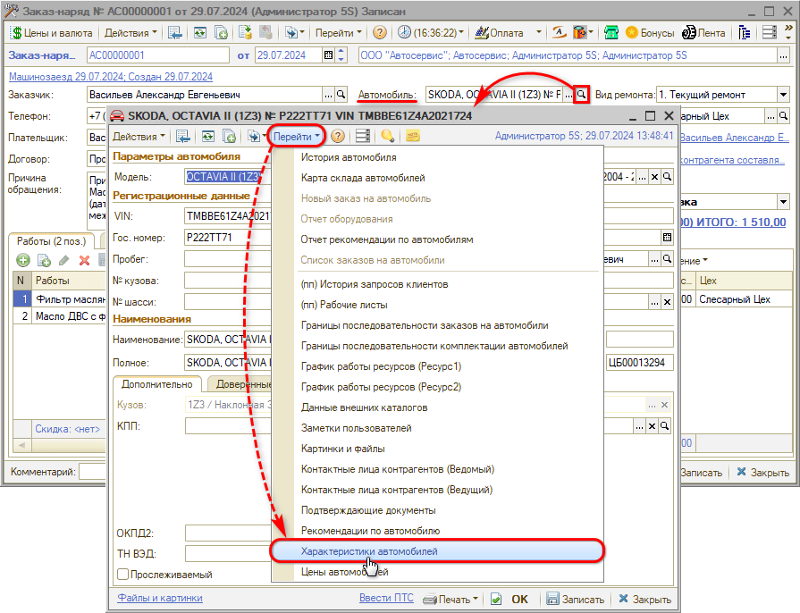
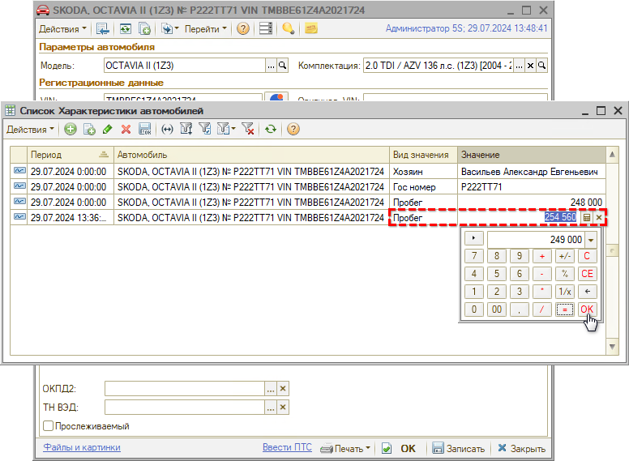

# Корректировка пробега автомобиля

<table><tr><td><b>Время чтения:</b> 5 мин.</td><td><b>Обновлено:</b> 20.08.2024</td></tr></table>

Источник: https://www.5systems.ru/help/korrektirovka-probega-avtomobilya

## Содержание

- [Введение](#введение)
- [Редактирование характеристик автомобиля](#редактирование-характеристик-автомобиля)

## Введение

Текущий пробег отображается в карточке автомобиля, а также в лиде/сделке. Также пробег на дату начала работ указывается в документах «Заявка на ремонт» и «Заказ-наряд».

Рекомендуется всегда уточнять у клиента актуальное значение пробега автомобиля и фиксировать его в соответствующем параметре — как правило, это делается в Заказ-наряде при заезде клиента, т. к. можно проконтролировать точное реальное значение пробега:

Это необходимо делать для корректной работы механизмов программы, в частности для более точного расчета прогнозируемого времени наступления следующего ТО — см. статью [Приглашения на ТО](../../CRM/Приглашения%20на%20ТО/priglasheniya-na-to.md).

Программа дает возможность записать документ с прежним значением пробега, если с момента ввода предыдущего значения прошло не более 60 суток. Если прошло больше времени, то программа не позволит записать документ, пока пользователь не обновит значение пробега.

*Примечание:* Контроль заполнения пробега в Заказ-наряде можно отключить правом «Контролировать пробег». Кроме того, можно сделать такую настройку только для отдельных *видов ремонта,* например, для автомойки, — через установку свойства «Не контролировать пробег».

Значение пробега в параметрах документа, сделки или карточки автомобиля можно изменять только в большую сторону. Программа не позволяет ввести значение пробега меньше того, которое было указано ранее.

В случае если ранее пробег был введен *некорректно* и его реальное актуальное значение меньше, есть возможность отредактировать пробег следующим способом.

## Редактирование характеристик автомобиля

Для редактирования текущего значения пробега следует перейти в карточку автомобиля — например, из заказ-наряда или сделки. Далее нужно нажатием на кнопку *«Перейти → Характеристики автомобиля»* открыть список характеристик автомобиля:

В открывшемся списке характеристик необходимо найти последнюю строку с видом значения «Пробег» и изменить значение:

*Важно!* Рекомендуется корректировать пробег указанным способом только в исключительных случаях, т. к. это может повлиять на работу механизмов программы, таких как расчет прогнозируемого превышения межсервисного пробега для приглашения на ТО.

*Примечание:* Помимо пробега через список «Характеристики автомобиля» также можно редактировать другие значения — например, хозяина автомобиля, гос. номер, тех. паспорт.

---

**Теги:** пробег, корректировка пробега, характеристики автомобиля, заказ-наряд, приглашение на то

