

# Модели автомобилей и другие справочники

<table><tr><td><b>Время чтения:</b> 8 мин.</td><td><b>Обновлено:</b> 15.01.2026</td></tr></table>

Источник: https://www.5systems.ru/help/modeli-avtomobiley-i-drugie-spravochniki

## Содержание

- [Справочник Модели автомобилей](#справочник-модели-автомобилей)
  - [Способы перехода в справочник](#способы-перехода-в-справочник)
- [Карточка модели автомобиля](#карточка-модели-автомобиля)
- [Варианты комплектации](#варианты-комплектации)
- [Цвета](#цвета)
- [Типы кузовов](#типы-кузовов)
- [Типы двигателей](#типы-двигателей)
  - [Модели двигателей](#модели-двигателей)
- [Типы КПП](#типы-кпп)
  - [Модели КПП](#модели-кпп)
- [Типы салона](#типы-салона)

## Справочник Модели автомобилей

В справочник «Модели автомобилей» заносится информация обо всех моделях автомобилей, обслуживаемых на предприятии или являющихся собственностью предприятия.

### Способы перехода в справочник

1. Через меню интерфейса программы: *Автосервис → Приемка → Справочники → Марки и модели а/м* (или через типовое меню: *Справочники → Автомобили → Модели автомобилей)*

   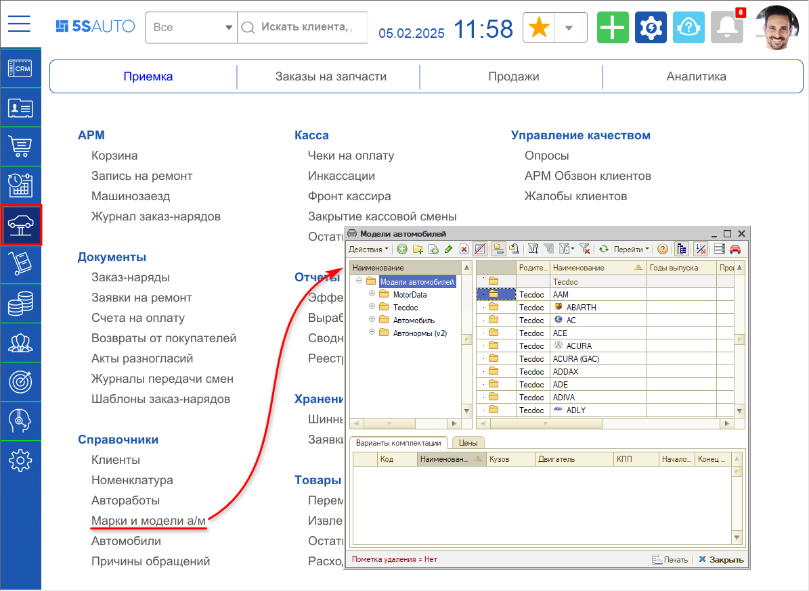

2. Из карточки [автомобиля](../Автомобили/avtomobili.md) нажатием на кнопку «Выбрать» в поле «Модель»:

   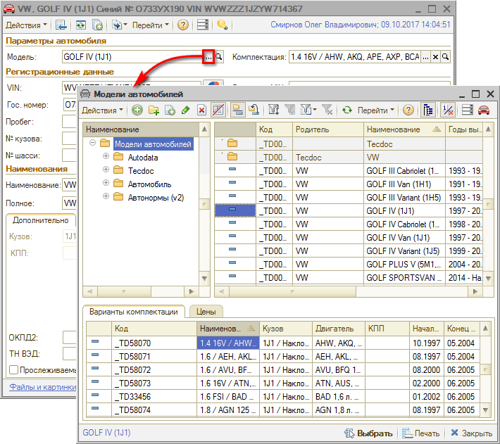

3. Из *сделки* нажатием на кнопку «Выбрать» в поле «Модель»:

   

## Карточка модели автомобиля

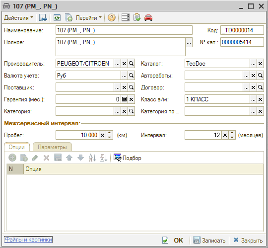

**Описание полей карточки модели автомобиля:**

| Поле | Содержимое |
| --- | --- |
| Наименование | Наименование модели автомобиля. |
| Полное | Полное наименование модели автомобиля. |
| Код | Код модели автомобилей в справочнике. |
| № кат. | Номер по каталогу (артикул) модели. |
| Производитель | Производитель модели автомобиля. Выбирается из справочника «Производители». |
| Каталог | Каталог, к которому относится эта модель. |
| Валюта учета | Используется для ведения дополнительного учета валютной себестоимости и цен. Выбирается из справочника «Валюты». |
| Автоработы | Группа [авторабот](../Автоработы/avtoraboty.md) для данной модели по умолчанию. Выбирается из справочника «Автоработы». |
| Поставщик | Выбирается из справочника «[Контрагенты и контакты](../../Работа%20с%20клиентами/Контрагенты%20и%20контакты/kontragenty-i-kontakty.md)». |
| Договор | Договор поставки данной модели автомобиля (с поставщиком). |
| Гарантия | Гарантийный срок в месяцах. |
| Класс а/м | Класс автомобиля. |
| Категория | Категория транспортного средства для проведения государственного технического осмотра. |
| Категория по... | Категория транспортного средства, которая указана в паспорте транспортного средства и в свидетельстве о регистрации транспортного средства. |

**Межсервисный интервал**

| Поле | Содержимое |
| --- | --- |
| Пробег (км) | Межсервисный пробег ТО. |
| Интервал (месяцев) | Межсервисный интервал ТО: период, через который необходимо производить следующее техобслуживание. |

## Варианты комплектации

Из справочника «Модели автомобилей» при помощи меню кнопки командной панели «Перейти» можно открыть подчиненный справочник «Варианты комплектации».

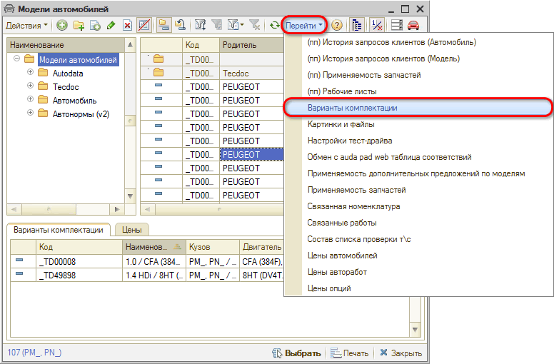

Справочник «Варианты комплектации» описывает варианты комплектации различных моделей автомобилей.

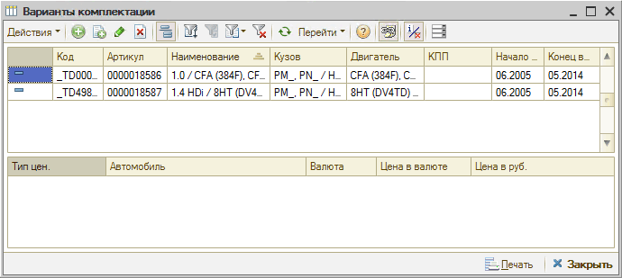

Карточка элемента справочника «Варианты комплектации»:

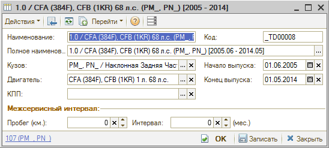

**Описание полей:**

| Поле | Содержимое |
| --- | --- |
| Наименование | Наименование комплектации. |
| Полное наименование | Полное наименование комплектации. |
| Код | Код варианта комплектации модели автомобиля. |
| Кузов | Тип кузова данного варианта комплектации автомобиля. Ссылается на справочник «[Типы кузовов](#типы-кузовов)» (см. ниже). |
| Двигатель | Тип двигателя данного варианта комплектации автомобиля. Ссылается на справочник «[Типы двигателей](#типы-двигателей)» (см. ниже). |
| КПП | Тип КПП данного варианта комплектации автомобиля. Ссылается на справочник «[Типы КПП](#типы-кпп)» (см. ниже). |
| Начало выпуска Конец выпуска | Начало и конец выпуска варианта комплектации. |

**Межсервисный интервал**

| Поле | Содержимое |
| --- | --- |
| Пробег (км) | Межсервисный пробег техобслуживания. |
| Интервал (месяцев) | Межсервисный интервал техобслуживания. |

## Цвета

Справочник «Цвета» (Справочники → Автомобили → Цвета) содержит информацию о возможных цветах автомобилей и соответствии этих цветов классификации ГИБДД.

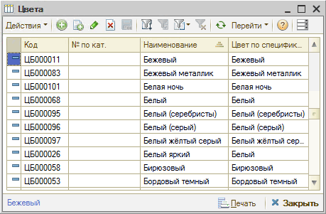

## Типы кузовов

В справочник «Типы кузовов» (Справочники → Автомобили → Типы кузовов) заносятся сведения о возможных типах кузовов автомобилей, обслуживаемых предприятием.

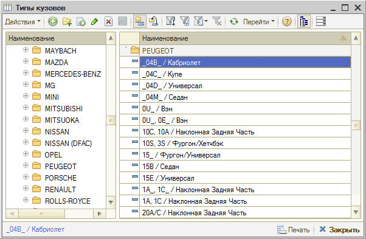

## Типы двигателей

В справочник «Типы двигателей» (Справочники → Автомобили → Типы двигателей) заносятся сведения о возможных типах двигателей автомобилей, обслуживаемых предприятием.

### Модели двигателей

Справочник «Типы двигателей» привязан к марке и модели автомобиля, но некоторые модели разных марок являются одинаковыми, и им подходят одни и те же детали. Для классификации и объединения однотипных моделей двигателей в систему введены понятия:

- *Модель двигателя* — понятие, объединяющее двигатели, имеющие разные маркировки, но одинаковую конструкцию и параметры, к которым подойдут одни и те же детали.
- *Группа моделей двигателей* — еще более универсальный уровень группировки ДВС, в котором можно объединить одинаковые модели двигателей, имеющие незначительные конструктивные отличия.

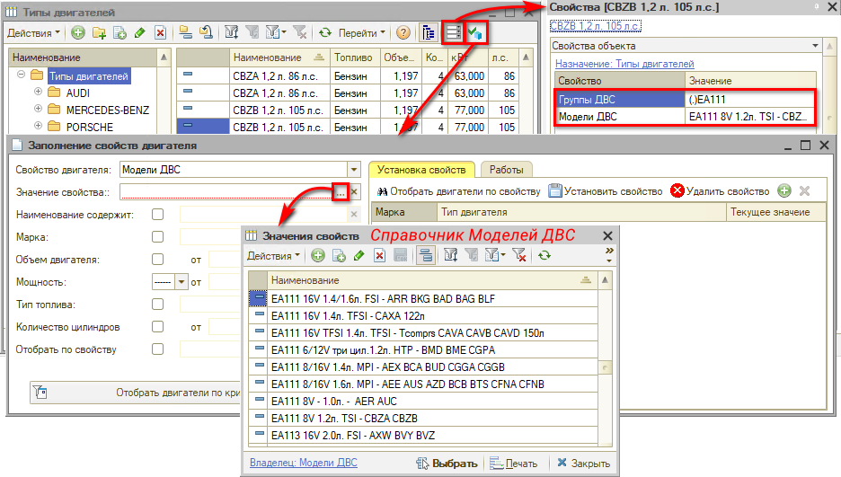

*Подробнее см. статью [Модели двигателей и КПП](../Модели%20двигателей%20и%20КПП/modeli-dvigateley-i-kpp.md).*

## Типы КПП

В справочник «Типы КПП» (Справочники → Автомобили → Типы КПП) заносятся сведения о возможных типах коробок переключения передач автомобилей, обслуживаемых предприятием.

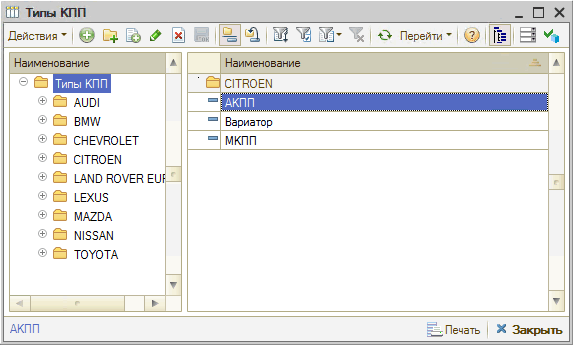

### Модели КПП

Справочник «Типы КПП» привязан к марке и модели автомобиля, но некоторые КПП разных марок являются одинаковыми, и им подходят одни и те же детали. Для классификации и объединения однотипных моделей КПП в систему введены понятия:

- *Модель КПП* — понятие, объединяющее КПП, имеющие разные маркировки, но одинаковую конструкцию и параметры.
- *Группа моделей КПП* — более высокий уровень группировки, в котором можно объединить одинаковые модели КПП, отличающиеся по некоторым критериям.

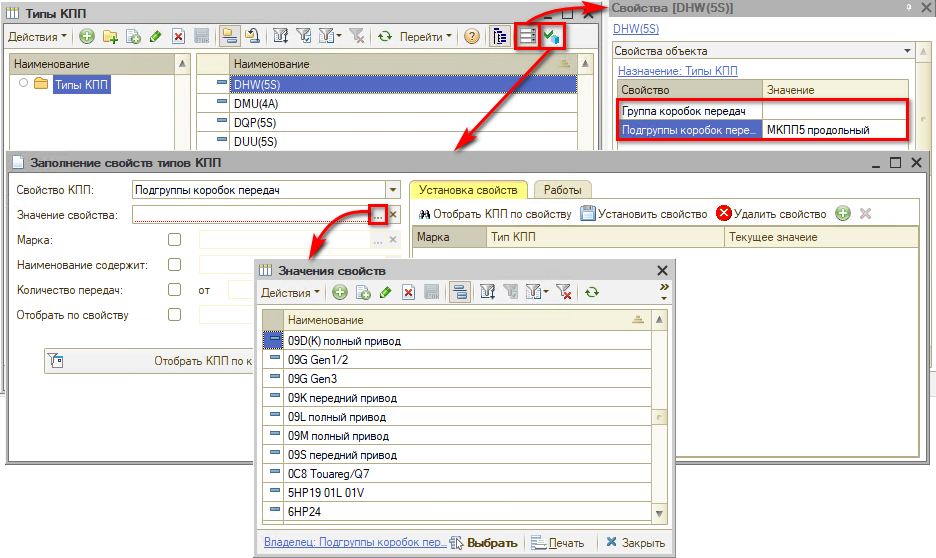

*Подробнее см. статью [Модели двигателей и КПП](../Модели%20двигателей%20и%20КПП/modeli-dvigateley-i-kpp.md).*

## Типы салона

В справочник «Типы салона» (Справочники → Автомобили → Типы салона) заносятся сведения о возможных типах интерьера салона автомобилей, обслуживаемых предприятием.

---

**Теги:** Автомобили, модели автомобилей, варианты комплектации, цвета, типы кузовов, типы двигателей, типы КПП, типы салона, справочники

