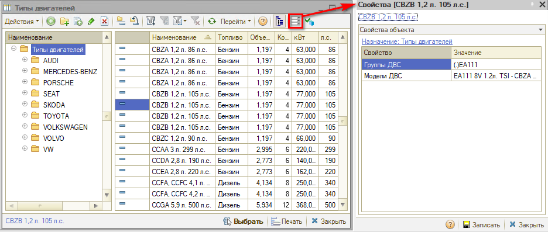
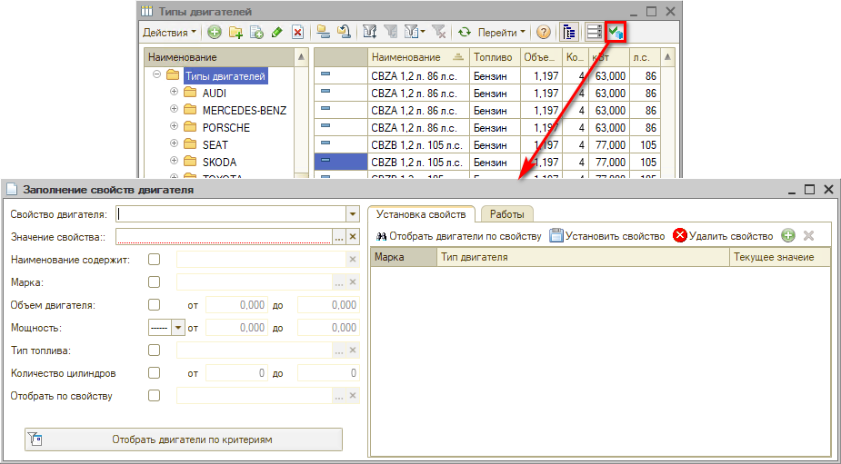
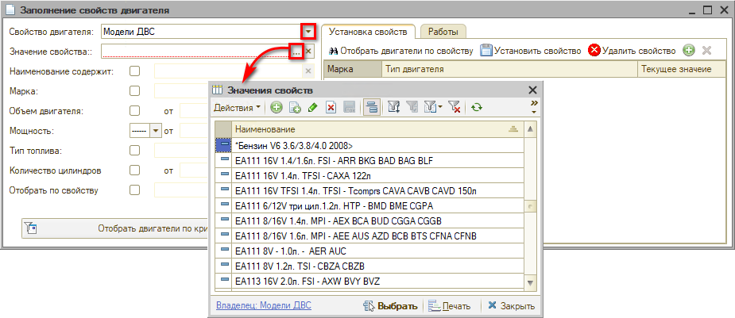
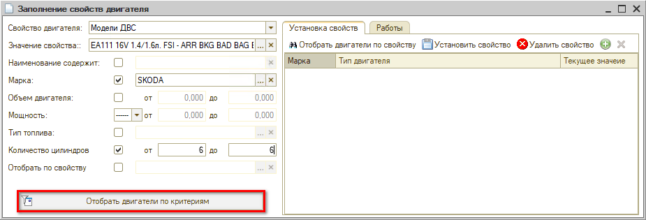
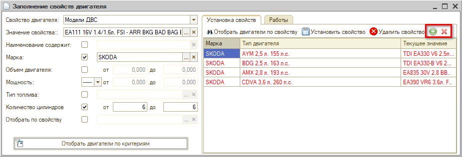
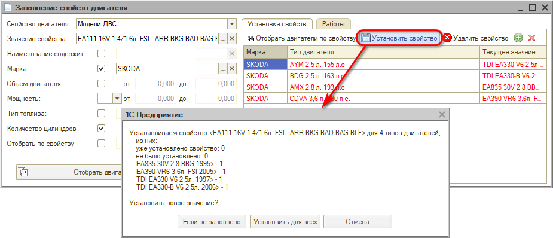
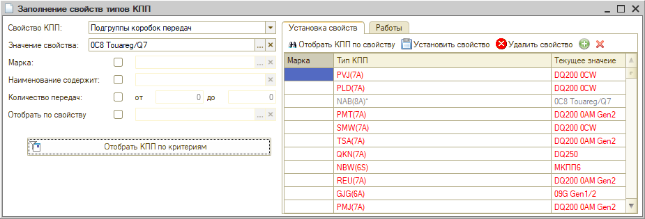

# Модели двигателей и КПП

<table><tr><td><b>Время чтения:</b> 8 мин.</td><td><b>Обновлено:</b> 30.11.2022</td></tr></table>

Источник: https://www.5systems.ru/help/modeli-dvigateley-i-kpp

*Функционал доступен с релиза 2.3.1.1.*

## Содержание

- [Введение](#введение)
- [Установка моделей и групп моделей ДВС и КПП](#установка-моделей-и-групп-моделей-двс-и-кпп)

## Введение

Справочники «Типы двигателей» и «Типы КПП» привязаны к марке и модели автомобиля, но некоторые модели разных марок — по сути «близнецы», и деталь подходит обеим моделям, независимо от марки (например, KIA и Hyundai, Citroën и Peugeot, ŠKODA и Volkswagen). Поэтому бывает целесообразно для подбора запчастей объединить типы двигателей или типы КПП в одну «модель».

Для классификации и объединения однотипных моделей двигателей и КПП в систему введены понятия «Модель двигателя» и «Группа моделей двигателя», «Модель КПП» и «Группа моделей КПП».

- *Модель двигателя* — понятие, объединяющее двигатели, имеющие разные маркировки, но одинаковую конструкцию и параметры, к которым подойдут одни и те же детали.
- *Группа моделей двигателей* — еще более универсальный уровень группировки ДВС, в котором можно объединить одинаковые модели двигателей, имеющие незначительные конструктивные отличия.
- *Модель КПП* — понятие, объединяющее коробки перемены передач (КПП), имеющие разные маркировки, но одинаковую конструкцию и параметры.
- *Группа моделей КПП* — более высокий уровень группировки, в котором можно объединить одинаковые модели КПП, отличающиеся по некоторым критериям.

О применении функционала см. статьи: *[Применяемость по типу двигателя и типу КПП](https://5systems.ru/help/primenyaemost-po-tipu-dvigatelya-i-tipu-kpp)*, *[Установка норм времени по моделям двигателей и КПП](../Установка%20норм%20времени%20по%20моделям%20двигателей%20и%20КПП/ustanovka-norm-vremeni-po-modelyam-dvigateley-i-kpp.md)*.

## Установка моделей и групп моделей ДВС и КПП

*Модели двигателя*, *Группы моделей двигателя*, *Модели КПП* и *Группы моделей КПП* являются по сути свойствами объектов «Тип двигателя» и «Тип КПП» соответственно:

Для установки данных свойств необходимо в справочнике «Типы двигателей» нажать кнопку «Установить свойства»:

В открывшемся окне «Заполнение свойств двигателя» на вкладке «Установка свойств» следует заполнить поля:

- *Свойство двигателя* — выбрать значение «Модель двигателя» или «Группа моделей двигателя»;
- *Значение свойства* — выбрать значение из заранее заполненного справочника:

Затем можно установить необходимые параметры: марка, объем, мощность, тип топлива, определенные буквы в наименовании и т. д., и нажать кнопку фильтра «Отобрать двигатели по критериям»:

Таблица на вкладке «Установка свойств» будет заполнена двигателями. Серый цвет шрифта типа двигателя в таблице означает, что значение свойства уже установлено и совпадает с заданными критериями. Красным цветом выделены подтянувшиеся позиции, значение свойства у которых не совпадает на данный момент. Черным цветом выделены двигатели, у которых значение свойства не заполнено.

Можно удалить из списка лишние или добавить вручную дополнительные позиции:

*Примечание:* Кнопка «Удалить свойство» удаляет ранее установленную связь со свойством для всех элементов в списке!

После заполнения всех параметров следует нажать кнопку «Установить свойство»:

Если не требуется изменять значения уже установленных свойств типов двигателей, следует нажать кнопку «Если не заполнено». Если нужно установить новую привязку свойства для всех двигателей, отобранных по параметрам, то следует нажать кнопку «Установить для всех».

Модели и группы моделей КПП устанавливается аналогично, только задаются другие параметры:

---

**Теги:** модель двигателя, группа моделей двигателя, модель кпп, группа моделей кпп, свойства двигателя, применяемость запчастей

