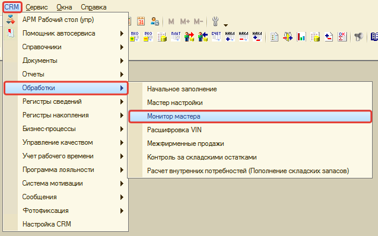
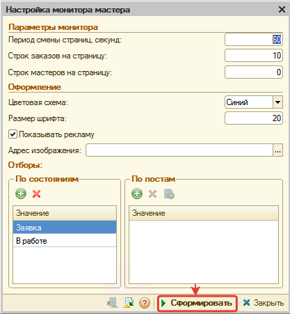
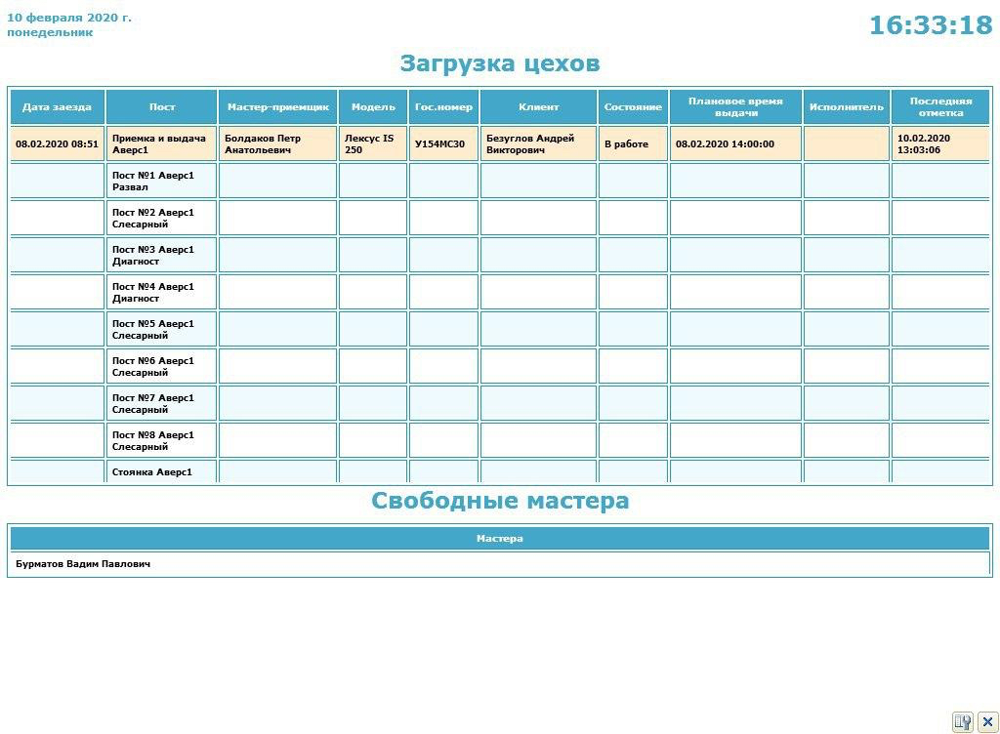
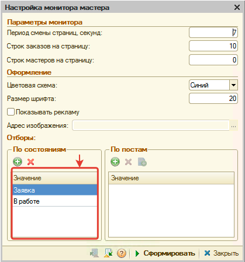

# Монитор мастеров

<table><tr><td><b>Время чтения:</b> 4 мин.</td><td><b>Обновлено:</b> 27.06.2022</td></tr></table>

Источник: https://www.5systems.ru/help/monitor-masterov

## Содержание

1. [Введение](#введение)
2. [Запуск обработки для отображения на мониторе](#запуск-обработки-для-отображения-на-мониторе)
   - [Отображение на мониторе](#отображение-на-мониторе)
3. [Настройка обработки](#настройка-обработки)
   - [Параметры настройки](#параметры-настройки)

## Введение

*Монитор мастеров* - обработка, которая позволяет на отдельном мониторе отобразить:

- информацию о загруженности на текущий момент цехов,
- информацию о свободных на текущий момент механиках (используется УРВ),
- рекламу.

На основе данной информации:

- клиент в процессе ожидания может следить за состоянием ремонта своего автомобиля и ознакомиться с рекламными предложениями сервиса,
- мастер-приемщик может отслеживать загруженность механиков и распределять в зависимости от этого автомобили.

## Запуск обработки для отображения на мониторе

Для запуска обработки перейдите по *меню программы*: CRM → Обработки → Монитор мастеров:

Если обработка ранее не открывалась, то вначале откроется *окно настройки*. После настройки нужных параметров перейдите в *режим отображения монитора*, нажав кнопку "Сформировать":

Если обработка ранее открывалась, то сразу *отобразится монитор*.

Для перехода к настройкам из режима отображения монитора, нажмите кнопку "Настройка полей поиска" в нижней правой части окна или клавишу F2.

### Отображение на мониторе

**Страница 1 - Загруженность по цехам и свободные матера**

**Страница 2 - Реклама**

## Настройка обработки

При настройке обработки обязательно необходимо установить отбор по состояниям заказ-нарядов, которые будут отслеживаться на мониторе:

### Параметры настройки

<table><tr><th>Ключевой показатель</th><th>Описание</th></tr><tr><td colspan="2"><b><i>Параметры монитора</i></b></td></tr><tr><td><b>Период смены страниц, секунд</b></td><td>Количество секунд, через которое будут переключаться слайды с листом загрузки на рекламу и наоборот.</td></tr><tr><td><b>Строк заказов на страницу</b></td><td>Количество заказ-нарядов, которое должно отображаться в блоке "Загрузка цехов"</td></tr><tr><td><b>Строк мастеров на страницу</b></td><td>Количество мастеров, которое должно отображаться в блоке "Свободные мастера"</td></tr><tr><td colspan="2"><b><i>Оформление</i></b></td></tr><tr><td><b>Цветовая схема</b></td><td>Цвет оформления монитора с отображением информации о загрузке</td></tr><tr><td><b>Размер шрифта</b></td><td>Размер шрифта на мониторе с отображением информации о загрузке</td></tr><tr><td><b>Показывать рекламу</b></td><td>При установке флажка на мониторе появляется изображение, указанное по адресу в параметре "Адрес изображения"</td></tr><tr><td><b>Адрес изображения</b></td><td>Адрес изображения с рекламой, которое должно отображаться на мониторе. Параметр доступен при установке флажка "Показывать рекламу".</td></tr><tr><td colspan="2"><b><i>Отборы</i></b></td></tr><tr><td><b>По состояниям</b></td><td>Выбор состояний заказ-нарядов, по которым отображается блок "Загруженность цехов"</td></tr><tr><td><b>По постам</b></td><td>Выбор постов, по которым отображается блок "Загруженность цехов"</td></tr></table>

---

**Теги:** автосервис, монитор мастеров, загрузка цехов, механики, урв
