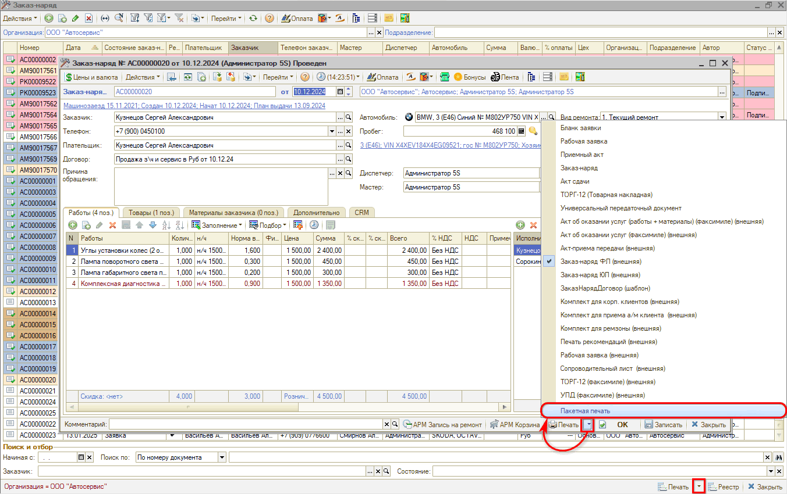
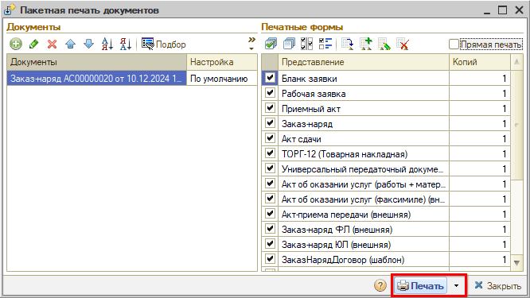
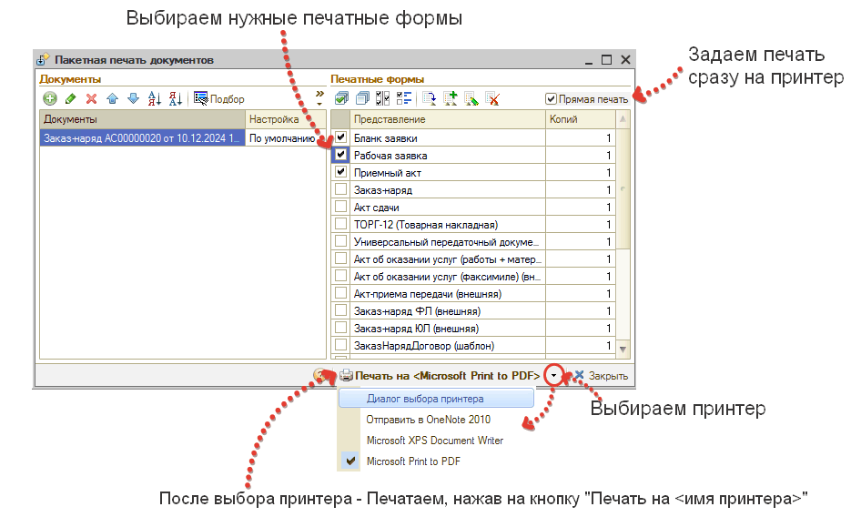

# Пакетная печать

<table><tr><td><b>Время чтения:</b> 4 мин.</td><td><b>Обновлено:</b> 23.12.2024</td></tr></table>

Источник: https://www.5systems.ru/help/paketnaya-pechat

Функционал *пакетной, или групповой, печати документов* предусмотрен, чтобы не печатать последовательно каждый документ, а печатать сразу комплект необходимых документов.

Пакетная печать в 5S AUTO реализована как из формы документа (например, Заказ-наряда), так и непосредственно из формы списка этих документов (например, реестра Заказ-нарядов).

Для этого требуется нажать на стрелку рядом с кнопкой «Печать» и в открывшемся меню выбрать вариант «Пакетная печать»

В открывшемся окне требуется выбрать галочками нужные для печати документы (и снять галочки с ненужных), а также задать количество копий (экземпляров), и нажать кнопку «Печать».

После этого, в программе откроются все печатные формы и можно будет с каждой индивидуально работать: решать какие напечатать сразу для отправки в цех, какие отправить клиенту через мессенджеры и др.

Для того, чтобы все печатные формы сразу ушли на принтер, требуется поставить галочку возле «Прямая печать».

---

**Теги:** пакетная печать, групповая печать, печатные формы, прямая печать

