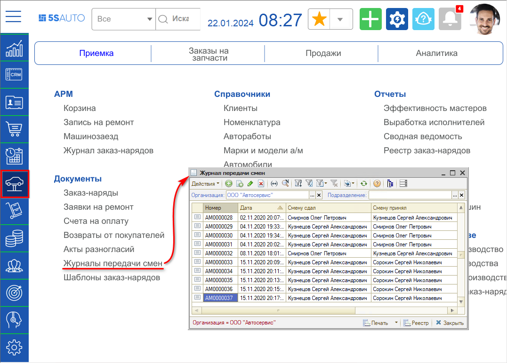
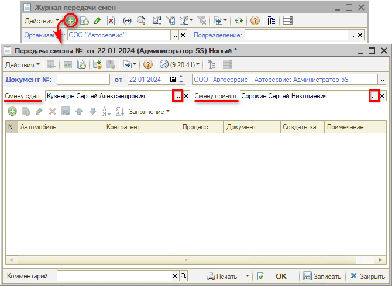
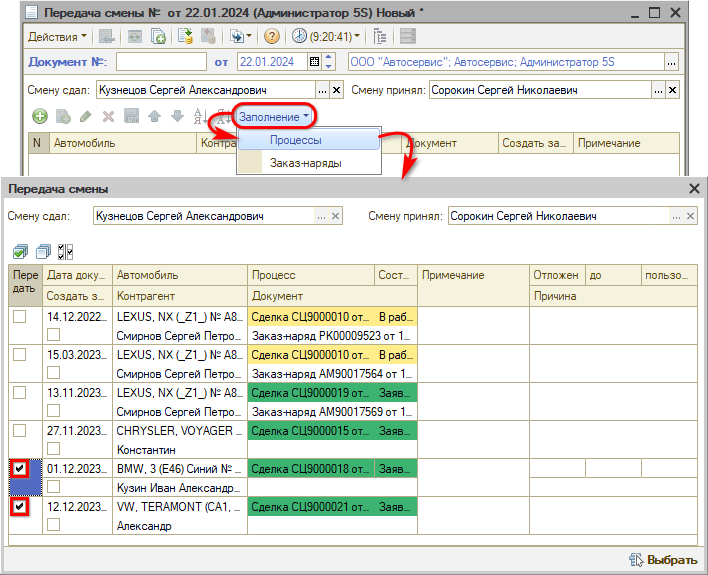
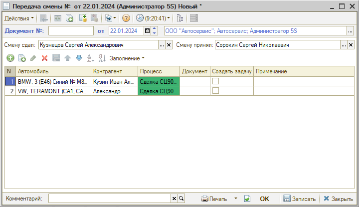
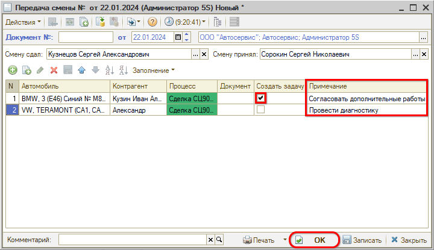
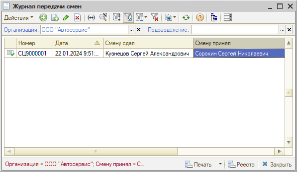
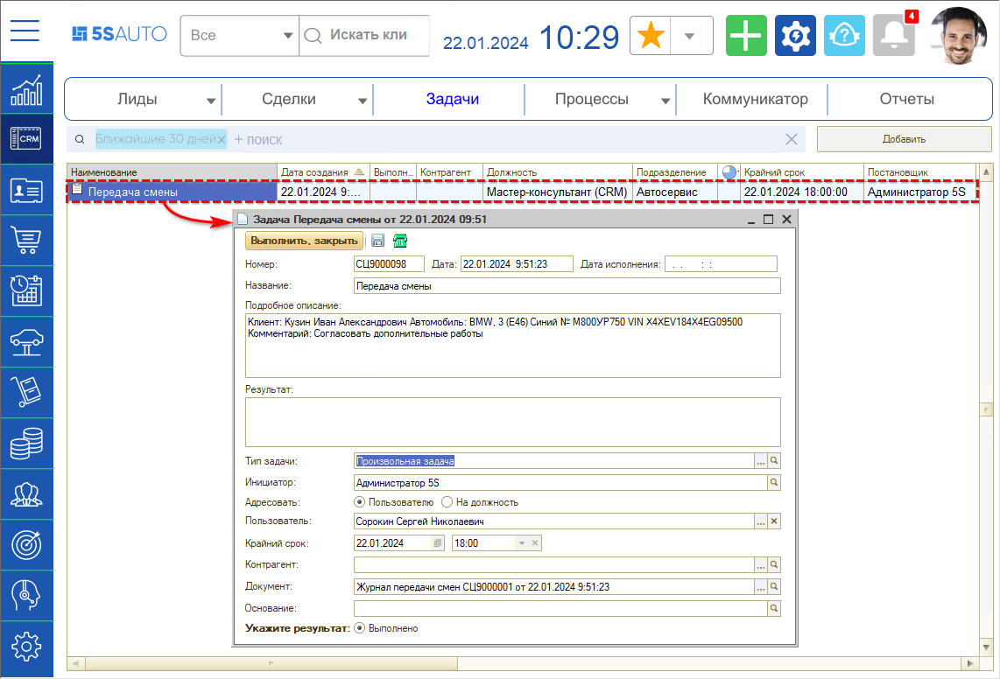
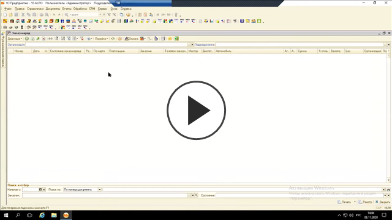

# Передача смен

<table><tr><td><b>Время чтения:</b> 10 мин.</td><td><b>Обновлено:</b> 22.01.2024</td></tr></table>

Источник: https://www.5systems.ru/help/peredacha-smen

## Содержание

- [Введение](#введение)
- [Журнал передачи смен](#журнал-передачи-смен)
  - [Заполнение журнала передачи смен](#заполнение-журнала-передачи-смен)
- [Видео по теме](#видео-по-теме)

## Введение

Когда мастер заканчивает смену и уходит на выходной, но на нем есть незавершенные процессы или работы по заказ-нарядам, он может передать их другому мастеру с помощью *Журнала передачи смен*.

**Журнал передачи смен** позволяет передать на исполнение заказ-наряды или процессы другому мастеру с указанием комментария о том, что необходимо сделать. При необходимости можно назначить задачу на выполнение каких-то дополнительных работ.

## Журнал передачи смен

Предполагается, что в начале своей смены мастер просматривает *Журнал передачи смен*, чтобы запланировать работы с учетом переназначенных на него заказ-нарядов и процессов.

Перейти в *Журнал передачи смен* можно через меню программы: *Автосервис → Приемка → Документы → Журналы передачи смен* или через стандартное меню: *CRM → Документы → Журнал передачи смен.*

В журнале пользователь видит только те записи о передаче смены, где он участвует. За исключением пользователей с должностью CRM «Управляющий директор» (см. [*Адресация задач в CRM по исполнителям → Описание должностей CRM*](https://5systems.ru/help/adresaciya-zadach-v-crm-po-ispolnitelyam)) — пользователь с данной должностью (ролью) видит все записи в журнале.

### Заполнение журнала передачи смен

Создайте новый элемент в журнале нажатием на кнопку «Добавить», в поле «Смену сдал» выберите мастера, передающего смену, в поле «Смену принял» — мастера, принимающего смену:

С помощью кнопки «Заполнение» отметьте заказ-наряды или процессы, которые нужно передать и нажмите «Выбрать»:

В списке выбора заказ-нарядов и процессов по умолчанию работает отбор по мастеру, указанному в поле «Смену сдал», и доступны для выбора только открытые заказ-наряды и процессы.

Выбранные заказ-наряды и процессы отобразятся в передаче смены:

По каждому отдельному процессу или документу можно указать примечание для мастера, принимающего смену, затем необходимо записать изменения:

*Внимание!* Если установить флажок «Создать задачу», то создастся задача, которая адресуется мастеру, принимающего смену, для исполнения.

После сохранения записи о Передаче смены, данная запись отобразится в журнале передачи смены. В результате, когда мастер, принимающий смену, зайдет в журнал, он увидит, что на него назначены заказ-наряды или процессы:

По заказ-наряду или процессу с отметкой «Создать задачу» мастер, принимающий смену, получит задачу:

## Видео по теме

**[Вебинар по теме «Журнал передачи смен» от 06.11.2020 — начиная c 14:32](https://youtu.be/9MIk6y-bgmc):**

---

**Теги:** передача смен, журнал передачи смен, мастер, заказ-наряд, процессы, задача

