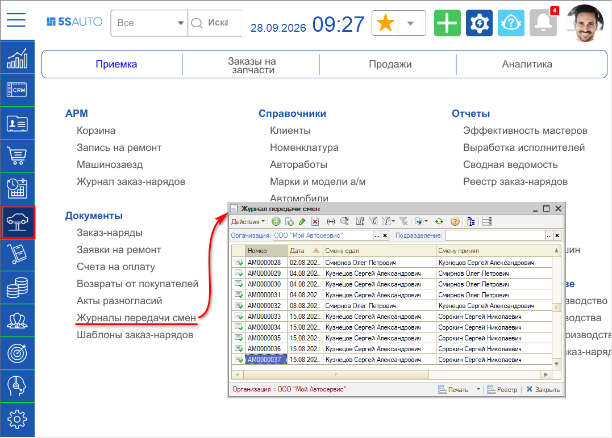
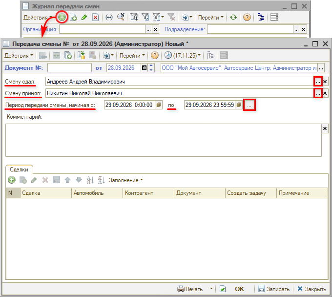
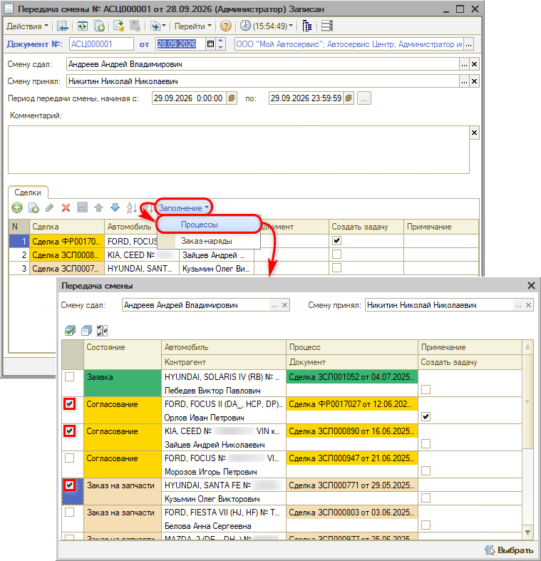
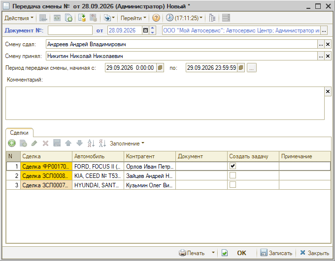
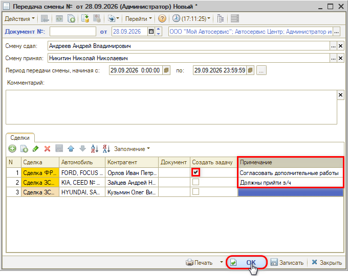
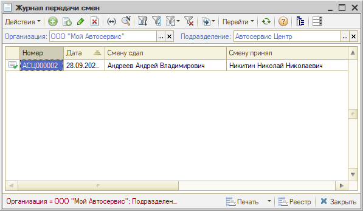
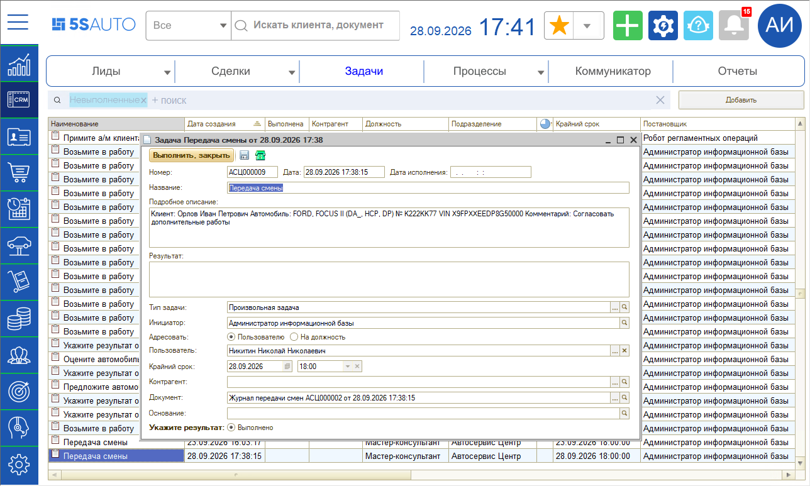
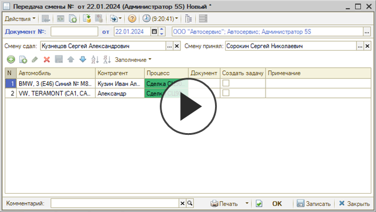

# Передача смен

<table><tr><td><b>Время чтения:</b> 10 мин.</td><td><b>Обновлено:</b> 29.09.2026</td></tr></table>

Источник: https://www.5systems.ru/help/peredacha-smen

> *Функционал обновлен в релизе 5S AUTO **2.8.5**: доступ сменщика к переданным процессам, период передачи смены.*

> *Комментарий: форма передачи смены обновлена с релиза 2.8.4.2; в описании релиза и в статье указан 2.8.5.*

> *Статья редактируется, релиз готовится к выходу.*

## Содержание

- [Введение](#введение)
- [Журнал передачи смен](#журнал-передачи-смен)
  - [Заполнение журнала передачи смен](#заполнение-журнала-передачи-смен)
- [Видео по теме](#видео-по-теме)

## Введение

Когда мастер заканчивает смену и уходит на выходной, но на нем есть незавершенные процессы или работы по заказ-нарядам, он может передать их другому мастеру с помощью *Журнала передачи смен*.

**Журнал передачи смен** позволяет передать на исполнение заказ-наряды или процессы другому мастеру с указанием комментария о том, что необходимо сделать. При необходимости можно назначить задачу на выполнение каких-то дополнительных работ.

На период передачи смены мастер, принимающий смену, получает доступ к переданным процессам:

- ***канбан / список*** – при установленном фильтре *«Мои сделки»* мастер видит не только свои сделки, но и мастера, передавшего смену (о фильтрах см. в статьях «[Канбан сделок → Поиск и фильтрация сделок в канбане](../../CRM/Канбан%20сделок/kanban-sdelok.md#поиск-и-фильтрация-сделок-в-канбане)» и «[Список сделок → Быстрые фильтры](../../CRM/Список%20сделок/spisok-sdelok.md#быстрые-фильтры)»);
- ***звонки*** – звонки клиентов по переданным процессам переводятся на мастера, принявшего смену;
- ***чаты*** – мастеру, принявшему смену, передаются чаты клиентов по переданным процессам;
- ***уведомления*** – мастер, принявший смену, получает уведомления о пришедших сообщениях клиентов по этим процессам.

## Журнал передачи смен

Предполагается, что в начале своей смены мастер просматривает *Журнал передачи смен*, чтобы запланировать работы с учетом переназначенных на него заказ-нарядов и процессов.

Перейти в *Журнал передачи смен* можно через меню программы: *Автосервис → Приемка → Документы → Журналы передачи смен* или через стандартное меню: *CRM → Документы → Журнал передачи смен.*

В журнале пользователь видит только те записи о передаче смены, где он участвует. За исключением пользователей с должностью CRM «Управляющий директор» (см. [*Адресация задач в CRM по исполнителям → Описание должностей CRM*](../../Задачи/Адресация%20задач%20в%20CRM%20по%20исполнителям/adresaciya-zadach-v-crm-po-ispolnitelyam.md)) — пользователь с данной должностью (ролью) видит все записи в журнале.

### Заполнение журнала передачи смен

> *Форма передачи смены обновлена начиная с релиза 5S AUTO **2.8.5**.*

Создайте новый элемент в журнале нажатием на кнопку «Добавить», в поле «Смену сдал» выберите мастера, передающего смену, в поле «Смену принял» — мастера, принимающего смену.

В параметре *«Период передачи смены, начиная с … по»* укажите, на какой период сменщик принимает смену. Например: при графике 2/2 – с 29 по 30 сентября, на время отпуска – с 28 сентября по 25 октября, при работе в утреннюю и вечернюю смены – с 15:00 до 23:59 29 сентября (завтрашнего дня):

Нажмите «Заполнение» и выберите «Процессы» – в списке будут открытые сделки мастера из поля «Смену сдал». Отметьте сделки, которые нужно передать, и нажмите «Выбрать». Так же через «Заполнение → Заказ-наряды» можно передать заказ-наряды:

В списке выбора заказ-нарядов и процессов по умолчанию работает отбор по мастеру, указанному в поле «Смену сдал», и доступны для выбора только открытые заказ-наряды и процессы.

Выбранные сделки и заказ-наряды отобразятся в передаче смены на вкладке «Сделки»:

По каждому отдельному процессу или документу можно указать примечание для мастера, принимающего смену, затем необходимо записать изменения кнопкой «Записать» или «ОК»:

> [!NOTE]
> Если установить флажок «Создать задачу», на мастера, принимающего смену, будет создана задача для исполнения.

После сохранения записи о Передаче смены, данная запись отобразится в журнале передачи смены. В результате, когда мастер, принимающий смену, зайдет в журнал, он увидит, что на него назначены заказ-наряды или процессы:

По заказ-наряду или процессу с отметкой «Создать задачу» мастер, принимающий смену, получит задачу:

## Видео по теме

**[Вебинар](https://youtu.be/9MIk6y-bgmc) по теме «Журнал передачи смен» от 06.11.2020 — начиная c 14:32:**

---

**Теги:** передача смен, журнал передачи смен, мастер, заказ-наряд, процессы, задача
