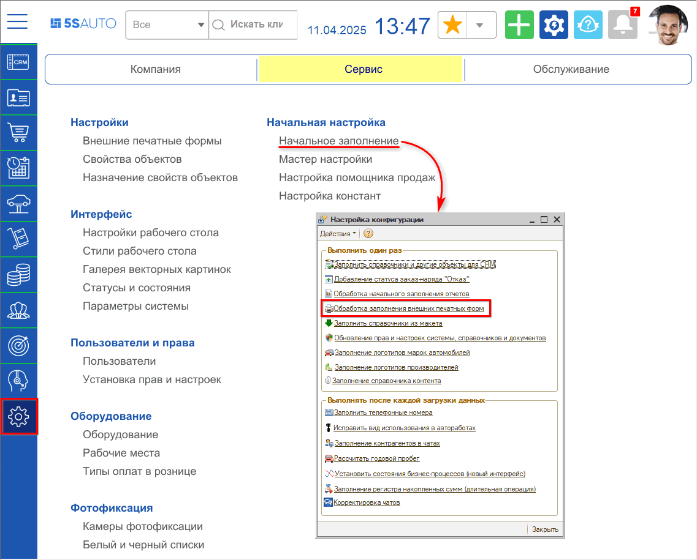
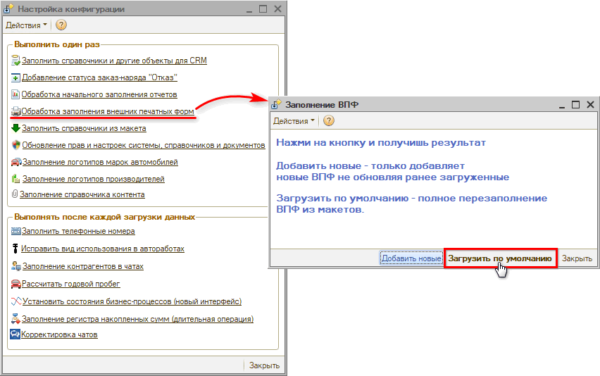
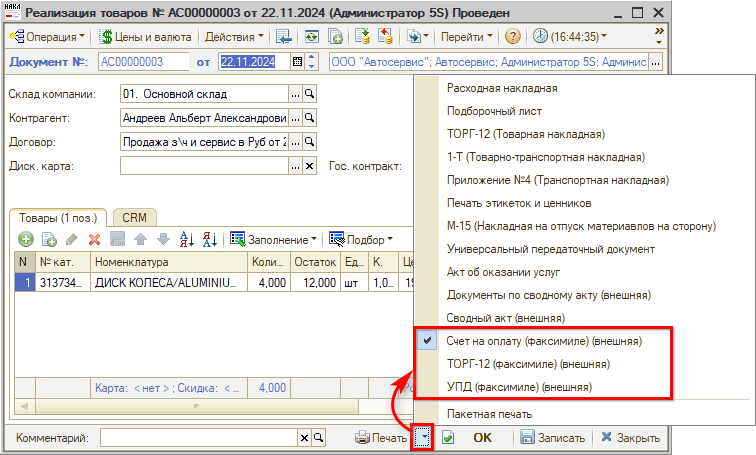
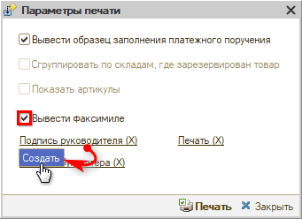
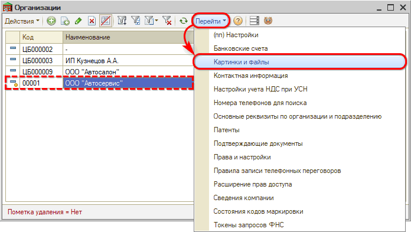
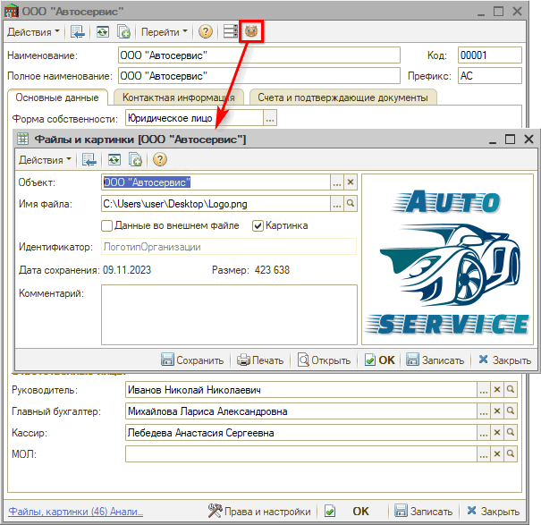
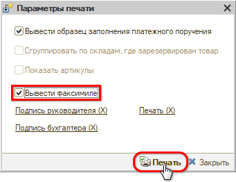

# Печать документов с факсимиле и логотипом организации

<table><tr><td><b>Время чтения:</b> 7 мин.</td><td><b>Обновлено:</b> 11.04.2025</td></tr></table>

Источник: https://www.5systems.ru/help/pechat-dokumentov-s-faksimile-i-logotipom-organizacii

## Содержание

- [Введение](#введение)
- [Настройка](#настройка)
  - [1. Загрузка внешних печатных форм](#1-загрузка-внешних-печатных-форм)
  - [2. Загрузка картинок факсимиле](#2-загрузка-картинок-факсимиле)
  - [3. Загрузка логотипа организации](#3-загрузка-логотипа-организации)
- [Печать с факсимиле](#печать-с-факсимиле)

## Введение

В программе есть возможность печатать документы для реализации товаров с использованием факсимиле: подпись руководителя, подпись бухгалтера, печать организации. Печать с факсимиле происходит через *внешние печатные формы*.

Кроме того, большинство встроенных и внешних печатных форм поддерживают возможность отображения логотипа организации — см. [ниже](#3-загрузка-логотипа-организации).

## Настройка

### 1. Загрузка внешних печатных форм

Для загрузки печатных форм, поддерживающих факсимиле:

**1.** Перейдите к обработке *«Начальное заполнение»* (*Администрирование → Сервис → Начальная настройка → Начальное заполнение):*

**2.** Выполните обработку заполнения внешних печатных форм:

В результате загрузятся следующие внешние печатные формы:

*&nbsp;&nbsp;&nbsp;● &nbsp;Счет на оплату (факсимиле) (внешняя);*
*&nbsp;&nbsp;&nbsp;● &nbsp;ТОРГ-12 (факсимиле) (внешняя);*
*&nbsp;&nbsp;&nbsp;● &nbsp;УПД (факсимиле) (внешняя)*

### 2. Загрузка картинок факсимиле

Есть два способа загрузить картинку с факсимиле в программу.

**Способ 1.**

Перейдите к печати документа через внешнюю печатную форму, поддерживающую факсимиле.

В параметрах печати установите флажок «Вывести факсимиле» и, кликнув на один из вариантов факсимиле, загрузите картинку:

Если картинка с факсимиле загружена, в меню управления факсимиле появляется возможность заменить, просмотреть или удалить картинку.

**Способ 2.**

Перейдите в справочник «Организации», выберите организацию, для которой нужно загрузить факсимиле, и нажмите меню *«Перейти → Картинки и файлы»:*

Загрузите картинку с соответствующим идентификатором:

*&nbsp;&nbsp;&nbsp;● &nbsp;*Для подписи руководителя — *ПодписьРуководителяФаксимиле*
*&nbsp;&nbsp;&nbsp;● &nbsp;*Для подписи бухгалтера — *ПодписьБухгалтераФаксимиле*
*&nbsp;&nbsp;&nbsp;● &nbsp;*Для печати организации — *ПечатьФаксимиле*

### 3. Загрузка логотипа организации

Для загрузки логотипа перейдите в справочник «[Организации](https://5systems.ru/help/spravochnik-organizacii)», выберите организацию, для которой необходимо загрузить логотип, нажмите на кнопку «Логотип организации», выберите файл для загрузки с картинкой логотипа и сохраните изменения:

## Печать с факсимиле

Перейдите к печати документа через внешнюю печатную форму, поддерживающую факсимиле.

В параметрах печати установите флажок «Вывести факсимиле» и нажмите кнопку «Печать»:

Установленные параметры печати сохраняются — в данном случае флажок «Вывести факсимиле» будет установлен при повторном вызове печати.

---

**Теги:** факсимиле, логотип организации, внешние печатные формы, подпись руководителя, подпись бухгалтера, печать организации

