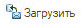
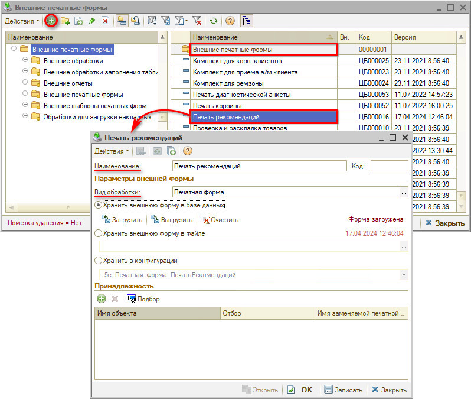
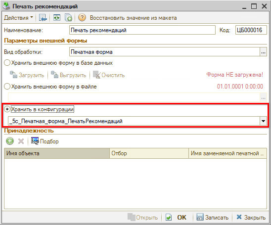
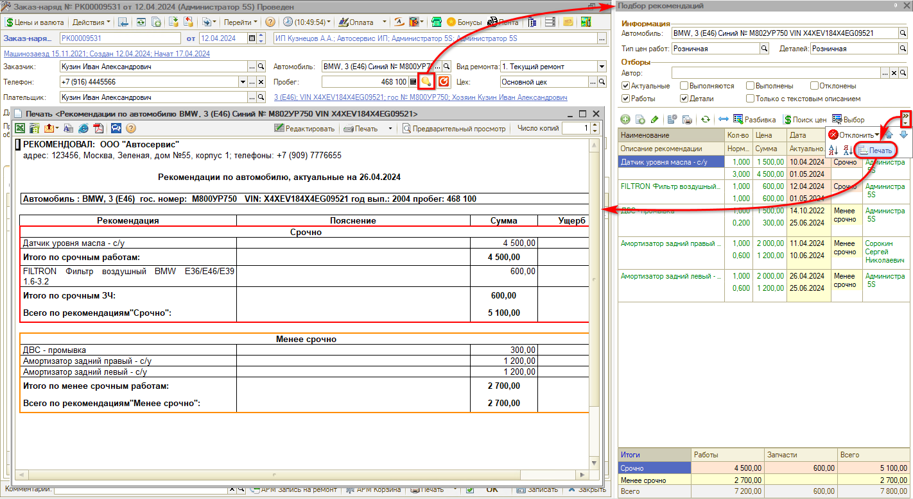
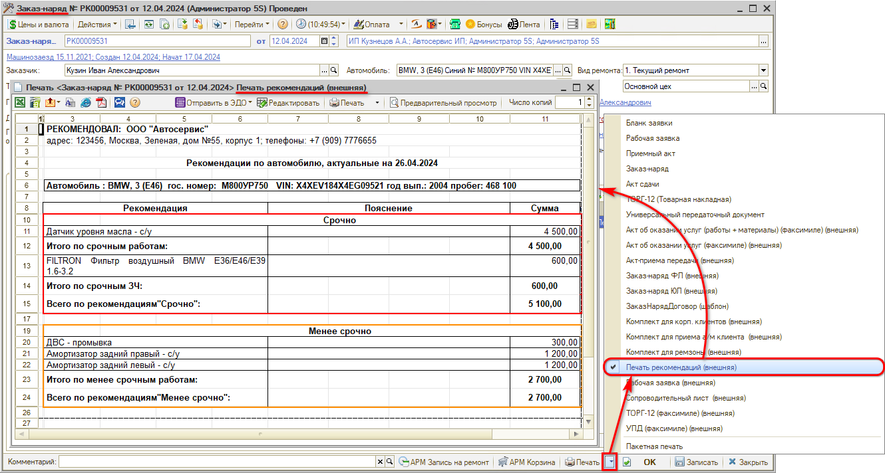
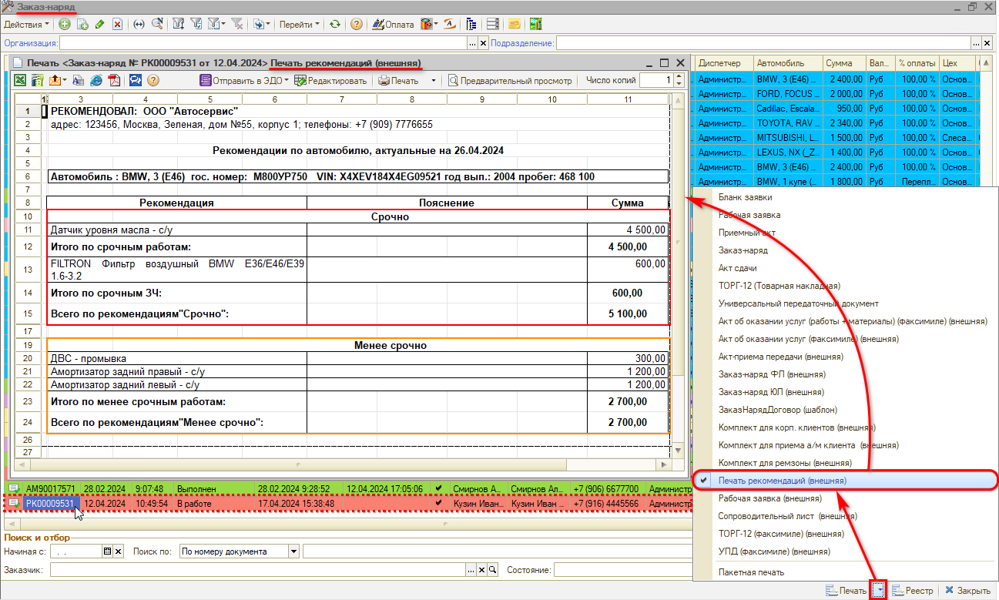
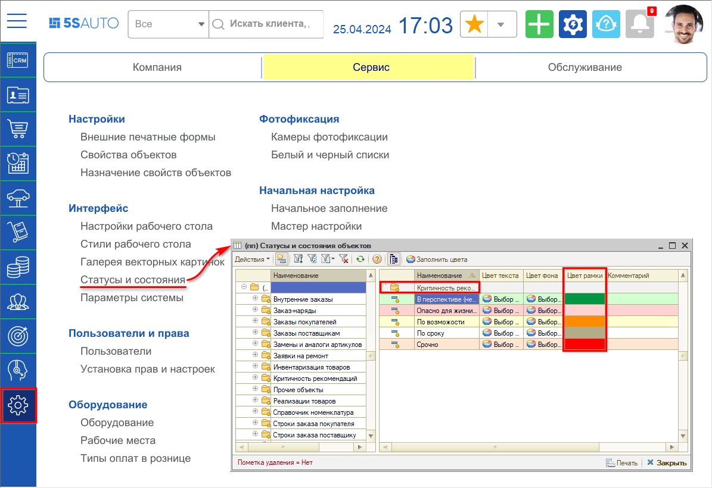

# Подключение внешней печатной формы «Печать рекомендаций»

<table><tr><td><b>Время чтения:</b> 6 мин.</td><td><b>Обновлено:</b> 01.09.2026</td></tr></table>

Источник: https://www.5systems.ru/help/podklyuchenie-vneshney-pechatnoy-formy-pechat-rekomendaciy

*Актуально для релиза 2.7.1.*

## Содержание

- [Введение](#введение)
- [Подключение внешней формы печати рекомендаций](#подключение-внешней-формы-печати-рекомендаций)
- [Работа механизма](#работа-механизма)
- [Настройка цвета рамок](#настройка-цвета-рамок)

## Введение

В программе реализована стандартная форма печати рекомендаций (см. статью «[Работа с рекомендациями → Печать рекомендаций](../Работа%20с%20рекомендациями/rabota-s-rekomendaciyami.md#печать-рекомендаций)»). При необходимости можно подключить внешнюю форму печати — из конфигурации или загрузить любую свою (сначала ее должен разработать программист).

Внешняя форма печати рекомендаций в решении 5S AUTO предоставляет расширенные возможности работы с рекомендациями с целью увеличения чека. Отличия от стандартной печатной формы:

- Группировка рекомендаций по критичности / срочности (сначала отображаются срочные рекомендации, ниже — менее срочные);
- Вывод на печать суммы потенциального ущерба, который может наступить, если клиент не последует рекомендации.

## Подключение внешней формы печати рекомендаций

Для подключения внешней формы печати рекомендаций в справочнике **«Внешние печатные формы»** в папке «Внешние печатные формы» создается элемент «Печать рекомендаций», задается наименование, выбирается вид обработки «Печатная форма». Сама форма загружается нажатием на кнопку «Загрузить»  *(файл для загрузки: [5с Печатная форма ПечатьРекомендаций.zip](attachments/5s-pechatnaya-forma-pechat-rekomendaciy.zip)):*

Если релиз актуальный, печатную форму можно подключить из конфигурации:

При необходимости можно задать принадлежность печатной формы — например, принадлежность документу «Заказ-наряд». В таком случае печатная форма рекомендаций будет доступна для выбора среди [печатных форм Заказ-наряда](https://5systems.ru/help/zakaz-naryady#pechat) при нажатии на стрелку рядом с кнопкой «Печать».

## Работа механизма

Загруженная форма будет вызываться на печать из Подбора рекомендаций вместо стандартной формы печати рекомендаций.

Печатную форму можно подключить к Заказ-наряду. Для этого устанавливается принадлежность — документ «Заказ-наряд».

После этого печатную форму можно будет вызвать из самого Заказ-наряда:

а также из реестра Заказ-нарядов: выделить кликом мыши строку с нужным Заказ-нарядом, нажать кнопку «Выбор печатной формы» (стрелка рядом с кнопкой «Печать»), выбрать «Печать рекомендаций (внешняя)». Откроется эта же загруженная печатная форма:

Колонка «Ущерб» будет выводиться на печать, если она отображается в форме «Подбор рекомендаций». Если ее нет, нужно воспользоваться «Настройкой списка» и отметить колонку «Ущерб».

Загруженная внешняя форма печати рекомендаций будет использоваться при автоматической отправке сообщений по рекомендациям вместо стандартной формы.

## Настройка цвета рамок

См. статью «[Настройка цветового оформления статусов и состояний](https://5systems.ru/help/nastroyka-cvetovogo-oformleniya-statusov-i-sostoyaniy)».

При необходимости можно настроить нужный цвет рамок выводимой на печать таблицы в зависимости от критичности рекомендаций:

---

**Теги:** рекомендации, печать рекомендаций, внешняя печатная форма, критичность

