

# Заказ-наряды

<table><tr><td><b>Время чтения:</b> 25 мин.</td><td><b>Обновлено:</b> 06.02.2025</td></tr></table>

Источник: https://www.5systems.ru/help/zakaz-naryady

## Содержание

- [Введение](#введение)
- [Назначение документа](#назначение-документа)
- [Интерфейс Заказ-наряда](#интерфейс-заказ-наряда)
  - [Функциональные кнопки верхней панели Заказ-наряда](#функциональные-кнопки-верхней-панели-заказ-наряда)
  - [Панель реквизитов документа](#панель-реквизитов-документа)
  - [Данные по клиенту](#данные-по-клиенту)
  - [Данные по автомобилю](#данные-по-автомобилю)
  - [Данные о ремонте](#данные-о-ремонте)
  - [Состояние Заказ-наряда](#состояние-заказ-наряда)
  - [Сумма](#сумма)
- [Вкладки табличной части Заказ-наряда](#вкладки-табличной-части-заказ-наряда)
  - [1. Вкладка «Работы»](#1-вкладка-работы)
    - [Исполнители и процент участия](#исполнители-и-процент-участия)
  - [2. Вкладка «Товары»](#2-вкладка-товары)
  - [3. Вкладка «Материалы заказчика»](#3-вкладка-материалы-заказчика)
  - [4. Вкладка «Дополнительно»](#4-вкладка-дополнительно)
  - [5. Вкладка «CRM»](#5-вкладка-crm)
- [Кнопки нижней панели Заказ-наряда](#кнопки-нижней-панели-заказ-наряда)
- [Дерево связей Заказ-наряда](#дерево-связей-заказ-наряда)
- [Печать Заказ-наряда](#печать-заказ-наряда)
- [Работа с реестром Заказ-нарядов](#работа-с-реестром-заказ-нарядов)
- [Видеоинструкции по работе с Заказ-нарядами](#видеоинструкции-по-работе-с-заказ-нарядами)

## Введение

Одним из основных документов 5S AUTO является **Заказ-наряд** — это чистовой вариант заполнения информации по выполнению работ, использованию в производстве запчастей, в том числе материалов заказчика и т. д.

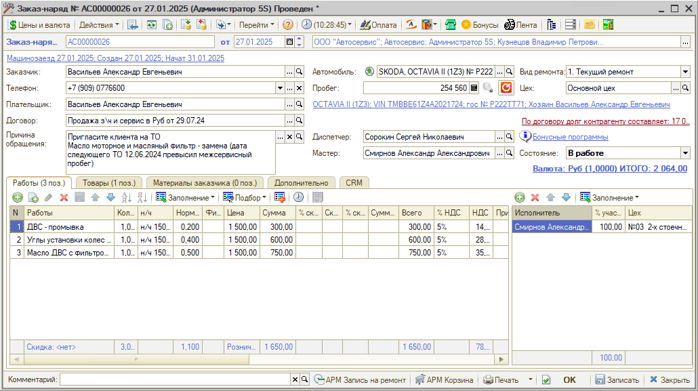

## Назначение документа

Документ «Заказ-наряд» предназначен для фиксации факта выполнения ремонта автомобиля и реализации деталей для выполнения данного ремонта. С помощью данного документа учитывается информация о выполнении ремонта (запасные части, работы, исполнители).

Также «Заказ-наряд» компонует и объединяет другие документы, связанные с ремонтом. Просмотреть связанные документы можно с помощью механизма «Дерево подчиненности документа»: *см. [ниже](#дерево-связей-заказ-наряда)*.

## Интерфейс Заказ-наряда

**Основные поля Заказ-наряда:**

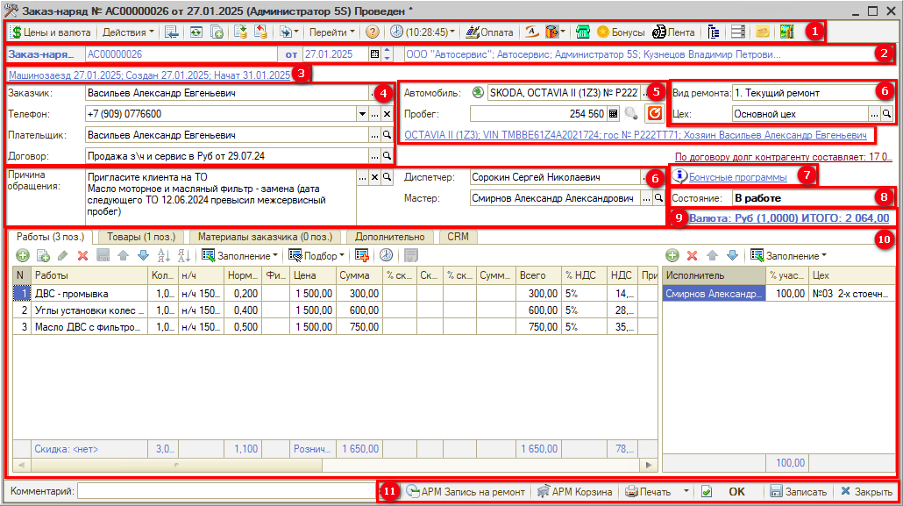

1. Функциональные кнопки верхней панели.
2. Панель реквизитов документа.
3. Даты Заказ-наряда.
4. Данные по клиенту.
5. Данные по автомобилю.
6. Данные о ремонте.
7. Бонусные программы: кнопка-ссылка отображается при наличии дисконтной карты у клиента.
8. Состояние Заказ-наряда.
9. Сумма.
10. Табличная часть Заказ-наряда.
11. Кнопки нижней панели Заказ-наряда.

### Функциональные кнопки верхней панели Заказ-наряда

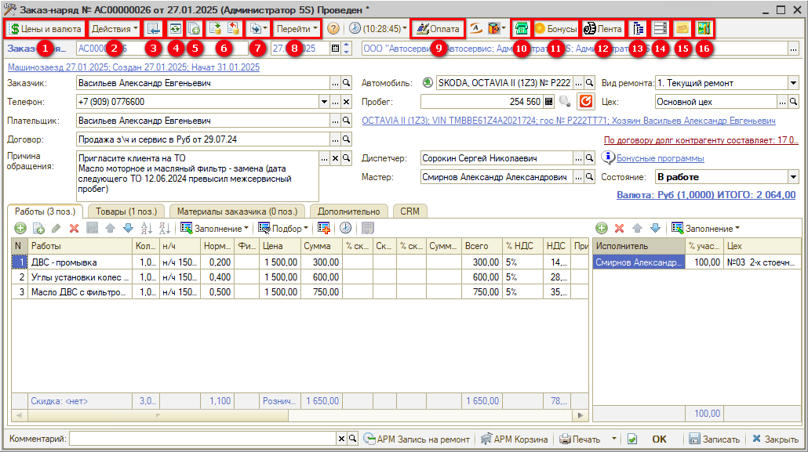

1. **Цены и валюта:** настройка типов цен и курса валют, в которых отгружаются детали для выполнения работ по Заказ-наряду.
2. **Действия:** открыть меню действий с документом.
3. **Найти в списке:** перейти к [реестру](#работа-с-реестром-заказ-нарядов) Заказ-нарядов с позиционированием на текущем документе.
4. **Обновить:** перечитать данные документа.
5. **Добавить копированием:** создать новый Заказ-наряд копированием.
6. **Провести / Отмена проведения:** провести Заказ-наряд / отменить проведение.
7. **Ввести на основании:** создать документ на основании текущего Заказ-наряда.
8. **Перейти:** открыть меню перехода к связанной информации.
9. **Оплата:** оплата принимается перед закрытием Заказ-наряда, для этого Заказ-наряд должен быть записан.
10. **Позвонить:** прямо из формы Заказ-наряда можно позвонить клиенту.
11. **Бонусы:** информация о бонусных баллах клиента (кнопка активна, если у клиента есть дисконтная карта).
12. **Лента:** открывается Лента событий, где отражена вся история общения с данным клиентом.
13. **Дерево связей:** перейти к структуре подчиненности связанных с текущим Заказ-нарядом документов (см. [ниже](#дерево-связей-заказ-наряда)).
14. **Свойства:** открыть панель свойств.
15. **Заметки:** открыть список [заметок](https://www.5systems.ru/help/rabota-s-zametkami).
16. **Изображения:** открыть картинки и файлы, прикрепленные к документу.

### Панель реквизитов документа

- Номер Заказ-наряда;
- Дата создания Заказ-наряда;
- Общие реквизиты: организация, подразделение (цех), автор/последний редактор:

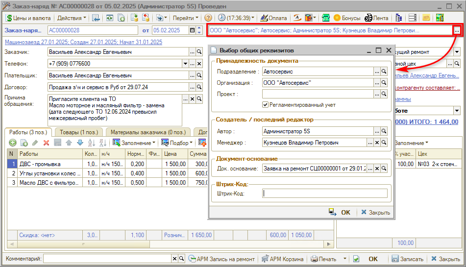

### Данные по клиенту

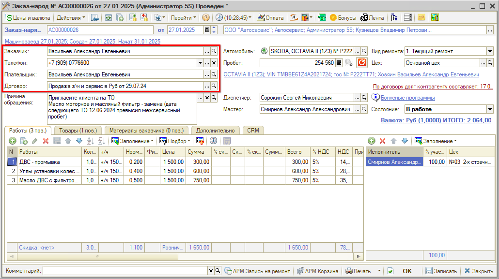

- **Заказчик** выполнения работ по заказ-наряду — человек, который непосредственно приехал на автомобиле и сдает его в ремонт. Может отличаться от Плательщика и Владельца автомобиля:
  *Пример 1:* Плательщик — юр. лицо, Заказчик — один из сотрудников этой компании (которых может быть указано несколько в качестве контактных лиц);
  *Пример 2:* Владелец автомобиля — бабушка, Заказчик — внучка, Плательщик — страховая компания.
  В качестве контактного номера отображается телефон Заказчика (по умолчанию).
- **Телефон** — телефонный номер, по которому заказчик обратился в автосервис. Телефон может быть выбран из списка, отредактирован или введен новый.
- **Плательщик** — тот, кто оплачивает заказ-наряд. В случае, когда владелец автомобиля и плательщик по заказ-наряду — разные лица (например, ремонт автомобиля через страховые компании), необходимо указать Плательщика. По умолчанию эти реквизиты идентичны. На номер плательщика будут отправляться уведомления о готовности автомобиля при переводе заказ-наряда в состояние «Выполнен». Изменить это можно в настройках Видов ремонта. Например, если плательщик — страховая компания, то можно настроить отправку уведомления о готовности автомобиля на Заказчика ремонта.
- **Договор** — договор, по которому оплачивается Заказ-наряд. В зависимости от настроек договора заказ-наряд изменит свои параметры. Например, при установленной галочке «Автоматическое закрытие сделок» оплата без привязки к сделке может закрыть оплату по этому заказ-наряду. Ранее сделанная переплата по договору может закрыть часть оплаты по заказ-наряду. Скидки, установленные в договоре, будут иметь приоритет перед автоматически устанавливаемыми скидками. Типы цен, указанные в договоре, заменят типы цен по умолчанию и будут использоваться при расчете стоимости заказ-наряда. Задолженность клиента перед компанией формируется на указанный договор.

### Данные по автомобилю

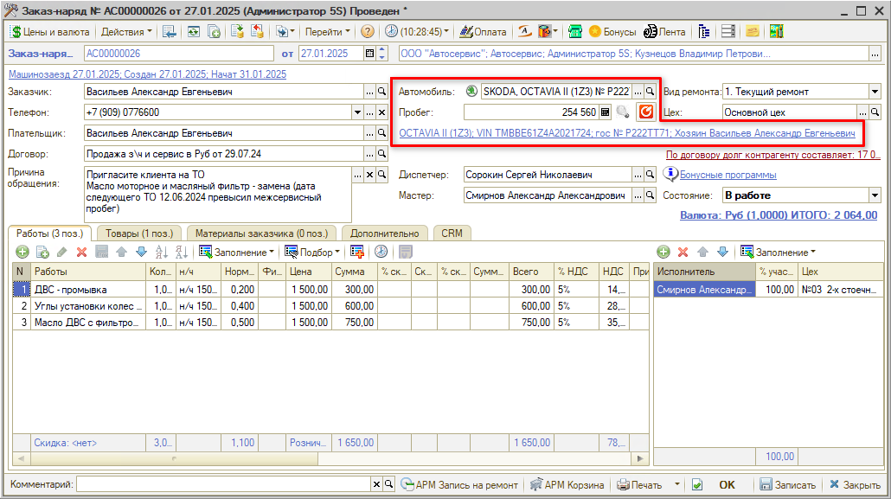

- **Автомобиль** — транспортное средство, которое предстоит ремонтировать. Каждый автомобиль уникален и заносится в программу один раз. В случае переуступки прав на него необходимо указать нового владельца в одноименном поле справочника Автомобили.
  По умолчанию для выбора предлагаются автомобили, владельцем которых является заказчик. При необходимости такой отбор можно отключить и выбрать любой другой автомобиль.
  У одного контрагента может быть несколько автомобилей, и на каждый из них может быть открыт Заказ-наряд. Но на каждый вид ремонта для одного автомобиля не должно быть более одного открытого Заказ-наряда.
- **Пробег** — пробег автомобиля на дату начала работ по заказ-наряду. При заезде автомобиля требуется проконтролировать корректность пробега и ввести точное значение в Заказ-наряд.
  Программа не позволяет ввести значение пробега меньше того, которое было указано ранее. Контроль пробега можно отключить в правах пользователя.
- **Подробная информация о ремонтируемом автомобиле** — модель, VIN-номер, гос. номер, ФИО хозяина. При нажатии на кнопку-ссылку открывается отчет «История автомобиля», с помощью которого можно получить информацию о выполненных заказ-нарядах по выбранному автомобилю или клиенту.
- **Кнопка «Рекомендации»**: если лампочка «горит» — значит, по данному автомобилю есть рекомендации. Нажатием на кнопку открывается обработка «Подбор рекомендаций», где можно просмотреть имеющиеся или подобрать новые рекомендации для автомобиля. Подробнее о работе с рекомендациями см. [статью](../../Работа%20с%20рекомендациями/rabota-s-rekomendaciyami.md).
- **Кнопка перехода в онлайн-каталог** позволяет создать новую расшифровку данного автомобиля или ознакомиться с сохраненной ранее расшифровкой. Можно открыть схему нужного узла автомобиля, уточнить расположение деталей, а также быстро подобрать оригинальные запчасти в случае необходимости. Подробнее о работе с онлайн-каталогом см. [видео](https://youtube.com/playlist?list=PL1_70Sj46HuNC1p1DqeZiTn98pSEw5mZc).

### Данные о ремонте

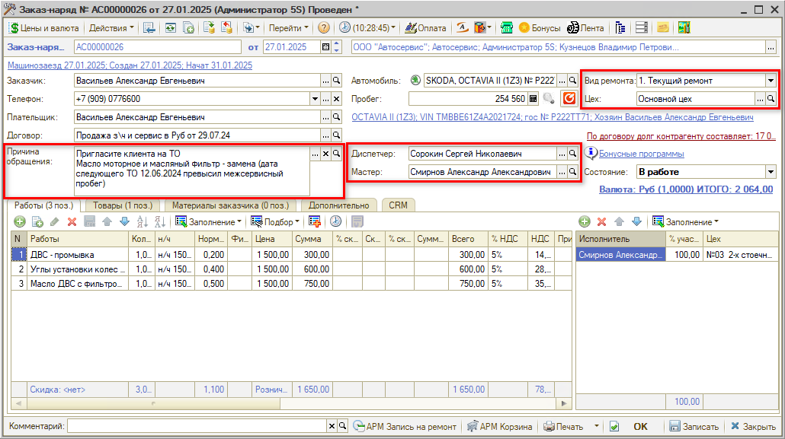

- **Причина обращения** — причина обращения в автосервис, описание неполадок со слов заказчика. Выбирается из справочника причин или заполняется вручную. Так как Заказ-наряд, как правило, создается на основании Заявки на ремонт, то причина обращения подтягивается из нее.
- **Вид ремонта** — вид ремонта, производимого по заказ-наряду. Значение выбирается из справочника *Виды ремонта*.
  Рекомендуется для каждого вида работ, производимых автосервисом, создавать свой вид ремонта, например: «Текущий ремонт», «Автомойка», «Шиномонтаж» и т. д. В случае если будет использоваться только один вид ремонта на все работы, могут возникнуть некоторые сложности или проблемы.
  Например, у клиента есть открытый заказ-наряд с видом ремонта «Текущий ремонт», по которому клиент ожидает запчасти для ремонта. При этом клиент заезжает на мойку: в этом случае требуется открыть новый заказ-наряд с видом ремонта «Мойка». Если для мойки будет создан заказ-наряд с таким же видом ремонта — «Текущий ремонт», — то при его закрытии будут закрыты все связанные документы по обоим заказ-нарядам и обрезано время обеих записей на ремонт! Если второй заказ-наряд будет создан с видом ремонта «Мойка» — то при его закрытии закроется только то, что касается мойки.
  Помимо этого, в зависимости от видов ремонта часто выстраивается ценообразование на работы и детали: в частности, используется деление видов ремонта по типу платный/бесплатный. Заказ-наряд с бесплатным ремонтом — например, гарантийным, — не изменяет взаиморасчетов с контрагентом. Подробнее см. в статье [Виды ремонта](../../Виды%20ремонта/vidy-remonta.md).
- **Цех** — основной цех проведения работ по заказ-наряду. Может изменяться при прохождении автомобиля по ремонтной зоне. При выборе исполнителей работ будет автоматически устанавливаться отбор по указанному цеху. В дальнейшем указание цеха позволит строить отчеты по ремонту с разбивкой по цехам.
- **Диспетчер** — специалист кол-центра или администратор, который произвел запись на выполнение ремонта. Обеспечивает оформление документов по выполнению ремонта. При выборе диспетчера в справочнике «Сотрудники» устанавливается отключаемый фильтр по должности «Диспетчер».
- **Мастер** — мастер-приемщик, ответственный за выполнение ремонта, который будет организовывать всю работу и сопровождать технологический процесс выполнения ремонта. Поле может заполняться автоматически или вручную. При выборе мастера в справочнике «Сотрудники» устанавливается отключаемый фильтр по должности «Мастер». Мастер в данной строке не обязательно равен Мастеру или Менеджеру в табличной части, которые заполняются для каждой работы или товара.

### Состояние Заказ-наряда

Отображается текущее **состояние** заказ-наряда. Данный параметр необходим для определения и фиксации стадии выполнения ремонта.

Переход из одного состояния в другое не выполняется автоматически — его нужно менять вручную, в зависимости от текущей стадии ремонта. Значение выбирается из справочника «Состояния заказ-нарядов».

*Смена состояний Заказ-наряда влияет на смену этапов Сделки.*

При переведении Заказ-наряда в состояние «Заявка», «Согласование», «В работе», «Ожидание деталей», «Ожидание оплаты» связанная с ним Сделка автоматически переводится с предыдущего этапа на этап «В работе».

**Предопределенные состояния Заказ-наряда:**

- **Заявка** — состояние первоначального ввода, приема автомобиля; из Заказ-наряда в этом состоянии можно распечатать сопроводительный лист и другие печатные формы.
  При открытии Заказ-наряда Сделка переходит на этап «В работе».
- **Начать работу** — документ подготовлен и ожидает начала работ.
- **В работе** — исполнители приступают к работам в рамках заказ-наряда. При переходе в это состояние рекомендуется делать перемещение в производство товаров Заказ-наряда. При переведении в это состояние Заказ-наряд проводится.
- **Согласование** — если требуется согласование с клиентом, можно установить данное состояние.
- **Ожидание запчастей** — данное состояние устанавливается, когда требуется оформить или когда уже оформлен заказ поставщику по деталям Заказ-наряда и ожидается поступление этих запчастей.
- **Выполнен** — заказ-наряд полностью выполнен, но еще не закрыт. Данное состояние устанавливается, когда работы выполнены, все работы и товары занесены в Заказ-наряд, при этом все товары перемещены в производство.
  Перед выбором этого состояния требуется проверить правильность заполнения всех табличных частей, т. к. формируются рассылки сообщений, что работа выполнена на определенную сумму. При этом клиенту печатаются все необходимые печатные формы.
  При установке данного состояния связанная с Заказ-нарядом Сделка переходит на этап «Выполнен».
- **Закрыт** — заказ-наряд полностью выполнен и закрыт. Состояние недоступно, если Заказ-наряд не был переведен в состояние «Выполнен». Закрывать Заказ-наряд необходимо после полной оплаты по сделке. Означает окончание ремонтных работ и оформление всех необходимых документов с клиентом.
  При переводе Заказ-наряда в это состояние Сделка переходит на этап «Закрыт».
- **Отказ** — перевод Заказ-наряда в это состояние осуществляется, если выполнить ремонт не удалось по каким-то причинам (клиент отказался или невозможно выполнить ремонт со стороны СТО).
  При переводе Заказ-наряда в данное состояние сделка переходит на этап «Отказ».

*Чтобы сохранить состояние Заказ-наряда, необходимо записать документ.*

О настройке состояний и работе со справочником «Состояния заказ-нарядов» см. в [статье](../Состояния%20Заказ-наряда/sostoyaniya-zakaz-naryada.md).

### Сумма

Общая итоговая **сумма** по товарам и работам в табличной части документа с учетом всех скидок.

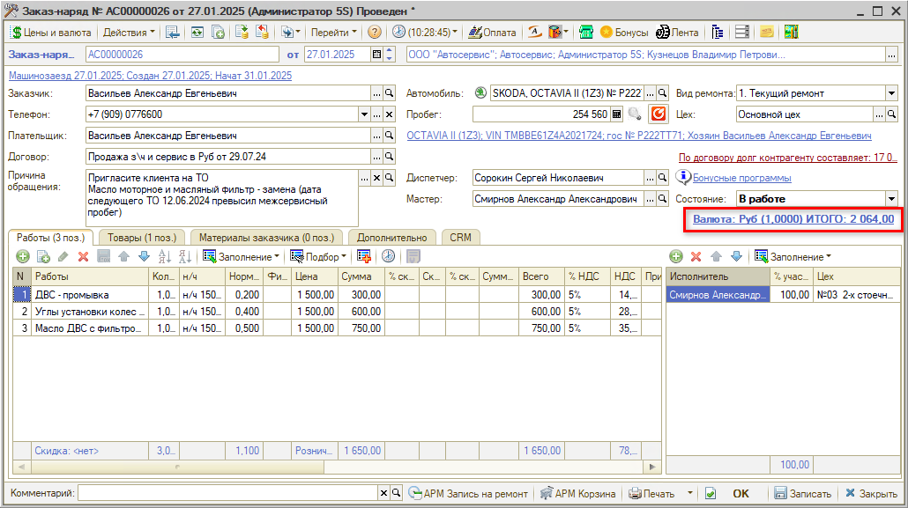

## Вкладки табличной части Заказ-наряда

### 1. Вкладка «Работы»

На вкладке *«Работы»* перечислены все добавленные работы по Заказ-наряду.

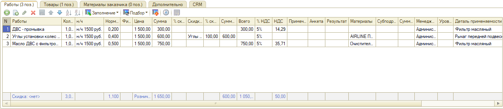

*Основные колонки табличной части «Работы»:* Работы, Количество, Нормочас, Цена, Сумма работ, НДС, % скидки, Сумма скидки, Вид гарантии, Анкета, Материалы, Субподрядчик, Менеджер, Уровень сложности, Деталь применяемости и т. д.

Есть возможность вывести скрытые колонки либо скрыть лишние — для этого следует кликнуть правой кнопкой мыши в любом месте таблицы, в открывшемся меню нажать «Настройка списка». В открывшемся окне настройки установить/снять галочки напротив нужных пунктов и нажать кнопку «ОК»:

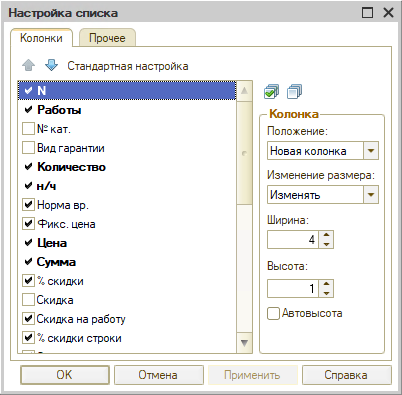

#### Исполнители и процент участия

Для каждой работы в Заказ-наряде можно назначать исполнителей и указывать процент их участия в выполнении данной работы.

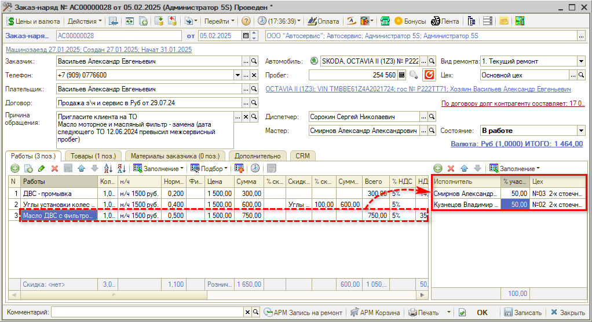

В сумме проценты участия всех исполнителей для каждой работы должны составлять 100%.

Для *быстрого заполнения* таблицы используются кнопки выпадающего меню:

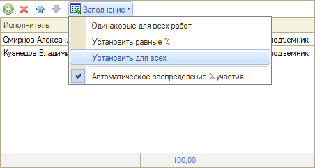

- **Одинаковые для всех работ** — если установлена галочка, то при изменении состава исполнителей и процента их участия для одной работы — изменится для всех; при добавлении новой работы будут установлены те же исполнители с теми же процентами участия;
- **Установить равные %** — устанавливает равные проценты участия для всех исполнителей для выбранной работы: то есть, программа поделит 100% участия в выполнении работы поровну на количество исполнителей;
- **Установить для всех** — устанавливает список исполнителей и проценты участия по примеру одной выбранной работы для всех остальных работ (используется для массового заполнения, если не установлена галочка «Одинаковые для всех работ»);
- **Автоматическое распределение % участия** — для автоматического равномерного распределения процентов участия исполнителей: если галочка стоит, то при изменении процента участия у одного исполнителя программа автоматически распределит оставшиеся проценты между остальными исполнителями; если галочка не стоит — нужно будет проставлять процент для каждого исполнителя вручную (и самостоятельно считать, чтобы в сумме было 100%).

### 2. Вкладка «Товары»

На вкладке *«Товары»* показан список товаров, которые будут использоваться в производстве.

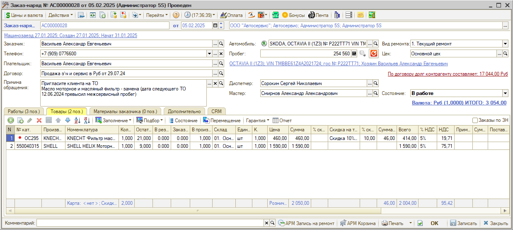

*Колонки табличной части «Товары»:* № по каталогу, Производитель, Номенклатура, Вид гарантии, Количество, Остаток (деталей на складе), В резерве (количество деталей, зарезервированных под данный заказ-наряд), Заказано (количество деталей заказанных, но не зарезервированных), В производстве (количество деталей в производстве), Склад, Единица измерения деталей, Цена, Сумма, НДС, % скидки, Сумма скидки, Поставщик, Срок поставки и др.

### 3. Вкладка «Материалы заказчика»

Если клиент предоставляет свои запчасти, их можно указать в таблице на данной вкладке. Для этого нужно добавить строку нажатием на кнопку .

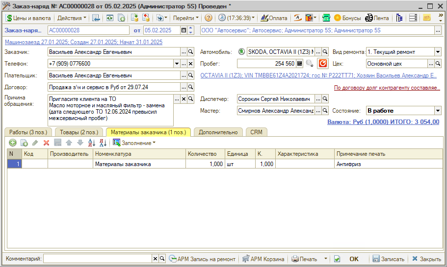

Возможны два способа работы с данным функционалом:

1) создать в номенклатуре папку «Материалы заказчика» и заполнить наименованиями основных деталей (без артикула), затем выбирать из списка нужные детали;

2) добавить в номенклатуру элемент «Материалы заказчика», а конкретные детали, привезенные клиентом, записывать в примечании — одной строкой, через запятую.

Информация о материалах заказчика из данной вкладки выводится в печатной форме Заказ-наряда (таблица «Перечень деталей клиента»).

*Столбцы табличной части «Материалы заказчика»:* Код — код номенклатуры, Производитель, Номенклатура, Количество, Единица измерения, Характеристика, Примечания.

### 4. Вкладка «Дополнительно»

На вкладке «Дополнительно» выводится информация:

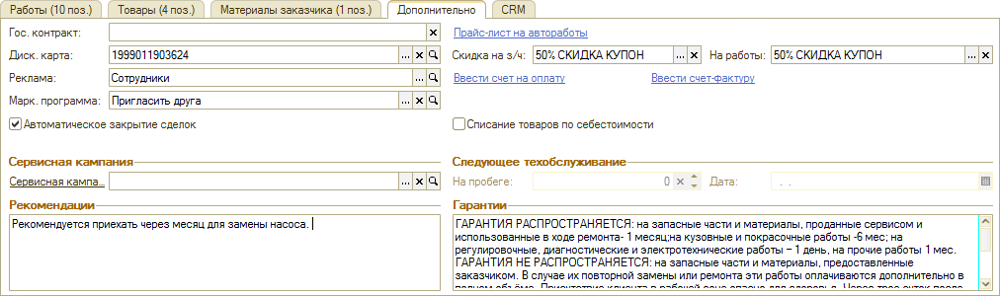

- **Дисконтная карта** — номер дисконтной карты покупателя для подстановки скидки и накопления суммы по карте.
- **Реклама** — рекламный канал, по которому произошло обращение заказчика.
- **Маркетинговая программа** — для учета эффективности различных маркетинговых акций для привлечения клиентов.
- Галочка **«Автоматическое закрытие сделок»** — оплата без привязки к сделке может закрыть оплату по этому заказ-наряду.
- Предоставляемые **скидки** на весь список авторабот и запасных частей;
- Галочка **«Списание товаров по себестоимости»** — для учета запчастей в заказ-наряде по себестоимости, а не по цене продажи.
- В поле **«Рекомендации»** можно внести свои рекомендации клиенту. Поле выводится в печатной форме Заказ-наряда, где клиент сможет ознакомиться с данными рекомендациями.
- Поле **«Гарантии»** — описание гарантийных обязательств на выполненные работы и использованные детали, заполняется согласно настройкам. Данное поле также переносится в печатную форму Заказ-наряда.

### 5. Вкладка «CRM»

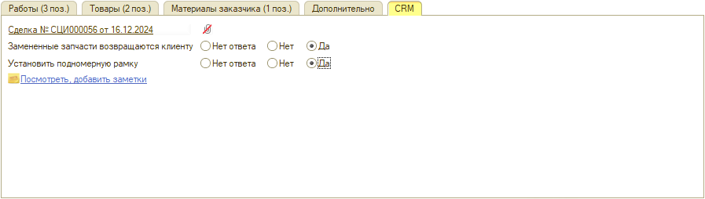

- **Ссылка на привязанную Сделку:** можно перейти к ней; а также кнопка «Открепить сделку» — если Заказ-наряд привязан к сделке по ошибке, можно открепить его от данной сделки и выбрать нужную в открывшемся окне;
- **Замененные запчасти возвращаются клиенту:** Нет ответа/Нет/Да; если в настройке Вида ремонта стоит флажок «Контролировать заполнение возврата запчастей», то при отметке «Нет ответа» будет невозможно провести Заказ-наряд: на этапе заполнения Заявки на ремонт требуется спрашивать у клиентов, нужно ли будет вернуть им замененные запчасти, и проставлять ответ — отметка о необходимости вернуть запчасти клиенту будет выводиться в Сопроводительном листе для мастера или механика,

  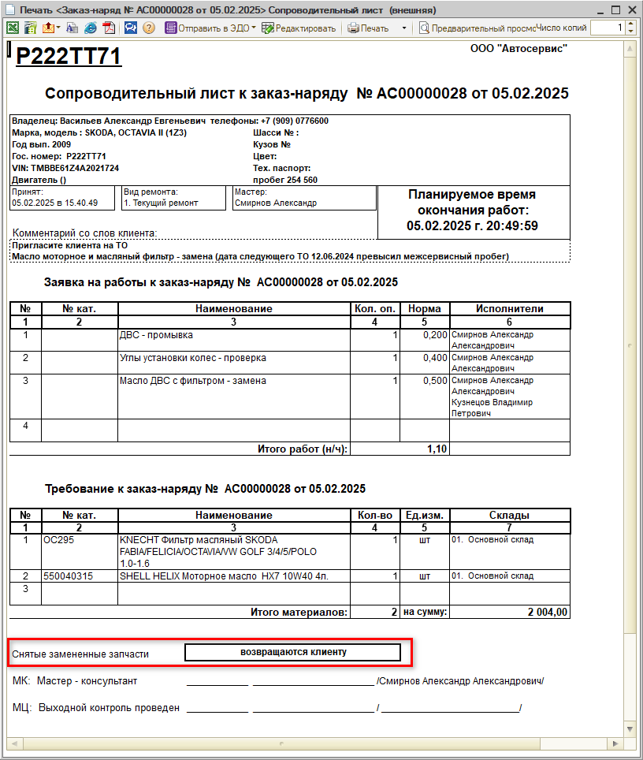

  а также будет печататься отметка о получении заказчиком запчастей в Акте выполненных работ;
- **Установить подномерную рамку:** Нет ответа/Нет/Да. Функционал используется, если автосервис устанавливает клиентам подномерные рамки: согласие клиента на установку рамки спрашивают на этапе заполнения Заявки, затем это значение подтягивается в Заказ-наряд.

## Кнопки нижней панели Заказ-наряда

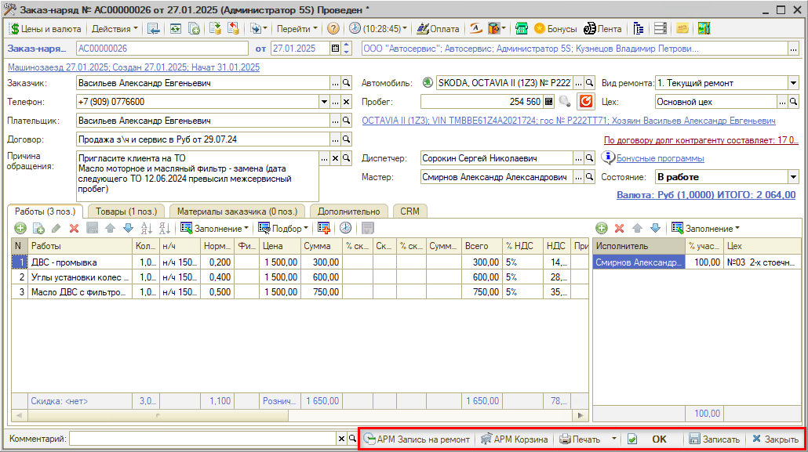

- **АРМ Запись на ремонт** — переход в АРМ Запись на ремонт;
- **АРМ Корзина** — переход в АРМ Корзина;
- **Печать** — печать документа: выводится последняя использованная печатная форма Заказ-наряда; выбор другой печатной формы производится нажатием на стрелку рядом с кнопкой «Печать»;
- **ОК** — записать с проведением и закрыть форму;
- **Записать** — сохранить внесенные изменения без закрытия формы;
- **Закрыть** — закрыть форму.

## Дерево связей Заказ-наряда

Заказ-наряд компонует и объединяет документы, связанные с ремонтом, такие как заявка на ремонт, заказы покупателя на отсутствующие детали, заказы поставщикам, перемещения в производство, документы оплаты, счета на оплату, счета-фактуры и другие. Количество документов может быть очень большим, особенно если используется много запасных частей и расходных материалов. Просмотреть связанные документы можно с помощью механизма *«Дерево подчиненности документа»*.

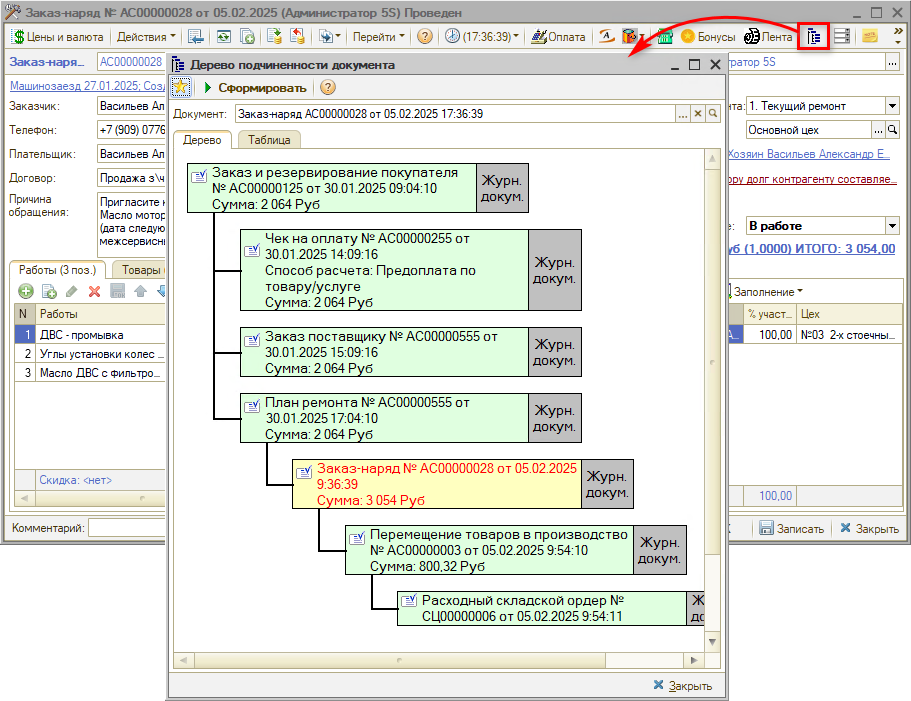

## Печать Заказ-наряда

Документ «Заказ-наряд» в программе имеет различные стандартные и внешние печатные формы. Количество и перечень печатных форм определяются настройками прав пользователя.

Внешний вид документов может отличаться для различных предприятий или подразделений: достаточно часто возникает необходимость корректировать эти формы — добавлять логотипы, менять шапки. Рекомендуется делать это путем подключения внешних печатных форм. Это упростит в дальнейшем процесс обновления конфигурации.

Для выбора нужной печатной формы необходимо нажать на *стрелку* рядом с кнопкой *«Печать»*.

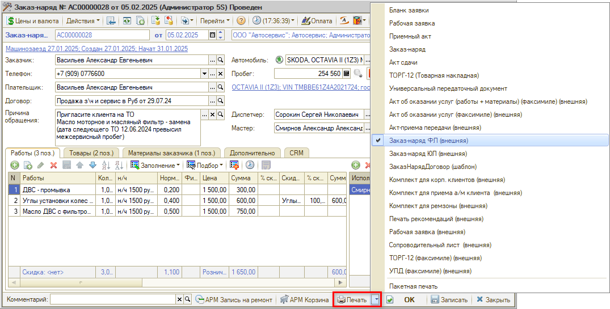

В печатной форме Заказ-наряда выводится информация по выполненным работам, гарантии, рекомендациям и др.

**Список наиболее используемых печатных форм:**

1. **Рабочая заявка:** печатается первой, при заезде клиента.
2. **Сопроводительный лист:** передается в цех для начала работы по Заказ-наряду.
3. **Акт приема-передачи:** в ряде случаев требуется напечатать для клиента, чтобы зафиксировать прием автомобиля.
4. **Заказ-наряд ФЛ (физ. лицам):** печатается после перевода Заказ-наряда в состояние «Выполнен» (перед оплатой). В основном для физ. лиц, но подходит и для юр. лиц, если не требуется отображение нормочасов.
   При печати данной формы Заказ-наряда, находящегося в любом состоянии кроме «Выполнен» и «Закрыт», выводится водяной знак «Предварительный».
5. **Заказ-наряд ЮЛ (юр. лицам):** печатается после перевода Заказ-наряда в состояние «Выполнен». Особенностью данной формы является то, что работы в Заказ-наряде отображены нормочасами, а не рублями.
6. **Акт об оказании услуг:** используется для печати выполненных работ. В основном требуется для юр. лиц.
7. **УПД:** совмещает в себе счет-фактуру и передаточный документ. В основном требуется для юр. лиц.

## Работа с реестром Заказ-нарядов

Реестр Заказ-нарядов находится в разделе интерфейса *«Автосервис» → Документы → Заказ-наряды*.

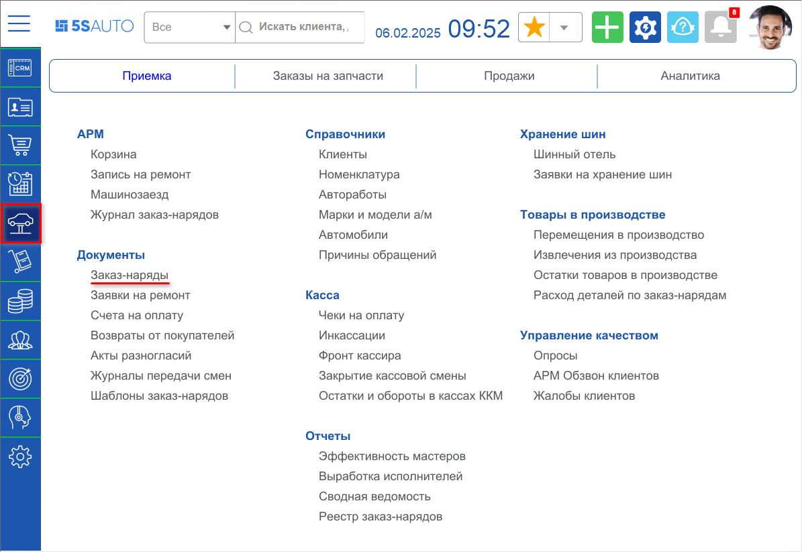

В реестре Заказ-нарядов документы отражаются с использованием цветовой индикации в зависимости от состояния, в котором находится Заказ-наряд.

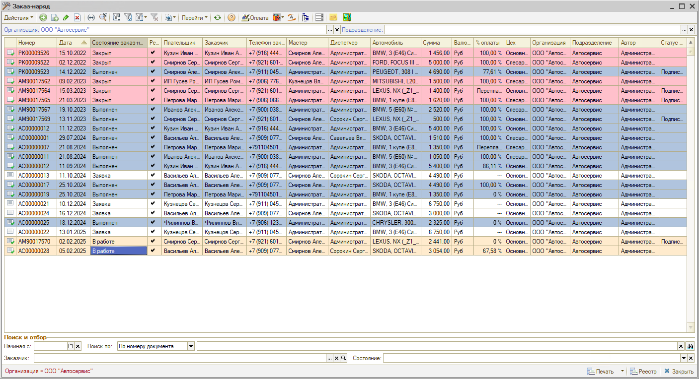

Из реестра Заказ-нарядов можно увидеть процент оплаты по определенному документу, а также принять оплату не заходя в документ.

В нижней части реестра расположена область поиска и отбора документов. Поиск может осуществляться по различным параметрам, отдельно вынесен отбор по состоянию.

## Видеоинструкции по работе с Заказ-нарядами

**1. [Обзор интерфейса Заказ-наряда](../Обзор%20интерфейса%20Заказ-наряда/obzor-interfeysa-zakaz-naryada.md):**

**2. [Как создать Заказ-наряд](../Как%20создать%20Заказ-наряд/kak-sozdat-zakaz-naryad.md):**

**3. [Как добавить работы в Заказ-наряд](../Как%20добавить%20работы%20в%20Заказ-наряд/kak-dobavit-raboty-v-zakaz-naryad.md):**

**4. [Как добавить детали в Заказ-наряд](../Как%20добавить%20детали%20в%20Заказ-наряд/kak-dobavit-detali-v-zakaz-naryad.md):**

**5. [Как принять оплату по Заказ-наряду](../Как%20принять%20оплату%20по%20Заказ-наряду/kak-prinyat-oplatu-po-zakaz-naryadu.md):**

**6. [Как закрыть Заказ-наряд](../Как%20закрыть%20Заказ-наряд/kak-zakryt-zakaz-naryad.md):**

**7. [Как распечатать Заказ-наряд](../Как%20распечатать%20Заказ-наряд/kak-raspechatat-zakaz-naryad.md):**

**8. [Как работать с реестром Заказ-нарядов](../Как%20работать%20с%20реестром%20Заказ-нарядов/kak-rabotat-s-reestrom-zakaz-naryadov.md):**

---

**Теги:** заказ-наряд, реестр заказ-нарядов, состояние заказ-наряда, дерево связей, печать заказ-наряда, исполнители, гарантии, материалы заказчика

