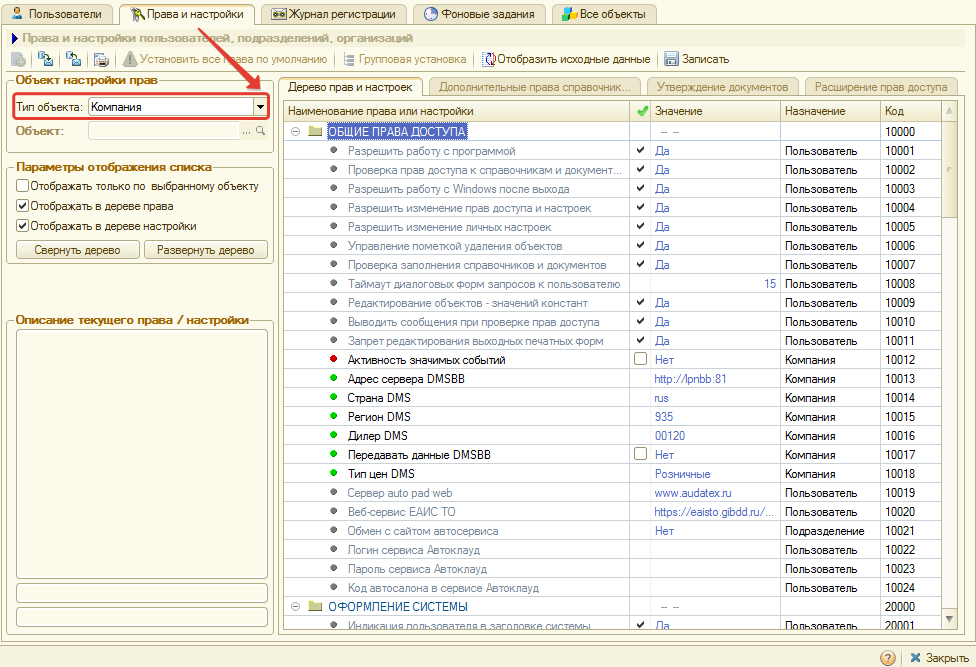
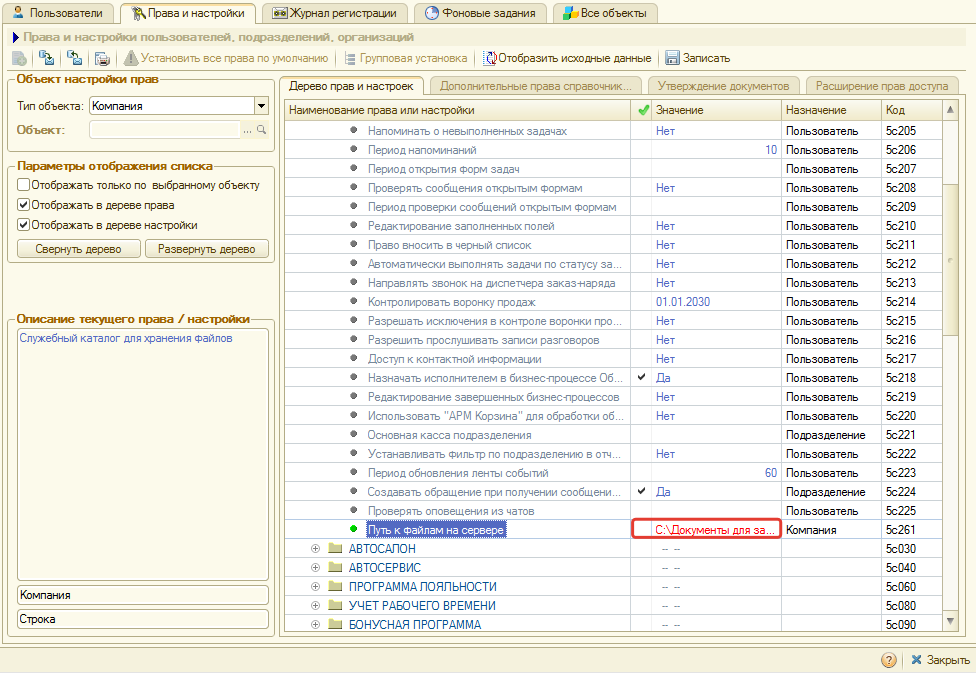
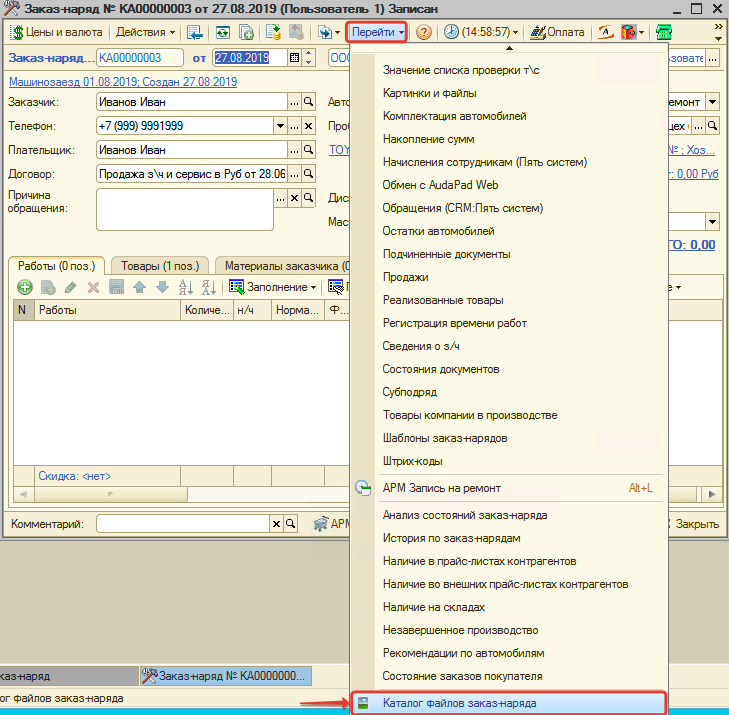
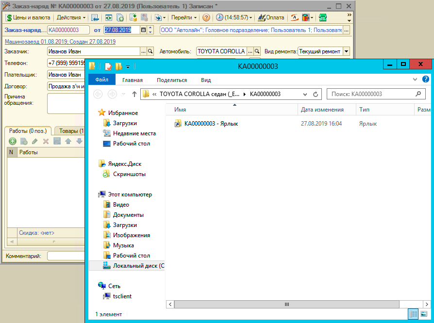

# Прикрепление файлов к заказ-наряду

<table><tr><td><b>Время чтения:</b> 4 мин.</td><td><b>Обновлено:</b> 21.06.2022</td></tr></table>

Источник: https://www.5systems.ru/help/prikreplenie-faylov-k-zakaz-naryadu

В программе предусмотрена возможность прикреплять файлы к документу «[Заказ-наряд](../Заказ-наряды/zakaz-naryady.md)»: фотографии автомобиля, сканы документов, результаты диагностики и т. п.

#### Предварительная настройка

Все создаваемые файлы для Заказ-наряда хранятся в одном месте. Путь к каталогу для хранения файлов необходимо указать в правах и настройках. Для этого:

1. Перейдите к [Установке Прав и настроек](https://5systems.ru/help/ustanovka-prav-i-nastroek-polzovatelya);
2. Выберите тип объекта «Компания»:

   

3. В настройке «ПЯТЬ СИСТЕМ → БАЗОВАЯ CRM → Путь к файлам на сервере» укажите локальный или сетевой путь для хранения файлов:

   

4. Запишите изменения.

#### Прикрепление и просмотр файлов

По сохраненному Заказ-наряду:

1. в командном меню выберите действие «Перейти → Каталог файлов заказ-наряда»:

   

2. в открывшемся каталоге просмотрите или добавьте файлы:

   

##### Формирование пути к файлам заказ-наряда

По заказ-наряду к исходному пути каталога для хранения файлов, заданному в настройках, добавляется путь формата: `<Подразделение>\<Клиент>\<Год>\<Месяц>\<Автомобиль>\<Номер заказ-наряда>`.

*Пример:* `\Головное подразделение\Иванов Иван\2019\08\TOYOTA COROLLA седан (_E12_) VIN NMTBM28E80R058037\КА00000003`

---

**Теги:** заказ-наряд, прикрепление файлов, каталог файлов, права и настройки

