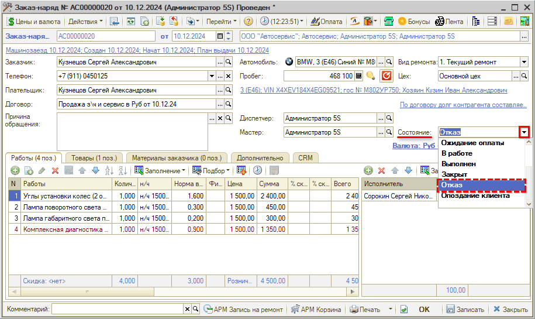

# Состояние «Отказ» Заказ-наряда

<table><tr><td><b>Время чтения:</b> 2 мин.</td><td><b>Обновлено:</b> 23.12.2024</td></tr></table>

Источник: https://www.5systems.ru/help/sostoyanie-otkaz-zakaz-naryada

В ситуации, когда клиент заехал в СТО и был открыт [Заказ-наряд](../Заказ-наряды/zakaz-naryady.md), но по каким-то причинам ремонт выполнить не удалось: клиент отказался или невозможно выполнить ремонт со стороны СТО, — нужно перевести Заказ-наряд в [состояние](../Состояния%20Заказ-наряда/sostoyaniya-zakaz-naryada.md) «Отказ»:

Для того, чтобы перевести Заказ-наряд в состояние «Отказ», предварительно убедитесь, что по Заказ-наряду нет остатков в производстве. Если есть остатки в производстве, то сперва верните их на склад, так как программа не даст записать Заказ-наряд.

Состояние «Отказ» по Заказ-наряду учитывается при анализе уходов клиентов на этапе «5. Заезд» в отчете [*Воронка продаж по закрытым сделкам*](https://5systems.ru/help/otchet-voronka-prodazh-po-zakrytym-sdelkam).

---

**Теги:** заказ-наряд, состояние отказ, воронка продаж, остатки в производстве

