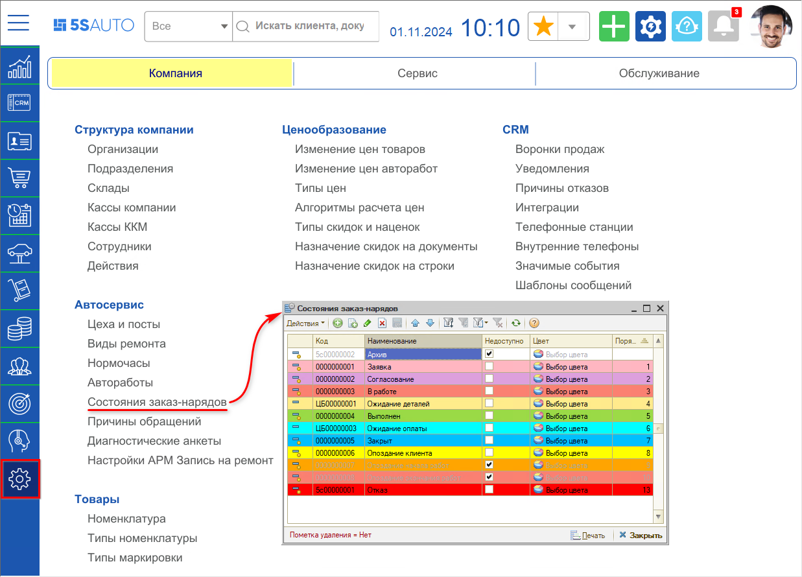
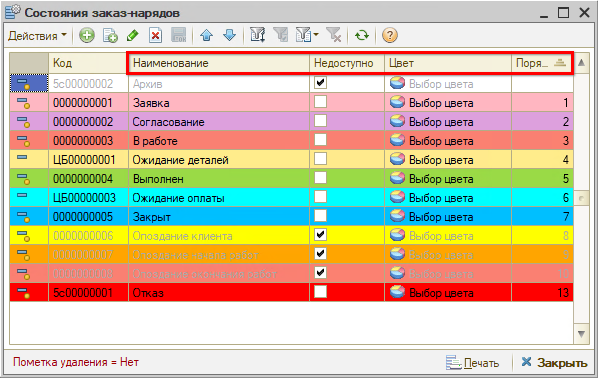
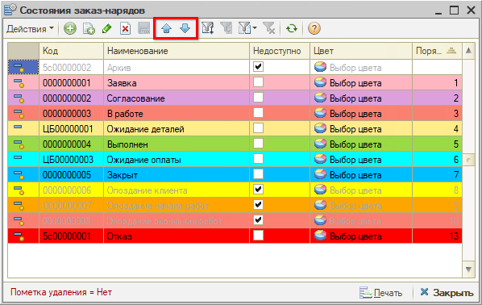
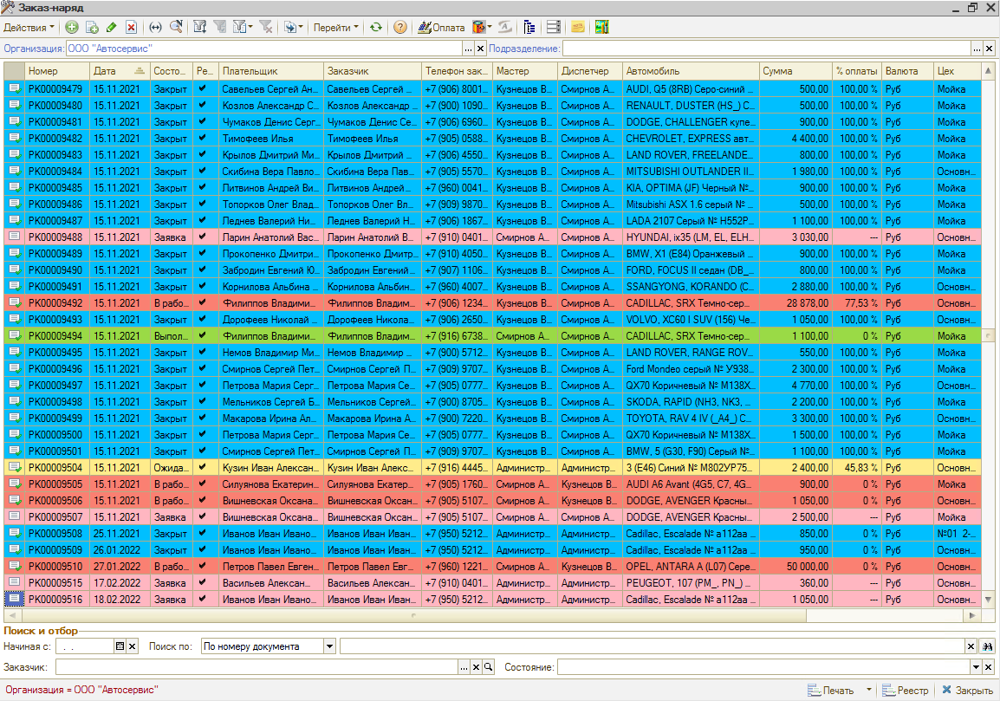
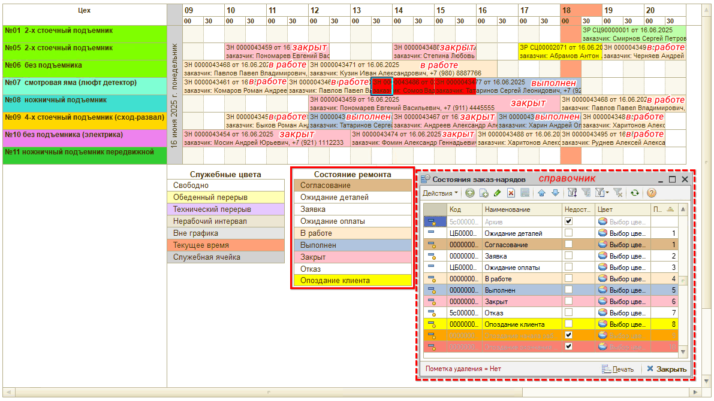

# Состояния Заказ-наряда

<table><tr><td><b>Время чтения:</b> 7 мин.</td><td><b>Обновлено:</b> 01.11.2024</td></tr></table>

Источник: https://www.5systems.ru/help/sostoyaniya-zakaz-naryada

## Содержание

- [Введение](#введение)
- [Справочник «Состояния Заказ-нарядов»](#справочник-состояния-заказ-нарядов)
- [Цветовая индикация Заказ-нарядов в реестре](#цветовая-индикация-заказ-нарядов-в-реестре)
- [Цветовая индикация в планировщике записи на ремонт](#цветовая-индикация-в-планировщике-записи-на-ремонт)
- [Настройка доступности состояний](#настройка-доступности-состояний)

## Введение

**Состояние** — это ключевой *реквизит Заказ-наряда*. При открытии формы Заказ-наряда в ней отображается его текущее состояние. Данный параметр необходим для фиксации и определения стадии выполнения ремонта.

Переход из одного состояния в другое не выполняется автоматически — его нужно менять вручную, в зависимости от текущей стадии ремонта. Состояние выбирается из справочника «Состояния заказ-нарядов».

## Справочник «Состояния Заказ-нарядов»

Путь перехода в справочник: *Справочники → Автосервис → Состояния заказ-нарядов*

В справочнике «Состояния заказ-нарядов» хранится перечень состояний, в которых может находиться Заказ-наряд. Здесь же задается цветовое оформление состояний для удобства работы с реестром документов, а также видимость тех или иных состояний в документе.

*Смена состояний Заказ-наряда влияет на смену этапов Сделки.*

Сделка переводится на этап «В работе» с предыдущего этапа при переведении Заказ-наряда в состояние «Заявка», «Согласование», «В работе», «Ожидание деталей», «Ожидание оплаты».

Описание состояний см. в статье «[Заказ-наряды](../Заказ-наряды/zakaz-naryady.md)».

*Чтобы сохранить состояние Заказ-наряда, необходимо записать документ.*

#### Столбцы справочника «Состояния заказ-нарядов»

1. **Наименование** — наименование состояния.
2. **Недоступно** — флажок позволяет отключить доступность состояния для выбора в документе Заказ-наряд (см. [ниже](#настройка-доступности-состояний)).
3. **Цвет** — цвет фона строк заказ-нарядов в списках в зависимости от состояния заказ-наряда.
4. **Порядок** — порядок следования переключения состояний заказ-наряда.

Порядок задается при помощи кнопок-стрелок в командной панели справочника:

В зависимости от бизнес-процессов компании можно отключить лишние или добавить новые состояния заказ-наряда.

## Цветовая индикация Заказ-нарядов в реестре

Цветовая индикация используется для удобства работы с реестром документов. Заказ-наряды в реестре отображаются с использованием цвета в зависимости от состояния, в котором находится Заказ-наряд:

## Цветовая индикация в планировщике записи на ремонт

Цвета, заданные в справочнике «Состояния заказ-нарядов» также используются для выделения в календаре в режиме «На день» *записей на ремонт,* по которым созданы Заказ-наряды:

Расшифровка цветов состояний ремонта отображается в легенде под таблицей (включается в настройках параметров календаря — см. в статье «[Календарь для планирования работ](../../../Запись%20на%20ремонт/Календарь%20для%20планирования%20работ/kalendar-dlya-planirovaniya-rabot.md#настраиваемые-параметры-календаря)»).

Подробнее см. в статье «[Цветовое оформление планировщика](../../../Запись%20на%20ремонт/Цветовое%20оформление%20планировщика/cvetovoe-oformlenie-planirovschika.md#1-заказ-наряды)».

## Настройка доступности состояний

Для того, чтобы состояние заказ-наряда было *доступно для выбора* при работе с формой документа, у него *не должен* быть установлен признак *«Недоступно»:*

В случае если нужное состояние пропало из выпадающего меню, например, невозможно выбрать состояние «Закрыт», следует проверить, не установлена ли у него галочка «Недоступно», и снять ее.

Через меню справочника *«Действия → История объекта»* можно узнать, кем была изменена настройка. Для этого нужно выделить курсором нужное состояние и нажать кнопку «История объекта» (История объекта может подгружаться несколько минут).

*Примечание:* Если у вас часто пропадают состояния заказ-наряда, рекомендуется в [праве](https://www.5systems.ru/help/ustanovka-prav-i-nastroek-polzovatelya) *«Право доступа ВидыСостоянийЗаказНарядов»* установить значение *«Чтение»* для всех сотрудников, кроме администратора и/или директора.

---

**Теги:** заказ-наряд, состояния заказ-наряда, справочник состояний, цветовая индикация, доступность состояний

