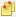
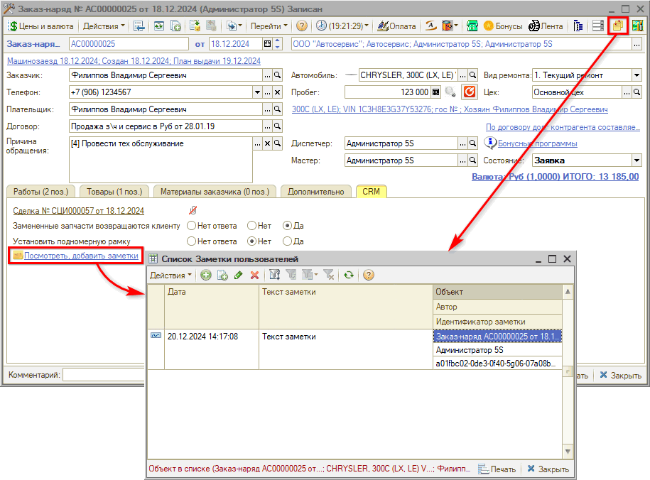
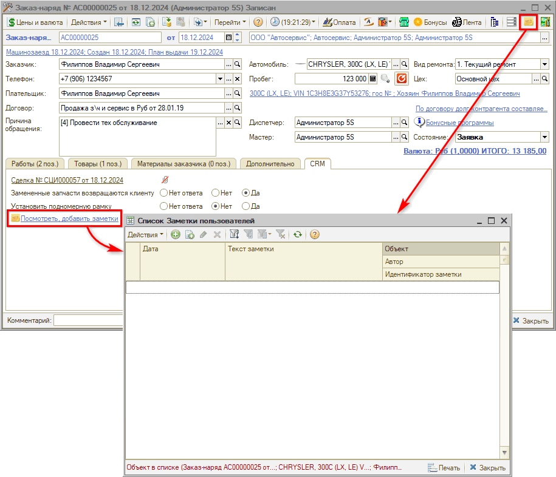
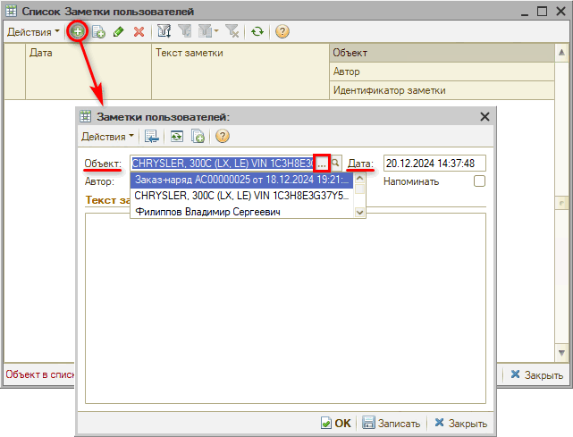
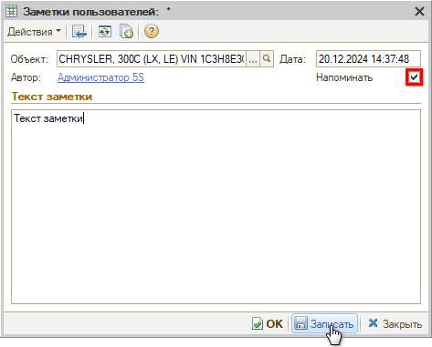
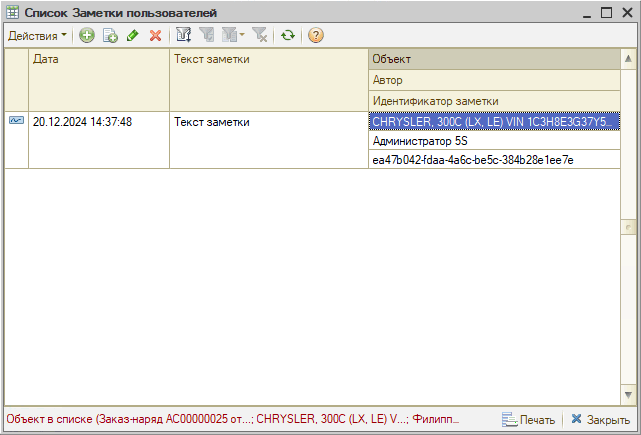
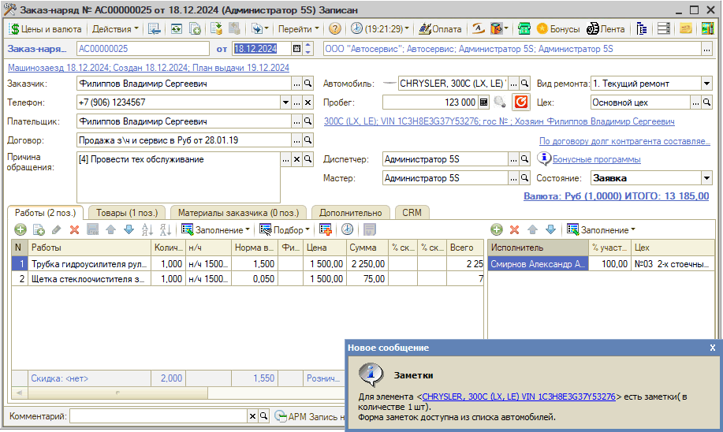

# Работа с заметками

<table><tr><td><b>Время чтения:</b> 5 мин.</td><td><b>Обновлено:</b> 20.12.2024</td></tr></table>

Источник: https://www.5systems.ru/help/rabota-s-zametkami

## Содержание

- [Введение](#введение)
- [Просмотр заметок](#просмотр-заметок)
- [Создание новой заметки](#создание-новой-заметки)
- [Напоминание о заметке](#напоминание-о-заметке)

## Введение

В программе есть возможность добавить заметки с произвольным текстом к документу, контрагенту или автомобилю, а также настроить напоминания по ним, для того чтобы указать для себя и других пользователей какие-либо особенности, которые нужно учесть в работе.

## Просмотр заметок

Заметки могут быть прикреплены к документу, контрагенту или автомобилю. Если в заказ-наряде, карточке клиента или карточке автомобиля на верхней панели отображается кнопка  — значит, по ним есть заметки. Также список заметок можно открыть для просмотра или добавления на вкладке CRM по кнопке-ссылке «Посмотреть, добавить заметки»:

## Создание новой заметки

Если по документу, контрагенту или автомобилю нет заметок, то на верхней панели кнопка «Открыть список заметок» выглядит так: .

Чтобы создать новую заметку, следует открыть список заметок по кнопке на верхней панели либо по кнопке-ссылке на вкладке CRM:

Нажатием на кнопку «Добавить» или «Добавить копированием» можно создать новый элемент списка заметок. В создаваемой заметке следует выбрать *объект*, к которому она будет привязана — это может быть заказ-наряд, автомобиль или клиент:

Поля *«Автор»* и *«Дата»* заполняются автоматически — при необходимости можно изменить.

При выборе в качестве объекта автомобиля или клиента появляется возможность установки галочки *«Напоминать»*. Если ее установить, то при открытии документа по данному объекту или при выборе данного автомобиля/клиента в документе будет показано напоминание о заметке — см. [ниже](#напоминание-о-заметке).

Затем нужно ввести текст и *записать* заметку или нажать «Ок»:

Созданная заметка появится в списке заметок по выбранному объекту:

## Напоминание о заметке

Если при создании заметки в качестве объекта был выбран автомобиль или клиент, то при открытии формы документа по ним будет всплывать фиксированное окно уведомления:

Сам текст заметки в уведомлении не отображается: чтобы ее просмотреть, следует перейти по ссылке.

---

**Теги:** заметки, напоминание, объект заметки, заказ-наряд, автомобиль, контрагент

