# Работа с приложением 5S Remzona

<table><tr><td><b>Время чтения:</b> 8 мин.</td><td><b>Создано:</b> 28.09.2026</td></tr></table>

> *Актуально начиная с версии релиза 5S AUTO **2.8.5**. Функционал дорабатывается.*

> 🛠 Комментарий для черновика: *черновик. Описание составлено по интерфейсу приложения: разделы и справочники просмотрены на рабочей базе без изменений. Функционал приложения дорабатывается, внешний вид может поменяться – скриншоты черновые (сделать на тестовой базе), после доработки заменить; текст сверить с приложением.*

## Содержание

1. [Введение](#введение)
2. [Первый запуск и установка](#первый-запуск-и-установка)
3. [Главная страница](#главная-страница)
4. [Список документов](#список-документов)
5. [Заказ-наряд](#заказ-наряд)
   - [Меню документа](#меню-документа)
   - [1. Обзор](#1-обзор)
   - [2. Данные](#2-данные)
   - [3. Осмотр](#3-осмотр)
   - [4. Заказ](#4-заказ)
6. [Заполнение голосом через Алису](#заполнение-голосом-через-алису)
   - [Подключение Станции](#подключение-станции)
   - [Поиск заказ-наряда](#поиск-заказ-наряда)
   - [Работа с документом](#работа-с-документом)
   - [Заполнение анкеты](#заполнение-анкеты)
   - [Примечание, рекомендации, пробег и статус](#примечание-рекомендации-пробег-и-статус)
   - [Общие команды](#общие-команды)
7. [Расшифровка VIN](#расшифровка-vin)
8. [Справочники](#справочники)
9. [Настройки приложения](#настройки-приложения)

## Введение

***5S Remzona*** – это приложение для пользователей программы 5S AUTO, предназначенное для работы с заказ-нарядами в ремонтной зоне с телефона или планшета. Приложение разработано для ***механиков***, которые заполняют диагностические анкеты, а также удобно для ***мастеров-приемщиков***.

***Основные функции 5S Remzona:***

- просмотр списка заказ-нарядов с поиском и отборами;
- работа с заказ-нарядом: клиент и автомобиль, статус, мастер, работы с исполнителями, товары;
- заполнение диагностических анкет;
- добавление рекомендаций по автомобилю;
- заполнение заказ-наряда голосом через Алису;
- расшифровка автомобиля по VIN;
- просмотр справочников: контрагенты, автомобили, автоработы, номенклатура, производители, сотрудники.

Приложение запускается через браузер, требуется авторизация под учетной записью [5S Cloud](../../Администрирование%20и%20настройка%20системы/Создание%20и%20редактирование%20пользователей%205S%20Cloud/sozdanie-i-redaktirovanie-polzovateley-5s-cloud.md). Приложение можно установить на устройство – компьютер, телефон или планшет.

*Для работы с приложением предварительно должны быть сделаны следующие настройки:*

**1)** настроена интеграция с [API 5S AUTO](../../Администрирование%20и%20настройка%20системы/API%205S%20AUTO/api-5s-auto.md); 
**2)** создан пользователь [5S Cloud](../../Администрирование%20и%20настройка%20системы/Создание%20и%20редактирование%20пользователей%205S%20Cloud/sozdanie-i-redaktirovanie-polzovateley-5s-cloud.md).

Дополнительная настройка прав и доступов в программе 5S AUTO не требуется.

> 🛠 Комментарий для черновика: *На данный момент ограничений в 1С, чтобы пользователь мог изменять только свои документы, нет: в списке видны все заказ-наряды, в том числе чужие.*

*Также рекомендуем для изучения статьи:*

- [Заказ-наряды](../Работа%20с%20Заказ-нарядами/Заказ-наряды/zakaz-naryady.md);
- [Диагностические анкеты](../Диагностические%20анкеты/diagnosticheskie-ankety.md);
- [Работа с рекомендациями](../Работа%20с%20рекомендациями/rabota-s-rekomendaciyami.md);
- [Расшифровка автомобиля по VIN](../Расшифровка%20автомобиля%20по%20VIN/rasshifrovka-avtomobilya-po-vin.md);
- [Работа с приложением 5S TSD](../../Склад%20и%20запчасти/Работа%20с%20приложением%205S%20TSD/rabota-s-prilozheniem-5s-tsd.md).

## Первый запуск и установка

**Шаг 1. Авторизация**

Для первого запуска приложения следует открыть в браузере на устройстве страницу [https://remzona.5systems.ru/](https://remzona.5systems.ru/) и ввести учетные данные пользователя 5S Cloud.

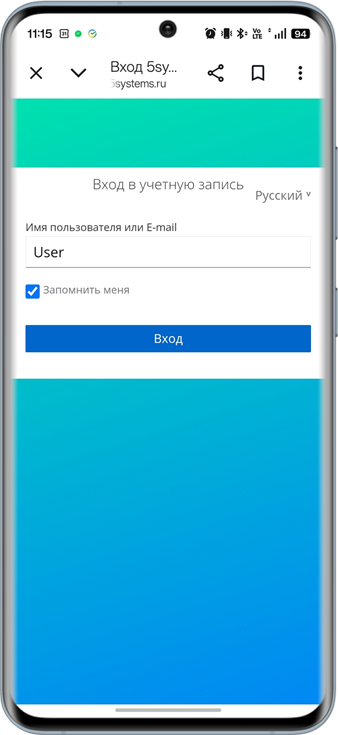 &nbsp;&nbsp;&nbsp;&nbsp;&nbsp;&nbsp; 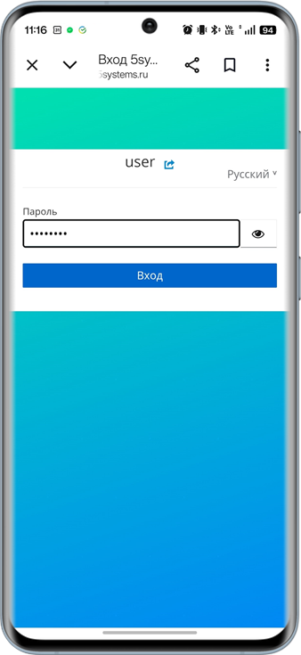

**Шаг 2. Установка приложения**

Чтобы приложение открывалось в отдельном окне, как обычная программа, установите его на устройство:

- в браузерах, которые поддерживают установку приложений (например, Google Chrome, Microsoft Edge), – через предложение установить приложение (см. ниже) или пункт меню браузера ***«Установить приложение»***;
- на iPhone и iPad откройте приложение в Safari, нажмите *«Поделиться»* и выберите *«На экран «Домой»»*.

При первом открытии приложения внизу экрана появляется предложение *«Установить как приложение?»* – нажмите ***«Установить»*** и подтвердите установку:

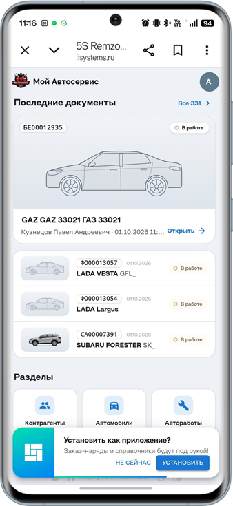 &nbsp;&nbsp;&nbsp;&nbsp;&nbsp;&nbsp; 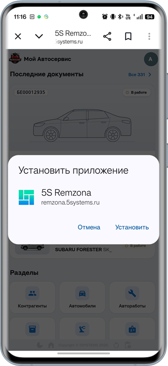

После установки иконка приложения появится на рабочем столе устройства.

## Главная страница

При входе в приложение открывается главная страница:

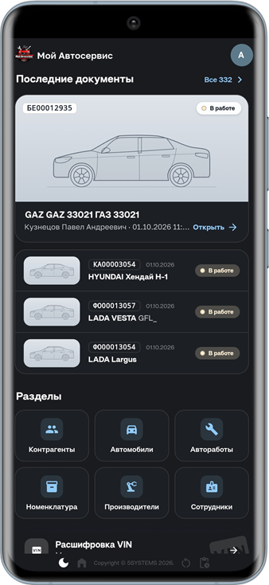

На главной странице:

- вверху – логотип и название организации и кнопка с первой буквой имени пользователя: по ней открываются настройки приложения (см. [ниже](#настройки-приложения));
- блок ***«Последние документы»*** – последний заказ-наряд крупной карточкой (кнопка *«Открыть»*) и еще несколько последних заказ-нарядов: номер, дата, статус, автомобиль и клиент. Ссылка *«Все»* в заголовке блока открывает полный список документов;
- блок ***«Разделы»*** – кнопки справочников: *«Контрагенты»*, *«Автомобили»*, *«Автоработы»*, *«Номенклатура»*, *«Производители»*, *«Сотрудники»* (см. [ниже](#справочники));
- кнопка ***«Расшифровка VIN»*** – переход к расшифровке автомобиля по VIN (см. [ниже](#расшифровка-vin)).

## Список документов

В списке документов отображаются заказ-наряды, новые – сверху, с разбивкой по годам. В карточке заказ-наряда: номер, дата и время, статус, автомобиль и VIN, клиент, мастер и пробег.

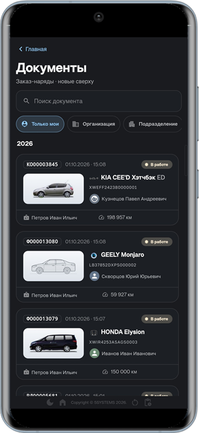 &nbsp;&nbsp;&nbsp;&nbsp;&nbsp;&nbsp; 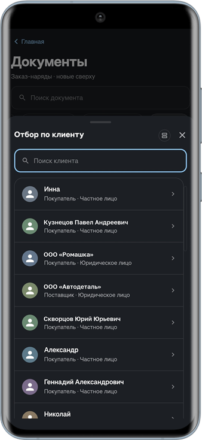

Для поиска нужного документа используйте строку *«Поиск документа»*.

***Отборы:***

- *«Только мои»* – заказ-наряды, в которых пользователь указан автором документа, мастером, диспетчером или исполнителем работ;
- *«Организация»*;
- *«Подразделение»*;
- *«Клиент»*.

По кнопкам *«Организация»*, *«Подразделение»* и *«Клиент»* открывается список для выбора с поиском.

Чтобы открыть документ, нажмите на него в списке.

## Заказ-наряд

Заказ-наряд открывается на вкладке *«Обзор»*. Переключение между разделами документа выполняется кнопками на нижней панели:

**1.** *Обзор* – сводка по заказ-наряду; 
**2.** *Данные* – клиент, автомобиль, статус, пробег, мастер, место и комментарий; 
**3.** *Осмотр* – диагностические анкеты, рекомендации и примечание; 
**4.** *Заказ* – работы и товары.

Вверху экрана – номер заказ-наряда (по нему можно вернуться назад), кнопка обновления и кнопка меню документа ***«⋯»***.

### Меню документа

По кнопке ***«⋯»*** в правом верхнем углу открывается меню документа:

- ***Обновить с сервера*** – загрузить из 5S AUTO документ, анкеты, работы и товары;
- ***Автообновление*** – переключатель: если он включен, данные документа обновляются из 5S AUTO автоматически. Например, если заказ-наряд заполняется голосом через Алису, новые данные появятся в приложении после сохранения через Алису (см. [ниже](#заполнение-голосом-через-алису));
- ***Скопировать номер*** – номер заказ-наряда;
- ***Скопировать ссылку*** – чтобы открыть документ на другом устройстве;
- ***Штрихкод документа.***

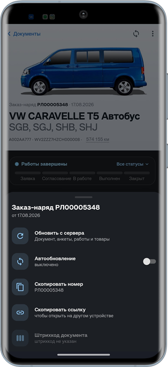

### 1. Обзор

На вкладке *«Обзор»*:

- ***автомобиль*** – изображение, номер и дата заказ-наряда, марка и модель, гос. номер, VIN и пробег;
- ***этап*** – шкала статусов документа (*Заявка*, *Согласование*, *В работе*, *Выполнен*, *Закрыт*) с текущим этапом; список всех статусов открывается по ссылке *«Все статусы»*;
- ***клиент*** – сведения о клиенте раскрываются по стрелке справа;
- карточки ***«Данные»***, ***«Осмотр»*** (сколько пунктов анкет заполнено и сколько рекомендаций) и ***«Заказ»*** (сумма, количество работ и товаров, нормо-часы) – по нажатию открывается соответствующий раздел.

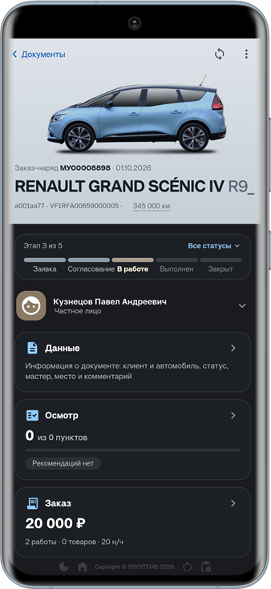

### 2. Данные

Основные сведения о документе собраны в карточках:

- ***Клиент***;
- ***Автомобиль*** – марка и модель, VIN и гос. номер;
- ***Статус*** – текущий статус и этап;
- ***Пробег***;
- ***Мастер***;
- ***Место*** – место выполнения работ, подразделение и организация;
- ***Комментарий.***

В приложении можно изменить *статус* заказ-наряда, *мастера* и *пробег*.

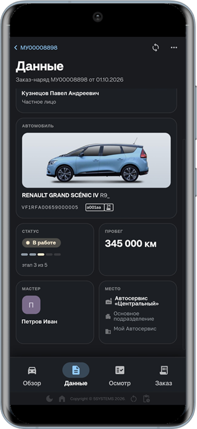

### 3. Осмотр

Раздел состоит из трех вкладок: ***«Анкеты»***, ***«Рекомендации»*** и ***«Примечание»***. Под заголовком – сводка: количество анкет, сколько пунктов заполнено и сколько отмечено «внимание».

#### Анкеты

На вкладке – диагностические анкеты, закрепленные за документом. Для каждой анкеты показано, сколько пунктов заполнено, а цветная шкала показывает результат по разделам анкеты.

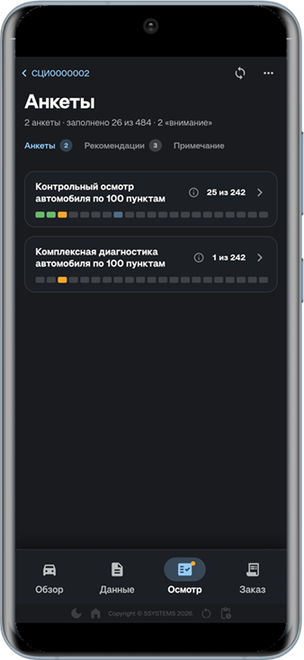

Нажмите на анкету, чтобы раскрыть ее:

- ***Карта пунктов*** – номера всех пунктов анкеты, окрашенные по результату: *«Норма»*, *«Внимание»*, *«Критично»*, *«Начато»*, *«Не проверено»*. Нажмите на номер, чтобы перейти к пункту;
- ***разделы анкеты*** – для каждого раздела указаны номера пунктов и сколько из них заполнено. Раздел раскрывается нажатием.

В раскрытом разделе для каждого пункта:

- номер пункта окрашен по оценке – *«Норма»*, *«Внимание»* или *«Критично»*;
- если у пункта есть варианты значения (например, *«Слабо держит»*, *«Не держит»*), они выводятся под названием пункта;
- пункты для левой и правой стороны автомобиля отмечены буквами ***«Л»*** и ***«П»***;
- кнопка справа от пункта – добавить ***примечание к пункту***: введите текст и нажмите *«Готово»*.

> 🛠 Комментарий для черновика: *Как выставляется оценка пункта – нажатием на номер пункта или иначе? Сейчас в статье – «номер пункта окрашен по оценке». (вопрос еще не задан)*

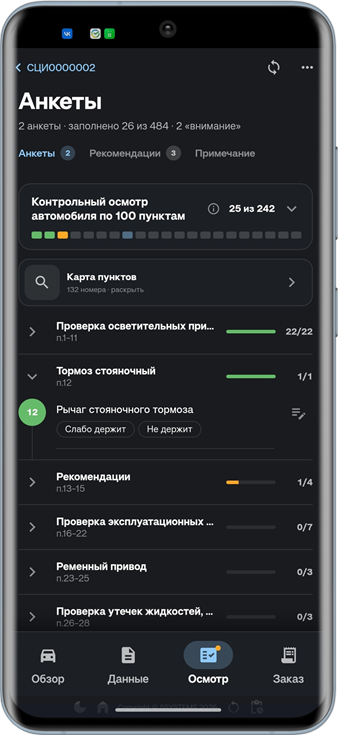 &nbsp;&nbsp;&nbsp;&nbsp;&nbsp;&nbsp; 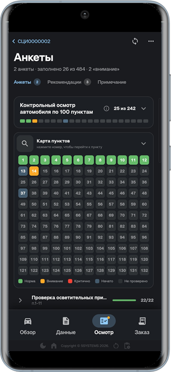

Подробнее о диагностических анкетах – в статье «[Диагностические анкеты](../Диагностические%20анкеты/diagnosticheskie-ankety.md)».

#### Рекомендации

На вкладке – рекомендации по автомобилю, сгруппированные по срочности: *критические*, *по возможности* и *без критичности*. Для каждой рекомендации указано, до какой даты она актуальна и сколько дней осталось – или на сколько дней она просрочена.

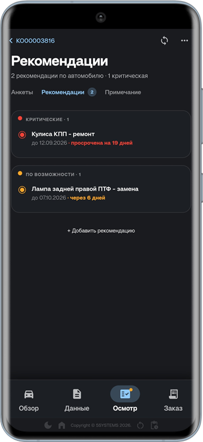

Чтобы добавить рекомендацию, нажмите ***«+ Добавить рекомендацию»***:

**1.** Введите текст рекомендации. 
**2.** Выберите *срочность*: *«Без критичности»*, *«По возможности»* или *«Критическая»*. 
**3.** Укажите, до какого срока рекомендация *актуальна*: *«Бессрочно»*, *«Через месяц»*, *«Через 3 месяца»* или конкретную *дату*. 
**4.** Нажмите ***«Сохранить»***.

Чтобы изменить рекомендацию, нажмите на нее в списке. Здесь же рекомендацию можно отклонить – кнопка ***«Отклонить»***.

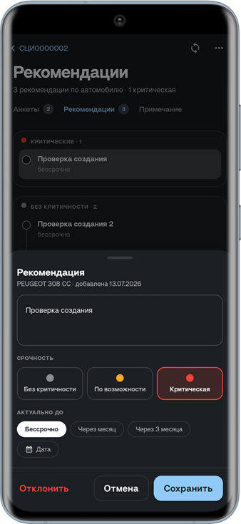

Подробнее о рекомендациях – в статье «[Работа с рекомендациями](../Работа%20с%20рекомендациями/rabota-s-rekomendaciyami.md)».

#### Примечание

На вкладке – примечание к документу. Под полем примечания есть кнопки ***«Из осмотра»***, ***«Рекомендации»*** и ***«Работа из справочника»***.

> 🛠 Комментарий для черновика: *Что делают кнопки «Из осмотра», «Рекомендации» и «Работа из справочника» под полем примечания – добавляют в примечание текст из осмотра, рекомендаций, работу из справочника? Сейчас в статье – только названия кнопок. (вопрос еще не задан)*

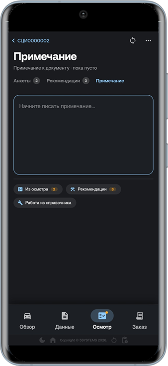

### 4. Заказ

Раздел состоит из двух вкладок: ***«Работы»*** и ***«Товары»***. Под заголовком – сводка: количество работ, нормо-часы и сумма. Кнопка ***«Исполнители»*** справа – назначение исполнителей.

#### Работы

Для каждой работы указаны наименование, цена, количество, нормо-часы, исполнители и процент их участия. Количество и нормо-часы можно изменить в полях под названием работы, исполнителя – добавить кнопкой справа от процента участия. Чтобы добавить работу, нажмите ***«+ Добавить работу»*** под списком работ.

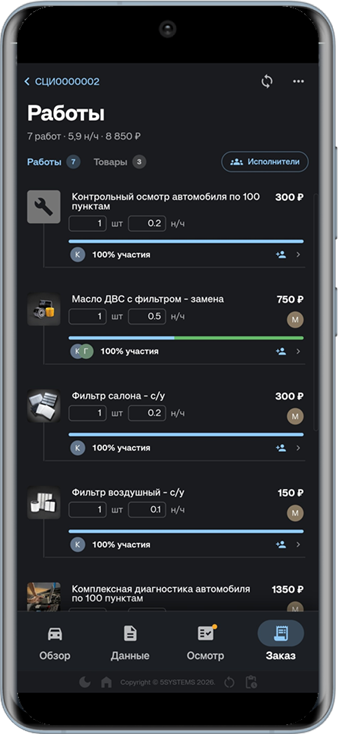

#### Товары

Список товаров заказ-наряда: наименование, артикул, производитель, количество, цена. Товар можно выбрать из справочника.

> 🛠 Комментарий для черновика: *нужен скриншот — вкладка «Товары»; уточнить, какие действия доступны.*

## Заполнение голосом через Алису

> *Функционал дорабатывается.*

С заказ-нарядом можно работать голосом через ***навык Алисы*** на Яндекс Станции – например, на посту диагностики, когда руки заняты. Голосом можно:

- найти и открыть заказ-наряд;
- заполнить диагностическую анкету;
- надиктовать примечание и рекомендации клиенту;
- указать пробег;
- изменить статус документа.

Данные записываются в программу 5S AUTO. Если в приложении 5S Remzona открыт тот же заказ-наряд и включено *автообновление*, новые данные появятся в приложении после сохранения через Алису (см. [выше](#меню-документа)).

Кнопки на экране Станции и в чате Алисы выполняют те же действия, что и голосовые команды.

### Подключение Станции

Станцию нужно один раз привязать к компании. Сейчас привязку выполняют ***специалисты 5SYSTEMS*** – для подключения Станции обратитесь в техподдержку.

За интеграцией компании закреплен постоянный ***шестизначный код***. Порядок подключения:

**1.** Скажите *«Алиса, запусти диагностику»* – Алиса попросит назвать код компании. 
**2.** Назовите код – цифрами по одной или числом (например, *«четыре восемь два семь один три»*). 
**3.** Специалисты 5SYSTEMS подтверждают устройство. Пока устройство не подтверждено, навык дальше не пустит. Запрос на подтверждение действует 3 дня – если за это время устройство не подтвердили, назовите код компании еще раз. 
**4.** Скажите *«проверить статус»*. Если устройство подтверждено, Алиса ответит *«Устройство подтверждено! Перехожу к главному меню»*, если нет – *«Подтверждение еще не получено»*: подождите и проверьте статус еще раз.

Если код назван неверно, Алиса попросит повторить его. После 5 неверных кодов подряд ввод кода блокируется на 10 минут.

Чтобы отвязать Станцию от компании, скажите *«отвязать устройство»* и *«подтверждаю»* – после этого Станция снова попросит код.

> 🛠 Комментарий для черновика: *Шестизначный код закрепляется за интеграцией компании при ее создании и не меняется (в памятке механику ошибочно — «код выдает администратор компании, действует 3 дня»). Когда код называют Алисе, в базу приходит вебхук с длинным кодом подтверждения – срок жизни этого кода 3 дня; устройство привязывается к интеграции (компании) вызовом метода подтверждения на микросервисе с этим кодом. Интерфейса для подтверждения нет — сейчас привязку вручную выполняют специалисты 5SYSTEMS.*

### Поиск заказ-наряда

После запуска (*«Алиса, запусти диагностику»*) назовите ***номер заказ-наряда, гос. номер*** автомобиля или ***фамилию клиента*** (например, *«найди 1234»*, *«А123ВС»*, *«Иванов»*) или скажите *«последние документы»*.

- Если найден один документ, он откроется сразу.
- Если найдено несколько, Алиса перечислит их по три. Выберите документ по номеру в списке (*«первый»*, *«2»*, *«последний»*) или по номеру заказ-наряда, скажите *«еще»* для следующих документов или уточните запрос.

Если в прошлый раз документ остался открытым, Алиса предложит продолжить работу с ним – с того места, где вы остановились.

### Работа с документом

В открытом заказ-наряде скажите, что нужно сделать:

| Команда | Действие |
| --- | --- |
| *«анкеты»* | Заполнение диагностических анкет. У каждой работы заказ-наряда своя анкета: Алиса перечислит их и скажет, сколько пунктов заполнено. Если анкета одна, она откроется сразу |
| *«примечание»* | Примечание к документу |
| *«рекомендация»* | Рекомендации клиенту по автомобилю |
| *«пробег»* | Пробег автомобиля |
| *«статус»* | Изменение статуса документа |
| *«сводка»* | Что заполнено в документе: статус, пробег, анкеты, примечание, рекомендации |
| *«другой документ»* | Закрыть документ и перейти к поиску |

### Заполнение анкеты

Алиса сама читает пункты анкеты по порядку, начиная с первого незаполненного, и называет раздел, когда он меняется. Для пунктов с двумя сторонами левая и правая сторона оцениваются отдельно.

На каждый пункт назовите оценку: ***«норма»***, ***«внимание»*** или ***«критично»***. К оценке можно добавить пояснение – например, *«критично, износ девяносто процентов»*. Если Алиса не поняла слово, она переспросит и запомнит его для вашей компании.

Другие команды при заполнении анкеты:

- *«остальные в норме»* – отметить все незаполненные пункты как «Норма» (после подтверждения); *«раздел в норме»* – только пункты текущего раздела;
- *«варианты»* – варианты значения пункта; чтобы выбрать вариант, назовите его;
- *«примечание: …»* – заметка к пункту;
- *«пропустить»*, *«назад»* (предыдущий пункт), *«пункт 7»*, *«незаполненные»* – переход по пунктам;
- *«очистить»* – очистить оценку пункта;
- *«сохранить»*, *«закончить анкету»*.

Оценки записываются в 5S AUTO одним пакетом – когда вы заканчиваете анкету, переходите к другому действию или выходите из навыка. Чтобы записать их раньше, скажите *«сохранить»*. Если программа не ответила, Алиса запишет оценки позже.

Когда все пункты заполнены, Алиса называет итог – сколько пунктов в норме, требуют внимания и критичны. Дальше можно перейти к следующей анкете (*«следующая анкета»*) или вернуться к пропущенным пунктам (*«незаполненные»*).

### Примечание, рекомендации, пробег и статус

***Примечание.*** Алиса прочитает текущее примечание. Продиктуйте текст – он добавится к примечанию; чтобы написать примечание заново, скажите *«заменить»*. Также доступны команды *«прочитать»* и *«удалить»*. Примечание записывается в программу по команде *«готово»*.

***Рекомендации.*** Продиктуйте рекомендацию и назовите критичность: *«обычная»*, *«по возможности»* или *«критическая»* (можно сразу: *«критично: заменить передние колодки»*). Рекомендации сохраняются как черновики, команды *«список»* и *«удали последнюю»* помогают их проверить. Чтобы записать рекомендации в программу, скажите *«отправить рекомендации»* – Алиса зачитает список, подтвердите запись словом *«да»*. Повторная отправка дублей не создает.

***Пробег.*** Назовите пробег в километрах (например, *«сто двадцать три тысячи»*). Если пробег меньше прежнего, Алиса предупредит. Пробег записывается в программу по команде *«готово»* вместе с примечанием.

***Статус.*** Алиса назовет текущий статус и доступные статусы из программы. Назовите номер или название статуса и скажите *«подтверждаю»* – статус запишется в программу сразу.

### Общие команды

| Команда | Действие |
| --- | --- |
| *«главное меню»* | Вернуться к поиску документа |
| *«помощь»* | Подсказка для текущего шага |
| *«где я»* | Какой документ, анкета и пункт открыты |
| *«повтори»* | Повторить последний вопрос |
| *«назад»* | На шаг назад (в анкете – к предыдущему пункту) |
| *«отмена»* | Назад с отменой начатого ввода |
| *«выход»* | Закрыть навык: документ останется открытым до следующего запуска, накопленные данные запишутся в программу |
| *«отвязать устройство»* | Отвязать Станцию от компании |

Из любого места можно сразу перейти к нужному действию полной фразой: *«найди документ 1234»*, *«последние документы»*, *«вернуться к документу»*, *«список анкет»*, *«примечание к документу»*, *«добавить рекомендацию»*, *«отправить рекомендации»*, *«указать пробег»*, *«изменить статус документа»*, *«сводка по документу»*.

Если программа долго отвечает, Алиса скажет *«Еще загружаю…»* – подождите пару секунд и скажите *«повтори»*.

## Расшифровка VIN

Для расшифровки автомобиля нажмите на главной странице ***«Расшифровка VIN»*** и начните вводить VIN. Расшифровка начинается сразу, по мере ввода: уже по первым символам приложение показывает подходящие марку и модель и характеристики автомобиля. Под полем показано, сколько символов из 17 введено.

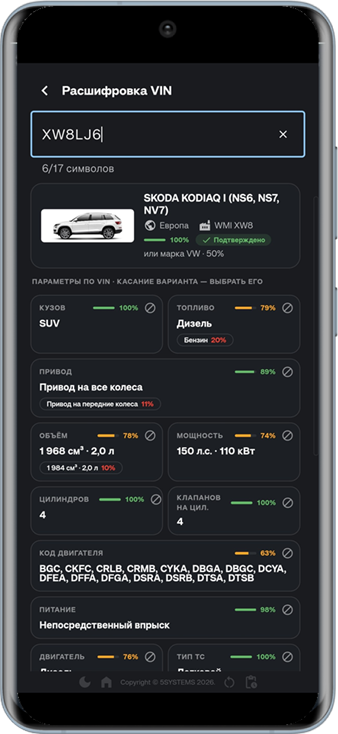

Чем больше символов введено, тем точнее результат:

- Если в программе есть автомобиль с таким VIN, он выводится первым – с гос. номером.
- Ниже – марка и модель, которые подходят под введенный VIN: годы выпуска, регион, производитель (WMI) и процент совпадения.
- В блоке ***«Параметры по VIN»*** – характеристики автомобиля: кузов, топливо, привод, объем и мощность двигателя, количество цилиндров и клапанов, код двигателя, питание, тип ТС и другие. Для каждого параметра указан процент совпадения; если вариантов несколько, нажмите на нужный, чтобы выбрать его.

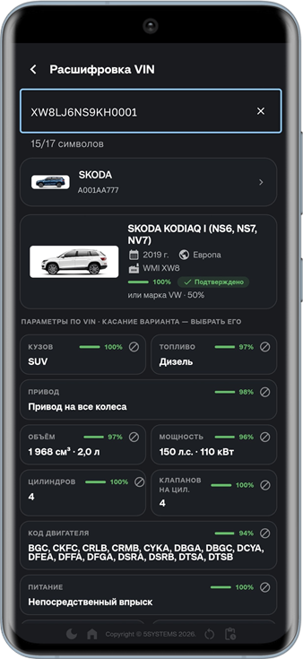

Подробнее – в статье «[Расшифровка автомобиля по VIN](../Расшифровка%20автомобиля%20по%20VIN/rasshifrovka-avtomobilya-po-vin.md)».

## Справочники

Справочники открываются с главной страницы, из блока *«Разделы»*. В каждом справочнике есть строка поиска, карточка элемента открывается нажатием на него в списке.

- ***Контрагенты*** – клиенты и поставщики. В списке указаны вид отношений (покупатель, поставщик) и тип (частное или юридическое лицо); в карточке – вид отношений, пол, дата рождения, ИНН, телефоны, email, Telegram, VK и Max;
- ***Автомобили*** – автомобили клиентов: модель, гос. номер и VIN; есть отбор по владельцу;
- ***Автоработы*** – работы с нормо-часами и анкетами: наименование и артикул; есть отбор по анкете;
- ***Номенклатура*** – товары и материалы: наименование, артикул и производитель;
- ***Производители*** – производители товаров и запчастей, с логотипами;
- ***Сотрудники*** – мастера и исполнители; есть отборы *«Только исполнители»* и *«Уволенные»*.

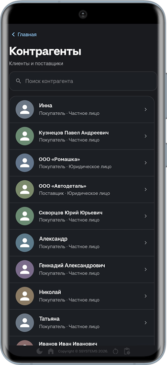 &nbsp;&nbsp;&nbsp;&nbsp;&nbsp;&nbsp; 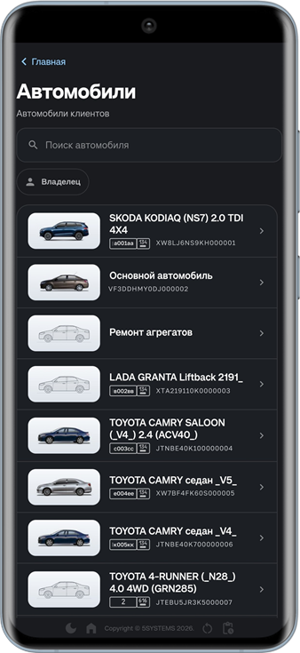

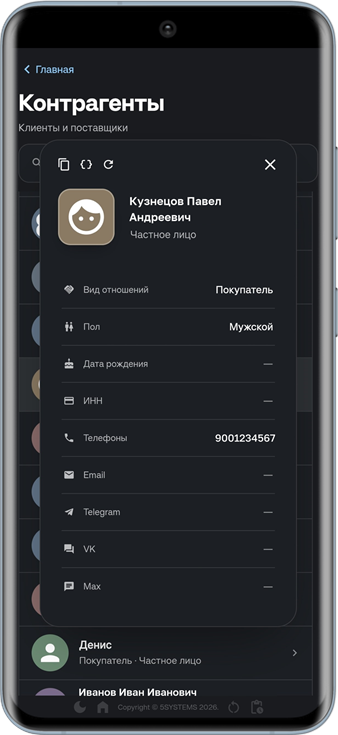

## Настройки приложения

Чтобы открыть настройки, нажмите на главной странице кнопку с первой буквой имени пользователя в правом верхнем углу. Вверху настроек – имя пользователя, логотип и название организации.

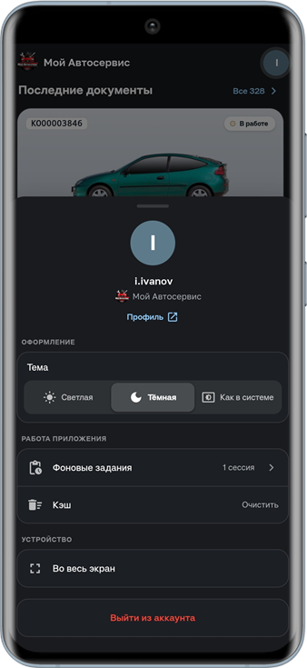

- ***Профиль*** – переход в профиль пользователя 5S Cloud: можно изменить личную информацию, настроить аутентификацию, проверить активные устройства и другие настройки безопасности.
- ***Тема*** – *«Светлая»*, *«Темная»* или *«Как в системе»* (как в настройках устройства).
- ***Фоновые задания*** – список фоновых заданий приложения.
- ***Кэш*** – кнопка *«Очистить»* очищает кэш приложения.
- ***Во весь экран*** – развернуть приложение на весь экран, интерфейс браузера при этом скрывается.
- ***Выйти из аккаунта*** – выход из учетной записи. После выхода потребуется заново авторизоваться.

#### Нижняя панель

Внизу каждого экрана расположены кнопки быстрого доступа:

- *«Изменить тему»* – переключение светлой и темной темы;
- *«Главная страница»* – возврат на главную страницу приложения;
- *«Обновить»* – обновление данных на экране;
- *«Фоновые задания»* – список фоновых заданий. Когда идет загрузка информации, на кнопке отображается индикатор.

---

**Теги:** 5S Remzona, приложение, заказ-наряд, ремонтная зона, мастер, исполнитель, рекомендации, диагностические анкеты, расшифровка VIN, мобильное приложение, Алиса, голосовое заполнение, Яндекс Станция
