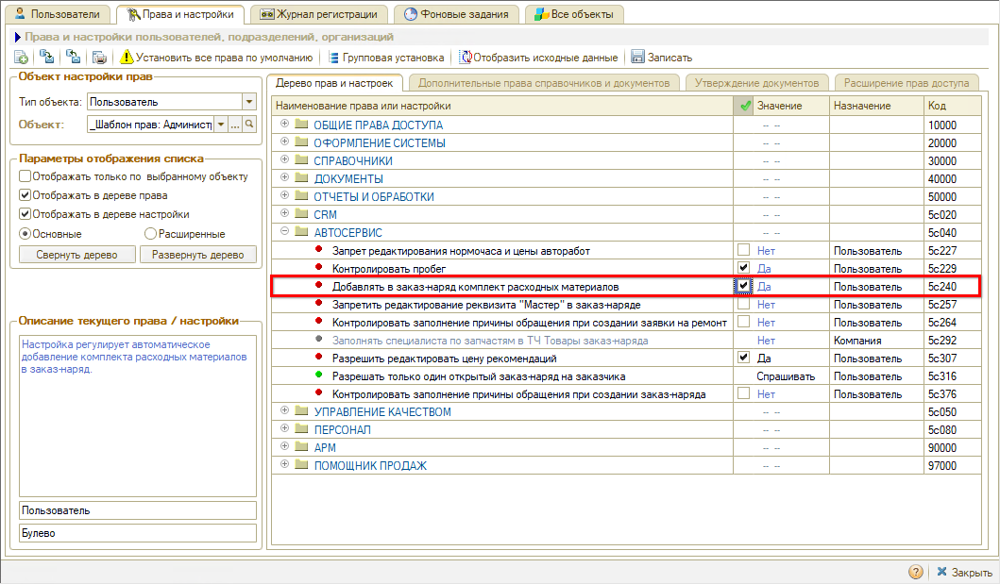
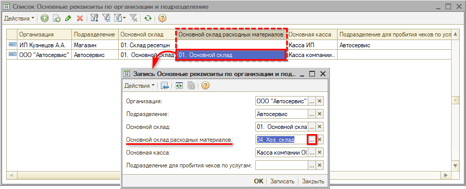
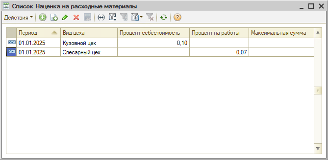
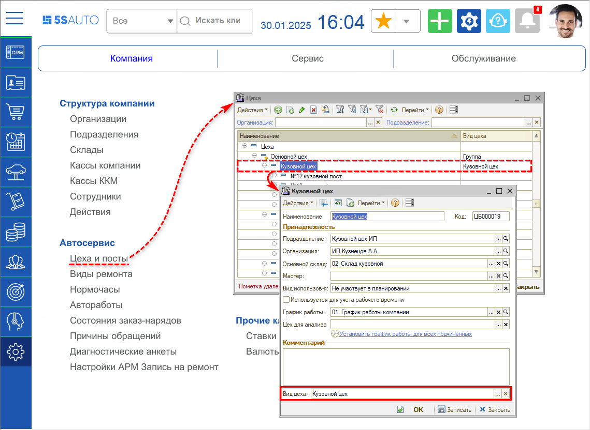
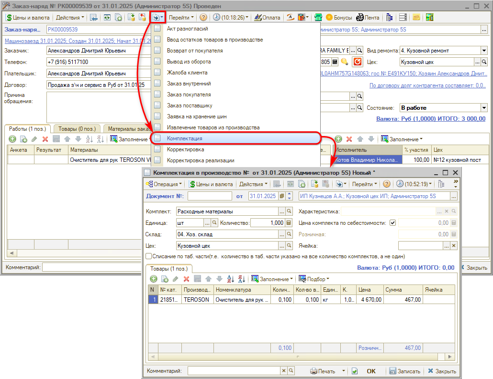
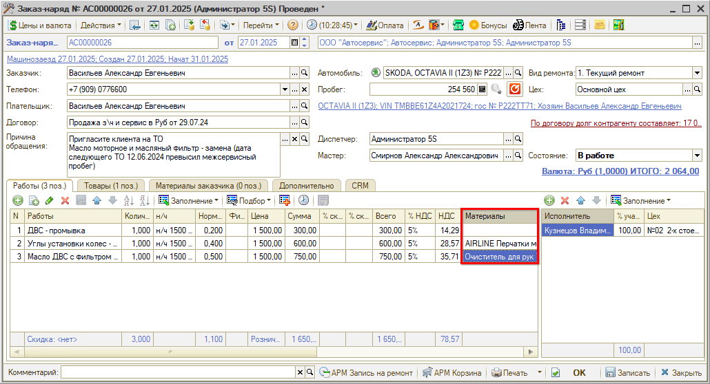
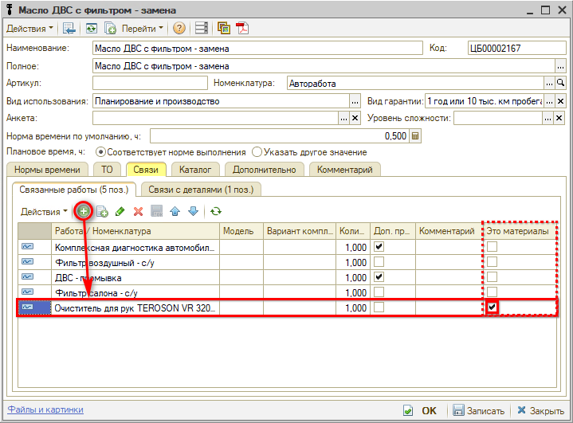

# Работа с расходными материалами

<table><tr><td><b>Время чтения:</b> 9 мин.</td><td><b>Обновлено:</b> 31.01.2025</td></tr></table>

Источник: https://www.5systems.ru/help/rabota-s-raskhodnymi-materialami

## Содержание

- [Введение](#введение)
- [Списание затрат по расходным материалам с клиента](#списание-затрат-по-расходным-материалам-с-клиента)
  - [Настройка автоматического добавления расходных материалов в Заказ-наряд](#настройка-автоматического-добавления-расходных-материалов-в-заказ-наряд)
  - [Настройка склада для автоматического добавления](#настройка-склада-для-автоматического-добавления)
  - [Настройка ценообразования для расходных материалов](#настройка-ценообразования-для-расходных-материалов)
  - [Логика расчета цены комплекта расходных материалов в Заказ-наряде](#логика-расчета-цены-комплекта-расходных-материалов-в-заказ-наряде)
  - [Комплектация в производство расходных материалов](#комплектация-в-производство-расходных-материалов)
- [Автоматическое заполнение расходных материалов, включенных в работу](#автоматическое-заполнение-расходных-материалов-включенных-в-работу)

## Введение

Расходные материалы — материалы, которые дополнительно используются при выполнении работ в Автосервисе: перчатки, краска, кисти, тряпки и т.п.

В программе предусмотрен учет комплекта расходных материалов в Заказ-нарядах с целью списания затрат на них с клиентов.

## Списание затрат по расходным материалам с клиента

### Настройка автоматического добавления расходных материалов в Заказ-наряд

[Право](https://5systems.ru/help/ustanovka-prav-i-nastroek-polzovatelya) «Добавлять в заказ-наряд комплект расходных материалов» при установленном значении «Да» активирует механизм автоматического добавления Расходных материалов в Заказ-наряд:

Также данное право устанавливает запрет на удаление пользователем расходных материалов из документа — удалить их сможет только пользователь с [ролью](https://www.5systems.ru/help/roli-polzovateley) «Полные права» либо с должностью «Руководитель техцентра» в [сведениях адресации](https://www.5systems.ru/help/adresaciya-zadach-v-crm-po-ispolnitelyam).

### Настройка склада для автоматического добавления

Также необходимо выбрать склад, который будет подтягиваться в расходные материалы при автоматическом добавлении. Для этого нужно перейти к регистру «Основные реквизиты по организации и подразделению» (через типовое меню программы *Сервис → Все операции → Регистр сведений*). Для соответствующей организации и подразделения указать необходимый склад для расходных материалов и записать:

### Настройка ценообразования для расходных материалов

Базовая стоимость Расходных материалов настраивается документом «Изменение цен» (см. [Настройка ценообразования для товаров → Установка цен продажи с помощью документа «Изменение цен» вручную](https://www.5systems.ru/help/nastroyka-cenoobrazovaniya-dlya-tovarov#ust_cen_vruchn)).

Дополнительно можно настроить расчет цены Расходных материалов в зависимости от состава Заказ-наряда и вида цеха: Кузовной или Слесарный. Для этого:

1. перейдите в *Сервис → Все операции → Регистр сведений → Наценка на расходные материалы*.
2. установите процент наценки по виду цеха. Например, для Кузовного цеха установить процент наценки от стоимости товаров равной 0,50, а для Слесарного цеха — от стоимости работ равной 0,07:

Вид цеха определяется в карточке цеха:

### Логика расчета цены комплекта расходных материалов в Заказ-наряде

При создании Заказ-наряда для автоматически или вручную добавленных Расходных материалов подставляется базовая стоимость из документа «Изменение цен». Цену можно подкорректировать вручную.

При переводе Заказ-наряда в статус «Выполнен» или при его печати будет рассчитываться стоимость Расходных материалов исходя их наценок на вид цеха. Если рассчитанная стоимость окажется больше установленной в Заказ-наряде, то программа предложит установить цену исходя из произведенного расчета. На усмотрение пользователя можно применить новую цену или оставить как есть.

### Комплектация в производство расходных материалов

При включении права «Добавлять в заказ-наряд комплект расходных материалов» и при условии что вид цеха в заказ-наряде «Слесарный», комплектация создается/обновляется автоматически. В остальных случаях расходные материалы нужно комплектовать/перемещать в производство вручную.

Для этого следует на основании Заказ-наряда, в котором учтены расходные материалы, создать документ, например, «Комплектация в производство»:

## Автоматическое заполнение расходных материалов, включенных в работу

В типовом решении в заказ-наряде предусмотрено отражение расходных материалов, включенных в себестоимость работы, которые должны быть списаны со склада:

Материалы по работе в данном случае подбираются вручную.

В рамках доработок в программе реализована автоматическая подстановка материалов по работе.

Для того, чтобы материалы автоматически подставлялись по работе необходимо заполнить материалы для работ через справочник «[Автоработы](../Автоработы/avtoraboty.md)» — добавить связанные работы с типом «Номенклатура» и признаком «Это материал»:

В результате при добавлении работы в заказ-наряд колонка «Материалы» заполняется автоматически из связанных работ с признаком «Это материал».

---

**Теги:** расходные материалы, заказ-наряд, комплектация, ценообразование, автозаполнение

