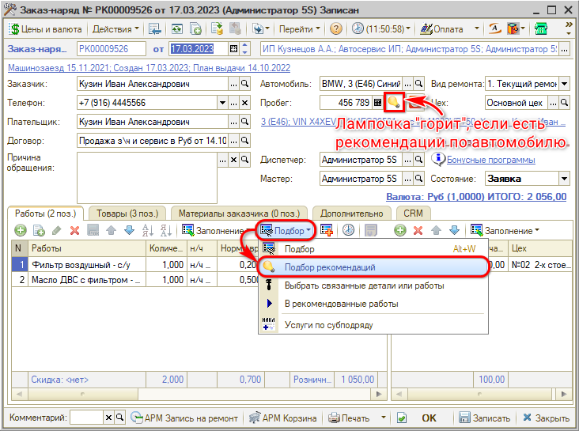
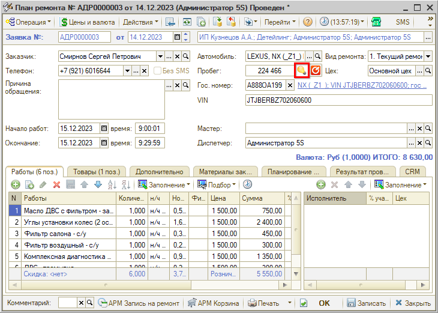
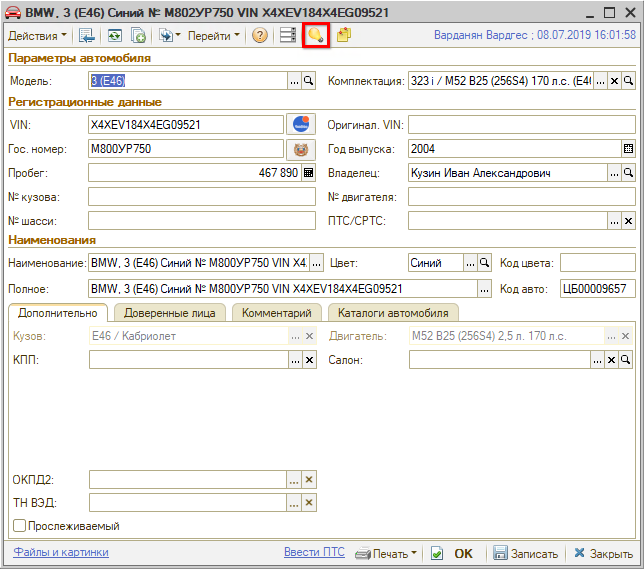
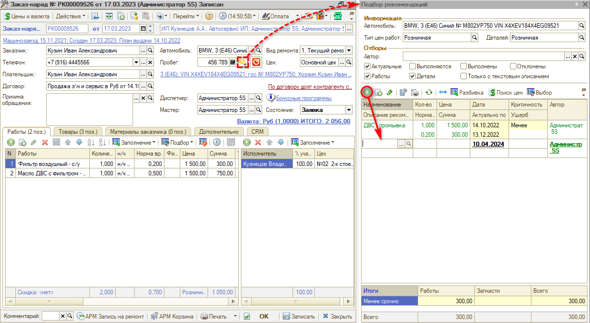
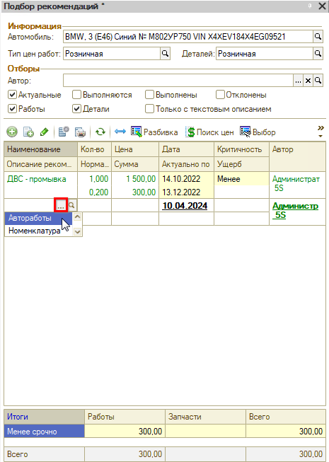
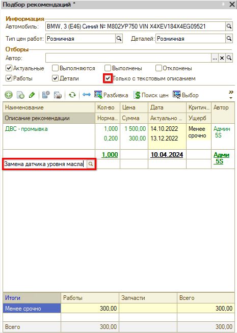
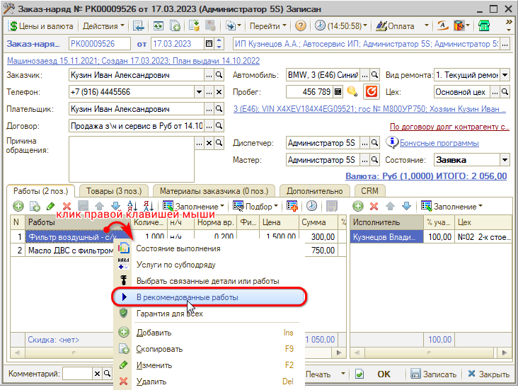
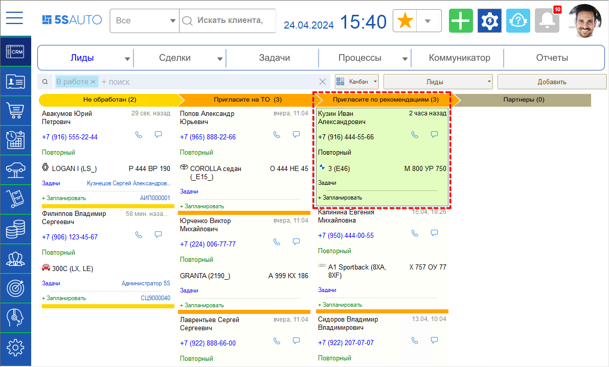
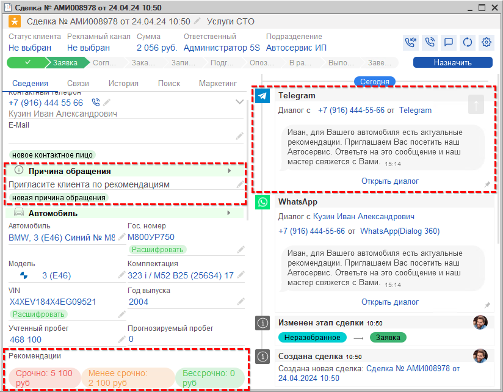

# Работа с рекомендациями

<table><tr><td><b>Время чтения:</b> 15 мин.</td><td><b>Обновлено:</b> 15.05.2024</td></tr></table>

Источник: https://www.5systems.ru/help/rabota-s-rekomendaciyami

*Актуально для релиза 2.7.1.*

## Содержание

- [Введение](#введение)
- [Подбор рекомендаций](#подбор-рекомендаций)
- [Добавление рекомендаций](#добавление-рекомендаций)
- [Корректировка рекомендаций](#корректировка-рекомендаций)
- [Удаление рекомендаций](#удаление-рекомендаций)
- [Перенос рекомендации в документ (Заказ-наряд, Заявка на ремонт)](#перенос-рекомендации-в-документ-заказ-наряд-заявка-на-ремонт)
- [Печать рекомендаций](#печать-рекомендаций)
- [Приглашение по рекомендациям](#приглашение-по-рекомендациям)

## Введение

В программе предусмотрена возможность давать Рекомендации по выполнению ремонтных работ и замене запасных частей для автомобиля. Подобранные и актуальные рекомендации печатаются в Заказ-наряде, который выдается клиенту.

Основным назначением рекомендаций является:

1. Расширение чека путем реализации дополнительных товаров и услуг.
2. Мотивация персонала для качественного исполнения работы — предполагается вознаграждение за реализацию выданных рекомендаций.
3. Забота о клиенте — клиент в курсе того, какие работы необходимо выполнить для автомобиля, чтобы комфортно и безопасно им пользоваться.

Рекомендации выдаются механиком:

- на момент приема и осмотра автомобиля;
- на этапе согласования сметы с клиентом — если клиент на время откладывает выполнение работ или замену запчастей;
- в процессе выполнения ремонтных работ.

Рекомендации заносятся в программу вручную мастером-консультантом.

## Подбор рекомендаций

Работа с рекомендациями в программе предполагает их добавление, корректировку, отклонение и исполнение.

Рекомендации отображаются при печати Заказ-наряда и на форме «Подбор рекомендаций». Перейти в «Подбор рекомендаций» можно из следующих мест:

1. Заказ-наряд:

   

2. Заявка на ремонт:

   

3. Корзина:

   

4. Карточка автомобиля:

   

## Добавление рекомендаций

Есть несколько способов заполнить рекомендации по автомобилю:

1. Добавить рекомендацию вручную.
2. Перенести работы/детали из документа (Заявка на ремонт, Заказ-наряд) в Рекомендации.
3. Перенести работы/детали из Корзины в Рекомендации.

*Обратите внимание!* Если рекомендации добавлены вручную, то цены на работы или товары, которые не проценены или выбраны со склада, будут пересчитываться каждый раз при открытии окна «Подбор рекомендаций» или печати рекомендаций в Заказ-наряде. Цены на работы и товары, которые перенесены из документа или Корзины, а также на товары, процененные у поставщика, перерасчитываться не будут.

Чтобы добавить работу или деталь в рекомендации вручную:

1. Перейдите в окно «Подбор рекомендаций».
2. Добавьте строку в окне подбора:

   

3. Заполните строку рекомендацией:

   Выберите конкретную работу или деталь:

   

   ИЛИ введите строкой в виде комментария (в этом случае рекомендация не может быть перенесена в документ, а отображаться будет при установленном фильтре «Только с текстовым описанием»):

   

Остальные поля строки с рекомендацией заполните при необходимости:

- *Кол-во* — проставляется количество рекомендаций по работе/детали.
- *Сумма* — для работы рассчитывается автоматически исходя из нормочаса, для детали проценивается через обработку «Поиск цен»:
- *Актуально по* — по необходимости можно установить дату, до которой выдавать клиенту рекомендацию.
- *Критичность* — выставляется степень критичности. Если не указать, то по умолчанию выставляется *«По возможности»*. При выборе степени критичности автоматически перезаписывается значение *«Актуально по»* как *\<Текущая дата\> + \<Количество дней актуальности для степени критичности\>*, где *\<Количество дней актуальности для степени критичности\>* указывается в *параметрах Мастера настройки отправки сообщений по регламенту* (см. [Мастер настройки системы → Приглашение по рекомендациям](https://5systems.ru/help/master-nastroyki-sistemy#prigl_po_rekom)).

Чтобы перенести работы или деталь из документа (Заказ-наряд, Заявка на ремонт) в Рекомендации выполните одно из следующих действий:

1. Удалите работу или деталь из документа. В этом случае программа спросит, перенести ли удаляемую работу/деталь в Рекомендации.

   *Примечание:* Чтобы программа выводила вопрос о переносе удаляемой работе/детали в рекомендации, необходимо установить право «Перенос работ/деталей в рекомендации при удалении» (41286) = «Да».

2. В контекстном меню выберите пункт «В рекомендованные работы»/«В рекомендованные товары»:

   

   В этом случае работа/деталь добавится в рекомендации и в то же время останется в документе.

Чтобы перенести все подобранные работы или детали из Корзины в Рекомендации к автомобилю, нажмите на кнопку «Сохранить все позиции в корзине как рекомендации к автомобилю»:

Чтобы перенести конкретный товар, вариант поставки или работу из Корзины в Рекомендации к автомобилю, выберите пункт «Перенести в рекомендации» контекстного меню, вызванного у выбранного товара, варианта поставки или работы:

Чтобы добавить деталь из подбора «Рабочий лист» Корзины, выберите пункт «Сохранить в рекомендации» контекстного меню, вызванного у выбранной детали или работы:

## Корректировка рекомендаций

Корректировка рекомендации возможна в окне «Подбор рекомендаций». Для корректировки рекомендации установите курсор мыши на значение, которое необходимо изменить, и нажмите кнопку «Изменить».

Изменить по рекомендации можно любые значения, кроме:

1. Норма времени выполнения,
2. Сумма,
3. Дата.

*Внимание!* Если дважды кликнуть мышью по нередактируемому значению строки, то рекомендация перенесется в документ.

## Удаление рекомендаций

Рекомендацию после добавления удалить нельзя, но можно совершить следующие действия:

1. Отклонить:

   

   Отклоненные рекомендации будут отображаться при установке фильтра «Отклоненные».

2. Добавить в Заказ-наряд работу/услугу, которая есть в рекомендациях — тогда до закрытия Заказ-наряда рекомендация будет в состоянии «Выполняется», а после закрытия «Выполнена» и предлагаться клиенту не будет. Просмотреть выполняемые рекомендации можно, установив фильтр «Выполняется», а выполненные, установив фильтр «Выполнены».

## Перенос рекомендации в документ (Заказ-наряд, Заявка на ремонт)

Для переноса рекомендации в документ (Заказ-наряд, Заявка на ремонт) выполните одно из действий:

- Дважды кликните мышью на рекомендацию.
- Нажмите на кнопку «Выбор»:

## Печать рекомендаций

Рекомендации можно вывести на печать, используя стандартную печатную форму:

В программе имеется возможность загрузки любой [внешней печатной формы печати рекомендаций](../Подключение%20внешней%20печатной%20формы%20Печать%20рекомендаций/podklyuchenie-vneshney-pechatnoy-formy-pechat-rekomendaciy.md) и подключения ее к Заказ-наряду.

## Приглашение по рекомендациям

В программе предусмотрена возможность автоматического создания лидов/сделок для приглашений клиентов по рекомендациям, для которых истекает период актуальности.

Целью работы функционала является запись клиента на ремонт по выданным ранее рекомендациям.

Настройка приглашений по рекомендациям производится в Мастере настройки системы — см. [Мастер настройки системы → Приглашение по рекомендациям](https://5systems.ru/help/master-nastroyki-sistemy#prigl_po_rekom).

При наступлении даты, указанной в значении «Актуально по», в программе создается новый лид или сделка в специальном разделе «Пригласите по рекомендациям»:

Сделка автоматически переходит на этап «Заявка». В причине обращения указано «Пригласите клиента по рекомендациям». В блоке «Автомобиль» отображается потенциальная сумма ремонта по рекомендациям в разбивке по уровням критичности:

При условии настройки автоматических приглашений по рекомендациям клиенту отправляется сообщение в мессенджер. Предварительно настраивается шаблон сообщений. Связаться с клиентом можно по переписке, открыв Ленту событий, либо созвониться с ним.

Для согласования с клиентом записи по рекомендациям можно открыть из сделки форму подбора рекомендаций по клику на любую из кнопок в блоке «Рекомендации». Для записи клиента следует создать заявку на ремонт вида «План ремонта» нажатием на кнопку «Новая заявка» в блоке Заявка. В созданную заявку следует перенести рекомендации, которые согласен выполнить клиент — см. выше [Перенос рекомендации в документ](#перенос-рекомендации-в-документ-заказ-наряд-заявка-на-ремонт).

---

**Теги:** рекомендации, подбор рекомендаций, приглашение по рекомендациям, печать рекомендаций

