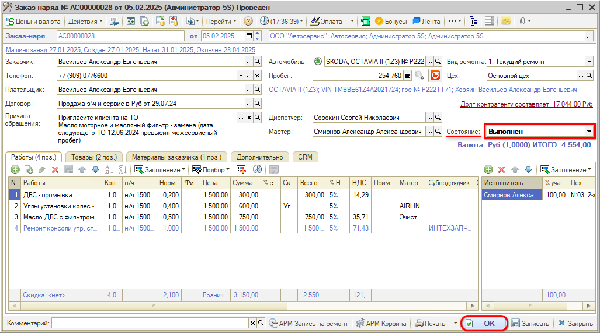
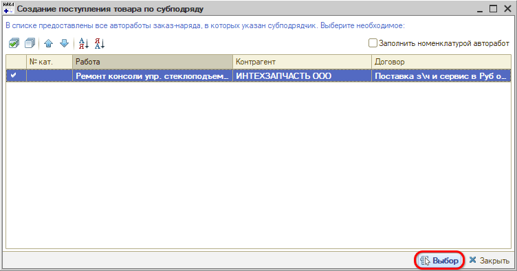
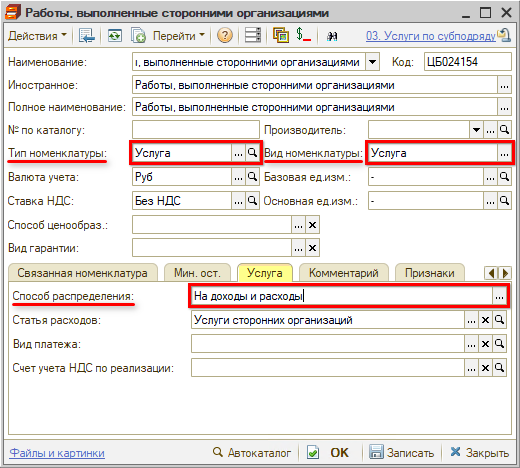
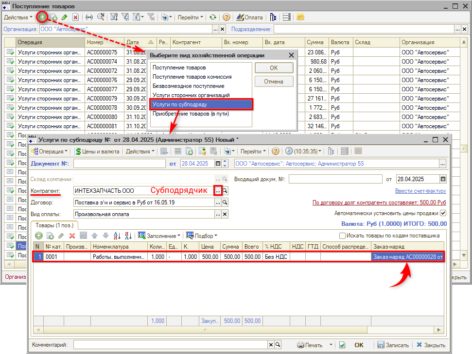
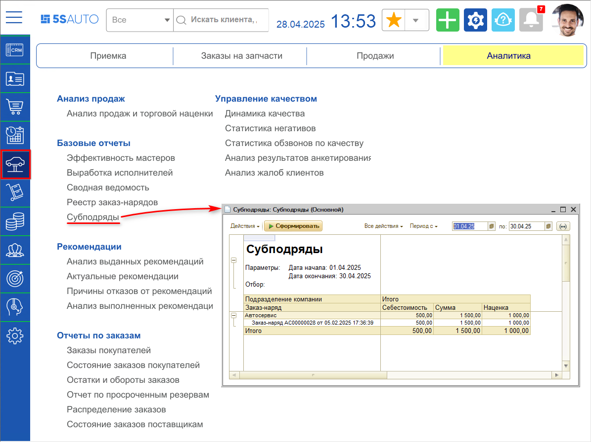
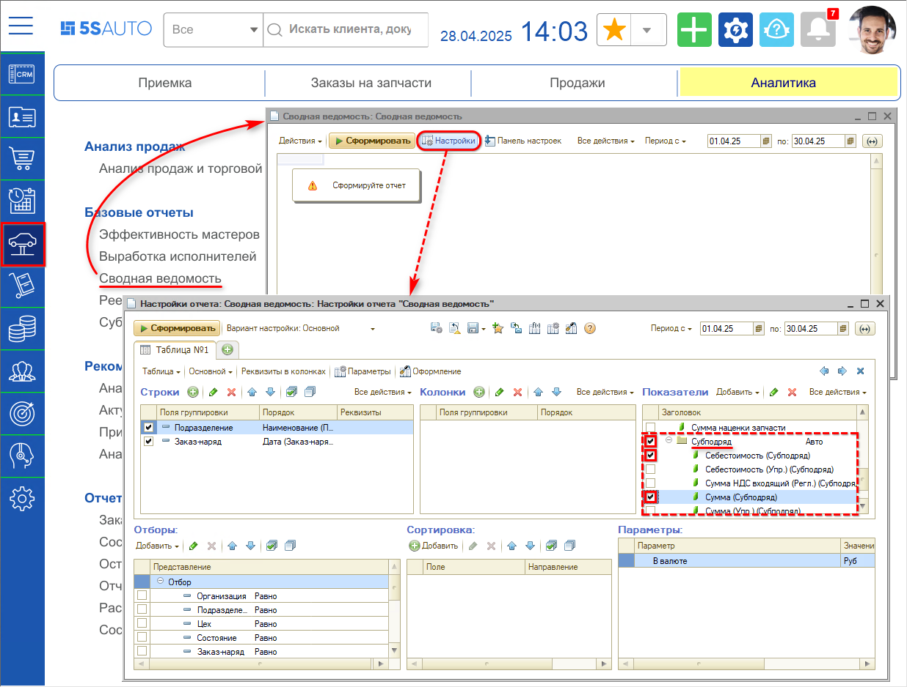
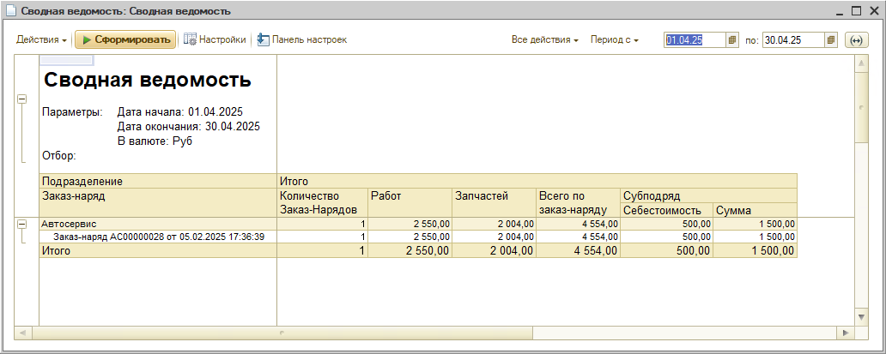

# Работа с субподрядами

<table><tr><td><b>Время чтения:</b> 11 мин.</td><td><b>Обновлено:</b> 28.04.2025</td></tr></table>

Источник: https://www.5systems.ru/help/rabota-s-subpodryadami

## Содержание

- [Введение](#введение)
- [Пример учета работ по субподряду](#пример-учета-работ-по-субподряду)
- [Отчеты по субподряду](#отчеты-по-субподряду)

## Введение

Ведение в автосервисе учета работ, выполняемых сторонними организациями (**субподрядом**), в программе предусмотрено следующим образом:

1. Заполнение субподрядчика по работе в Заказ-наряде;
2. Оприходование выполненных субподрядчиком работ путем создания и проведения документа «Услуги по субподряду».

По субподрядам есть возможность сформировать отчеты (см. ниже *[Отчеты по субподряду](#отчеты-по-субподряду)*).

## Пример учета работ по субподряду

В Заказ-наряде для работы, которая выполняется по субподряду, в столбце «Субподрядчик» необходимо указать контрагента, который будет выполнять работу:

Работа по субподряду выделяется синим цветом шрифта. *Если по работе указывается Субподрядчик, то исполнителей заполнять не нужно.*

Для дальнейшей работы Заказ-наряд должен быть переведен в состояние «Выполнен» и записан:

Далее следует создать на основании Заказ-наряда документ *«Услуги по субподряду»:*

В открывшемся списке следует выбрать работу, которая должна быть учтена в документе:

В созданном документе необходимо отразить услуги, которые будут учтены по субподрядчику, и провести документ:

В качестве товаров в документе «Услуги по субподряду» отражается номенклатура вида «Услуга», у которой указан способ распределения «На доходы и расходы»:

В статье расходов удобно отражать «Услуги сторонних организаций» или «Услуги по субподряду» для учета затрат на сторонние организации.

Для учета работ по субподряду можно создать одну общую услугу, как в примере, а можно на каждую работу создать отдельную услугу и сопоставить их по артикулу: артикул работы = № по каталогу в номенклатуре. Тогда при выборе работ для создания документа «Услуги по ремонту» можно установить флажок «Заполнить номенклатурой (найти по артикулу автоработы)», чтобы номенклатура в документе заполнилась автоматически:

Если необходимо оприходовать услуги по субподряду по нескольким Заказ-нарядам, то удобнее создать документ «Поступление товаров» (**Запчасти и склад → Снабжение → Закупка → Поступления товаров**) с видом операции «Услуги по субподряду». В документе следует:

1. Указать контрагента-субподрядчика,
2. Добавить услуги по Заказ-нарядам, которые необходимо оприходовать:

Также в программе есть возможность установить для пользователей следующие [права](https://5systems.ru/help/ustanovka-prav-i-nastroek-polzovatelya), контролирующие учет субподрядных работ:

**1. «Минимальный процент наценки услуг по субподряду в заказ-наряде»**: в случае если в заказ-наряде субподряд выставлен менее чем с указанной наценкой, будет показано сообщение пользователю, проведение документа может быть запрещено.

**2. «Контроль субподряда по заказ-наряду»**: при переводе заказ-наряда в состояние выполнен/закрыт осуществляется проверка наличия услуг по субподряду, введенных на основании данного заказ-наряда и производится сверка сумм субподрядных работ, выписанных в документе и фактически оприходованных.

## Отчеты по субподряду

Посмотреть себестоимость и наценку на работы по субподряду можно в отчете «Субподряды» (**Отчеты → Автосервис → Субподряды**):

Кроме отчета «Субподряды» можно использовать отчет «Сводная ведомость» (**Отчеты → Автосервис → Сводная ведомость**). В настройках отчета выбрать показатели субподряда:

и сформировать отчет:

---

**Теги:** субподряд, субподрядчик, услуги по субподряду, заказ-наряд, отчет субподряды, сводная ведомость

