# Расшифровка автомобиля по VIN

<table><tr><td><b>Время чтения:</b> 12 мин.</td><td><b>Обновлено:</b> 31.10.2025</td></tr></table>

Источник: https://www.5systems.ru/help/rasshifrovka-avtomobilya-po-vin

## Содержание

- [Введение](#введение)
- [Предварительная настройка](#предварительная-настройка)
- [Переход к расшифровке по VIN](#переход-к-расшифровке-по-vin)
- [Идентификация автомобиля по VIN](#идентификация-автомобиля-по-vin)
  - [Расшифровка в Tecdoc](#расшифровка-в-tecdoc)
  - [Сопоставление данных из каталогов TecDoc и OEM](#сопоставление-данных-из-каталогов-tecdoc-и-oem)
  - [Идентификация в OEM каталогах](#идентификация-в-oem-каталогах)
- [Сохранение моделей и модификаций автомобилей из Tecdoc в базу](#сохранение-моделей-и-модификаций-автомобилей-из-tecdoc-в-базу-1с)
- [Видео по теме](#видео-по-теме)

## Введение

***VIN-номер*** — это уникальный номер автомобиля, состоящий из 17 символов, разделенных на 3 части — всемирный индекс изготовителя (3 символа), описательная часть (6 символов) и отличительная часть (8 символов). Общепринятое расположение — под ветровым стеклом, слева на приборной панели и на водительской двери.

В программе есть возможность по VIN-коду расшифровать автомобиль через сервисы Tecdoc и создать автомобиль на основании расшифрованных данных. Это позволяет значительно ускорить процесс создания автомобиля и иметь более точные данные об автомобиле для дальнейшего подбора работ и запчастей.

## Предварительная настройка

Для начала необходимо создать папку в справочнике «[Модели автомобилей](../Модели%20автомобилей%20и%20другие%20справочники/modeli-avtomobiley-i-drugie-spravochniki.md)» *(Автосервис → Приемка → Справочники → Марки и модели а/м)* для моделей Tecdoc и привязать ее к каталогу в справочнике «(пп) Каталоги подбора»:

Все расшифрованные в Tecdoc модели будут сохраняться в справочнике моделей автомобилей в указанной папке:

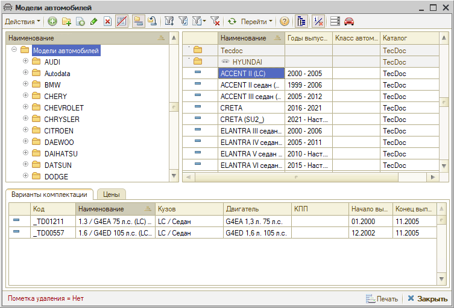

## Переход к расшифровке по VIN

Для перехода к расшифровке по VIN необходимо ввести VIN автомобиля или выбрать автомобиль с указанным VIN и нажать кнопку «Расшифровать а/м» (универсальная обработка для расшифровки в Laximo и TecDoc). Сделать это можно в следующих местах программы:

1. Регистрация обращения через [АРМ Клиенты и автомобили](../../Работа%20с%20клиентами/Работа%20в%20АРМ%20Клиенты%20и%20автомобили/rabota-v-arm-klienty-i-avtomobili.md):

   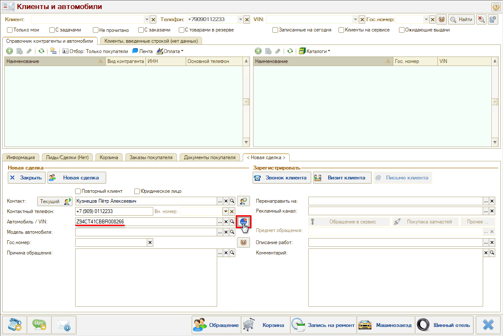

2. Карточка автомобиля:

   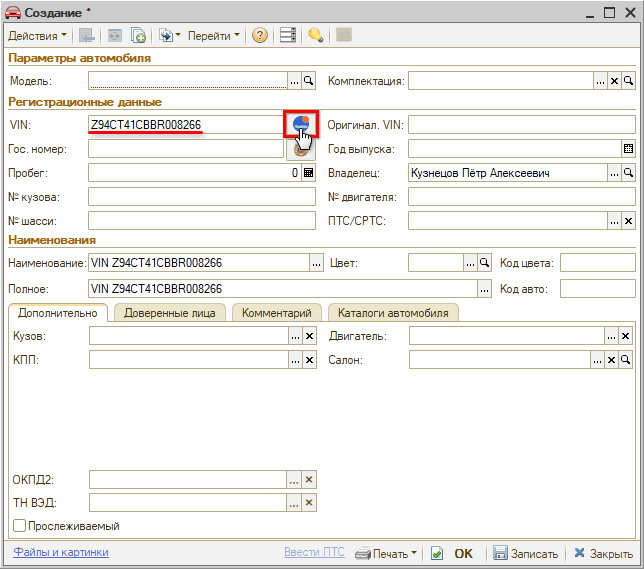

3. Карточка клиента:

   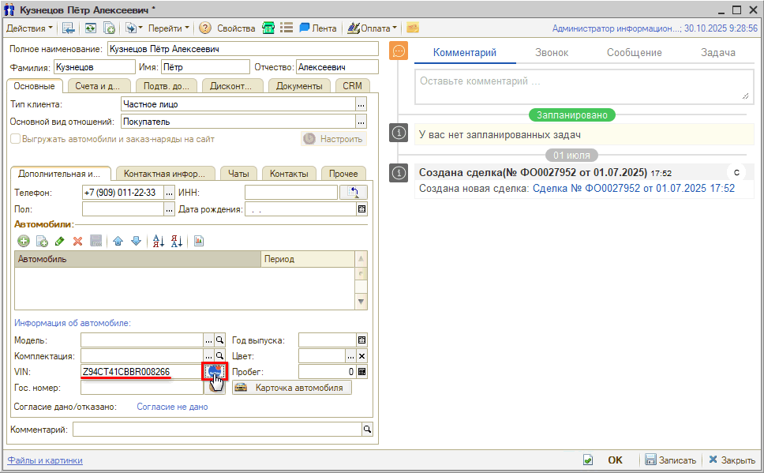

4. Корзина:

   

5. Сделка:

   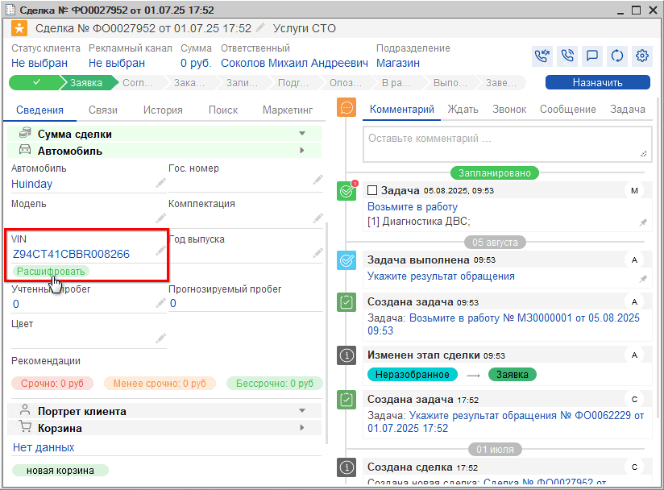

## Идентификация автомобиля по VIN

После перехода к расшифровке по VIN открывается окно «Идентификация автомобилей», где происходит расшифровка автомобиля в каталогах Tecdoc и идентификация в OEM каталогах.

### Расшифровка в Tecdoc

Если автомобиль однозначно расшифрован, то в области «Расшифровка» заполняются данные и о модели, и о модификации:

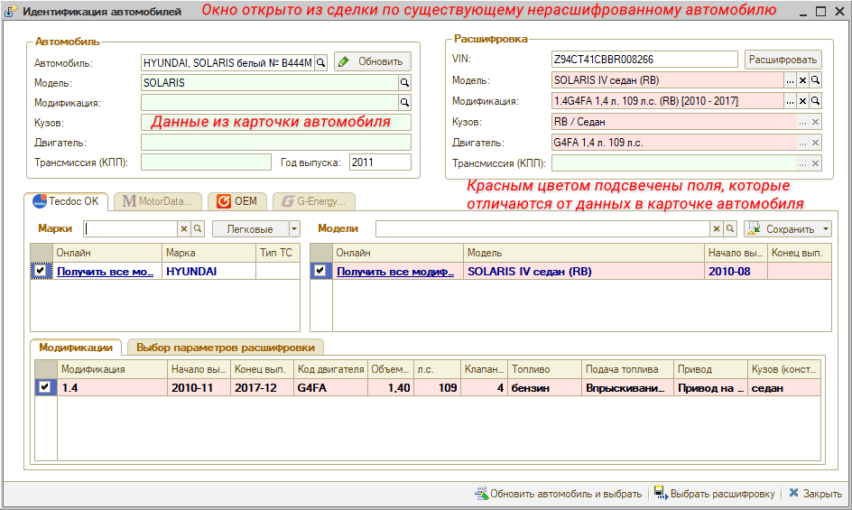

*Примечание:* Если модификация определена, то на вкладке рядом с наименованием «Tecdoc» появляется отметка «OK».

Если у автомобиля не определена модификация, то можно уточнить данные автомобиля по ПТС.

Если нет ПТС под рукой, то принять решение о модификации автомобиля можно по информации из OEM каталога. Например, ознакомьтесь с информацией о двигателе:

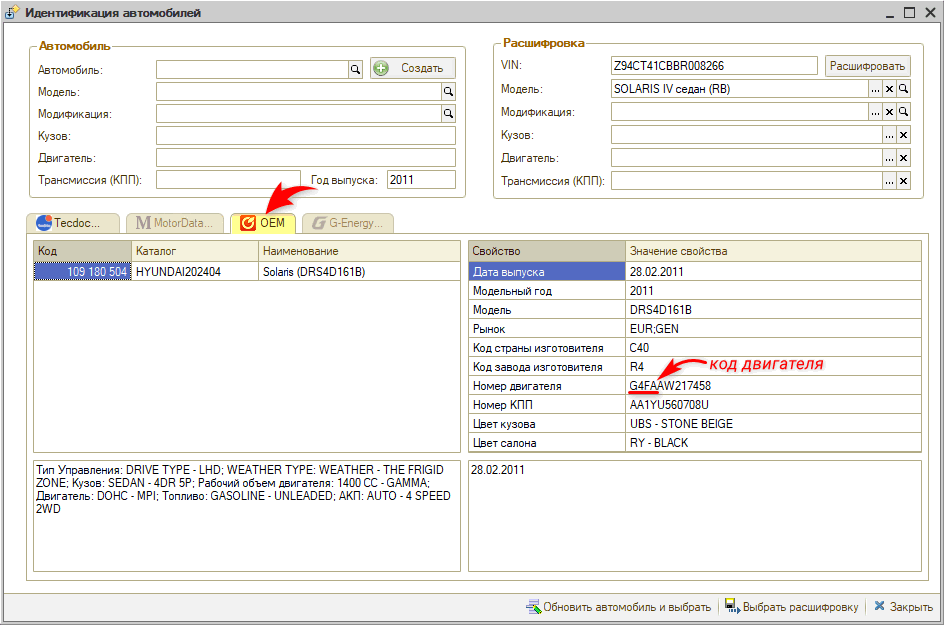

На основе информации о двигателе выберите нужную модификацию вручную. Для этого:

1. нажмите ссылку «Получить все модификации»:

   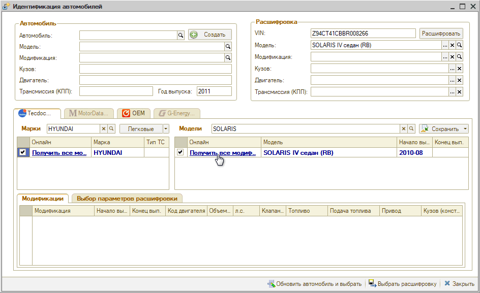

2. выберите из списка подходящую модификацию:

   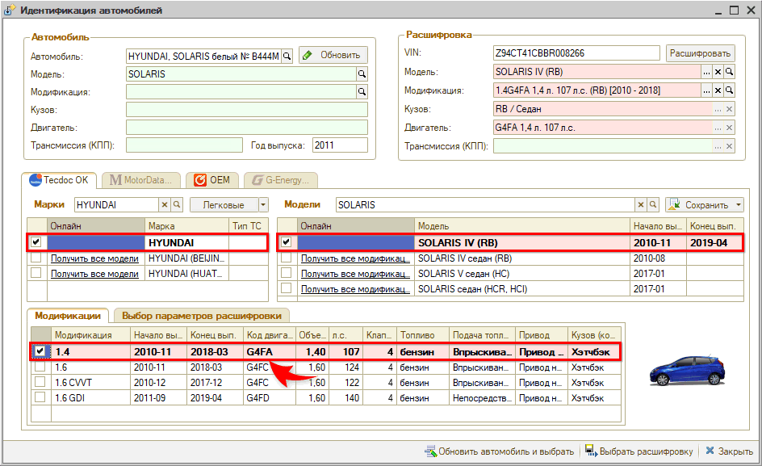

Если автомобиль не расшифрован автоматически, то можно идентифицировать его вручную. Для этого:

1. Выберите тип автомобиля и получите все модели подходящей марки:

   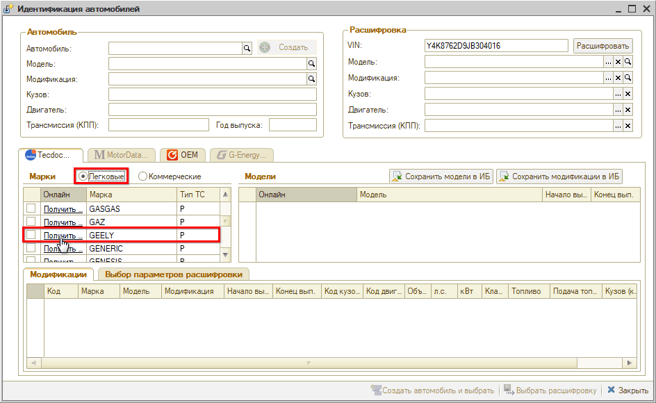

2. Выберите модель и получите все модификации по модели:

   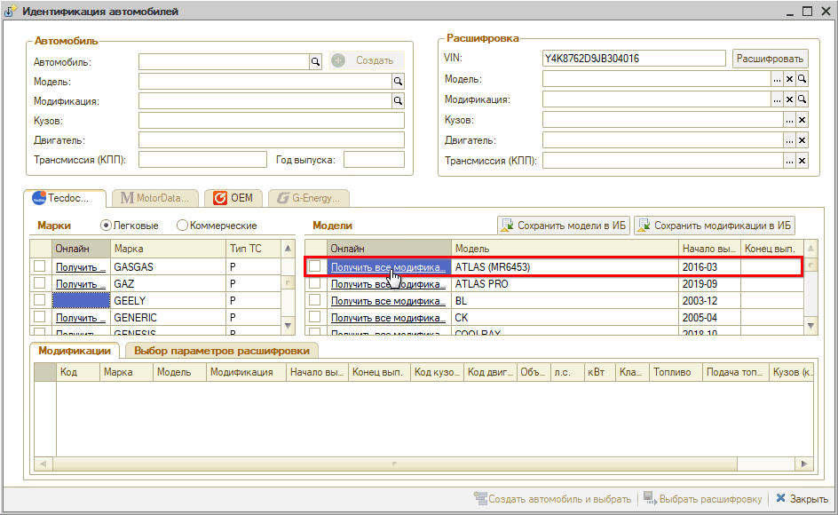

3. Выберите подходящую модификацию:

   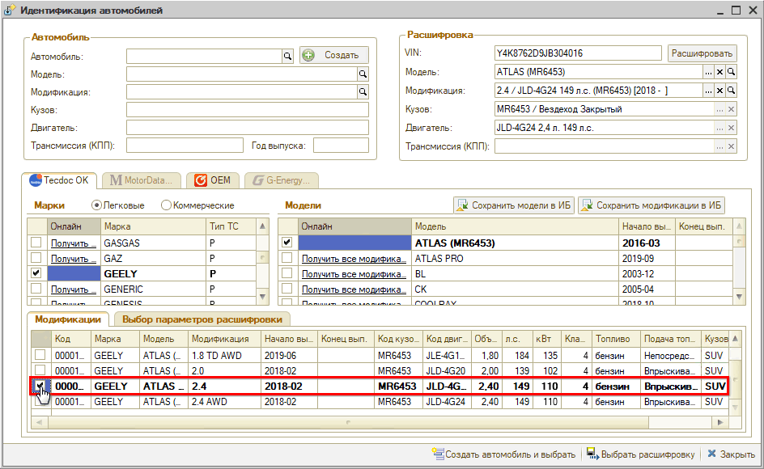

Все выбранные параметры расшифровки (марка, модель, модификация) автоматически сохраняются (создаются или обновляются) в справочнике «Модели автомобилей» и «Варианты комплектации» со ссылкой на каталог Tecdoc.

После автоматического или ручного выбора параметров расшифровки выберите одно из действий:

1. Выбрать расшифровку — если необходимо заполнить данные по автомобилю без сохранения (карточка автомобиля, карточка клиента).
2. Создать автомобиль и выбрать — если необходимо заполнить данные по автомобилю и автоматически создать автомобиль.
3. Обновить автомобиль и выбрать — если необходимо заполнить данные по автомобилю и автоматически обновить автомобиль.

### Сопоставление данных из каталогов TecDoc и OEM

Два каталога содержат информацию разного предназначения:

- TecDoc используется как основной каталог для получения информации о марках, моделях и модификациях автомобилей;
- Каталог Laximo содержит данные про запчасти, применяемость деталей; в рамках расшифровки а/м идентификация в OEM-каталогах используется для уточнения модификации автомобиля.

Конкретные автоработы учитывают специфику конкретной модификации (коробка ручная/автоматическая, крыша, привод и т.д.). Некоторые работы при этом могут иметь другую трудоемкость. Также и применяемые запчасти могут отличаться. Чтобы четко подобрать нормы времени и запчасти, требуется четко определиться с комплектациями.

Сопоставление данных из обоих каталогов позволяет выбрать наиболее точный вариант расшифровки. Например, если в TecDoc не расшифровывается VIN и выходит слишком много вариантов расшифровки — используется код двигателя и другие параметры из каталога Laximo.

Таким образом, интеграция с данными каталогами дает удобство и скорость работы, позволяет пользователю работать внутри «1С», никуда не переключаясь: вся информация доступна внутри программы.

### Идентификация в OEM каталогах

Для просмотра информации об автомобиле по VIN в OEM каталоге перейдите на вкладку OEM:

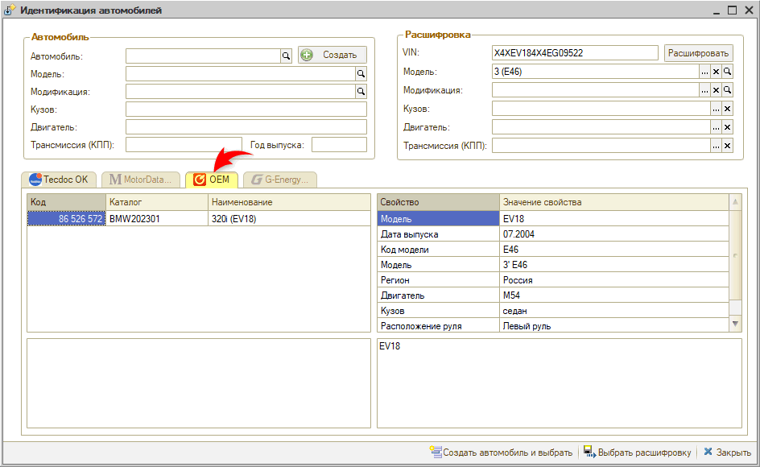

Для получения информации должна быть настроена интеграция с OEM каталогами. См. [Настройка интеграции с каталогами Laximo](../../Интеграция%20с%20внешними%20сервисами/Настройка%20интеграции%20с%20каталогами%20Laximo/nastroyka-integracii-s-katalogami-laximo.md).

## Сохранение моделей и модификаций автомобилей из Tecdoc в базу 1С

С помощью обработки «Расшифровка VIN» есть возможность загрузить расшифрованные модели и модификации автомобилей в базу 1С, не создавая автомобиль. При этом заполнится справочник «Модели автомобилей» в папке, указанной в *Предварительной настройке*, и справочник «Варианты комплектации» для модели.

Поскольку расшифровывать VIN автомобиля не нужно, удобно перейти к обработке для данного случая через меню программы: *CRM → Обработки → Расшифровка VIN*.

Для того, чтобы сохранить модели автомобилей:

1. выберите тип автомобиля (легковые или коммерческие).
2. выберите марку автомобиля и нажмите кнопку-ссылку «Получить все модели»:

   

3. нажмите кнопку «Сохранить модели в ИБ»:

   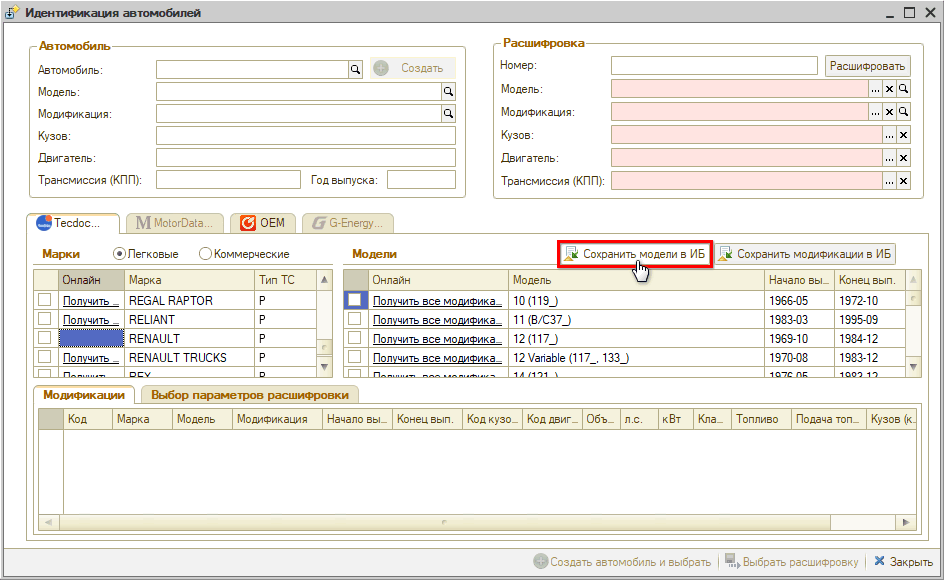

В результате в базу сохранятся все модели, которые были получены по марке и видны в таблице «Модели».

Для того, чтобы сохранить модификации автомобилей:

1. выберите модель автомобиля и нажмите кнопку-ссылку «Получить все модификации»:

   

2. нажмите кнопку «Сохранить модификации в ИБ»:

   

В результате в базу сохранятся все модификации, которые были получены по модели и видны в таблице «Модификации».

## Видео по теме

См. видеоинструкции:

**1. [Как создать карточку автомобиля через TecDoc](../../../../lessons/Урок%206.%20Подбор%20запчастей%20и%20работ/Как%20создать%20автомобиль%20в%20Корзине/kak-sozdat-avtomobil-v-korzine.md):**

[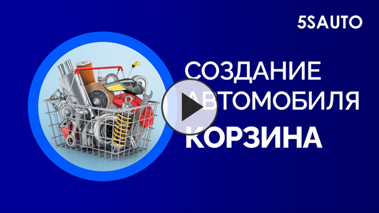](https://edu.5systems.ru/video/Korzina/Korzina-6_Sozdanie_avtomobilya.mp4)

**2. [Как идентифицировать автомобиль в Онлайн-каталоге](../../../../lessons/Урок%207.%20Онлайн-каталог%20запчастей/Как%20идентифицировать%20автомобиль%20в%20Онлайн-каталоге/kak-identificirovat-avtomobil-v-onlayn-kataloge.md):**

[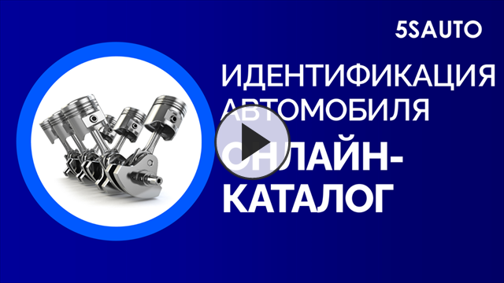](https://edu.5systems.ru/video/Online_katalog/Online_katalog-3_Identifikaciya_avtomobilya.mp4)

---

**Теги:** VIN, расшифровка автомобиля, TecDoc, OEM, Laximo, идентификация автомобиля
