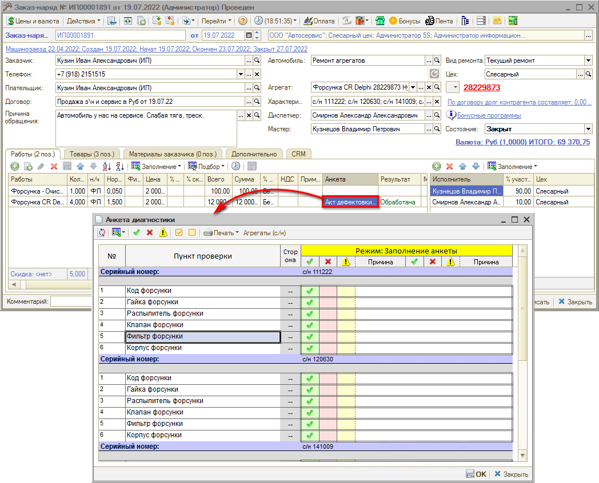
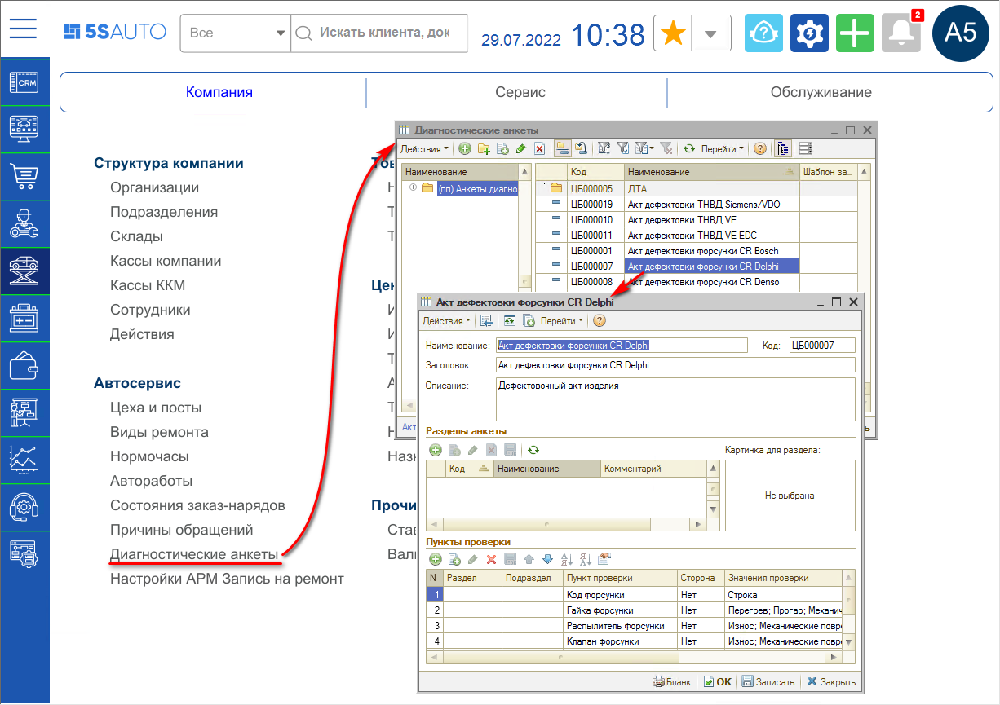
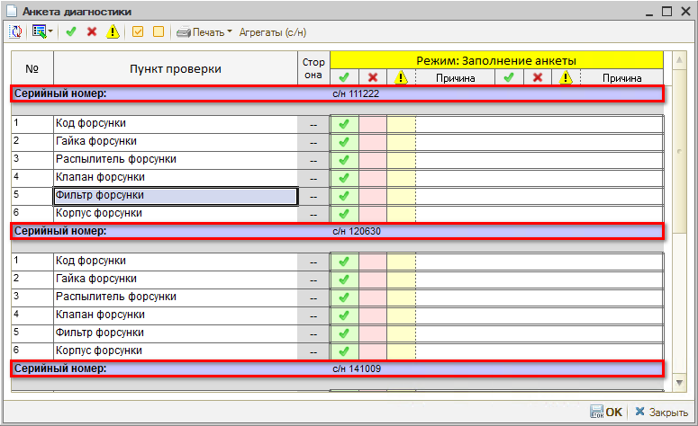
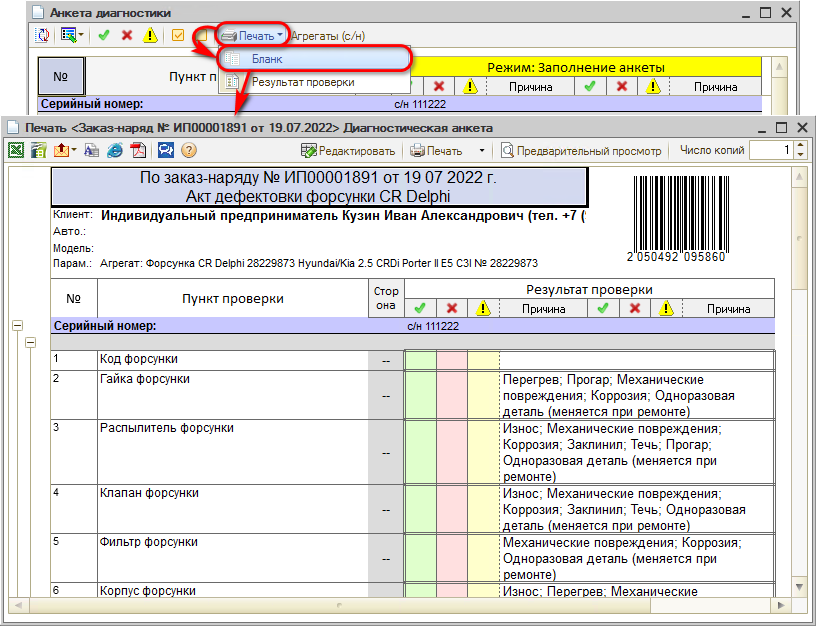
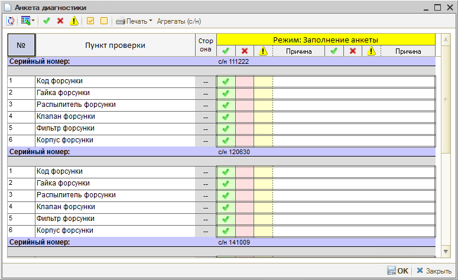

# Диагностические анкеты для агрегатов

<table><tr><td><b>Время чтения:</b> 5 мин.</td><td><b>Обновлено:</b> 03.08.2022</td></tr></table>

Источник: https://www.5systems.ru/help/diagnosticheskie-ankety-dlya-agregatov

#### Формирование анкеты для нескольких серийных номеров

В Заказ-наряде на ремонт агрегата выводится *Акт дефектовки,* то есть Диагностическая анкета агрегата:

Диагностическая анкета создается в соответствующем справочнике обычным путем (см. подробнее статью [*Диагностические анкеты*](../../Диагностические%20анкеты/diagnosticheskie-ankety.md)):

Особенность формирования диагностической анкеты для агрегата в том, что серийные номера, которые заданы в характеристике, переносятся в печатную форму. Если задано несколько номеров, то формируется несколько разделов диагностической анкеты:

#### Штрихкод в диагностической анкете

Для удобства заполнения мастером неисправностей в диагностической анкете ее следует распечатать. При печати диагностической анкеты на бланке формируется штрихкод:

После заполнения анкеты необходимо перенести результаты диагностики на форму диагностической анкеты в программе. Для этого можно идентифицировать штрих-код с помощью сканера — в программе сразу откроется форма заполнения анкеты без открытия формы заказ-наряда:

В открывшуюся форму остается внести результаты проведенной диагностики и нажать «Ок» — анкета перейдет в состояние «Обработана».

---

**Теги:** диагностическая анкета, агрегат, акт дефектовки, штрихкод, серийный номер

