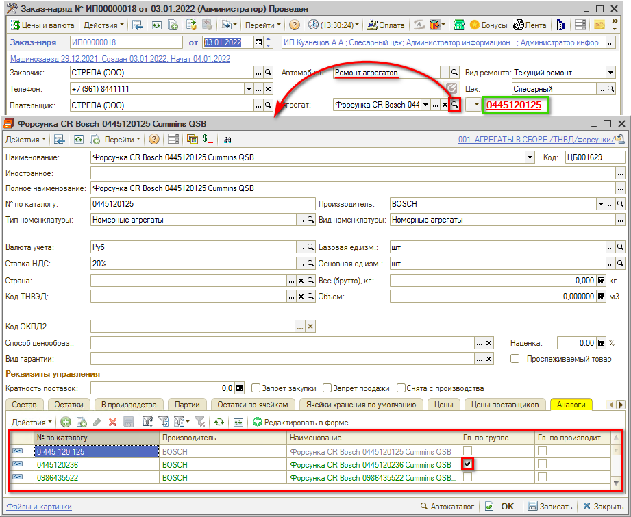
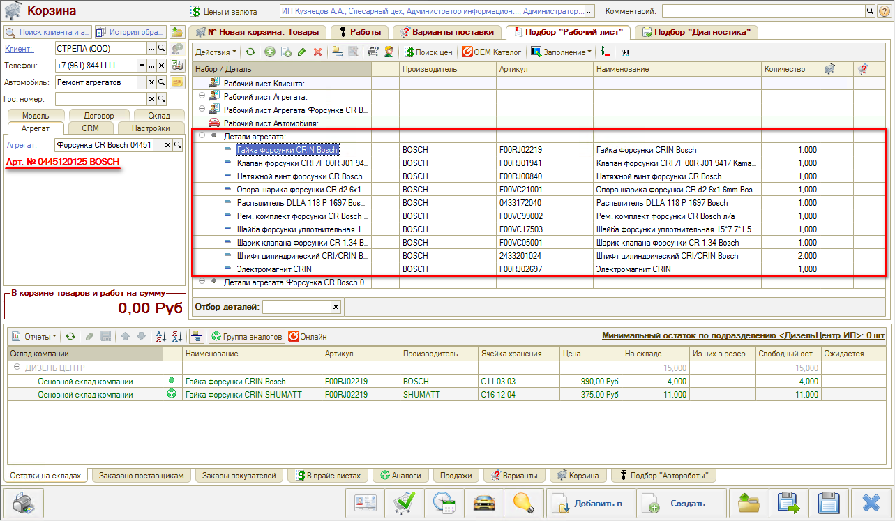
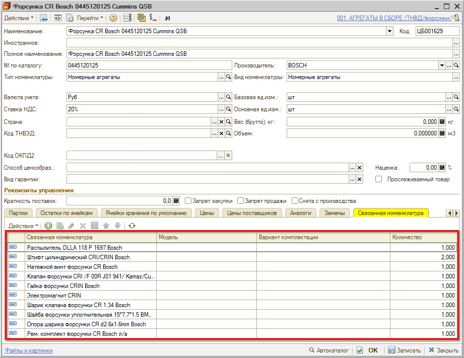
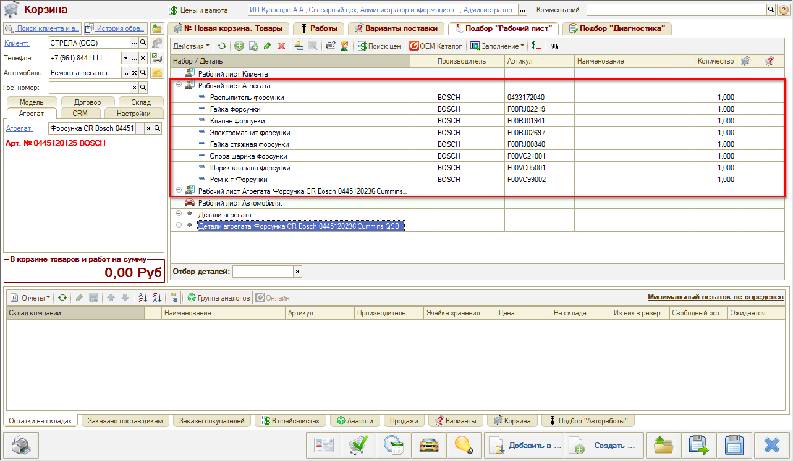
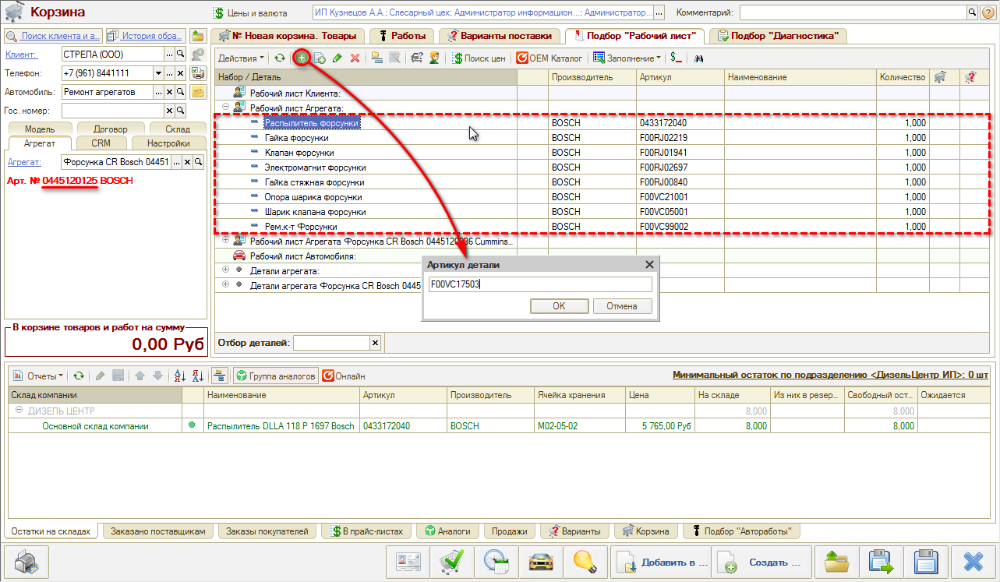
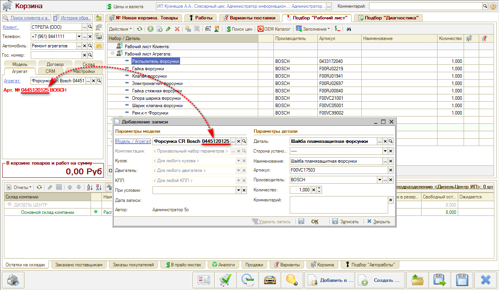
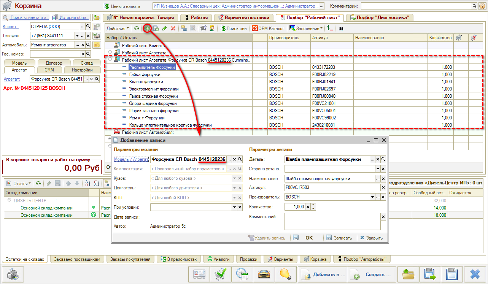

# Применяемость для агрегатов

<table><tr><td><b>Время чтения:</b> 13 мин.</td><td><b>Обновлено:</b> 13.07.2022</td></tr></table>

Источник: https://www.5systems.ru/help/primenyaemost-dlya-agregatov

## Содержание

- [Введение](#введение)
- [Выбор главного аналога по группе](#выбор-главного-аналога-по-группе)
- [Детали агрегата в Корзине](#детали-агрегата-в-корзине)
- [Рабочий лист агрегата в Корзине](#рабочий-лист-агрегата-в-корзине)

## Введение

*См. основные статьи [Учет агрегатного ремонта](../Учет%20агрегатного%20ремонта/uchet-agregatnogo-remonta.md) и [Работа с применяемостью](../../../Склад%20и%20запчасти/Применяемость%20запчастей/Работа%20с%20применяемостью/rabota-s-primenyaemostyu.md).*

В работе с применяемостью для агрегатов существует особенность в том, что у агрегата может быть перечень аналогов — следовательно, при добавлении новых деталей в применяемость возникает вопрос, к какой номенклатуре из этого перечня необходимо ее привязать.

## Выбор главного аналога по группе

В карточке агрегата на вкладке «Аналоги» находится перечень аналогов — как этого же производителя, так и других: в столбце «Гл. по группе» требуется *отметить*, какой аналог является **главным по группе**.

*\*В рассматриваемом примере в заказ-наряде выбран номер агрегата, который **не является** главным по группе.*

При добавлении новых деталей в применяемость к агрегату есть возможность выбрать, к какому аналогу из перечня крепить применяемость — к *текущему номеру* или к *главному по группе (см. ниже)*. Как правило, привязка производится к главному по группе, но если деталь применима только к текущему аналогу, то привязку следует сделать к нему.

## Детали агрегата в Корзине

При переходе в Корзину, чтобы сделать калькуляцию для ремонта этого агрегата, на вкладке «Подбор Рабочий лист» можно увидеть две группы деталей агрегата:

1. Детали, которые применимы конкретно к текущему номеру агрегата:

   

2. Детали агрегата, которые применимы к главному в группе аналогу (и подвязанные к его номеру):

   

Таким образом, есть возможность создавать применяемость только для главного в группе агрегата, чтобы при этом она была видна при работе со всеми другими аналогами агрегата из группы.

Наполнение листов «Детали агрегата» для текущего и главного аналогов редактируется не через «Рабочий лист» Корзины, а через карточки номенклатуры агрегатов на вкладке «Связанная номенклатура»:

## Рабочий лист агрегата в Корзине

Альтернативный механизм применяемости — «Рабочий лист Агрегата»:

Если нужно добавить новую деталь в применяемость, требуется установить курсор в нужном разделе:

1. Чтобы добавить деталь в применяемость для *текущего номера* (в контексте которого открыта Корзина), необходимо кликнуть мышью в разделе «Рабочий лист Агрегата» и нажать кнопку «Добавить» :

   

   Можно ввести артикул или выбрать деталь из справочника, при необходимости указать сторону установки.
   Создается запись применяемости для указанного номера агрегата:

   

2. Чтобы добавить деталь в применяемость для *главного* по группе агрегата, требуется установить курсор в раздел по его номеру и нажать кнопку «Добавить»:

   

---

**Теги:** Применяемость, Ремонт агрегатов, главный аналог по группе, рабочий лист агрегата, корзина

