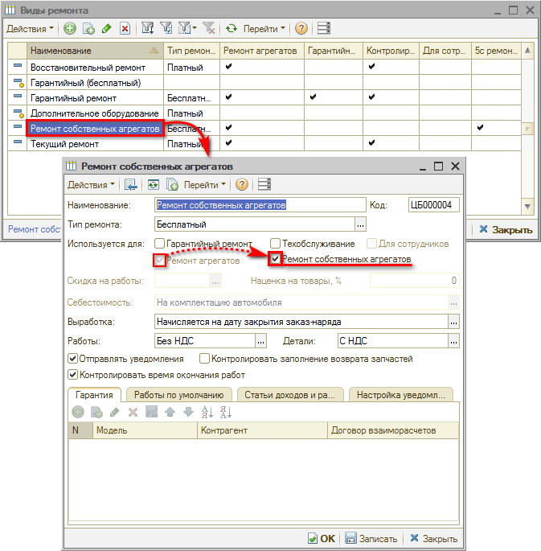
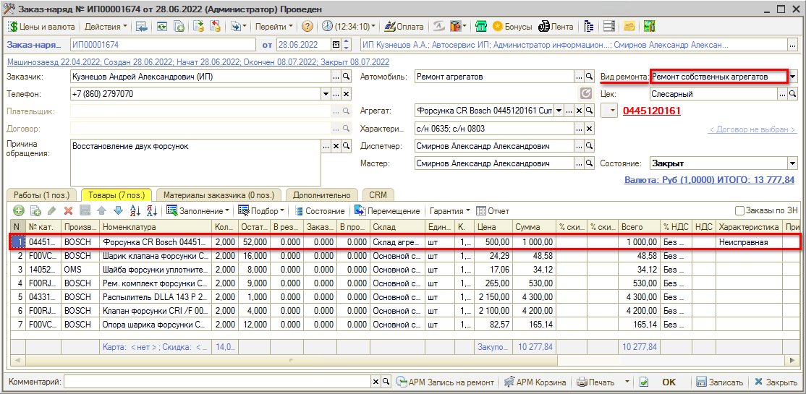
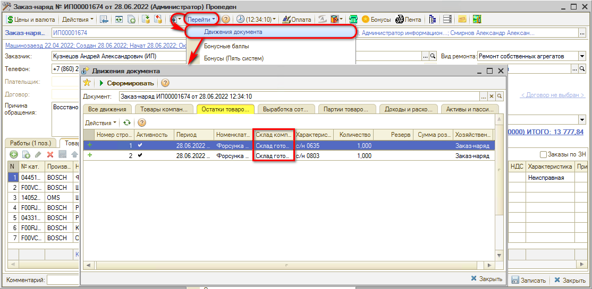
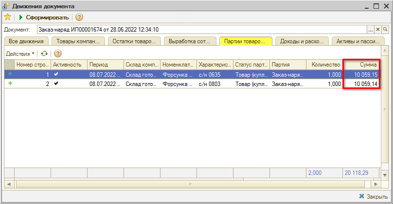
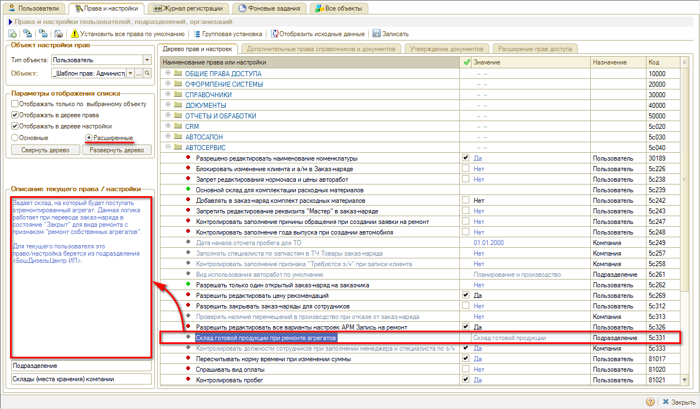
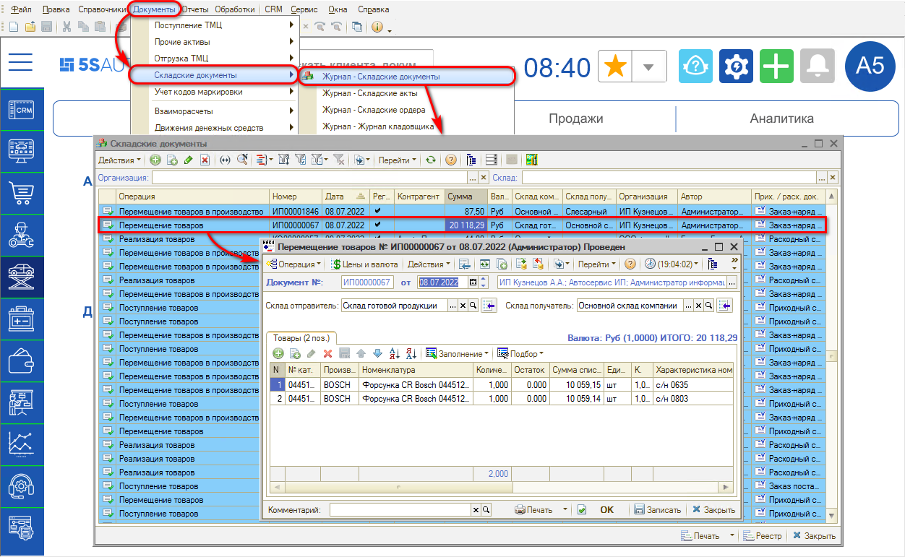
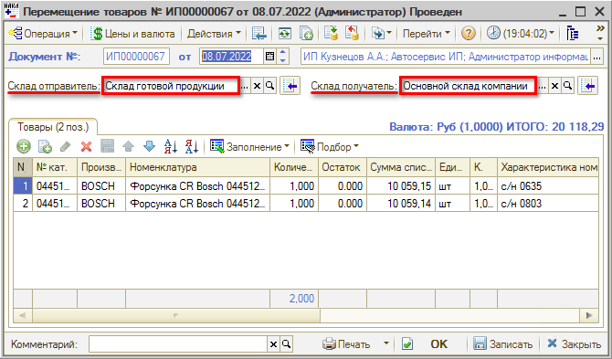
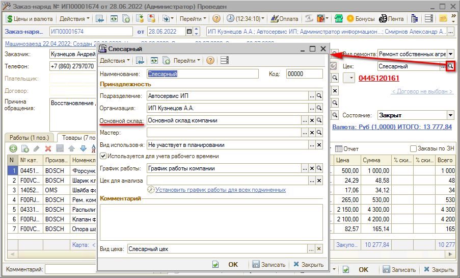

# Ремонт собственных агрегатов

<table><tr><td><b>Время чтения:</b> 6 мин.</td><td><b>Обновлено:</b> 03.08.2022</td></tr></table>

Источник: https://www.5systems.ru/help/remont-sobstvennykh-agregatov

#### Описание

Данный функционал используется для отображения операций по ремонту неисправных агрегатов, выкупленных автосервисом у клиентов или у третьих лиц.

Для справочника «Виды ремонта» в 5S AUTO создана настройка, которая включает специальный режим работы. Для работы функционала создается отдельный [вид ремонта](../../Виды%20ремонта/vidy-remonta.md) *«Ремонт собственных агрегатов»*, и в его параметрах ставится галочка *«Ремонт собственных агрегатов»* (активируется, если стоит галочка «Ремонт агрегатов»):

При оформлении заказ-наряда с таким видом ремонта действует определенная логика.

Например, на складе есть две неисправные форсунки — они включаются в список запчастей заказ-наряда, которые были задействованы в ремонте агрегатов:

В целом заказ-наряд оформляется как обычно, в работах указывается список работ и т. д., но при закрытии заказ-наряда агрегат попадает на склад готовой продукции:

При этом себестоимость данных форсунок равняется себестоимости заказ-наряда, то есть, себестоимость форсунок складывается из себестоимости списанных запчастей и суммы работ по заказ-наряду:

В дальнейшем на эту стоимость можно делать наценку при продаже отремонтированной детали.

#### Склад готовой продукции при ремонте агрегатов

Склад, на который требуется оформить приход отремонтированной детали, определяется специальной настройкой — *Права и настройки → Расширенные → Автосервис → «Склад готовой продукции при ремонте агрегатов»:*

Описание настройки: *«Задает склад, на который будет поступать отремонтированный агрегат. Данная логика работает при переводе заказ-наряда в состояние “Закрыт” для вида ремонта с признаком “ремонт собственных агрегатов”.»*

Настройка производится по подразделению компании: задается тот склад, на который будет формироваться поступление отремонтированных деталей.

#### Перемещение товаров на основной склад

Заказ-наряд создает поступление на склад готовой продукции, но заказ-наряд сам по себе не является складским документом, и работники склада данное поступление не увидят. Поэтому, для отражения в журнале складских документов, в программе автоматически создается документ *«Перемещение товаров»:*

Таким образом, отремонтированные агрегаты изначально поступают на склад готовой продукции, который указан в правах. Затем автоматически создается документ «Перемещение товаров», который оформляет перемещение с этого склада на основной склад компании:

Основной склад компании задается в настройках цеха:

---

**Теги:** Ремонт агрегатов, ремонт собственных агрегатов, заказ-наряд, склад готовой продукции, перемещение товаров, себестоимость

